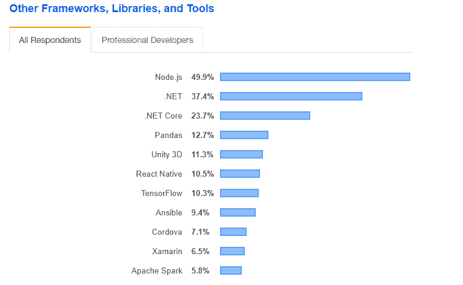
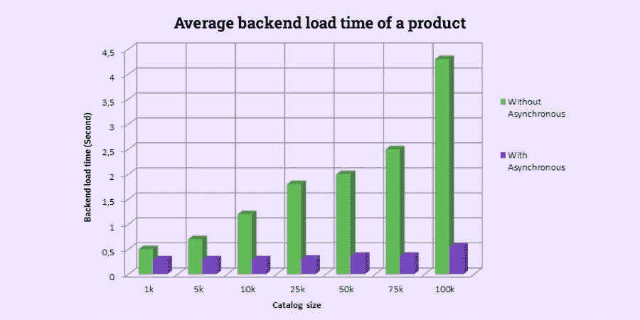
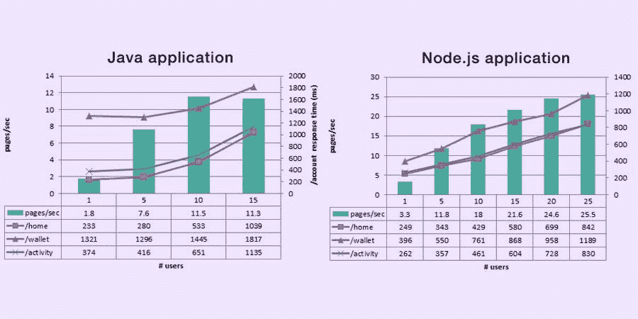

# 如何使用 Node.js 创建一个成功的电子商务 Web 应用程序

> 原文：<https://javascript.plainenglish.io/make-your-ecommerce-app-10x-faster-by-creating-it-with-node-js-c96cfff79a4?source=collection_archive---------0----------------------->

## 使用 Node.js 创建电子商务应用，使其速度提高 10 倍

> 雇佣一家应用程序开发公司，通过使用 Node.js 构建一个简单的电子商务应用程序来确保无缝功能，从而将您的零售业务迁移到在线电子商店

事实上，电子商务行业将在 2021 年实现 22，739.91 亿美元的总收入和 [62%的智能手机用户](https://buildfire.com/mobile-ecommerce-stattistics-data/)在过去六个月中使用他们的设备进行了在线购物，很明显，电子商务已经彻底改变了人们的购物方式。

人们有时间在市郊购物的日子已经一去不复返了。随着数字世界中新兴技术和创新的出现，从世界任何一个角落购买任何东西都只需从您的设备发出一个语音命令。电子商务令人瞠目结舌的发展给那些梦想以最少投资成功经营在线业务的年轻企业带来了广泛的潜在机遇。

最近一段时间，电子商务平台成了人们谈论的热门话题。就像 UberEats，Grubhub，Deliveroo 正在统治在线食品配送行业，同样，亚马逊，易贝，宜家，Wish，沃尔玛是电子商务行业中少数几个统治该领域的巨头。

但是，这仍然是一个巨大的市场，仍然为即将到来的业务提供了巨大的潜力。开发一个电子商务应用程序可以转化为公司在短时间内将投资翻倍的机会。

你不需要接受我们的空话。如果你真的对开发一个成功的电子商务应用感兴趣，你需要看看电子商务的全球市场及其使用情况。

## **全球电子商务市场统计及其应用**

正如我们在引言中所讨论的，电子商务市场是巨大的，并且在快速扩张。大多数领先的电子商务移动应用程序现在都是大型跨国公司，它们利用自己的应用程序获得数百万用户和数十亿美元的收入。

*   据统计，2019 年全球零售电子商务销售额达 3.5 万亿美元，预计到 2023 年底将达到 6.5 万亿美元。
*   [根据统计数据，](https://www.grandviewresearch.com/industry-analysis/e-commerce-market)2019 年，亚太地区以 55.3%的份额主导了电子商务市场，预计将在 2020 年至 2027 年间实现最快增长。
*   [一项研究显示](https://www.grandviewresearch.com/industry-analysis/e-commerce-market)北美和欧洲有望在预测期内实现稳定增长，而中东和非洲则有望在未来几年实现显著增长，原因是年轻人口不断增长，购物市场快速发展。

**简而言之:**考虑到这些统计数据，成为这个蓬勃发展的行业的一部分似乎很诱人，因为它已经成为世界领先的在线零售商的摇钱树。但同样，电子商务领域的竞争比以往任何时候都更加激烈。因为销售你的产品和服务对顾客来说不再是一个以眼睛为中心的概念，因此，走在市场曲线的前面是当今企业面临的最常见的挑战之一。在这种情况下，开发方法和技术可以为您的业务成功带来很大的不同。

> **节点就在那里。电子商务应用程序开发的 Js 已经取得了势头！**

虽然它易于访问，使用起来也很划算，因此它立即成为全世界每个 [**移动应用程序开发公司**](https://www.xicom.ae/services/mobile-app-development/) 和企业的最爱。

但核心问题是如何实现？为了帮助你得到这个问题的答案，你需要看看一个详细的解释，以了解为什么我们和世界上其他人都爱上了 Node.js 的电子商务应用程序开发。

## **博客亮点:**

*   *电子商务行业面临的挑战*
*   *借助 Node.js 获得支持——node . js 是什么，它如何在 2022 年为您的业务带来好处？*
*   *如何用 Node.js 搭建电商 App？——遵循的逐步指南*
*   *2022 年用 Node.js 开发一个电商 App 要多少钱？*
*   最后一句话:下一步何去何从？

让我们深入每一点，了解什么是真实的事实，以及 Node.js 如何帮助你在这个蓬勃发展的行业中生存下来。

# **1。电子商务行业面临的主要挑战**

毫无疑问，电子商务领域每天都在蓬勃发展，并大胆地为我们的生活铺平道路，确保无缝购物体验。电子商务使用的增加也提升了对电子商务应用程序开发的需求。

过去，发展电子商务网站是零售商的唯一目标。随着智能手机的使用越来越多，通过在线平台在全球范围内进行商业和销售的网络应用浪潮已经成为这些天来更加普遍的趋势。

然而，事实上，当你计划 [**雇佣一个移动应用程序开发者**](https://www.xicom.ae/services/mobile-app-developers/) 并为这个竞争激烈的市场开发一个电子商务应用程序时，有许多挑战需要应对。

> ***这是关于电子商务应用程序开发的真相，没人会告诉你！***

在新冠肺炎被世卫组织正式宣布为疫情之后，来自世界各地的人们开始囤积这些东西。无论是医疗用品还是家庭必需品，在线商店都开始努力跟上应用程序的步伐。嗯，一家 [**node.js 应用程序开发公司**](https://www.xicom.ae/solutions/web-development/) 可以为你提供一个以客户为中心的解决方案，但在此之前，重要的是要详细评估挑战:

> 以下是你在运行电子商务应用时可能遇到的最关键的问题:

## **挑战 1:前端漂亮后端差——变成大失败！**

大多数企业专注于选择最好的 UX/用户界面设计，以使他们的屏幕看起来漂亮，迷人和有吸引力。虽然集中注意力很重要。但是，如果您的应用程序无法处理可伸缩性，并且无法生成、维护和交付信息给用户的前端显示器，该怎么办呢？

## 挑战 2:构建一个可扩展的复杂电子商务界面是一项艰巨的工作！

电子商务应用程序主要依赖于支付网关、物流、运输、物流、供应商、产品目录等元素。总的来说，这些因素增加了复杂性，使保持出色的性能变得非常困难。尽管雇佣一个移动应用程序开发人员是有道理的，他可以通过拥有 Node.js 来确保出色的性能。

## **挑战三:App 前端主要依赖后端**

关于最后一点，将这些元素集成到应用程序中会减慢后台工作活动，并影响应用程序的性能。在后端，将会有成百上千个来自全球各地的请求被即时发送到应用程序上。执行这样的请求是相当具有挑战性的。在后端处理太多的请求会降低加载速度，最终影响你的搜索引擎排名。一个理想方法是后端加载时间不应该超过总加载时间的 20%，应该是 200 毫秒或更少。

***简而言之:*** *随着各种技术、工具和框架的出现，* [***构建一个电子商务 app***](https://www.xicom.ae/services/ecommerce-development/) *对于开发者来说并不是一件遥不可及的事情。但是在市场中保持领先并克服这些挑战是一件严肃的事情。*

当涉及到开发一个电子商务网站时，JavaScript 总是服务于最好的环境，但强烈建议 Node.js 移动应用程序开发人员在任何电子商务商店中使用 Node.js。使用 Node.js 环境的主要原因是跨平台和高度可伸缩性和健壮性，这是业务的独立需求。

但是在进一步讨论 Node.js 之前，让我们直接进入 Node.js 如何为您的业务带来好处的介绍。

# **2。Node.js 助您一臂之力——node . js 是什么，它将如何在 2022 年为您的企业带来好处？**

在开发 web 应用程序时，Angular.js、React 和 Vue.js 是优秀前端开发的首选编程语言，这就是 Node.js 为您的 web 应用程序提供强大后端的原因。

[Image Source](https://insights.stackoverflow.com/survey/2019)

## ***node . js 快速介绍！***

如果用简单的语言来说，Node.js 是一个开源的运行时环境。这是一个跨平台的解决方案，支持在浏览器之外执行 JavaScript。它可以创建服务器端和网络应用程序，并使它们运行更快，因为它使用了 Chrome 的 V8 JavaScript 引擎。

V8 是谷歌的 JavaScript 引擎，免费使用，确保了出色的性能，用 C++编写。因此，Node.js 最适合创建可以在多个设备上无缝运行的数据密集型实时应用。

此外，它的异步和事件驱动架构以及高可扩展性已经赢得了世界各地开发人员的青睐，并成为包括网飞、亚马逊、Paypal 等在内的多家公司和科技公司的选择。事实上，它还为易贝和全球速卖通的后端供电。

但现在的问题是，为什么企业应该寻找 Node.js 电子商务应用程序开发？

## ***用 Node.js 构建电子商务应用之美***

对于用户来说，使用电子商务应用程序总是充满乐趣的体验，但是对于软件开发公司来说，开发这个平台总是一项复杂的工作。为了让所有的元素在你的电子商务应用中协同工作，你需要一个合适的技术来支持它。

毫无疑问，Node.js 是你的电子商务平台的最佳选择。

> 让我们来看看是怎么回事？

## **A .出色的应用性能**

使用 Node.js 开发电子商务应用程序是一个值得做出的决定，因为它的异步特性确保了前端和后端加载时间之间的完美平衡，这最终会转化为更好的应用程序性能。

[Image Source](https://www.simform.com/build-ecommerce-web-application-node-js/)

## **B .使用前端和后端通用语言节省预算**

Node.js 是一个基于 JavaScript 的环境，大多数领先的前端框架(如 reaction、Angular、Ember)都使用相同的语言。因此，您可以创建一个电子商务应用程序，用一种语言编写。这将减少 [**雇用应用程序开发人员**](https://www.xicom.ae/solutions/hire-developers/) 负责前端和后端的需求，并简化开发流程，因为 Node.js 应用程序开发人员可以更容易地理解代码库的两个方面。

## **C .处理大量用户群的能力**

由于 Node.js 是单线程的，并且具有事件驱动的体系结构，因此，它提供了一次处理多个并发用户的能力。这是其他 web 技术所缺乏的，并为每个请求创建一个额外的线程。这将耗尽整个内存，直到处理结束。Node.js 帮助开发人员充分利用 I/O 操作的事件循环和回调，这是 Node.js 将长期运行的请求分解成更小块的经典方法。

## **D .重量轻，响应时间更快**

由于它基于 JavaScript，并对客户端和服务器端脚本使用相同的语言，因此，Node.js 确保了更快的开发速度和对应用程序的快速响应时间。

根据谷歌(Google)的一项研究，40%的人会放弃加载一款需要 3 秒钟以上的应用。如果你的项目是电子商务，每一毫秒都可以产生巨大的影响。

***PayPal 讲述了一个有趣的故事，他们如何将*** [***从 Java 迁移到***](https://medium.com/paypal-tech/node-js-at-paypal-4e2d1d08ce4f) ***，不幸的是，这让网站的业务可用性提高了 100%。在后台使用 Node.js 后，贝宝的页面响应时间减少了 35%，启动时间也快了 200 毫秒。***

[Image Source](https://medium.com/paypal-tech/node-js-at-paypal-4e2d1d08ce4f)

## **e . NPM 各种插件及软件包**

Node.js 可以确保更快的开发，并减少从头开始编写所有东西的需要。Node.js 附带了很多包，可以很容易地在应用程序中实现，因此，开发人员可以利用开源解决方案并增强开发过程。

## **node . js 成为赢家的一些额外好处**

*   数据流对于电子商务 web 应用程序来说非常重要，Node.js 是一个非常有用的工具。
*   Node.js 的大社区对开发者有很大的帮助，因为对于领先的移动应用开发公司来说，开发一个电子商务应用 可能是复杂的。
*   有了数不清的插件，开发人员可以毫不费力地精心设计您的电子商务网站，并构建一个精心设计的 Node.js 购物车。
*   使用 Node.js 构建的 Web 应用程序是轻量级的，加载速度更快，这是电子商务应用程序最常见的问题之一。

通过了解 Node.js 的所有这些优势，你们中的许多人肯定很想为电子商务项目雇佣一名应用程序开发人员，并想知道开发的成本。但在此之前，让我们先来看看使用 Node.js 开发电子商务应用程序的分步指南。

# **3。如何用 Node.js 创建一个电子商务应用？接下来的逐步指南**

构建一个电子商务应用可能很复杂，但也是一种有益的体验。这是我们的教程，带你完成应用程序开发的步骤。无论你是企业家还是开发者，都可以学习如何充分利用这个平台。

所以让我们从教程开始吧。

## **第一步。使用敏捷开发方法**

为了让你的电子商务应用程序顺利运行，经常更新你的应用程序是非常重要的，也是值得推荐的。但是要执行这样一个复杂的任务，最好是利用项目的敏捷方法。

## **第二步。组建一个伟大的开发团队**

应用程序的成功很大程度上取决于应用程序开发团队的技能，他们为您的项目倾注了大量精力。因此，要构建一个 Node.js 电子商务应用程序来帮助您在竞争激烈的市场中保持领先地位，您需要雇佣一家 [**电子商务应用程序开发公司**](https://www.xicom.ae/services/ecommerce-development/) ，其 Node.js 开发团队包括:

*   *商业分析师*
*   *Node.js 应用开发者*
*   *质量保证工程师*
*   *UX/UI 设计师*
*   *项目经理*

## **第三步。下载并安装 Node.js**

要下载 Node.js，可以[在首页点击这里](https://nodejs.org/en/download/)。在这里，您可以找到特定于平台的安装程序。

使用“[节点包管理器”(NPM)](https://www.npmjs.com/) 安装 Node.js。NPM 是最受欢迎的包管理器之一，因为它有大量可重用的代码。你可以[点击这里](https://nodejs.org/en/download/package-manager/)了解如何为你的平台安装 Node.js。

## **第四步。选择一个知名的 Node.js 电子商务框架**

有几个 Node.js 框架，但是让我们来看看哪一个可以使您的电子商务业务受益:

**4.1。KOA:** 它是 Node.js 的开源 web 框架，号称是 API 和 web 应用程序最健壮的基础。其中，KOA.js 是作为一个快速无缝的服务器编写平台而构建的。

> **KOA 集锦:**

-它轻便、灵活、快捷。
-它确保了更好的定制和电子商务应用程序开发模块的广泛选择。
-Koa.js 允许开发人员消除回调，最小化错误概率并改进错误处理。

**4.2。TOTAL.js Framework:** 它提供了一个支持包括电子商务应用在内的多种用例的框架。*这里有一些好处和特性可以看看:*

*(a)确保更快的开发，因为它是一个全功能的框架。
(b)开发人员可以构建一个高性能的电子商务 web 应用程序，易于扩展。
(c)这个框架附带了高质量的文档
(d)开发人员可以访问它的教程以获得即时帮助。这个框架有一个 NoSQL 数据库，这对电子商务很重要。*

**4.3。模式。IO Framework:** 这是一个 ecommerce Node.js 框架，为您提供了广泛的功能选择，并使整个开发过程对开发人员来说更加容易。

*a .提供覆盖电商功能的强大 API。通过使用此框架的管理仪表板，电子商务商店的配置变得更加容易。
c .定制电子商务应用程序更容易、更无缝*

## **第五步。用 Scrum 技术管理你的电子商务项目**

管理这个项目的最好方法是使用“Scrum 技术”。但是要正确使用它，你需要开发一个 Scrum 开发团队。因此，您可能需要:

设计师、开发人员、测试人员等等可以一起工作的跨职能团队被称为“Scrum 团队”。

*   项目经理:他们扮演“Scrum 大师”的角色。
*   将需求作为文档中的特性提供的产品所有者，这被称为“产品积压”。
*   Scrum 项目中的迭代，这被称为“冲刺”。
*   为了使所有的功能都发挥作用，团队进行了一次“Sprint 规划会议”,在会上他们评估了这些特性，并根据项目的整体优先级在不同的 Sprint 中加入了不同的特性。

最后，你对 Node.js 电子商务应用程序开发有了一个想法。但是现在主要关心的是，开发它要花多少钱？

# **2022 年，为你的企业开发 Node.js 电子商务应用需要多少成本？**

计算电子商务应用程序开发的成本从制作线框开始。只有你的应用程序的视觉架构才能向你解释你的应用程序的外观和功能。通常，组织 [**雇佣一个网络开发人员**](https://www.xicom.ae/services/hire-web-developers/) 通过从各个角度理解和分析客户的需求，为项目起草多个线框。每个线框的成本取决于页面的复杂程度。平均来说，将 2 页画成 3 页的成本是 300-500 美元。

*   接下来，是设计，这是应用程序的主要部分。根据设计的复杂程度，设计网络应用程序的界面将花费你 3000 到 15000 美元以上。
*   第三，Node.js 开发者的专业知识！根据处理项目的知识和专业水平，开发人员的每小时成本会有很大的不同。通常， [**雇佣一名电子商务应用开发者**](https://www.xicom.ae/services/hire-ecommerce-developers/) 的每小时费用在阿联酋从 15 美元以上开始，在美国可以达到 150 美元以上。
*   其次，电子商务应用程序的功能可以带来应用程序开发成本的巨大差异。更复杂的特性导致更多的开发时间和更高的成本。
*   即使在使用 Node.js 开发并集成了最好的 API 之后，维护和支持对于使您的应用程序无缝运行也是必不可少的。

***因此，总体而言，如果我们计算 Node.js 电子商务应用程序开发的平均成本，那么它可能从 1 万美元到 5 万美元不等，具体取决于所有这些因素。***

# **结论**

Node.js 无疑是高端 web 应用程序开发工具的最佳选择，尤其是当您开发一个集成了许多元素的电子商务应用程序或实时应用程序时。决定用 Node.js 开发一个电子商务应用程序是一个明智的决定，但也需要了解它在未来会给你带来多少收益和成本。

然而，通过雇佣一个 [**网络开发公司**](https://www.xicom.ae/solutions/web-development/) 你可以直接得到你的问题的答案，这些问题涉及成本、特性、功能、Node.js 开发者的专业知识、第三方服务以及你可能需要的应用程序的维护和支持。

*希望这篇博客已经解决了你对 Node.js 电子商务应用开发的大部分担忧。不过，如果你有任何疑问，你可以在下面发表评论。*

*更多内容请看*[***plain English . io***](http://plainenglish.io)