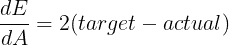
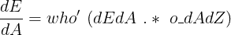
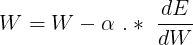

# 用 JavaScript 构建自己的神经网络

> 原文：<https://javascript.plainenglish.io/make-your-own-neural-network-app-with-plain-javascript-and-a-tiny-bit-of-math-js-30ab5ff4cbd5?source=collection_archive---------4----------------------->

Photo by [Mockup Graphics](https://unsplash.com/@mockupgraphics?utm_source=medium&utm_medium=referral) on [Unsplash](https://unsplash.com?utm_source=medium&utm_medium=referral)

开始深度学习真的不一定非得是 Python。JavaScript 为您提供了从头创建自己的神经网络所需的一切。使用 JavaScript 的最大好处和明显优势是，您可以快速地将您的模型嵌入到正在运行的应用程序中——无论是通过 web 还是通过 React Native 在移动设备上提供。在这篇文章中，我将向你展示如何通过训练和实现你自己的神经网络来创建一个识别手写数字的 web 应用程序。你所需要的只是普通的 JavaScript 和一点点库 [mathJS](https://mathjs.org) 。

在我的第一篇[文章](/how-to-run-ai-models-locally-in-the-smartphone-with-react-native-and-tensorflow-js-666f52fd15ca)中，我展示了如何实现现有深度学习模型(转换为 Tensorflow.js)的概念验证，以便它们可以在移动设备上本地运行，而在本文中，重点将真正放在从头创建一个模型上。我假设你对神经网络如何工作有基本到高级的理解——我将快速回顾一下像反向传播这样的概念，并包括进一步的有用阅读。

如果你对神经网络还不太有信心，我推荐你去读一读塔里克·拉希德的精彩著作[《打造你自己的神经网络》](http://makeyourownneuralnetwork.blogspot.co.uk)。这本书极大地帮助了我理解神经网络实际上是如何在幕后工作的。所以让我们开始吧！

# **项目概述**

如上所述，我们将创建一个非常简单的网页来识别手写数字。网页分为两栏:左边一栏是训练网络，右边是游乐场。以下是详细的功能:

“培训和测试”:

*   神经网络可以被训练，也可以立即用当前权重进行测试。

“预测”:

*   可以在 HTML 画布上绘制一个数字，然后用于网络识别。

“加载/保存重量”:

*   训练后，所有的权重都可以保存在一个 JSON 文件中。
*   您可以使用当前权重进行预测，也可以从保存的 JSON 文件中加载权重并使用它们。

以下是最终网页功能的截图:

Final web page’s main features

*   点击“训练”按钮，训练开始，其进度记录在灰色容器中。在每个训练周期或迭代之后，训练好的网络被测试，并且它的进度也被显示，连同度量损失和准确性。
*   通过点击“测试”按钮，根据测试数据集测试当前模型。
*   “加载重量”按钮只有在保存了 JSON 文件，且该文件中包含以前训练的重量时才可用。
*   黑色方块是用户可以画一个数字的画布。一旦点击“预测”按钮，来自模型的预测就会显示在旁边的白色方形区域中。

# **项目结构**

这里没什么特别的。在项目根目录的文件夹中只有三个文件:

Project folder

*   这个文件是我们所有神经网络逻辑的所在地。
*   `index.html`:我们的网页，用于将神经网络实现为一个工作应用。它导入我们的`nn.js`文件和 mathJS 库。
*   一些相当简单的 CSS 样式使我们的网页更加漂亮。
*   `mnist/`:该文件夹包含 MNIST 数据集，以 CSV 文件形式保存。您可以从 [pjreddie](https://pjreddie.com/projects/mnist-in-csv/) 下载这些文件，由于大小原因，它们不会包含在[项目的资源库](https://github.com/RyanLinXiang/neural-network-with-js)中。
*   `dist/`:该文件夹包含训练好的权重的 JSON 文件。

# 项目数据集

我们将利用流行的手写数字的 MNIST 数据集来训练我们的神经网络。该数据集包括 60，000 个用于训练的样本和 10，000 个用于验证/测试的样本。该数据集具有以下特征:

*   每一个数字都由一张 28x28 像素的灰度图片表示。数据集中“3”的示例如下:

*   如下图所示，每个像素可以用 0-255 范围内的颜色值来表示:

MNIST sample of a “3” mapped with its colour codes

*   上面所有的颜色信息对应于 CSV 文件中的一行，看起来像`3,0,0,0,0,0,0, ..... 11,186,239,253,253,187, ...... 0,0,0,0\n`。每行的第一个元素以标签或以下颜色代码代表的地面真实数字开始。因此，在上面的示例中，该行以“3”开头。每行有 785 个逗号分隔的值，1 个用于标签，784 个用于颜色代码。

# **构建神经网络**

现在，我们已经看到了最终项目的所有细节、结构和数据集，让我们一步一步地编写神经网络模型:

## 数学

上面的快捷方式将使我们的代码更简洁，可读性更好，因为我们不希望在使用 mathJS 函数时使用它们的全名。请不要混淆`math.`和`Math.`，因为后者是由 JavaScript 提供的。`math.`参考流行的第三方库 mathJS，从中我们将特别需要矩阵乘法函数。除此之外，mathJS 还提供了各种科学计算助手。mathJS 对我们来说一个很大的优势就是可以理解微积分表达式的`math.evaluate`函数。稍后您将会看到，这再次使我们的代码更容易掌握。

有了这些捷径，我们把我们的神经网络放到一个类中，从这个类中我们可以实例化。这增加了我们模型的可重用性。下面的代码演示了结构:

正如你所看到的，我们的神经网络由两层组成(第 4 & 5 行)。这对于 MNIST 数据集的[巨大成果](http://yann.lecun.com/exdb/mnist/)来说已经足够了！构造函数需要传递一些超参数——每个超参数通过它们的变量名自我解释(第 2–12 行)。最后两个参数`wih`和`who`代表“**I**nput-to-**h**idden 层的 **w** 八分之一”以及“**h**idden-to-**o**output 层的 **w** 八分之一”。它们是可选的:如果它们被通过，那么神经网络假定你想用已经训练好的权重初始化它，如果不是，那么它将随机初始化权重(第 8 行& 9)。

第 11 行是我们的激活函数——正如您从代码中可以猜到的，选择落在了 [sigmoid 函数](https://deepai.org/machine-learning-glossary-and-terms/sigmoid-function)上。使用`mmap`(mathJS '`math.map`的简写)我们可以传入一个矩阵作为第一个参数，它将在每个元素上应用激活函数，作为第二个参数传入。

请记住，我们需要通过使用`math.matrix`将 JavaScript 数组转换成 mathJS 矩阵，我们用`mat`作为快捷方式来访问提供的所有功能。这完全等同于在 Numpy 中创建“ndarrays”或在 Pytorch 中创建“tensors”。

下图显示了我们的两层模型。每层中的节点数量当然取决于您启动模型的方式，此处仅用于说明:

Two layers neural network (created via [alexlenail](http://alexlenail.me/NN-SVG/index.html))

现在让我们更深入地看看我们神经网络的每一种方法`forward`、`backward`、`update`、`predict`、`train`(上面代码片段的第 18–22 行)。顾名思义，它们实现前向/后向传播，然后在我们网络的训练过程中更新权重。在向您介绍代码之前，我将先给你一个方法一个方法地快速回顾一下基本概念。

## 正向传播

**快速回顾**:前向传播的目标是当我们输入某些值(例如，在我们的例子中，手写数字的像素颜色代码)并将其乘以可调的所谓权重值时，从神经网络中获得预测。对于每一层，正向特性可以用两个函数来描述:首先，我们有以下描述两个矩阵的点积(加权和)的线性函数——为了简单起见，我们可以省略偏差项:

在我们的两层神经网络中，W 可以表示输入到隐藏层或隐藏到输出层的权重矩阵。另一方面，x 可以是具有隐藏层的输出值的矩阵，或者仅仅是输入值。

其次，我们需要在网络中加入非线性，因为只有这样我们才能解决更复杂的问题:

sigmoid 函数似乎是一个自然的选择，因为它强制其参数 Z 的值在 0-1 的范围内，这可以非常直观地理解为概率值，尤其是在输出图层中。

向前传播的进一步阅读:

 [## 深度网络中的正向传播-深度神经网络| Coursera

### 在上一个视频中，我们描述了什么是深度 L 层神经网络，还谈到了我们用来…

www.coursera.org](https://www.coursera.org/lecture/neural-networks-deep-learning/forward-propagation-in-a-deep-network-MijzH) 

我们的`forward`方法将线性和非线性函数翻译成下面这段代码:

第 9-10 行通过构建我们矩阵的点积`wih`和`input`(第 9 行)并通过 sigmoid 激活函数(第 10 行)，从输入层向前推进到隐藏层。结果保存在`h_out`中(用于 **h** idden 层 **out** put)。因为我们使用的是 mathJS' `evaluation`函数，方便地用`e`缩写，所以点积公式可以非常直观地写成`wih * input`。正如您在第 8 行看到的，您只需要将表达式中使用的所有变量打包到一个对象中，并将其作为 mathJS 的第二个参数传递，以识别这些值(`{wih, input}`)。

在我看来，能够真正写出微积分表达式对于可读性来说是非常好的，并且有助于从你在深度学习中所学到的东西转换成代码，而不用太担心如何将其转换成正确的编程语言结构。

第 11–12 行然后用同样的原理从隐藏层向前推进到输出层。

最后`input`、`h_out`和实际预测值`actual`都保存在`cache`(第 14-16 行)，因为`backward`法我们以后需要用到它们。

让我们将正向传播步骤与所有变量和方程映射到网络的插图中:

Forward propagation

## 反向传播

**快速重述**:后向传播的目的是将前向传播过程中发现的误差(即神经网络预测值和真实标签值之间的差值)分配给前一层的权重，使得这些权重实际上导致了总的输出误差。通过这样做，权重可以逐渐进行相应的调整，以最小化总体误差。常用的方法是求出误差函数相对于(w.r.t)各层权重(等式左侧)的梯度，通过下面的[链式法则](https://www.youtube.com/watch?v=YG15m2VwSjA)公式表示:

在哪里

*   e 是误差/损失函数，
*   a 是激活功能，
*   Z 是线性函数(Z = WX，前面关于前向传播的章节已经提到过)和
*   w 指一层的重量矩阵

关于反向传播的进一步阅读:

 [## 逐步反向传播示例

### 背景反向传播是一种常用的神经网络训练方法。网上不乏这样的论文…

mattmazur.com](https://mattmazur.com/2015/03/17/a-step-by-step-backpropagation-example/) 

反向传播概念被转化为我们的`backward`方法，它考虑了链式规则公式的所有组成部分:

现在，让我们通过将链规则与上面摘录的代码联系起来，来分析链规则的不同部分:

我们的神经网络的误差函数是:

输出值`actual`的梯度通常为:

为了简单起见，我们可以去掉常数`2`，这样梯度就是`target — actual`(第 10 行)。我们将它保存在一个名为`dEdA`的常量中，以便于识别它引用了链式规则公式中的哪个组件。

在我们的输出层中，sigmoid 函数的[梯度](https://towardsdatascience.com/derivative-of-the-sigmoid-function-536880cf918e) A w.r.t 其参数 Z 如下导出并保存在`o_dAdZ`中，其中`o_`指的是输出层(第 13 行):

最后，隐藏到输出层的线性函数 Z 的梯度 w.r.t 其权重 W 就是隐藏层的输出。该值从缓存中提取到`h_out`(第 4 行)，我们已经在正向传播过程中保存了该值:

既然我们已经计算了链规则的所有三个不同的组成部分，我们可以将它们放在一起，以获得相对于隐藏到输出层的权重的误差梯度(第 18 行):

我们不会在这里停下来，而是进一步向后，通过再次计算链规则的不同部分，对隐藏层重复相同的过程。

这一次，输出的误差梯度 w.r.t 是从我们的输出层反向传播、加权并保存在名为`h_err`的常数中的误差，以表示隐藏层误差(第 25 行):

鉴于这一轮的 sigmoid 梯度按如下方式导出并保存在`h_dAdZ`中，其中`h_`反映隐藏层(第 32 行):

线性函数的梯度相对于输入到隐藏层的权重就是`input`值本身:

现在再次量化链规则的所有组件，我们将它们放在一起，以获得相对于输入到隐藏层的权重的误差梯度(第 37 行):

正如你从上面看到的，在我们的两层中的每一层，我们都严格遵循向后传播的链式法则。请注意在代码中使用`.*`进行元素乘法，而使用`*`进行两个矩阵的点积。也请不要忽略`'`符号(如第 25 行:`who'`)，它转置一个矩阵。你可以看到，应用 mathJS 的`evaluate`函数允许我们使用非常接近真实数学表达式的语法。

两个误差梯度都保存在常量`dwih`(输入到隐藏层权重的误差梯度)和`dwho`(隐藏到输出层权重的误差梯度)中，并放入缓存中，因为我们稍后需要它们来更新下一节中的权重(第 43 行& 44)。

让我们通过将`backward`方法中的所有变量和方程映射到我们的网络图来总结反向传播:

Backward propagation: error propagation

Backward propagation: error gradients

## 更新权重

**快速回顾:**经过一次向前和一次向后的传递，我们最终获得梯度，以减少我们当前的重量，这将导致一个步骤，以最小化整体损失。通过应用表示为α的小学习率，用接收到的梯度更新当前权重。通过这样做，我们可以平滑地更新权重，并避免典型的陷阱，如超过最小值。这个过程称为[梯度下降](https://towardsdatascience.com/gradient-descent-explained-9b953fc0d2c)，描述如下:

上面的公式通过以下方式转化为我们的`update`方法:

在第 8 & 9 行，我们用刚刚计算的误差梯度`dwih`更新了输入到隐藏层`wih`的当前权重。相同的规则适用于隐藏到输出层`who`及其误差梯度`dwho`。代码中两个方程的符号都是正的，因为我们取消了误差梯度，以便在正确的方向上更新，从而找到最小值。如果你对我的解释不满意，我强烈建议你进一步看看吴恩达关于梯度下降背后的直觉的精彩讲解。

就是这样！我们刚刚成功地创建了一个两层神经网络，其中包含了用于训练和测试/预测的所有基本方法。现在让我们看看通过`train`和`predict`使用它们有多简单:

为了训练网络，我们只是进行`forward`和`backward`传播和`update`该序列中的权重(第 6–8 行)。为了测试网络或从中获得任何预测，我们只需要进行一次`forward`传播并返回结果(第 2 行)。

仅仅几行代码就能构建神经网络这样强大的基础，这难道不令人着迷吗？JavaScript 也感觉是非常自然的编程语言。现在让我们利用这个基础。

# 训练和测试神经网络

## 初始化

在我们开始任何培训或测试之前，我们需要做一些准备工作。首先，我们需要定制我们的神经网络，用可以处理 MNIST 数据集的超参数初始化它:

如前所述，MNIST 数据集由 28x28 灰度图像组成。因此，每个图像有 784 个像素，这个数字也是我们的输入层的大小(第 2 行)。对于隐藏层，大小 100 [已经足够了](http://yann.lecun.com/exdb/mnist/)(第 3 行)。最终的输出层有 10 个节点，因为我们希望网络为每个数字(0–9)提供一个概率猜测(第 4 行)。将应用 0.2 的学习率(第 5 行)，并将训练迭代次数设置为 5(第 6 行)。你可以随意摆弄这些数字。

第 12 行包含了最重要的基石:这里我们用所有的超参数从我们的神经网络类中实例化了一个实体`myNN`,现在可以使用它的所有方法了。

让我们展开剩余的初始化代码:

正如您可以从上述不断初始化中得出的，在我们开始任何训练或测试网络之前，第二步也是最后一步是突出的:我们需要加载和准备我们的 MNIST 训练和测试数据。让我们仔细看看这是如何做到的:

## 数据准备

上面的`loadData`函数(第 7 行& 13)相当简单，我不会在这里解释代码，因为基本上它只是调用 JavaScript 的[“fetch”](https://developer.mozilla.org/en-US/docs/Web/API/Fetch_API/Using_Fetch)函数来获取数据集。请参考[项目的 Github 库](https://github.com/RyanLinXiang/neural-network-with-js)中的完整代码。我们转而关注`prepareData`(第 10 行& 16)。下面是该函数的基本代码:

一旦 CSV 原始文件被加载并传递到`prepareData`，并且在创建一个数组后，每个元素引用 CSV 数据的一行(第 2 行)，使用数组函数`[pop](https://developer.mozilla.org/en-US/docs/Web/JavaScript/Reference/Global_Objects/Array/indexOf)`(第 3 行)删除最后一个元素是很重要的。这是因为数组的最后一个元素总是空的，由于`[split](https://developer.mozilla.org/en-US/docs/Web/JavaScript/Reference/Global_Objects/String/split)`函数(第 2 行)，它引用了 CSV 文件中的一个空白的最后一行。我们现在可以循环遍历每一行，并从逗号分隔的值创建一个新的数组，其中每个元素的灰度值范围为 0–255(第 5–14 行)。我们不应该忘记通过利用第 6 行中的`[map](https://developer.mozilla.org/en-US/docs/Web/JavaScript/Reference/Global_Objects/Array/map)`函数(注意前缀`+`，它是转换为数字的快捷方式)将 CSV 字符串值转换为数字。

如前所述，MNIST 数据集使用每行的第一个字符作为样本的基础事实标签。因此，我们需要提取并删除它，以便只获得颜色值(第 8 & 9 行)。

在第 11 行，我们调用了`myNN`的静态`normalizeData`方法，将输入值标准化到 0.01–0.99 的范围内。这是一个重要的步骤，尤其是当我们使用 sigmoid 激活功能时，否则我们的神经网络会达到所谓的[饱和](https://rohanvarma.me/inputnormalization/)，其学习能力(=调整其权重)会大大降低:

标准化之后，数据准备工作就完成了，我们终于可以开始训练我们的网络了！

## 培养

下面显示了来自`train`函数的代码摘录。不要把它和我们之前详细讨论过的`train`方法混淆。这个方法位于我们的神经网络实体`myNN`内部，不被用户直接调用。为此，下面的`train`功能作为桥梁:

因为我们模型的输出层有 10 个节点，所以我们可以为每个数字(0–9)提供一个概率，我们需要将在数据准备阶段提取的标签号转换为所谓的[一个热点向量](https://medium.com/@michaeldelsole/what-is-one-hot-encoding-and-how-to-do-it-f0ae272f1179)。例如“3”变成了`[0, 0, 0, 0.99, 0, 0, 0, 0, 0, 0]`。因此，我们首先需要一个零数组(第 8 行)，然后给该元素赋值 0.99，其索引号 3(从 0 开始计数)恰好是标签号 3(第 9 行)。这种一次性编码是我们的目标，网络预测与其偏差越大，误差就越大。

第 14–16 行检查训练周期是否结束，如果结束，调用`test`分析我们模型的性能。在我们马上到达那里之前，顺便提一下:我们的训练数据集不是批处理的，模型将在训练完每个样本后更新。我这样做是出于简单的原因——请随意编写一个函数，将数据集分成[个小批](https://towardsdatascience.com/batch-mini-batch-stochastic-gradient-descent-7a62ecba642a)！

## 测试

每次训练迭代后，调用`test`函数返回神经网络的当前性能:

如果第二个参数`inTraining`设置为真，它将调用`train`继续训练过程(第 13–15 行)。这就是为什么我们在`train`函数的代码片段的第 15 行调用了`test("", true)`。这也方便地允许我们独立于`train`调用`test`，不传递任何东西或者传递一个 falsy 布尔值作为第二个参数(第 1 行)。

我们在`test`中所做的只是遍历整个准备好的测试数据集(第 5-16 行)。对于每个样本，我们将基础事实标签(第 6 行)与我们网络的预测(第 8 行)进行比较，如果匹配(第 9 行)，则增加`correctPredicts`。

我们的模型返回的预测是一个 mathJS 矩阵，每个数字(0–9)有 10 个概率(第 8 行)。应该选择概率最高的数字作为我们的预测。这是在`formatPrediction`函数中完成的，该函数将网络的预测转换成我们实际可以使用的 JavaScript 数字:

首先，我们需要用 mathJS' `toArray`函数将 mathJS 矩阵转换成 JavaScript 数组(第 2 行)。但是这个数组将是二维的，所有的 10 个概率值占据它们自己的子数组:`[ [p1], [p2], ... [p10] ]`。因此，我们需要用`map`(第 2 行)将所有子数组提取到一个扁平的一维数组中。然后这个展平的数组被展开，每个元素被作为单个参数传递给 JavaScript 的 T4 函数，另一方面，它只返回最大值。使用数组函数`[indexOf](https://developer.mozilla.org/en-US/docs/Web/JavaScript/Reference/Global_Objects/Array/indexOf)`,我们可以确定在由 10 个元素组成的扁平数组中可以找到最高概率值的索引位置，从而得到我们正在寻找的预测数。

我们已经到达了一个伟大的里程碑。您现在知道了如何用 JavaScript 构建自己的神经网络，以及如何训练和测试它。请深呼吸，因为你真的可以为你的成就感到骄傲！

到目前为止，我们所做的一切对用户来说都是不可见的。尚未实现任何用户界面。是的，您可以在 NodeJS 中运行代码并进行试验。但这不是我们的目标，也不是 JavaScript 的优势。因此，让我们立即继续实施，并将我们漂亮的神经网络嵌入到一个真实的应用程序中，在我们的情况下，简单的网页允许用户训练和测试模型，以及手写他们的数字，并从网络中获得预测。因为我们使用的是 JavaScript，这最后一个实现步骤实际上是最简单的一步，而且非常有趣。

# 实现神经网络

我们简单的网页由非常基本的 HTML/CSS 组成，所以我不会在这里深挖，只关注触及我们神经网络的方面。

The final web page embedding our neural network

我们的 web 页面的外观只在两个文件中定义:`index.html`和`styles.css`。您将在[项目的 Github 资源库](https://github.com/RyanLinXiang/neural-network-with-js)中找到完整的代码。我们之前在所有代码片段中讨论过的神经网络的逻辑被浓缩在`nn.js`中。我们现在需要将它和 mathJS 库一起嵌入到`index.html`中:

网页主要由`div`容器和按钮组成，我们通过它们的 id 选择它们(第 6-14 行),并将引用保存在常量中，这样我们以后可以更方便地使用它们。最重要的`div`容器是 id 为“status”的容器(第 6 行)。在这里，所有的训练和测试过程都被记录并显示给用户。为了正确工作，我们需要稍微修改一下`nn.js`中的`train`和`test`函数，如下所示:

## **“列车&测试”功能**

正如你在上面的代码片段中看到的，训练我们模型的所有代码现在都被一个额外的 JavaScript `[setTimeout](https://developer.mozilla.org/en-US/docs/Web/API/WindowOrWorkerGlobalScope/setTimeout)`函数包装起来，使其成为[异步](https://developer.mozilla.org/en-US/docs/Learn/JavaScript/Asynchronous)(第 11–20 行)。为什么？因为否则的话，在[阻塞](https://exploringjs.com/impatient-js/ch_async-js.html#blocking-browsers) `forEach`循环完全执行之前，网页的呈现不会用我们的日志消息更新(第 17 行)。但是我们希望从我们的`train`函数中不时地得到一个生命信号——在我们可以在像`printSteps`这样的变量中定义的间隔内(例如每 1000 个样本)。为此，我们需要将循环中的阻塞代码转换为非阻塞异步代码，例如使用`setTimeout`。这同样适用于`test`函数，因为我们希望它在分析网络性能时以一定的时间间隔向我们报告:

附带说明:由于异步的性质，我们实际上可以在网络仍在训练时画一个数字，并根据当前训练的权重得到一个“实时”预测。能够在训练过程中使用基于神经网络的应用程序，这难道不令人惊讶吗？

经过这些修改后，我们只需将这两个函数连接到它们对应按钮的事件监听器:

请自己尝试一下:一旦你点击“训练”按钮，训练将立即开始，并在灰色的“状态”`div`容器中记录进度。一旦你点击“测试”，它将立即开始测试当前的重量，并记录进度。当然，只有当训练更加进步并且误差变得更低时，网络才会产生有意义的结果:

“Train” feature

“Test” feature

## 表演

我们对 MNIST 数据集的训练将需要一些时间，这取决于您的计算机的性能，在使用前面提到的默认超级参数进行 5 次迭代后，最终准确率应该在 97%左右:

Final result

## “预测”功能

当我们的网络在训练时，让我们继续构建我们的单页应用程序的中心功能:一个黑色画布，用户可以用鼠标画一个白色的数字，点击“预测”按钮，从我们的神经网络中得到一个猜测。让我们用一个截图来概括一下这个特性:

“Predict” feature

画布本身由简单的 HTML/JavaScript 实现，您可以在最终代码中找到实现。我们更感兴趣的是如何以一种我们的神经网络可以理解的方式转换画布数据，并根据它们做出预测:

因为 28x28 像素的图像非常小，所以我们需要更大的绘图区域。这里我选择了 150x150 像素的画布。为了将其调整到训练数据图像的大小，我们首先需要创建第二个画布(第 3 & 4 行)，然后应用`[drawImage](https://developer.mozilla.org/en-US/docs/Web/API/CanvasRenderingContext2D/drawImage)`函数，该函数将原始的`canvas`作为参数，并输出一个新的调整大小的图像(第 5 行)。

之后，我们可以使用`[getImageData](https://developer.mozilla.org/en-US/docs/Web/API/CanvasRenderingContext2D/getImageData)`将画布图像转换成一个特殊的`ImageData`对象，该对象包含一个`data`数组(第 8 行)。对于图像中的每个单个像素，该阵列有 4 个相应的颜色值，范围从 0 到 255，涉及每个[RGBA](https://en.wikipedia.org/wiki/RGBA_color_model)(R =红色，G =绿色，B =蓝色，A=alpha)通道。这就是为什么`data`数组的长度是 3136(= 28 x28 x4)。因此，我们的目标是将其减少到我们网络的输入大小 784 (=28x28x1)，因为我们只需要灰度颜色通道。

这里的方法是只计算三个 RGB 通道的平均值，将它作为我们的灰度值，并在 alpha 通道上循环(第 12–14 行)。

在将我们的值传递给我们网络的`predict`方法之前，我们不能忘记标准化我们的值，以便与训练数据具有相同的值范围(第 16 行)。网络的预测然后再次由`formatPrediction`格式化，如之前已经解释的，并最终显示在页面的“预测”`div`容器中(第 19 行)。

最后，我们只需要将`predict`函数连接到相应“预测”按钮的事件监听器，如第 8 行所示:

瞧啊！我们做到了，一旦训练结束，它就会像魔法一样发挥作用！通过一些点积和反向传播计算，您可以获得非凡的成果:

Final predictions for all digits

## “保存/加载重量”功能

我们的应用程序中包含的最后一个突出特性是，在耗时的训练过程完成后，让用户有机会保存重量并从外部文件加载它们。通过这样做，模型可以(重新)用于预测，我们不必在每次重新加载页面时重新训练它。此外，我们还可以方便地与他人分享重量。为此，让我们最后一次塑造我们的`test`函数，并从内部调用一个新函数`createDownLoadLink`:

一旦我们检查了培训是否完成，并且没有进一步的`test`调用(第 9-11 行)，我们就调用`createDownloadLink`(第 10 行)来混合一个下载链接。这可以通过从我们的神经网络的`myNN`实体(第 19 行& 20)中提取最新的权重，并通过“下载”属性(第 22–24 行)将它们字符串化为 HTML 锚元素来轻松完成。现在，每次完成训练后，都会显示“下载模型重量”链接:

Link to download trained model weights

为了让用户能够将刚刚保存的 JSON 文件加载到神经网络中，让我们最后一次重新访问网络的初始化代码，并添加以下内容:

如果在初始化时发现 JSON 文件，它将被保存在常量`savedWeights`(第 10–12 行)中。现在，一旦用户点击“加载重量”按钮，应执行以下功能:

从上面的代码中可以看出，在我们的神经网络实体`myNN`中，输入到隐藏层(`wih`)以及隐藏到输出层(`who`)的权重被`savedWeights`的值覆盖。当然，这里的最后一步是添加另一个事件监听器，并将其与`loadWeights`函数及其相应的按钮链接起来(如下第 8 行):

现在，当您点击“加载权重”按钮时，将显示以下消息，您可以立即开始绘制，以获得基于加载权重的预测:

“Load weights” feature

恭喜你！如果你遵循了所有的步骤，你现在不仅对如何用 JavaScript 构建、测试和训练你自己的神经网络有了很好的理解，而且对如何把你的模型变成一个真正的应用程序也有了很好的理解！这是实现你所有令人兴奋的想法的坚实基础！这篇文章真的很全面，但我不能决定删除任何内容，因为我真的想给你一个这个非常深刻和有趣的主题的完整概述。

我从心底里是一名 JavaScript 开发人员，我希望在阅读完这篇文章后，您会同意 JavaScript 是实现令人兴奋的应用程序的自然选择，这些应用程序带有可以在任何地方运行的人工智能。在我看来，JavaScript 和机器学习的耦合仍然是一个提供巨大潜力的未知领域，特别是随着深度学习框架的引入，如 [Tensorflow.js](https://www.tensorflow.org/js) 。

如果您已经完全理解了我在本文中提到的概念和代码，没有什么能阻止您构建更复杂的模型来解决更复杂的问题。因此，感谢您的关注和耐心。请不要犹豫，把你的问题贴在这里。我也非常期待你的反馈和评论，迫不及待想看到你用 JavaScript 实现神经网络应用程序！

# 项目存储库

您可以在[项目的 Github 知识库](https://github.com/RyanLinXiang/neural-network-with-js)中找到完整的代码，包括所有的注释。在那里您还可以找到`nn.js`的高级版本，在那里您可以随时中止训练，但仍然可以下载在此之前训练过的重量。

我还在`dist/`文件夹中放入了一个`weights.json`文件，其经过训练的权重达到了所提到的约 97%的准确度，供您直接加载到神经网络中。

您将需要 MNIST 数据集(train 和 test)作为 CSV 版本，由于其大小而不包括在存储库中。请直接从 [pjreddie](https://pjreddie.com/projects/mnist-in-csv/) 下载。

当您在本地运行这个项目时，您将需要在本地 web 服务器上运行它。否则，项目通过`fetch`对本地文件的访问将无法工作，因为它需要服务器提供文件服务..最简单的方法是设置[“Chrome Web 服务器”](https://chrome.google.com/webstore/detail/web-server-for-chrome/ofhbbkphhbklhfoeikjpcbhemlocgigb?hl=en)。如果您遇到任何问题，请在此处留言。

# 限制

神经网络的训练不利用任何硬件加速，因此将需要很长时间来完成，尤其是考虑到 60，000 个样本的数量。对于更复杂的模型，你将最终使用深度学习框架，如 [Tensorflow.js](https://www.tensorflow.org/js) ，它也提供 GPU 支持。此外，用户的手绘可能与训练图像有很大不同，例如，它们可能非常小或不够居中(这个问题已经在 StackOverFlow 的[这里](https://stackoverflow.com/questions/59535286/improve-real-life-results-of-neural-network-trained-with-mnist-dataset)解决了)，这可能导致错误的预测。为了简单起见，我们没有在代码中解决这些问题。我这篇文章的目标不是构建完美的模型，而是更加关注用 JavaScript 实现神经网络。希望通过自己制作一个模型和一个应用程序来帮助你扩展你的知识。

# 承认

*   塔里克·拉希德(Tariq Rashid)写的这本精彩易懂的书[“打造你自己的神经网络”，让我第一次真正“明白”了神经网络实际上为什么以及如何工作。](http://makeyourownneuralnetwork.blogspot.co.uk)
*   格兰特·桑德森制作的非常漂亮的视频系列[“3 blue 1 brown”](https://www.youtube.com/c/3blue1brown)，我第一次真正“明白”微积分[和线性代数](https://www.youtube.com/playlist?list=PLZHQObOWTQDMsr9K-rj53DwVRMYO3t5Yr)[实际上是如何工作的。](https://www.youtube.com/playlist?list=PLZHQObOWTQDPD3MizzM2xVFitgF8hE_ab)
*   有史以来最好的深度学习老师:[吴恩达](https://www.google.com/url?sa=t&rct=j&q=&esrc=s&source=web&cd=&cad=rja&uact=8&ved=2ahUKEwjP97jq-LXvAhWRYMAKHTP-C6QQFjAAegQIAhAD&url=https%3A%2F%2Fde.wikipedia.org%2Fwiki%2FAndrew_Ng&usg=AOvVaw30UIYDUGmhrLKmRo5D6Neg)。他的课程[“机器学习”](https://www.coursera.org/learn/machine-learning)和[“深度学习专门化”](https://www.coursera.org/specializations/deep-learning)在 [Coursera](https://coursera.org) 上，如果你想真正理解机器学习背后的概念和数学，特别是深度学习，这是必须的。