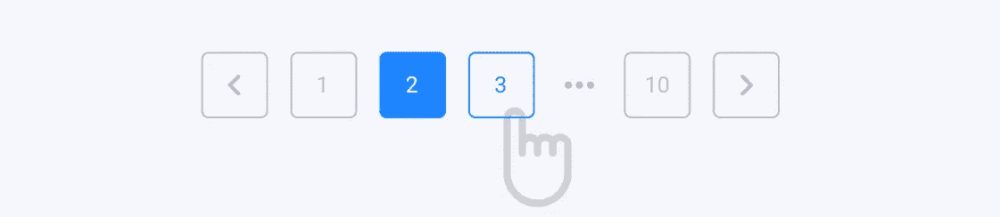
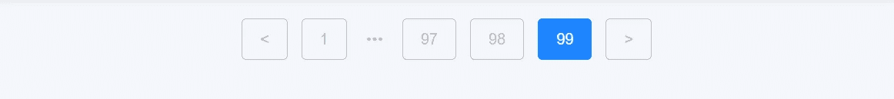

# 制作您自己的 React 分页

> 原文：<https://javascript.plainenglish.io/make-your-own-react-pagination-90f3d976de74?source=collection_archive---------5----------------------->

## 如何在 react 中制作分页组件

Pagination Banner

嘿，大家好！最近，我正在为一个项目添加一个分页组件。但是在研究一个非常适合的分页库时，我发现我们可以很容易地创建一个具有所需样式的分页组件。即使我们使用一些库进行分页，最有可能的是，分页组件的样式将不得不根据所需的设计进行彻底的更改。这可能会增加理解库的定制选项的必要延迟。所以，我认为最好还是维护我们自己的分页组件。

一个分页组件只需要 3 个重要的道具:1。`*currentPage*`
2。`*setCurrentPage*`
3。`*pageCount*`

这些道具都是不言自明的。这些道具会从母州传过来。

你可以根据需要增加一些道具，比如`*displayPageCount*` ——用户可以看到的页面按钮的数量，通常是 3 个或 5 个。在本文中，我们还将了解分页组件的一些设计变化。

分页组件只有一个**逻辑**职责要完成，即 ***根据用户选择改变页码。*** 道具中的`setCurrentPage`功能将用于此。

分页的所有其他职责都是表示性的，对于分页组件来说是局部的。这些职责包括:

***1。显示可选择页面的正确系列。显示下一页和上一页按钮，3。如果需要，显示第一页和最后一页按钮*和**

用户可以与这些按钮中的任何一个进行交互，并更改当前页面。

作为演示，我将使用来自 devchallenges.io 的挑战— [Muze Jobs Challenge](https://devchallenges.io/challenges/TtUjDt19eIHxNQ4n5jps) 。这个挑战提供了一个简单分页组件的设计。

我们将尝试创建以下分页组件:

Pagination Design

这是演示:

Muze Job challenge solution

每次点击按钮时，`*setCurrentPage*` 将用于更改当前页码，这将是父组件中的一个状态。这个`*currentPage*` 状态将在`*useEffect*` *内部的 API 调用中使用。*它将被添加到`*useEffect*`的依赖项中。因此，用户与分页的交互将更新父组件。

条件用于添加活动类。此外，考虑分页结束时将显示的页面范围。

Pagination end design

在这个演示中，条件呈现用于在分页结束时稍微改变分页设计。

以下是可重用分页组件:

我们可以自定义要显示的页面按钮的数量、样式以及第一页/最后一页按钮。有些设计可以包含用户输入的页码，以便直接跳转到该页面。

就是这样。这个组件可以在任何地方重复使用，并且可以很容易地添加变化。通过这种方式，我们可以减少项目的依赖性以及一些规模。

感谢您的宝贵时间！

*更多内容看*[***plain English . io***](http://plainenglish.io/)