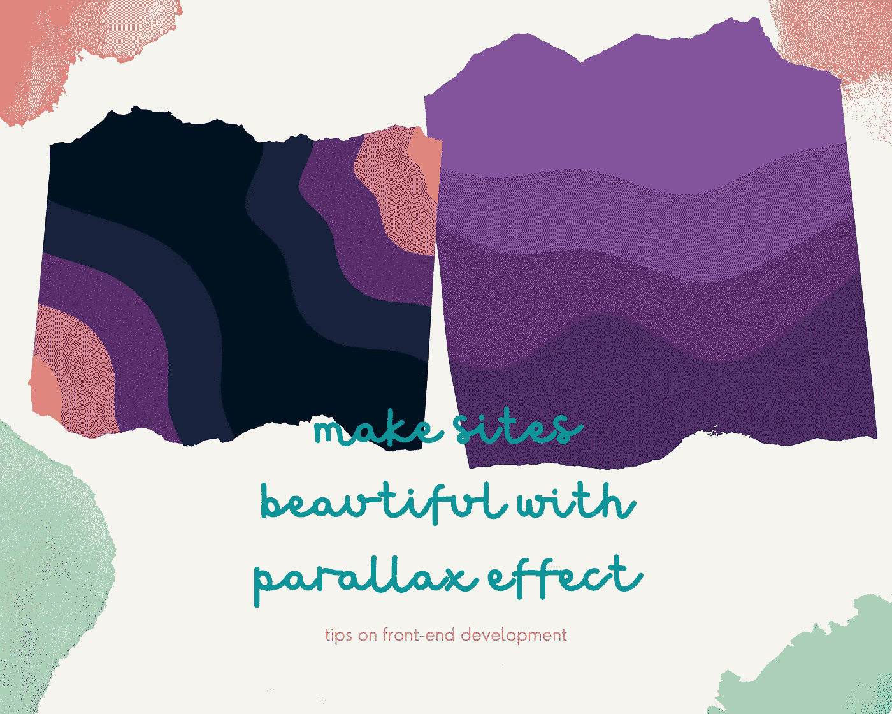

# 用视差效果让你的网站更漂亮

> 原文：<https://javascript.plainenglish.io/make-your-site-more-beautiful-with-parallax-effect-9160cf8db2bd?source=collection_archive---------11----------------------->

## 如何创建一个网站视差效果



Image Designed with [Canva](https://www.canva.com/)

## **什么是视差？**

前端网页设计中的视差是一种背景内容在滚动时以不同于前景内容的速度移动的效果。当我在为一个作品集网站做样板工程的时候，我想到了这个主题来写第二篇教程。我认为，如果我们添加一些背景效果，同时使您的网站更具吸引力和响应性(在所有设备上都能正常工作)，会更有趣。好了，开始编码吧！

**你将从这个话题中学到什么:**

*   如何使用**纯 CSS** 制作**图像背景**的视差效果
*   如何使用**纯 CSS** 制作**视频背景**的视差效果
*   如何使用 **simpleParallax.js** 制作视差效果

## **1。如何用纯 CSS 制作带有图像背景的视差效果**

首先，我们将看到图像背景的视差效果，它也可以很好地处理 SVG 文件，正如你在我的第一个演示中看到的。

这个工作的重要部分是我的 HTML 文件中的 *div* 元素，它有一个名为`“*parallax-init*”`的类(如果你愿意，你可以使用不同的类名)，然后我还添加了一个类`“*parallax-bg1*”`作为图像源的例子。我把它分成不同的类，以防你需要在你的网站上添加多个图片源。记住，你可以在一个 HTML 元素中添加多个类。将这些类添加到 HTML 文件中，如下所示:

```
<div class=”parallax-init parallax-bg1"></div>
```

在 CSS 文件中，自定义如下`“*parallax-init”*`类:

```
*.parallax-init {**/* Set height and width*/**height: 100vh;**width: 100vw;**/* Create the parallax scrolling effect */**background-attachment: fixed;**background-position: center;**background-repeat: no-repeat;**background-size: cover;**}*
```

现在，让我们在下面的[演示中看看它是如何工作的:](https://0msce.csb.app/)

或者，如果你不是 SVG 文件的粉丝，你可以看看下面的其他图像文件的演示:

## **2。如何用纯 CSS 制作带有视频背景的视差效果**

对于视频文件的视差效果，在 HTML 文件中添加一个带有类`“*ParallaxVideo*”`的`*div*`元素(你可以随意命名你的类)，如下所示:

```
*<div class=”ParallaxVideo”>**<video autoplay muted loop>**<source**src=”video-file-example.mp4"**type=”video/mp4"**/>**</video>**</div>*
```

然后在 CSS 文件中，自定义您的类，如下所示:

```
*.ParallaxVideo {**height: 300px;**}**.ParallaxVideo video {**object-fit: cover;**width: 100vw;**height: 100vh;**position: fixed;**top: 0;**left: 0;**z-index: -1;**}*
```

下面是[演示](https://xowd0.csb.app/)来看看它是如何工作的:

## **3。**如何使用 **simpleParallax.js** 制作视差效果

我在这里添加这一部分是因为在寻找其他视差效果时，我发现尝试这种方法简单而有趣。所以，如果你喜欢视差的内置 JavaScript 包，我想在这里介绍它作为额外的部分。SimpleParallax.js 由 [Geoffrey Signorato](https://twitter.com/geo_signo) 打造开发。基于他们的[文档](https://simpleparallax.com/)，您可以简单地添加带有 CDN 链接的包，或者安装 npm/yarn 包(如果您选择这种方法并使用离线代码编辑器，请确保您已经在您的计算机上安装了 *node.js* )。

```
*#npm npm install simple-parallax-js**#yarn yarn add simple-parallax-js*
```

对于代码沙盒上的演示，我安装了它的 npm 包，然后在 JavaScript 文件中实现了如下代码:

```
*import simpleParallax from “simple-parallax-js”;**const images = document.querySelectorAll(“img”);**new simpleParallax(images, {**delay: 1.8,**transition: “cubic-bezier(0,0,0,1)”,**orientation: “down”,**scale: 1.2**});*
```

记得在 HTML 文件中添加图像文件的源。

点击此处查看[演示](https://mxgyz.csb.app/)，看看它的表现如何:

今天这个话题就到这里吧！希望你能发现它很容易应用到你的项目中。请不要犹豫给我任何建议或评论，我真的很感谢你的时间和你的反馈。

如果您错过了我关于前端库的第一个技巧，您可以在这里快速阅读:

[](/saving-your-time-with-these-front-end-libraries-77a291f3215a) [## 使用这些前端库节省时间

### 如何通过使用这些 web 库来节省开发时间

javascript.plainenglish.io](/saving-your-time-with-these-front-end-libraries-77a291f3215a) 

快乐阅读，让我们一起成长！

*更多内容请看*[***plain English . io***](http://plainenglish.io)