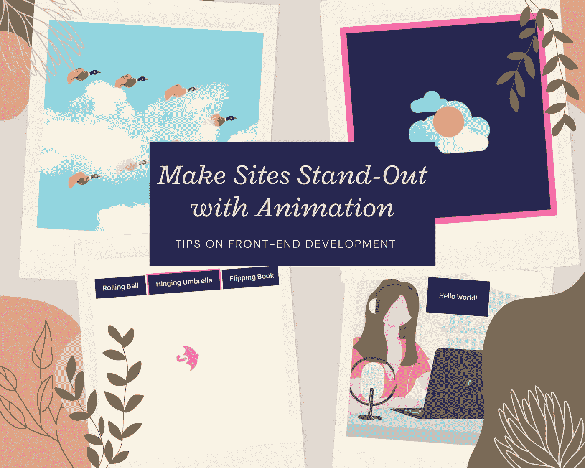

# 用动画让你的网站脱颖而出

> 原文：<https://javascript.plainenglish.io/make-your-site-stand-out-with-animation-4bb855c5a109?source=collection_archive---------19----------------------->

## 如何使用 CSS 和 JavaScript 创建动画，使你的网站更有吸引力



Image Designed with [Canva](https://www.canva.com/)

欢迎阅读我关于前端开发的第三个技巧。希望您会对这篇技巧感到兴奋，因为这也是我最喜欢的前端 web 应用程序设计和开发技巧之一。这次我们将探索和学习使用 CSS 和一些 JavaScript 库的**动画**。

**你将从这个话题中学到什么:**

*   动画用**纯 CSS**
*   动画用 **Anime.js**
*   动画用 **Ani.js**
*   带 **Typed.js 的动画**

好了，我们开始吧！

**1。纯 CSS 动画**

如果你正处于成为一名网络开发人员的初级阶段，你可能会在你的网站上寻找一些简单但仍然有趣的东西，那么只用纯 CSS 制作动画就足以让你的网站脱颖而出。所以，让我们来编写这个简单的 CSS 代码，让你的网站更加生动有趣。

从我的 HTML 文件开始，我添加了一个类名为" *animation-container* "的 *div* 元素(如果您愿意，可以使用不同的类名)。然后最重要的部分是 CSS 文件，在这里你可以为容器制作动画效果的样式，如下所示:

```
*.animation-container {
 height: 100vh;
 width: 100%;
 background-color: #8bd3dd;
 background-image: url(“https://freepngimg.com/thumb/cloud/7-cloud-png-image.png"),
 url(“https://media2.giphy.com/media/jqAqMwUmzolKNIvstM/giphy.gif?cid=ecf05e47guudo4c2yqpcwitl3f49tbcgze0qbfcjf7fslurz&rid=giphy.gif&ct=s");**background-repeat: repeat-x;
 background-position: left top, center center;
 background-size: auto, auto;
 animation: animated 50s infinite;
}**@keyframes animated {
 100% {
 background-position: -500px 50%, 0 0;
 }
}*
```

在这段代码中，我为背景图片创建了两层，第一层是移动的背景，第二层是移动的物体。最重要的一个是*动画*属性“*动画 50 秒无限*”，这意味着动画持续 50 秒，然后它再次开始，永远继续下去(无限)。在这种情况下，*@关键帧动画*将以 100%动画时间改变这两个层的背景位置。因为我为前景层使用了 gif 图像文件，所以我不需要改变它的位置来使它动画，所以我将它水平和垂直设置为 0。

让我们看看它在 Codepen 上的这个[演示](https://codepen.io/juniHub/pen/KKmzXQP)中表现如何:

**2。用 Anime.js 制作的动画**

现在，如果你想进一步了解动画中的 JavaScript 库，Anime.js 是首先尝试的好方法。 **Anime.js** 由[朱利安·卡尼尔](http://juliangarnier.com/)打造开发。在他们的[文档](https://animejs.com/)站点中，它被声明为“*一个轻量级的 JavaScript 动画库，具有简单而强大的 API。它可以处理 CSS 属性、SVG、DOM 属性和 JavaScript 对象。听起来很有趣，所以我决定尝试一下，做一个简短的演示。这个工作的重要部分是代码如下的 *index.js* 文件:*

```
*import anime from “animejs/lib/anime.es.js”;**anime({**targets: “.moon”,**keyframes: [**{ translateY: -40 },**{ translateX: 100 },**{ translateY: 40 },**{ translateX: 0 },**{ translateY: 0 }**],**duration: 3000,**easing: “easeOutElastic(1, .8)”,**loop: true**});*
```

将他们的包作为依赖项安装后，只需导入它，如上所示，然后您可以根据他们拥有的可用属性定制您的动画(他们的文档[在这里](https://animejs.com/documentation/))。在本例中，我将类名为“ *moon* ”的 HTML *div* 元素作为目标，并应用了云背景，因此您可以看到一个月亮围绕着云无限循环移动。

请参见此处的[演示](https://jg7sd.csb.app/):

**3。带 Ani.js 的动画**

另一个我最喜欢的动画库是 Ani.js，我觉得尝试一下也很有趣。 **Ani.js** 由[达利尔·诺尔](https://twitter.com/dariel_noel)建造开发。这里你可以看到没有 JavaScript (JS)文件可能会简单一点，因为这个包中有一个内置的 JS 文件。所以，关键是如何在你的 CSS 文件中应用。在他们的[文档](https://github.com/anijs/anijs/wiki/Sentence-Definitions)站点中，他们使用像这样的键公式" *If 一些事件(点击、滚动、鼠标悬停、* [*更多的*](https://developer.mozilla.org/en-US/docs/Web/Events) *)，对任何元素(CSS 选择器)，做一些行为(旋转动画)，对(任何元素)。好的，让我们将这个公式应用到你的代码中。我已经在代码沙盒上做了一个简短的演示，你可以很容易地跟随它。*

在 HTML 文件的 head 部分添加以下链接:

```
<link rel=”stylesheet” href=”https://anijs.github.io/lib/anicollection/anicollection.css" />.
```

然后在 body 部分的结束标记之前添加以下脚本:

```
<script src=”https://anijs.github.io/lib/anijs/anijs.js"></script><script src=”https://anijs.github.io/lib/anijs/helpers/dom/anijs-helper-dom-min.js"></script>
```

然后，应用一个包含其他动画元素的 *div* 元素。

```
*<div class=”button”>**<h2 class=”tab”>Rolling Ball</h2>**<p><i class=”fas fa-volleyball-ball rollIn animated”></i></p>**<h2 class=”tab active”>Hinging Umbrella</h2>**<p><i class=”fas fa-umbrella hinge animated”></i></p>**<h2 class=”tab”>Flipping Book</h2>**<p><i class=”fas fa-book flip animated”></i></p>**</div>*
```

重要的部分是如下所示的*代码*元素，它命令动画的动作工作。如果你喜欢使用他们可用的[集合](http://anicollection.github.io/#/)动画动作列表，你可以定制它。

```
*<code**data-anijs=”if: click, on: .tab, do: $removeClass active, to: .tab.active;**if: click, on: .tab, do: $addClass active, to: target”**>**</code>*
```

点击此处查看[演示](https://o7jxi.csb.app/):

**4。用 Typed.js 制作的动画**

制作动画的另一个精彩是用 Typed.js 制作的动画打字文本 **Typed.js** 是由 [Matt Boldt](https://github.com/mattboldt/typed.js) 构建开发的 *JavaScript 打字动画库*。要使用它，您可以将 typed.js 作为依赖项安装，或者使用 CDN。在我的演示中，我安装了它的包，然后在 *index.js* 文件中实现了如下代码:

```
*import Typed from “typed.js”;**var typed = new Typed(“.hello”, {**strings: [“Hello World!”, “My name is Juni Nguyen.”],**typeSpeed: 30,**backSpeed: 0,**loop: true,**showCursor: true**});*
```

就是这样，记得在 HTML 元素中添加类名" *hello* "(你可以用不同的方式调用你的类名)。它的包中还有更多定制的属性。您可以在他们的[文档](http://mattboldt.github.io/typed.js/docs/)中查看这一点。

看[演示](https://in2qk.csb.app/)这里:

这就是前端开发的技巧。我希望你能喜欢它。让我知道你是否能在你的项目中应用这些，并在这里与我分享。感谢您的阅读，祝您度过美好的一天！

如果您错过了我关于前端开发的第一个技巧和第二个技巧，您可以在这里快速阅读:

[](/make-your-site-more-beautiful-with-parallax-effect-9160cf8db2bd) [## 用视差效果让你的网站更漂亮

### 如何创建一个网站视差效果

javascript.plainenglish.io](/make-your-site-more-beautiful-with-parallax-effect-9160cf8db2bd) [](/saving-your-time-with-these-front-end-libraries-77a291f3215a) [## 使用这些前端库节省时间

### 如何通过使用这些 web 库来节省开发时间

javascript.plainenglish.io](/saving-your-time-with-these-front-end-libraries-77a291f3215a) 

*更多内容请看*[***plain English . io***](http://plainenglish.io/)