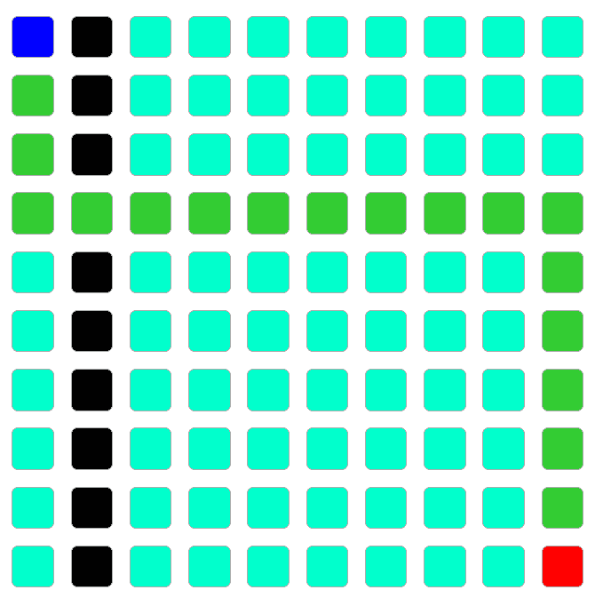

# 如何做一个寻路网站

> 原文：<https://javascript.plainenglish.io/making-a-pathfinding-website-4796a83e35a6?source=collection_archive---------19----------------------->


Photo by [Glenn Carstens-Peters](https://unsplash.com/@glenncarstenspeters?utm_source=medium&utm_medium=referral) on [Unsplash](https://unsplash.com?utm_source=medium&utm_medium=referral)

很多人都是寻路可视化网站的忠实粉丝。

 [## 寻路可视化工具

### 编辑描述

clementmihailescu.github.io](https://clementmihailescu.github.io/Pathfinding-Visualizer/) 

我们要做的东西与此相差甚远，但概念是相似的。如果你愿意花时间和精力去做，那么你可以做一些和那个网站非常相似的东西。

# 目的

该网站背后的主要思想是寻路。我们将在最后创建的网站将做到这一点。

**一些重要提示:**

1.  我们**没有**考虑任何对角移动(可以通过微小的改变来完成，你将在后面看到)。
2.  开始节点和结束节点是固定的。
3.  我不会涉及任何 CSS，所以如果你的输出看起来不同，那是因为 CSS。

# 先决条件:

了解广度优先搜索、深度优先搜索、邻接矩阵和 JavaScript。

# 方法学

## **第一步:**

首先，我们必须使用 JavaScript 创建一个网格(10x10)。

在 HTML 文件中创建一个 ID 为“grid”的 div 后，我们将使用下面的代码创建一个网格。

该网格将由 100 个节点组成。每个节点都需要一些属性，以便我们可以单独识别它们。所以我们给每个节点分配一个“行”和“列”值。这样，我们可以把网格看作一个 2D 矩阵。我们还将为它分配一个索引值(1–100)。没有必要这样做，但我们将这样做，以了解如何创建一个邻接矩阵，并找到使用矩阵的路径。

由于我们使用邻接矩阵的概念，我们需要维护一个“访问过的”数组。所以我们可以把它作为节点属性添加进去。

```
node.setAttribute("row", row);
node.setAttribute("col", col);
node.setAttribute("index", index);    node.setAttribute("visited",0);
```

我们需要动态地创建这些节点，也就是说，我们将在创建网格时这样做。


Final Output after some CSS

蓝色是开始节点，红色是结束节点。一定要给每个节点留有余量！

## ***第二步***

现在我们需要添加一面墙的功能。作为墙的节点不应该被访问。所以我们可以把它们当作 *visited=1。*

每个节点都有一个“列”和“行”。只需找到节点并设置 *visited=1。*


Walls in Black

## ***第三步***

现在有趣的部分来了！首先，我们必须创建一个邻接矩阵(为了便于学习，这个概念用于查找路径)。

我们的邻接矩阵将是 100x100，因为每个节点被单独处理。创建它的代码很繁琐，而且非常直观。请随意查看我的 GitHub，看看它是如何做到的。

## ***第四步:***

现在来看主算法。

我们将实现广度优先搜索(BFS)和深度优先搜索(DFS)来查找路径。BFS 会给我们最佳路径(没有对角线运动)。

每次我们访问一个节点时，我们都会将它的父节点和子节点存储在一个映射中。一旦我们到达节点 100，我们将把地图发送给另一个函数，该函数将突出显示所有的父子关系。这条道路将是我们的解决方案。

BFS Code

可以做类似的事情来实现 DFS。

## ***第五步:***

创建一个使用地图突出显示路径的函数:



BFS Path

# 可以做的补充:

1.  尝试思考不使用邻接矩阵的方法。
2.  尝试寻找使 DFS 最优的方法(不考虑对角线移动)。提示— BFS+DFS。
3.  需要做些什么来考虑对角线运动。提示:(-1，-1)，(1，1)。
4.  根据用户需要改变开始和结束节点。

GitHub 链接(可以看到用简单的 JavaScript 实现 BFS 和 DFS):

[](https://github.com/hitenSharm/Pathfinding-Site) [## hiten sham/寻路网站

### 您可以使用简单的 JS 看到 BFS 和 DFS 的实现。你可以在人们不能参观的地方做墙(黑色)……

github.com](https://github.com/hitenSharm/Pathfinding-Site) 

*更多内容尽在*[*plain English . io*](http://plainenglish.io/)