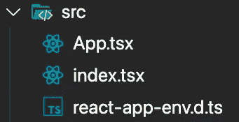

# 用 Redux Toolkit 在 TypeScript 中制作 React To-Do 列表

> 原文：<https://javascript.plainenglish.io/making-a-react-to-do-list-with-redux-toolkit-in-typescript-dd852bfb2c67?source=collection_archive---------1----------------------->

## 今天我们将学习如何使用 Redux 来管理应用程序的状态，从而制作一个待办事项列表。


Redux 是一个流行的状态管理库，特别是对于 React 来说，但是 Redux 的一个缺点/缺点是它可能非常容易出错。进入 Redux 工具包。Redux Toolkit 大大减少了我们必须编写的 Redux 代码的数量，并极大地改善了开发人员的体验，正如您将要看到的那样。所以，事不宜迟，让我们开始创建我们的待办事项列表。

# 先决条件

*   **反应知识**
*   **打字稿知识**
*   **JavaScript 知识**
*   **了解 Redux 如何工作(这将有所帮助，但不是必需的)**

# 我们开始吧

在我们做任何事情之前，我们的第一步将是创建我们的项目。我们将使用一个 create-react-app 模板作为这个项目的开始。运行以下命令将生成一个我们将使用的启动项目。

有一个 redux-typescript 的模板，但是我们必须删除这个项目的大部分文件和代码。

## 项目设置

```
npx create-react-app redux-todo-list --template typescript
```

在您的项目构建完成后，您可以继续在您选择的代码编辑器中打开它。我将使用 VS 代码，但是你可以使用任何你觉得舒服的代码。

随着我们的项目打开，是时候从 src 文件夹中删除一些不必要的文件了:

*   **App.test.tsx**
*   **App.css**
*   **index.css**
*   **logo.svg**
*   **setupTests.ts**
*   **reportWebVitals.ts**

当我们完成时，我们的 src 文件夹应该看起来像这样。



删除了所有不必要的文件和文件夹后，是时候清理 App.tsx 和 index.tsx 文件了。它应该看起来像下面的代码。

设置我们的项目需要做的最后一件事是安装几个包。运行以下命令将安装我们的应用程序所需的包。

```
npm install @reduxjs/toolkit react-redux @material-ui/core @material-ui/icons uuid @types/uuid
```

或者你用的是纱线。

```
yarn add @reduxjs/toolkit react-redux @material-ui/core @material-ui/icons uuid @types/uuid
```

## 包的描述

我们将使用 **@material-ui/icons** 和 **@material-ui/core** 来设计我们的应用程序， **uuid** 来生成唯一的 id， **@reduxjs/toolkit** 负责我们的状态管理，而 **react-redux** 将用于向 react 应用程序提供我们的状态。

## 确保我们的应用程序运行

继续运行下面的命令，以确保我们的应用程序可以运行。

```
npm start
```

或者你用的是纱线。

```
yarn start
```

# 让我们开始编码吧

## 创建待办事项类型

随着我们的项目按照我们需要的方式构建，是时候编写一些代码了。我想从创建一个我们的待办事项列表的结构模型开始。让我们从在 **src** 文件夹中创建一个新文件夹开始，并将其称为**模型**。让我们在模型文件夹中创建一个名为 **Todo.ts** 的文件。应该是这样的。

## 在应用程序中设置 Redux

现在我们的界面是为 Todo 创建的，是时候建立我们的 Redux 商店和 Redux Toolkit 所谓的“切片”了。我们可以在 **src** 文件夹中创建一个名为 **redux** 的新文件夹。接下来，我们将一个名为**的文件添加到 redux 文件夹中。这将控制我们的应用程序的状态管理是如何工作的，并且会是这样的。**

**以上代码说明:**

让我们从上面例子的**第 5 行**开始。这是不言自明的，但是我们需要设置应用程序开始时的状态(在这种情况下，是 Todo 类型的空数组)。当我们进入**第 7 行**时，我们将第一次看到 Redux Toolkit 在运行。

Now createSlice 是 Redux Toolkit 内置的一个函数，它将一个对象作为一个参数，带有 3 个必需字段。

第一个字段为**名称**。这很重要，因为它用于帮助命名 createSlice 中生成的操作类型。

第二个字段是 **initialState，**，顾名思义，这将是我们第一次启动应用程序时的初始状态。

第三个领域是我们的**减速器**，这是我们不同的状态处理将要发生的地方。在上面的代码中，您可以看到我有 3 个减压器(用于添加、删除和设置 todos 完成状态)。您还会注意到，我管理状态的方式让它看起来像是可变的(但事实并非如此)。在幕后，Redux Toolkit 正在利用一个名为 Immer 的库。简而言之，沉浸只是一个库，使得处理不可变状态更容易编写(更少的样板文件)。如果您感兴趣，下面是 Redux Toolkit 文档中讨论该问题的页面的链接。

真的是这样。上面的代码将控制我们整个应用程序的状态。对于那些手工编写所有 redux 代码的人来说(动作和减压器)，你会注意到这是多么少的锅炉板。

 [## 用 Immer | Redux 工具包编写减速器

### Redux Toolkit 的 createReducer 和 createSlice 在内部自动使用 Immer，让您编写更简单的不可变代码…

redux-toolkit.js.org](https://redux-toolkit.js.org/usage/immer-reducers#reducers-and-immutable-updates) 

下一步是为 Redux 建立我们的商店。让我们从在 **redux** 文件夹中创建一个名为 **store.ts** 的新文件开始。

**上述代码的解释:**

这里没有太多要讨论的，因为它非常简单，但是 Redux Toolkit 提供了一个关于 Redux store 的抽象，称为 **configureStore** 。基本上，我们需要做的就是将我们所有的切片传递给**配置存储**函数中的 reducer 选项。此外，我们还为一些事情提供了类型，以便以后让 TypeScript 满意。这些类型将被传递给 *useSelector* 和 *useDispatch* (react-redux 钩子)作为描述类型的方式。下面是 configure store API 文档的链接，供那些想了解更多信息的人参考。

[](https://redux-toolkit.js.org/api/configureStore) [## 配置存储| Redux 工具包

### 对标准 Redux createStore 函数的友好抽象，为……的商店设置添加了良好的默认值

redux-toolkit.js.org](https://redux-toolkit.js.org/api/configureStore) 

## 向我们的 React 应用程序添加 Redux

对于之前使用过 Redux 的人来说，这个过程保持不变。这就是我们之前安装的包发挥作用的地方(react-redux)。我们要做的就是将我们的整个 React 应用程序包装在由 **react-redux** 提供的组件中。为此，我们将编辑我们的 **index.tsx** 文件。

**上述代码的解释:**

这里也没有太多要解释的，但本质上，我们将我们的*提供者*组件包装在*应用*组件周围。这将允许我们从 React 应用程序中的任何地方访问我们的 Redux 商店，正如您将要看到的那样。如果你有兴趣了解更多，下面是提供者组件的 react-redux 文档的链接。

[](https://react-redux.js.org/api/provider) [## 提供者|反应还原

### 该组件使 Redux 存储对任何需要访问 Redux 存储的嵌套组件可用。因为任何…

react-redux.js.org](https://react-redux.js.org/api/provider) 

## 将 Redux 集成到我们的 UI 中

这将是最后一步，您将看到 Redux Toolkit 将使我们使用 react-redux 变得多么简单。

在我们开始之前，这里有一个关于我们将要做的事情的简要说明。首先，我们不会为这个应用程序编写自己的风格(如果你愿意，你可以)。这就是 Material-UI 发挥作用的地方。我们将有一个文本字段和一个按钮，负责将项目添加到我们的待办事项列表。在这个文本字段下面，按钮将是我们的项目列表。每个项目都将显示待办事项描述、一个将项目标记为完成的复选框以及一个用于从列表中删除待办事项的删除按钮。这就是全部内容，所以让我们来写代码。

**上述代码的解释:**

我们需要做的第一件事是向我们的 **index.tsx** 文件添加几行代码。我们将从 Material-UI 中导入并添加 *CSSBaseline* 组件。所有这些都是在我们的 CSS 中添加一些智能重置和默认值。

现在是时候写我们的 UI 了。我的例子中的所有代码都将存在于 App.tsx 文件中，但是如果您正在制作一个实际的应用程序，我强烈建议您将这些代码分解成单独的文件和组件。

为了避免混淆，我将不会深入到 Material-UI 的细节中(对于那些以前没有使用过它的人，您不必太深入地研究每个组件在做什么)。在上面的代码中，重要的是我们如何分派我们的动作。您会注意到操作是如何根据我们对 reducer(add todo、removeTodo、setTodoStatus)的命名来命名的。

让我们先讨论一下 *useDispatch* 钩子，以及它如何连接到我们在 **todoSlice.ts** 文件中创建的不同项目。

在**第 46 行，**我们正在调度 *addTodo* 动作。这真的很简单，因为我们只需要向它传递描述，并且因为我们在我们的切片中设置它的方式，将自动生成 *ID* 和*完成*状态。

在**第 65 行，**我们正在调度 *removeTodo* 动作。在这种情况下，我们只需要将 todo 项的 id 传递给它。在用于移除 todo 的解析器中，我们有一些代码，这些代码将根据 todo 项在数组中的索引从数组中拼接该项。

在**75 线，**我们正在调度 *setTodoStatus* 动作。在这个场景中，我们必须传递一个我们在 **todoSlice.ts** 文件的解析器中定义的对象。该对象包含 id 和完成状态，我们希望将 todo 项设置为完成状态。我们需要这两个项目，因为我们必须既能在数组中找到待办事项，又能根据它在该对象中的值设置完成状态。

这解释了我们在这个场景中如何使用 dispatch，但是现在我们需要理解 *useSelector* 钩子如何在 **line 25** 上工作。这很重要，因为我们使用这个钩子来生成我们的列表。

在**第 25 行，**你会看到我们将一个箭头函数作为参数传递给了 useSelector 钩子。基本上，这个箭头函数的作用是描述我们正在获取的数据的样子。在这种情况下，我们希望返回整个状态，所以我只是返回箭头函数另一端的状态。另一个需要注意的对 TypeScript 很重要的事情是在 arrow 函数中；state 参数有一个我们之前定义的类型 *RootState* 。本质上，这是一个动态生成的类型，完全基于我们传递给商店的项目。总而言之，我们的 *todoList* 变量将有一个类型的 *Todo[]* ，我们可以映射它来生成我们的列表。你会在第 53 行看到这个代码。

差不多就是这样。我们有一个全功能的应用程序，它有一个使用 Redux 的响应状态。下面是我在 Github 上的代码，如果你想克隆我的库并用作参考。

[](https://github.com/13bfrancis/redux-toolkit-todolist-tutorial) [## 13b Francis/redux-toolkit-todolist-tutorial

### 在 GitHub 上创建一个帐户，为 13 bfrancis/redux-toolkit-to dolist-tutorial 开发做贡献。

github.com](https://github.com/13bfrancis/redux-toolkit-todolist-tutorial) 

# 参考资料和文档

以下是一些有用的参考资料和文档。

[](https://github.com/uuidjs/uuid#readme) [## uuidjs/uuid

### 对于 RFC4122 UUIDs 的创建完整-支持 RFC4122 版本 1、3、4 和 5 UUIDs 跨平台-支持…

github.com](https://github.com/uuidjs/uuid#readme) [](https://material-ui.com/) [## Material-UI:一个流行的 React UI 框架

### React 组件使 web 开发更快更容易。建立自己的设计体系，或者从材料设计开始。

material-ui.com](https://material-ui.com/) [](https://redux.js.org/tutorials/fundamentals/part-8-modern-redux) [## Redux 基础知识，第 8 部分:带有 Redux 工具包的现代 Redux

### 恭喜你，你已经完成了本教程的最后一部分！在我们…之前，我们还有一个话题要讲

redux.js.org](https://redux.js.org/tutorials/fundamentals/part-8-modern-redux) [](https://redux-toolkit.js.org/) [## Redux 工具包| Redux 工具包

### 官方的、固执己见的、包含电池的高效 Redux 开发工具集

redux-toolkit.js.org](https://redux-toolkit.js.org/) [](https://react-redux.js.org/) [## 反应还原|反应还原

### 您的 Docusaurus 站点没有正确加载。一个非常常见的原因是错误的 site baseUrl 配置。

react-redux.js.org](https://react-redux.js.org/) [](https://redux.js.org/) [## redux-JavaScript 应用程序的可预测状态容器。|还原

### 您的 Docusaurus 站点没有正确加载。一个非常常见的原因是错误的 site baseUrl 配置。当前…

redux.js.org](https://redux.js.org/) 

# 结论

Redux 是一个引人注目的流行库，许多 React 开发人员都在使用它。即使你不打算在你的项目中使用它，知道和理解它也是有益的。在我看来，Redux Toolkit 是未来许多 Redux 应用程序的发展方向。它大大减少了样板文件，目前是 Redux 推荐的方法。希望你从这篇教程中获得一些关于 Redux Toolkit 有多方便的价值。

*更多内容请看*[***plain English . io***](https://plainenglish.io/)