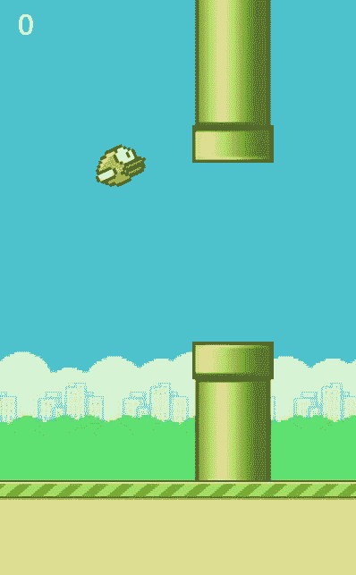

# 用 p5.js 制作基于 Web 的 Flappy Bird 克隆|第 4 部分

> 原文：<https://javascript.plainenglish.io/making-a-web-based-flappy-bird-clone-with-p5-js-part-4-9164d8d25f2f?source=collection_archive---------7----------------------->



## 概述

这是 Flappy 鸟克隆系列的第 4 部分。你可以在这里找到第一部[，在这里](/how-to-make-a-web-based-flappy-bird-clone-with-p5-js-part-1-2913fde25c8a)找到第二部[，在这里](/making-a-web-based-flappy-bird-clone-with-p5-js-part-2-c554254881b1)找到第三部[。在上一篇文章中，我通过动画演示了 bird 的跳跃和下落，回顾了它的更新逻辑。有了这些，我们就有了制作游戏的所有组件，所以我们将在这个系列的最后一篇文章中关注游戏逻辑的添加。](/making-a-web-based-flappy-bird-clone-with-p5-js-part-3-32d4e96b8737)

## 重访管道

让我们想想这个游戏是怎么玩的。当你思考这个问题的时候，你得到一分的唯一时间是当小鸟经过一组管道的时候，游戏结束的唯一时间是当小鸟碰到一个管道或者地面的时候。所以管道是拼图中重要的一块，我们需要把我们的游戏逻辑和它们联系起来。

首先，让我们看看如何判断鸟儿何时通过了管道

```
// Pipe.jsfunction Pipe(){
 ...
 this.isPassed = (bird) => {
  return bird.x > this.x + Math.floor(this.scaledWidth / 2);
 };
}
```

简单地说，我们只需要检查鸟的 x 位置，以及它是否大于管道的 x 位置。在这种情况下，只有当鸟通过管道的中点时，才算通过。

在我们继续之前，让我们也编写代码来检查鸟是否与管道发生了碰撞。

```
// Pipe.jsfunction Pipe(){
 ...
 this.isCollided = (bird) => {
  const cx = bird.x;
  const cy = bird.y;
  const dia = BIRD_IMG[0].width * bird.SCALE * 0.85; const topPosition = this.y - this.scaledHeight - this.gap;
  const collideTop = collideRectCircle(
   this.x,
   topPosition,
   this.scaledWidth,
   this.scaledHeight,
   cx,
   cy,
   dia
  );
  const collideBottom = collideRectCircle(
   this.x,
   this.y,
   this.scaledWidth,
   this.scaledHeight,
   cx,
   cy,
   dia
  ); return collideTop || collideBottom;
 };
}
```

在这个方法中，我们使用一个名为 collideRectCircle 的函数来确定鸟是否与管道发生了碰撞。碰撞矩形的定义如下

```
// Utils.jscollideRectCircle = function (rx, ry, rw, rh, cx, cy, diameter) {
 //2d
 // temporary variables to set edges for testing
 var testX = cx;
 var testY = cy;// which edge is closest?
 if (cx < rx) {
 testX = rx; // left edge
 } else if (cx > rx + rw) {
 testX = rx + rw;
 } // right edgeif (cy < ry) {
 testY = ry; // top edge
 } else if (cy > ry + rh) {
 testY = ry + rh;
 } // bottom edge// // get distance from closest edges
 var distance = this.dist(cx, cy, testX, testY);// if the distance is less than the radius, collision!
 if (distance <= diameter / 2) {
 return true;
 }
 return false;
};
```

老实说，我实际上是从一个库复制了这段代码，我现在不记得这个库的名字了，但是它应该对我们的目的有用。该代码用于检测一个圆是否与一个矩形发生碰撞，其中我们的鸟是圆，管道是矩形。我发现对于我们的目的来说，估计击中框是鸟上的一个圆是相当准确的——不相信我？好吧，让我们在鸟身上画个圈看看。

Seems close enough to me

## 记分

好了，现在我们可以检测小鸟何时通过管道，我们可以添加一个计分机制。首先，分数对象…

```
function Score(currentScore=0) {
 this.currentScore = currentScore; this.show = () => {
  textSize(32);
  fill(255, 255, 255);
  text(this.currentScore.toString(), 20, 40);
 }; this.incrementBy = (amount) => {
  this.currentScore += amount;
 };
}
```

当然，文本对象仍然是一个 p5 对象，需要被明确告知在每一帧中呈现。

```
function pipesUpdate() {
 ...
 if (pipe.isPassed(bird) && !pipe.isPassedCounted) {
  score.incrementBy(1);
  pipe.isPassedCounted = true; 
 }
}
```

在这里，您可能已经注意到，如果我们已经通过了管道，我们只需在当前分数上加 1。但是，我们还向管道添加了一个名为 isPassedCounted 的属性。记住 pipesUpdate 在每一帧都运行，这个检查让我们知道当我们第一次通过这个管道时，我们已经增加了分数，这样有助于在鸟已经通过管道后分数不会继续增加。

## 杀死这只鸟

我们已经非常接近完成游戏了。首先，让我们创建一个函数来设置所有的游戏开始条件，初始化我们需要的所有对象。

```
// index.js...
function setup() {
 createCanvas(WIN_WIDTH, WIN_HEIGHT);
 //add the following lines to fix bugs
 angleMode(DEGREES); 
 frameRate(30);

 gameStartConditions();
}function gameStartConditions() {
 bird = new Bird();
 ground = new Ground();
 score = new Score(0);
 gamePlay = true;
 pipes = [];
}
```

正如你在这里看到的，我们已经封装了游戏开始所需的所有对象初始化。我们也将把游戏设置为真——只要游戏仍然是真的，鸟就是活着的。一旦游戏性是假的，你应该不能让鸟跳了，因为它掉到了地上，地面上的位置更新和管道应该停止。这个逻辑可以在我们的 draw 函数中轻松控制。

```
// index.js
function draw() {
 background(BG_IMG); if (gamePlay) {
  pipesUpdate();
  ground.update();
 } pipes.forEach((pipe) => {
  pipe.show();
  }); score.show();
 ground.show(); bird.update(); imageMode(CORNER);
}
```

如果游戏是真的，我们想更新管道和地面。我们还希望管道和地面即使在游戏结束后仍然显示在屏幕上——这就是为什么我们将这些对象的显示和更新方法分开。这里我们仍然需要担心的一件事是，这只鸟仍然能够跳跃——实际上，这只鸟又是如何跳跃的呢？

```
function keyPressed() {
 if (key === “ “) {
 jumpEvent();
 }
}function mouseClicked() {
 jumpEvent();
}function jumpEvent() {
 gamePlay && bird.jump();
 !gamePlay && bird.hitGround() && gameStartConditions();
}
```

正如你所看到的，我们将 jumpEvent 提取到一个函数中，在这个函数中，我们说如果游戏性仍然是真的，那么小鸟可以跳跃，但是如果游戏性是假的，小鸟撞到了地面，用户事件将触发游戏重置，用户可以重新开始游戏。

## 还有几件事

我们还没有处理导致这只鸟死亡的实际事件。

```
// index.js
function pipesUpdate() {
 ... pipes.forEach((pipe, idx) => {
  ... if (pipe.isCollided(bird)) {
   gamePlay = false;
  }
 });
}
```

如果这只鸟撞到地面，我们也希望它死掉

```
// Bird.jsfunction Bird(){
 ...
 this.update = () => {
  ...
  if (this.hitGround()) {
   gamePlay = false;
  }
 }
}
```

## 好了

如果你已经完成了这篇教程，那么恭喜你。你现在应该能够用 p5 做一些很酷的事情，也希望能学到一点如何制作一个简单的游戏。

当然，为了简洁起见，有许多地方我必须浏览，但是如果有任何问题，请让我知道。你可以点击此链接[https://birdflap.netlify.app/](https://birdflap.netlify.app/)试用游戏的部署版本。

如果有足够的需求，我可能还会做一个如何在 Netlify 上部署游戏的教程。我就说这些。

*更多内容尽在*[***plain English . io***](http://plainenglish.io/)