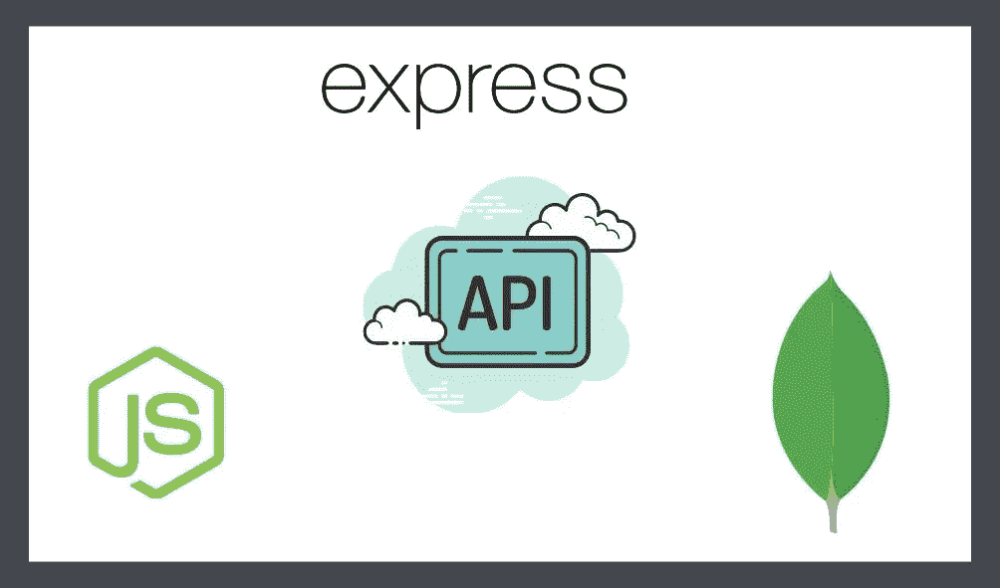

# 在 Node.js 中为 REST API 创建 API 端点

> 原文：<https://javascript.plainenglish.io/making-api-endpoints-for-rest-api-in-nodejs-ec688c18aaa?source=collection_archive---------3----------------------->

## 第二部分。制作 API 端点来发布或检索数据

在本文中，您将了解如何使用 Rest-API 让端点对存储在 MongoDB Atlas 数据库上的数据进行 CRUD(创建、读取、更新、删除)操作。

[](/how-to-make-rest-api-with-node-js-express-and-mongodb-dfce5e70e830) [## 如何用 Node.js，Express，MongoDB 制作 REST API

### 在这篇文章中，您将了解什么是 REST API，并学习如何在 Node.js 中为 API 建立连接

javascript.plainenglish.io](/how-to-make-rest-api-with-node-js-express-and-mongodb-dfce5e70e830) 

在上面的文章中，我们看到了如何设置 Node.js 项目并将我们的 MongoDB 数据库连接到 Node.js。

## 1.首先，我们必须在我们的 API 中制作我们想要的数据类型的模式，我们将为商店中的产品制作模式

在主目录下做一个名为 **models** 的文件夹，做一个名为 **Products.js** 的文件，代码如下。

```
const mongoose = require('mongoose') // required to make the schemaconst ProductSchema = mongoose.Schema({
  name: {
    type: String,
    required: true
  },
  price: {
   type: Number,
   required: true,
  },
})
// we are exporting our schema for table Products.
module.exports = mongoose.model('Products', ProductSchema)
```

## 2.我们必须定义检索数据和发布数据的路线

在主目录下做一个名为**路线**的文件夹，然后做一个名为 **product.js.** 的文件

转到主目录中的 **app.js** ，在 mongodb 连接代码前写入如下产品路线的入口代码:

```
// making the /products route for our productconst ProductRoute = require('./Routes/Product');
app.use('/products', ProductRoute)
```

转到 **routes** 文件夹中的 **product.js** 文件，开始制作获取和发布路线，如下所述:

```
**// we are making express router to handle different kinds of request like get/post/patch/delete**const express = require('express')
const router = express.Router()**// We will me making this file in next step which will handle all our logic** const ProductController = require('../controllers/product')**// All these routes are there for our products like this:** [**// (http://localhost:5000/products/get)**](http://localhost:5000/products/get) **for getting all product
// (**[**http://localhost:5000/products/post**](http://localhost:5000/products/post)**) for posting a product**router.get('/get', ProductController.get_all_product);router.post('/post',ProductController.create_product)router.get('/:productId', ProductController.get_single_product)router.patch('/:productId',ProductController.patch_product_details)router.delete('/:productId',ProductController.delete_product)module.exports = router
```

## 3.使控制器处理路由背后的所有逻辑

转到项目的主目录，创建名为**控制器**的文件夹，并在其中创建名为 **product.js** 的文件

现在，在这个文件中，路由背后的所有逻辑如下所示

For /get 请求:

```
// schema of the product table
const Product = require('../models/Product')// Logic for the get request to get all the products
exports.get_all_product = async (req, res) => {
  try {
    // finding all the product in the table
    const products = await Product.find()
    // To check in the console 
    console.log(products) res.send(products)
   }catch (err) {
      res.send({ message: err })
   }
}// Logic for the get request to get the single productexports.get_single_product = (req, res) => {
    const id = req.params.productId; //get the productid from params
    Product.findById(id)
      .then(result => {
          res.send(result) // if product is found then returned
      })
      .catch(err => {
         res.send({message: err}) //gives error if product not found
      })
}
```

申请/发布请求

```
exports.create_product = async (req, res) => {
   console.log(req.file)

   // retrieving data from json body of post request const product = new Product({
      name: req.body.name,
      price: req.body.price,
     });
   product.save()
    .then(result => {
       res.status(200).send({
        _id: result._id,
        name: result.name,
        price: result.price,
        request: {
           type: 'GET',
           url: 'http://localhost:5000/products/' + result._id
          }
        })
      })
   .catch(err => {
      res.send({ message: err })
    })
}
```

for /patch 请求

```
exports.patch_product_details = (req, res) => {
   const id = req.params.productId; // get product ID from params
   const update = {}
   // checks for the value to be updated in item
   for (const ops of req.body) {
       update[ops.propName] = ops.value;
   }
   Product.update({ _id: id }, { $set: update })
   .exec()
   .then(result => {
       res.send(result)
    })
   .catch(err => {
      res.send(err)
    })
}
```

对于/删除请求

```
exports.delete_product = (req, res) => {
   const id = req.params.productId; //checks for productId to delete
   Product.remove({ _id: id }) // removes product from table
     .exec()
     .then(result => {
         res.send(result)  //sends the result back
      })
     .catch(err => {
        res.send(err)    // sends error if product is not updated
      })
}
```

我们已经完成了 API 工作所需的所有路线和逻辑，您可以通过尝试任何 API 测试工具(如 Postman)来检查您的 API。

## 错过了第一部分？看看下面吧

[](/how-to-make-rest-api-with-node-js-express-and-mongodb-dfce5e70e830) [## 如何用 Node.js，Express，MongoDB 制作 REST API

### 在这篇文章中，您将了解什么是 REST API，并学习如何在 Node.js 中为 API 建立连接

javascript.plainenglish.io](/how-to-make-rest-api-with-node-js-express-and-mongodb-dfce5e70e830) 

被一个错误卡住了？没问题！留下评论，我一定会努力解决。

*更多内容请看*[***plain English . io***](http://plainenglish.io)