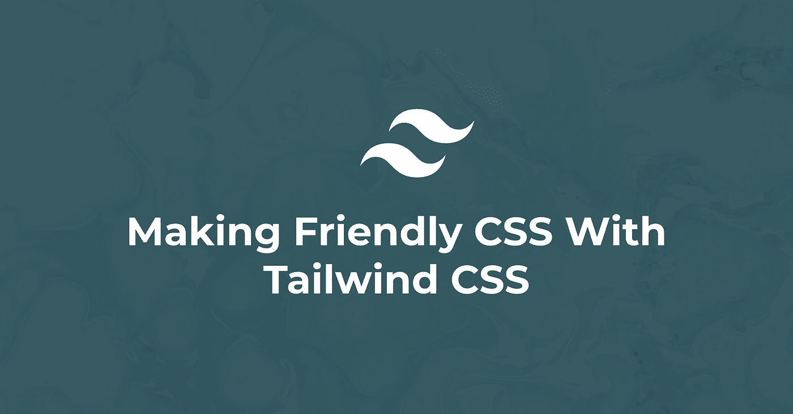
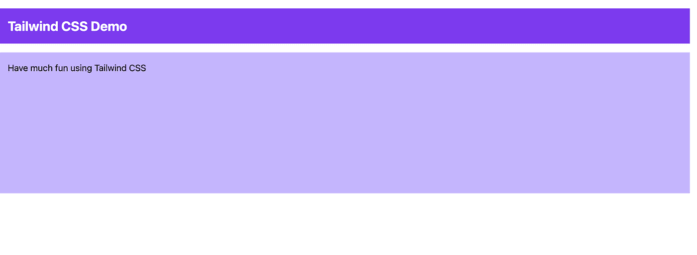
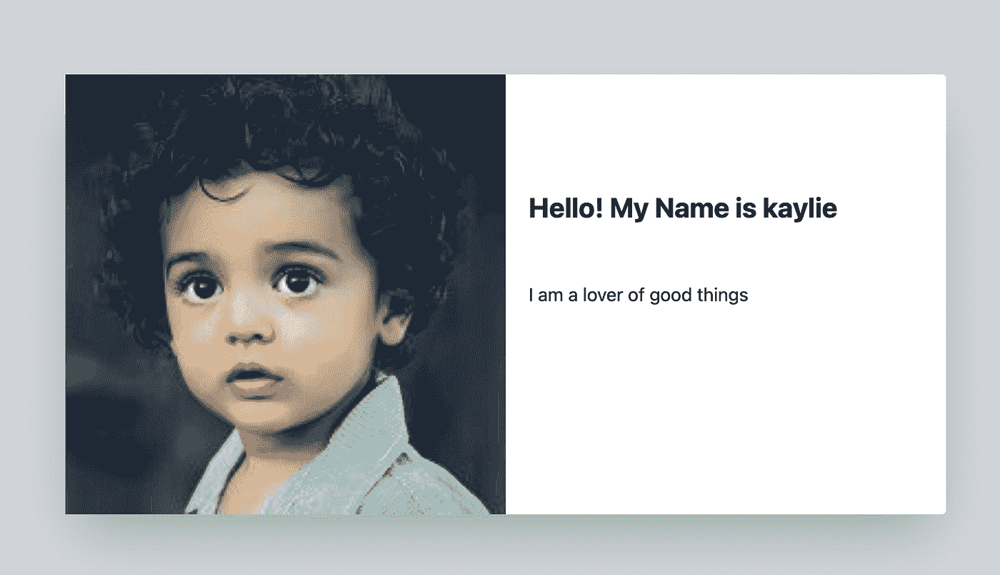
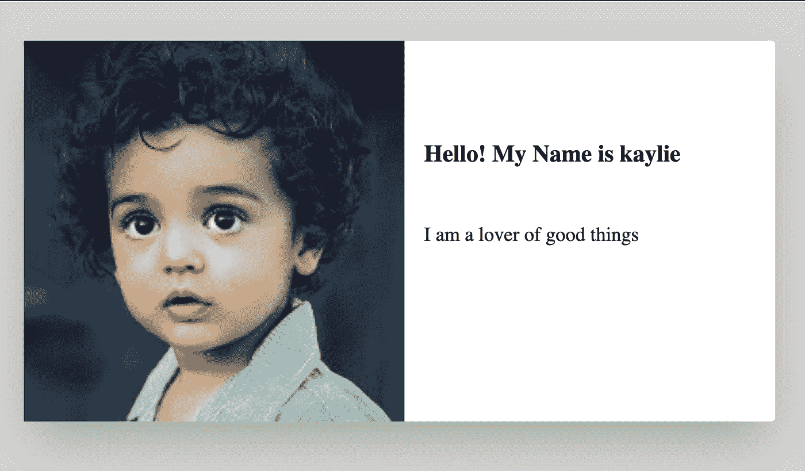

# 用 wind CSS 制作友好的 CSS

> 原文：<https://javascript.plainenglish.io/making-friendly-css-with-tailwind-css-1b20f474cf32?source=collection_archive---------13----------------------->



写 CSS 会激怒开发者，但是有了 tailwind，CSS 用起来就变得更友好了。在本文中，我将带您进入实用优先框架“顺风”的旅程。

# 什么是顺风 CSS？

根据[官方文档](https://tailwindcss.com/)，Tailwind CSS 是一个实用优先的 CSS 框架，用于快速构建定制用户界面。Tailwind 使您能够编写内联样式并实现一个奇妙的用户界面，而无需离开您的 HTML 代码和编写一行 CSS。

与 Bootstrap 或 Materialize CSS 等其他 CSS 框架不同，Tailwind CSS 没有预定义或内置的组件。相反，Tailwind CSS 为您提供了一组 CSS 助手类，使您能够轻松创建自定义设计。

在我看来，大多数用 Bootstrap 构建的网站看起来总是一样的，感觉也是一样的。但是 Tailwind CSS 并不固执己见，它允许你创建自己独特的设计。

# 使用 Tailwind CSS 设置项目。

了解如何启动 Tailwind CSS 并运行您的项目。

# 通过 CDN 使用顺风

如果你想快速建立一个简单的项目或快速演示，通过 CDN 使用 tailwind 是非常好的。但请注意，许多出色的顺风功能无法通过 CDN 获得。

以下是 CDN 的最新默认配置:

```
<link href="https://unpkg.com/tailwindcss@^2/dist/tailwind.min.css" rel="stylesheet">
```

# HTML 初学者模板

这是你的 HTML5 doctype 包含 tailwind CDN 后的样子。

```
<!doctype html>
<html>
<head>
 <meta charset="UTF-8" />
 <meta name="viewport" content="width=device-width, initial-scale=1.0" />
 <link href="https://unpkg.com/tailwindcss@^2/dist/tailwind.min.css" rel="stylesheet">

</head>
<body>
  <h1>Welcome to Tailwind CDN</h1>
</body>
</html>
```

# 通过 npm 安装顺风

与通过 CDN 使用顺风不同，通过 npm 或 yarn 安装顺风可以让您访问顺风的强大功能。

在通过 npm 安装 tailwind 之前，使用 npm 命令创建一个新的 package.json 文件。

```
npm init -y
```

然后通过 npm 安装顺风

```
npm install tailwindcss
```

# 在你的 CSS 中包含顺风

下一步是在 CSS 中包含 Tailwind。您可以通过创建一个新的 CSS 文件夹来实现这一点。如果你没有，那么你创建一个 CSS 文件。你可以给它起任何你喜欢的名字，但是为了这个项目，我将把它命名为`style.css`。

将以下内容添加到`style.css`文件中。

```
/* ./css/style.css */
@tailwind base;
@tailwind components;
@tailwind utilities;
```

# 添加 postcss 插件

```
npm install postcss-cli autoprefixer
```

# 创建您的配置文件

为了完成顺风设置，我们将创建一个配置文件，使您能够定制您的顺风项目。

使用此命令创建一个配置文件

```
npx tailwindcss init
```

这将在项目的根目录下创建一个`tailwind.config.js`文件。

```
// tailwind.config.js
module.exports = {
  purge: [],
  darkMode: false, // or 'media' or 'class'
  theme: {
    extend: {},
  },
  variants: {},
  plugins: [],
}
```

# 用顺风处理 CSS

通过在项目的根目录下创建一个`postcss.config.js`文件，可以将 tailwind 和 autoprefixer 添加到 PostCSS 配置中。

将它添加到 postcss.config.js 文件中

```
//postcss.config.js
  module.exports = {
     plugins: [
        require('tailwindcss'),
        require('autoprefixer'),
       ]
    }
```

在 package.json 中，插入以下构建脚本:

```
"build": "postcss css/style.css -o build/style.css"
```

要执行此脚本，请键入:

```
npm run build`
```

# 创建一个 index.html 文件

让我们在构建文件夹中创建一个新的文件 index.html，并插入下面的 HTML 代码。

```
<!DOCTYPE html>
    <html lang="en">
    <head>
        <meta charset="UTF-8">
        <meta name="viewport" content="width=device-width, initial-scale=1.0">
        <link rel="stylesheet" href="style.css">
        <title>Tailwind CSS Demo</title>
    </head>
    <body>
        <div class="h-64">
            <div class="p-4 m-4 bg-purple-600">
                <h1 class="text-2xl font-bold text-white">Tailwind CSS Demo</h1>
            </div>
            <div class="p-4 m-4 bg-purple-300 h-full">
                <h2 class="text-purple-900">Have much fun using Tailwind CSS</h2>
            </div>  
        </div>
    </body>
    </html>
```

# 设置实时服务器

为了给我们的服务器设置一个 web 服务器，我们将使用一个实时服务器。要使用实时服务器，请通过 npm 安装它:

```
npm install -g live-server
```

接下来，通过键入以下命令启动实时服务器。

```
live-server build
```

然后，您应该能够通过将浏览器指向 URL 127.0.0.1:8080 来打开该网站。

结果如下所示:



# 带顺风 CSS 的部件

不像 bootstrap、materialize CSS 等其他 CSS 框架。，tailwind 没有为按钮、卡片、导航条等不同组件提供预定义的内置组件。在本节中，您将学习如何使用 Tailwind CSS 实用程序类来设计组件的样式。我们还将看到如何通过构建组件来使用 tailwind 创建友好的 CSS，并比较它在 tailwind 和 Vanilla CSS 中的编写方式

# 组件 1:按钮

让我们设计一个按钮。

## 在这里，您将创建一个提交按钮，并对其进行样式化

```
//tailwind.css
 <button class="bg-blue-700 w-60 text-white border-2 border-blue-700 rounded py-3 
    hover:bg-red-500 hover:border-transparent">
       Submit
 </button>
```

应用以下实用程序类别:

这个类为按钮设置了蓝色背景。值 700 只是一个范围从(50-900)的着色数。

`w-60`:这个类表示按钮的宽度。值 60 相当于`15rem`，换算过来也是`240px`。

`text-white`:这个类将文本设置为白色。它相当于普通 CSS 中的`color:white`

`border-2`:这个类将边框宽度设置为 2px

`border-blue-700`:这个类将`border-color`设置为蓝色。如前所述，值 700 只是一个阴影数。

`rounded`:该类将`border-radius`设置为`0.25rem`，转换后也是`4px`。

`py-3`:该类将`padding-top`和`padding-bottom`设置为`0.75rem`，转换后也是`12px`。

`hover:bg-red-500`:这个类在鼠标悬停时将蓝色背景变成红色。

`hover:border-transparent`:这个类在鼠标悬停时使边框透明。

## 在 tailwind CSS 中，结果应该是这样的:


## 悬停时的结果应该如下所示:


## 使用普通 CSS 的样式

```
//index.html
    <button class="button ">Submit</button>//style.css

    .button{
      background-color: blue;
      width: 240px;
      color: white;
      border: 2px solid blue;
      border-radius:4px;
      padding-top: 12px;
      padding-bottom: 12px;
    }

    .button:hover{
       background-color: red;
      border: transparent
    }
```

在普通的 CSS 中，结果应该是这样的


悬停时的结果应该是这样的


您可以看到如何在 tailwind CSS 中创建了一个按钮并设计了它的样式。您还可以看到如何编写更少的代码，并且与常规 CSS 相比，它使内联样式更加整洁，可读性更好。我们可以看到所有我们必须做的造型。即使你尝试内联样式化常规 CSS，也会变得繁琐，不容易读懂。

## 组件 2:一张卡

最后，让我们看看如何使用 Tailwind 的实用程序类来设计卡片组件的样式:

```
//index.html
    <!DOCTYPE html>
    <html lang="en">
    <head>
        <meta charset="UTF-8">
        <meta name="viewport" content="width=device-width, initial-scale=1.0">
        <link rel="stylesheet" href="style.css">
        <title>Tailwind CSS Demo</title>
    </head>
    <body class="bg-gray-300">
        <div class="bg-white mx-auto my-40 shadow-2xl  w-3/5 h-96 rounded flex ">
            
            <div>
                <h1 class="font-bold text-2xl p-5 mt-20">Hello! My Name is kaylie</h1>
                <p class=" text-xl p-5 mt-2">I am a lover of good things</p>
            </div>
        </div>
    </body>
    </html>
```

应用以下实用程序类别:

`bg-gray-300`:该类设置为 body，将默认的白色背景改为灰色。

`mx-auto`:这个类被设置为将 div 移动到中心。`mx`代表`margin-right`和`margin-left`

`my-40`:这个类被设置为从顶部和底部移动 div`10rem`。

`shadow-2xl`:这个类表示卡片的方框阴影。

`w-3/5`:该类将卡的`width`设置为`60%`

`rounded`:该类将`border-radius`设置为`0.25rem`，也就是`4px`

`h-96`:该类将卡片的高度设置为`384px`

`font-bold`:该类将`font-weight`设置为`bold`

`text-2xl`:这个类将`font-size`设置为`24px`

`p-5`:这个类将`padding`设置为`20px`

`mt-20`:该类将`margin-top`设置为`80px`

`text-xl`:该类将`font-size`设置为`20px`

`mt-2`:这个类将`margin-top`设置为`8px`

在 tailwind CSS 中，结果应该是这样的



## 普通 CSS

```
//index.html
    <!DOCTYPE html>
    <html lang="en">
    <head>
        <meta charset="UTF-8">
        <meta name="viewport" content="width=device-width, initial-scale=1.0">
        <link rel="stylesheet" href="style.css">
        <title>Tailwind CSS Demo</title>
    </head>
    <body>
      <div class="card">
        

        <div>
            <h1 class="card-h1">Hello! My Name is kaylie</h1>
            <p class="card-p">I am a lover of good things</p>
           </div>
      </div>
    </body>
    </html>
```

## 使用普通 CSS 的样式

```
//style.css
    body{
      background: lightgray
    }
    .card{
      background-color: white;
      margin:40px auto;
      box-shadow: 0 25px 50px -12px rgba(0, 0, 0, 0.25);
      width: 60%;
      height: 384px;
      border-radius: 4px;
      display:flex;
    }
    .card-h1{
      font-weight:bold;
      font-size: 24px;
      padding: 20px;
      margin-top: 80px;
    }
    .card-p{
      font-size:20px;
      padding: 20px;
      margin-top: 8px;
    }
```

在普通的 CSS 中，结果应该是这样的



您可以看到，在上面的示例中，您获得了相同的结果，尽管使用了不同的方法。这个组件示例向您展示了 tailwind 如何使用普通 CSS 的基础知识。现在让我进一步解释为什么你应该在你的下一个项目中使用 Tailwind CSS。

# 为什么使用 Tailwind CSS

# 对核心的响应

需要编写大量媒体查询来构建响应性应用程序的日子已经一去不复返了。使用 Tailwind CSS，您可以在 class 属性中轻松创建响应式设计。Tailwind CSS 在创建响应式应用程序时也使用了移动优先的方法。

受常见设备分辨率的启发，默认有五个断点:断点前缀最小宽度 CSS`sm`640 px`@media (min-width: 640px) { ... }md`768 px`@media (min-width: 768px) { ... }lg`1024 px`@media (min-width: 1024px) { ... }xl`1280 px`@media (min-width: 1280px) { ... }2xl`1536 px`@media (min-width: 1536px) { ... }`

下面我们来看一个例子。

```
<!DOCTYPE html>
    <html lang="en">
    <head>
        <meta charset="UTF-8">
        <meta name="viewport" content="width=device-width, initial-scale=1.0">
        <link rel="stylesheet" href="style.css">
        <title>Tailwind CSS Demo</title>
    </head>
    <body>
        <div class="lg:text-9xl md:text-5xl lg:font-extrabold md:font-bold text-center 
            mt-40">Hello World</div>
    </body>
    </html>
```

上面的代码根据屏幕大小改变文本大小。要查看响应情况，请查看此 [codepen 演示](https://codepen.io/amycruz/pen/dyvNdrw)并尝试调整屏幕大小以查看响应情况。

# 内联伪类

普通 CSS 内联样式不能做的一件事是处理伪类，如`hover`、`focus`和`active`状态。但是使用 Tailwind CSS，您可以将伪类应用于 class 属性本身中的元素。

例如

```
<div class="bg-red-900 hover:bg-blue-900 mt-10 text-center">
    <span class="text-5xl text-white hover:text-yellow-300 ">Hello      world!</span>
   </div>
```

结果呢


悬停时


从上面的例子中我们可以看到`red`处的`background-color`和`white`处的`text-color`。悬停时，`background-color`将变为`blue`，而`text-color`变为`yellow`。

# 用户化

与其他框架相比，Tailwind CSS 有很多优势，其中之一就是定制选项。Tailwind 允许您在单个`tailwind.config.js`文件中配置您的实用程序。自定义文件使您能够轻松地自定义实用程序，如颜色、间距、主题等。你可以在这里阅读更多关于定制的内容。

例如，让我们覆盖默认主题中已经存在的顺风默认蓝色，这样我们的自定义值将覆盖默认值。

这里我们将使用相同的颜色阴影编号来覆盖默认的蓝色。

## `tailwind.config.js`文件现在应该看起来像这样:

```
module.exports = {
      purge: [],
      theme: {
        extend: {
          colors: {
            blue: {
              '100': '#72c1df',
              '200': '#5bb7d9',
              '300': '#43add4',
              '400': '#2ca2ce',
              '500': '#1498c9',
              '600': '#1289b5',
              '700': '#107aa1',
              '800': '#0e6a8d',
              '900': '#0c5b79'
            },
          },
        },
      },
      variants: {},
      plugins: [],
    }
```

# 用@apply 收紧长的类列表

当样式变长时，顺风 CSS 内联样式会变得混乱。这就是@apply 的用武之地。@apply 指令还可以用来抑制样式中可能出现的类的重复。例如，如果你给两个 HTML 元素相似的样式，@apply 可以帮助你避免重复。

```
//index.html
    <div class="btn">
    </div>//style.css
    .btn {
       @apply my-2 px-4 py-2 border-2 border-blue-500 rounded-md bg-gradient-to-b 
         from-blue-600 to-blue-400 hover:from-blue-500 hover:to-blue-300 text-white shadow-l
    }
```

# 易用性

Tailwind CSS 非常容易使用。起初，学习所有的命名方案可能需要很长时间才能掌握。但是一旦您掌握了它，您将确切地知道如何配置整个库以达到您的满意。命名方案也是顺风最重要的部分之一。例如，`p-{n}`表示填充，`-{n}`表示使用某个实用程序值。`md:`用于处理断点等。

# 不再有命名问题

我不喜欢普通 CSS 的一点是，我必须想出唯一的类名来进行样式设计。但是使用 Tailwind CSS，您可以直接在 HTML 标记内进行样式化，并且每个内联样式都限定在该特定标记的范围内。

# 结论

在使用 tailwind CSS 之前，你必须熟悉你的普通 CSS，因为你可能最终会在不知道类如何工作的情况下使用它们。如果你擅长使用普通的 CSS 并且想要一个更快的样式化过程，并且你也愿意花时间学习实用程序类，那么 tailwind CSS 是一个很好的选择。

Tailwind CSS 引入了一种不同于其他 CSS 框架的工作方式。它为您提供了一组实用程序类，可用于轻松创建独特的设计。Tailwind CSS 也不是固执己见的，所以你可以自由地以你想要的方式设计你的应用程序。

在本文中，您已经学习了如何在项目中设置 Tailwind CSS。您还看到了如何在构建按钮和卡片等组件时使用实用程序类。我还进一步给出了您应该使用 Tailwind CSS 的实际原因。了解更多关于 Tailwind CSS 的内容。[官方文档](https://tailwindcss.com/docs)有一些额外的资源，包括例子、截屏和教程。感谢阅读。我希望我今天帮助你学到了一些新的东西！

*本文原载于*[*https://JavaScript . works-hub . com/learn/making-friendly-CSS-wit h-tailwind-CSS-66334*](https://javascript.works-hub.com/learn/making-friendly-css-with-tailwind-css-66334)

*更多内容看*[***plain English . io***](http://plainenglish.io)