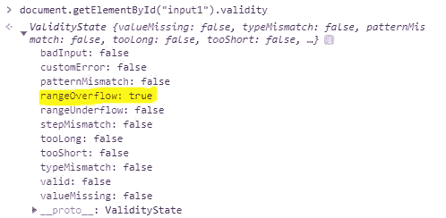
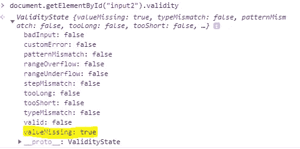
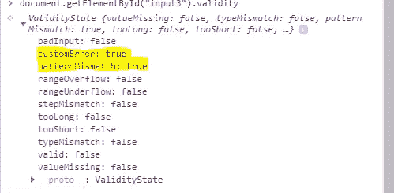

# 充分利用 HTML 输入框内置的验证方法

> 原文：<https://javascript.plainenglish.io/making-most-of-html-input-box-built-in-validation-methods-e87e502ba6a9?source=collection_archive---------10----------------------->

## 使用普通 JavaScript 的输入框验证中一些较少使用的方法


Photo by [Firos nv](https://unsplash.com/@firosnv?utm_source=medium&utm_medium=referral) on [Unsplash](https://unsplash.com?utm_source=medium&utm_medium=referral)

我们都使用了输入字段，处理了验证，显示了错误消息。像 Angular 这样的框架有先进的方法来创建表单和处理验证，好的旧的普通 JavaScript 确实有一些有趣的特性来简化我们的开发。

在本文中，我将讨论什么是有效性状态，如何检查输入框的有效性，显示错误消息，使用 CSS 伪类进行验证状态，以及处理自定义验证消息。

# 1.有效状态

使用 V *验证状态*界面可以知道验证失败的原因。有一些默认情况下适用于输入框的基本验证。例如:`required`、`min`值、`max`值、`minlength`、`maxlength`和`pattern`。`ValidityState`为您提供验证失败的确切情况。要知道输入的有效性状态，在目标元素上使用`validity`。

示例 1:

```
HTML:
<input type="number" id="input1" max="6" min="3" value="33">JS:
document.getElementById("input1").validity
```



Example-1 for ValidityState

在`input1`上，最小值和最大值分别是 3 和 6，其值是 33。因此`rangeOverflow`就是`true`。

示例 2:

```
HTML:
<input type="tel" id="input2"  required value="">JS:
document.getElementById("input2").validity
```



Example-2 of Validity State

在`input2`上，不满足`required`验证，故`valueMissing`为`true`。

您还可能观察到，`valid`在两种情况下均为假。这通常表明输入验证有问题。

# **2 .检查输入的有效性**

有两种方法可以检查您的输入是否没有验证错误。

1.  在目标元素上使用`checkValidity()`。如果有验证错误，则返回`false`。
2.  通过在目标元素上使用`validity.valid`来使用有效性状态。

示例:

```
//Using checkValidity()
HTML:
<input type="text" id="input3" pattern="[A-Z]{4}" value="icecream">JS:
document.getElementById("input3").checkValidity() //false//Using Validity State
document.getElementById("input3").validity.valid //false
```

两者的区别在于:

*   `checkValidity()`适用于单个输入元件，也适用于整个表单，而`ValidityState`仅适用于单个输入元件。

示例:

```
HTML:
<form name="myForm">
    <input type="tel" id="f1"  required value="">
    <input type="text" id="f2" required value="icecream">
</form>JS:
document.getElementsByName("myForm")[0].checkValidity(); //false
```

# 3.验证消息

对于输入框上的基本验证，如`min`值、`max`值、`minlength`、`maxlength`、`required`或`pattern`，JavaScript 确实有一些内置的验证消息。利用目标元素上的`validationMessage`属性。

示例:

```
HTML:
<input type="number" id="input1" max="6" min="3" required value="33">JS:
document.getElementById("input1").validationMessage //Value must be less than or equal to 6.
```

# 4.用于验证的 CSS 伪类

CSS 伪类`valid`和`invalid`可以在目标元素上使用，以适当地处理样式。

示例:

```
HTML:
<input type="number" id="input1" max="6" min="3" required value="33">CSS:
#input1:invalid{
  border-color: red; 
}
```

## 各种验证状态的 CSS 伪类列表:

*   :有效-如果满足所有输入约束。
*   :无效-如果不满足至少一个输入约束。
*   :超出范围—当值超出`min`和`max`值的范围时。
*   :必需-当不满足必需的约束时。
*   :可选—提交表单时不需要输入。

# 5.自定义验证消息

如果您想使用自定义验证消息而不是内置消息，请在输入字段上使用`setCustomValidity`。

示例:

```
HTML:
<input type="text" id="input3" pattern="[A-Z]{4}" value="icecream">JS:
Built-in Validation Message:
document.getElementById("input3").validationMessage //Please match the requested format.**Custom Message:**
document.getElementById("input3").setCustomValidity("Only uppercase values are allowed with max length 4");document.getElementById("input3").validationMessage //Only uppercase values are allowed with max length 4
```

另一点需要注意的是，对于自定义错误，`ValidityState`对象中的`customError`属性为真。



Validity State Object for Custom Errors.

确保一旦满足所有约束且输入值正确，`setCustomValidity`的值应为空。否则，输入仍将处于无效状态。

示例:

```
var pattern = document.getElementById("input3").pattern;
var regex = new RegExp(pattern);
var elm = document.getElementById("input3");if(!regex.test(elm.value)){
  elm.setCustomValidity("Only uppercase values are allowed with max length 4");
}else{
  elm.setCustomValidity("");
}
```

# 结论

我们已经看到了 HTML5 输入验证方法和用法的基础。ValidityState 的浏览器兼容性可以在这里检查[。并非每个浏览器都支持每个属性。](https://developer.mozilla.org/en-US/docs/Web/API/ValidityState)

嵌入一些我们在这里讨论的各种方法的例子。

希望这篇文章有用！

HTML5 Validations Example

**参考文献:**

validity state:[https://developer . Mozilla . org/en-US/docs/Web/API/validity state](https://developer.mozilla.org/en-US/docs/Web/API/ValidityState)

check validity:[https://developer . Mozilla . org/en-US/docs/Web/API/HTMLObjectElement/check validity](https://developer.mozilla.org/en-US/docs/Web/API/HTMLObjectElement/checkValidity)

setCustomValidity:[https://developer . Mozilla . org/en-US/docs/Web/API/html selectelement/setCustomValidity](https://developer.mozilla.org/en-US/docs/Web/API/HTMLSelectElement/setCustomValidity)