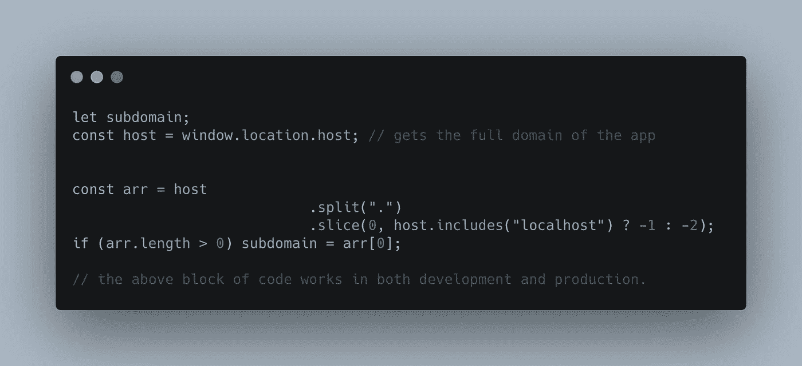
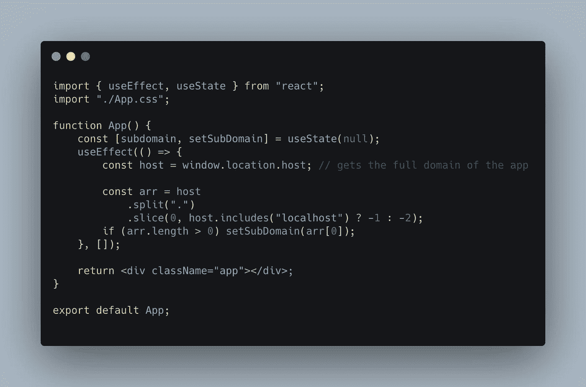
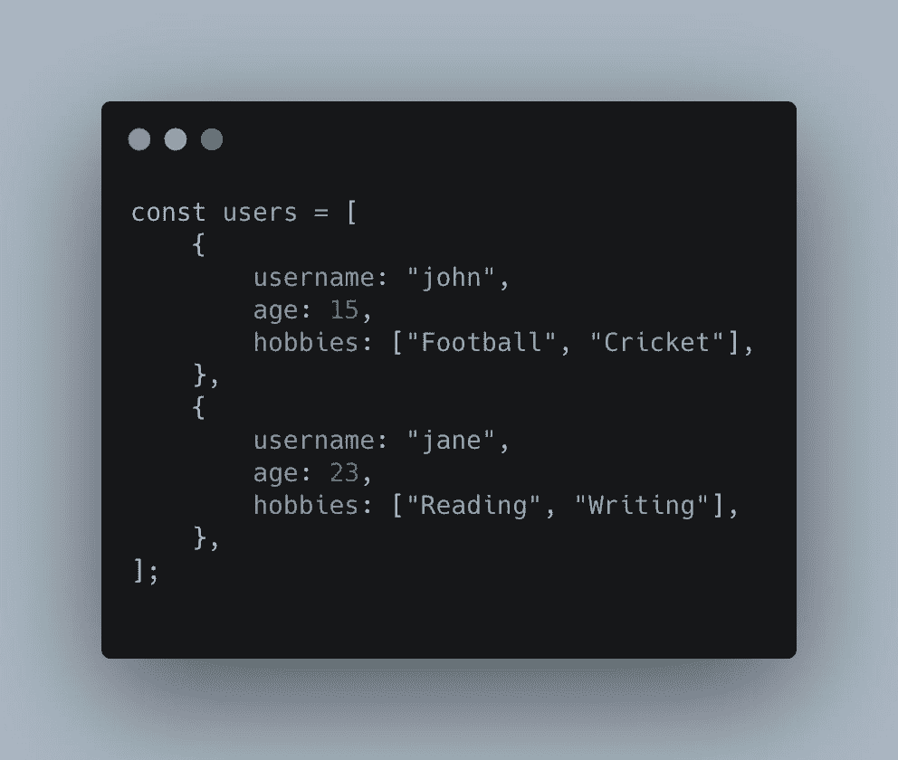
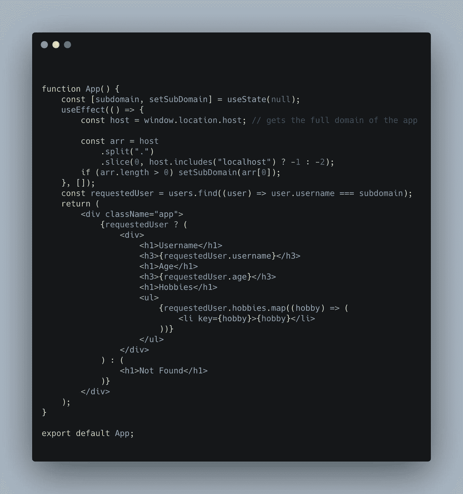
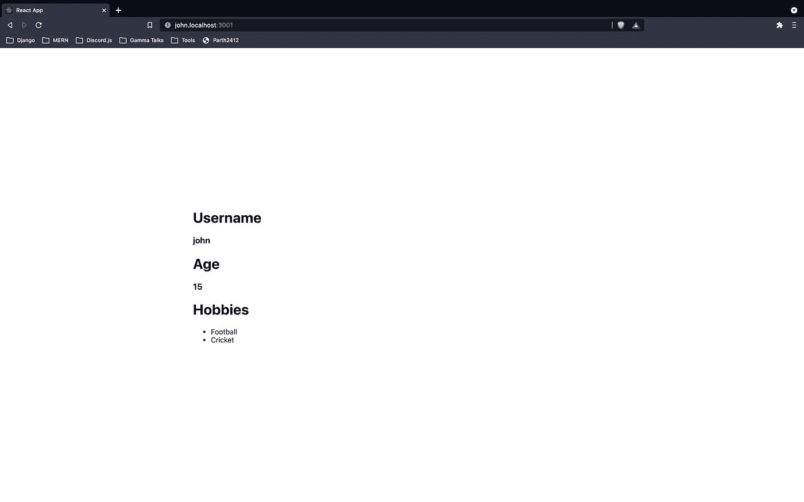
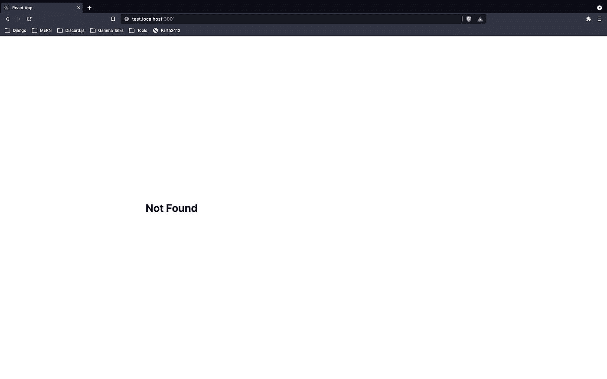
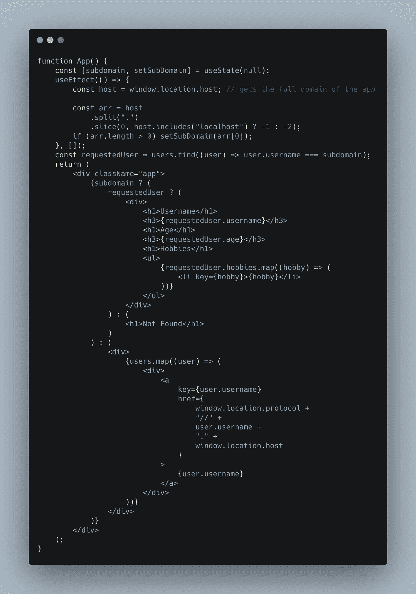
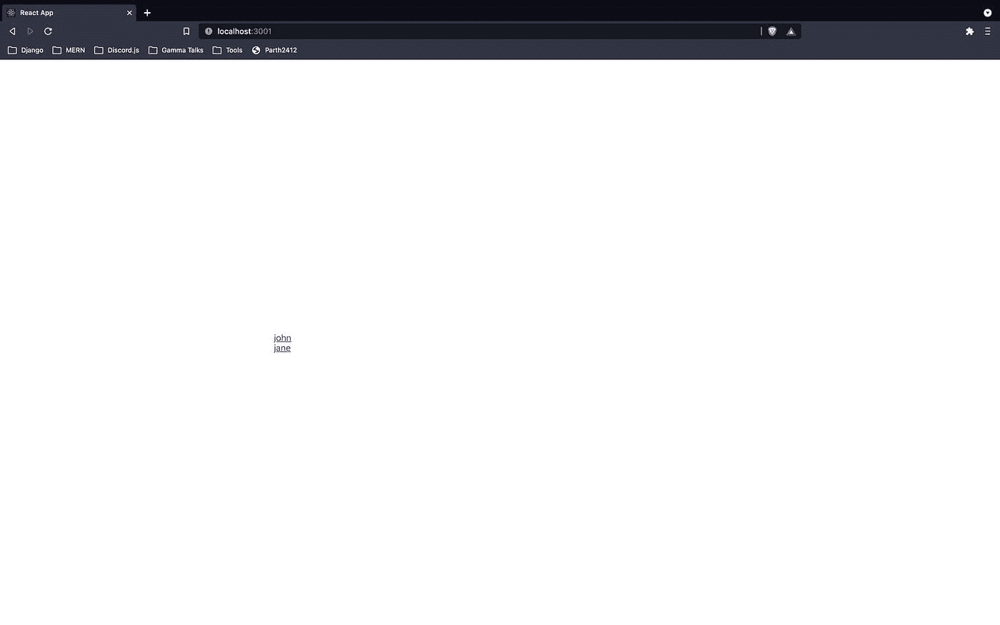

# 在 React 中管理动态和自定义子域

> 原文：<https://javascript.plainenglish.io/manage-dynamic-and-custom-subdomains-in-react-31154559694?source=collection_archive---------6----------------------->


Photo by [Max Duzij](https://unsplash.com/@max_duz?utm_source=medium&utm_medium=referral) on [Unsplash](https://unsplash.com?utm_source=medium&utm_medium=referral)

像 hashnode.com[这样的网站如何给每个用户一个单独的自定义域名？比如](http://hashnode.com)[https://parth 2412 . hash node . dev](https://parth2412.hashnode.dev/)。这个问题一直让我眼花缭乱。他们做这件事的方式就像魔术一样。或者至少我是这么想的。本文指导您在 react 应用程序中管理动态和自定义子域。

在本文中，我们将构建一个简单而简约的 React 应用程序，其中每个用户都将拥有一个基于其用户名的自定义子域，进入该子域将显示用户的个人资料，其中将包括用户的年龄、姓名和爱好。转到主域名会显示用户所有子域的链接。

例如，如果用户的用户名为 *john* ，年龄为 *15* ，爱好为*足球和板球，*那么转到 url `john.domain.com`将显示用户“john”的姓名(“john”)、年龄(15)和爱好(足球和板球)，其中`domain.com`被假定为我们应用程序的主要域。

用户的数据将是虚拟数据，而不是来自数据库。

# 什么是子域？

> *子域是主域名的附加项。本质上，一个子域是你的网站的一个独立的部分，在同一个主域名下运行。*
> 
> *您的主域名可能是“*[*”bestwebdesigner.com*](http://bestwebdesigner.com)*，“而您可以向该域名添加一个子域，名为“*[*【blog.bestwebdesigner.com】*](http://blog.bestwebdesigner.com)*”*
> 
> 子域给你创建一个全新网站的自由，同时仍然使用相同的域名。另外，你通常可以为你拥有的每个域名创建无限数量的子域名。

来源:[https://www.hostgator.com/blog/whats-a-subdomain/](https://www.hostgator.com/blog/whats-a-subdomain/)

点击[此处](https://www.hostgator.com/blog/whats-a-subdomain/)了解更多信息。

# 先决条件

*   React 基础知识(挂钩和功能组件)
*   JavaScript 基础(窗口对象和数组函数)
*   关于域和子域的基本知识

首先创建一个 React 应用程序。

```
npx create-react-app dynamic-subdomainscd dynamic-subdomains
```

您可以随意命名您的应用程序。

# 你如何在本地主机上使用子域？

我认为在本地主机上使用子域需要相当多的配置。但是我大错特错了。例如，如果您的 react 应用程序运行在 [localhost:3000](http://localhost:3000) 上，那么转到 URL `john.localhost:3000`或`jane.localhost:3000`或任何其他子域仍会显示您的 react 应用程序。不需要配置。

# 如何在 React 中根据子域显示不同的内容？

下面的代码是我们如何使用**纯 JavaScript 从完整域访问子域。**



让我们看看这里发生了什么

1.  我们使用`window.location.host`获得应用程序的完整域名(只有域名，而不是完整的 URL)。
2.  假设网址是[https://JavaScript . plain English . io/dear-developer-this-is-how-you-center-a-div-e 526 e 7 cfcc 9d](/dear-developer-this-is-how-you-center-a-div-e526e7cfcc9d)那么主机将是`javascript.plainenglish.io`
3.  我们将域分割成一个数组，只要我们找到一个`.`。得到的数组将是`["javascript", "plainenglish" , "io"]`
4.  如果主域是**而不是 localhost** ，我们删除获得的数组的最后 2 个元素。最后一个元素是域的后缀，如。组织，。com，。网，。io 等。获得的数组的倒数第二个元素将是应用程序的主域。
5.  在示例中，数组的最后一个元素是后缀`io`。倒数第二个元素是主域`plainenglish`。因此，我们只剩下数组`["javascript"]`
6.  如果数组有 0 个元素，那么就没有子域。如果不是，子域是数组的第一个元素。因此子域是`javascript`

另一个主要领域为`localhost`的开发示例

1.  假设主机(全域)是`sub.localhost:3000`
2.  在我们找到一个`.`的地方分割域后，我们得到数组`["sub", "localhost:3000"]`。
3.  由于主域是 localhost，这意味着该域没有诸如。所以我们只是从数组的末尾移除了 1 个元素，而不是 2 个。因此，我们只剩下数组`["sub"]`
4.  如果数组有 0 个元素，那么就没有子域。如果不是，子域是数组的第一个元素。因此子域为`sub`

# 注意

子域也可以嵌套在许多级别下，即可以有多个子域，如[a.b.c.d.example.com](http://a.b.c.d.example.com)。但是本文将只关注处理一个级别的子域。

回到我们的 react 应用程序，我们现在将看到上面的代码应该如何以 react 格式编写。



这里发生了同样的事情，但是我们不是在变量中存储子域，而是在 React 状态下存储子域，我们还在 useEffect 回调中提取子域。

让我们为用户添加虚拟数据。



这里我们有一组用户。

每个用户都有一个唯一的用户名、年龄和爱好列表。

所以当我们转到网址`john.localhost:3000`时，会显示用户“约翰”的姓名、年龄和爱好。

因此，URL `jane.localhost:3000`将显示用户“简”的姓名、年龄和爱好。

因此，在这个应用程序中，每个用户将被分配一个子域(这将等于他们的用户名)，进入该子域将显示用户的姓名，年龄和爱好

接下来也是最后一部分真的很简单。我们只需使用存储在状态中的`subdomain`值来显示适当的内容。



就这么简单。

我们获取`subdomain`，并使用它来查找其`username`与`subdomain`相同的用户，并将该用户存储在`requestedUser`变量中。

如果没有用户名与子域相同的用户，那么我们显示文本*未找到*。否则我们显示用户的姓名、年龄和爱好。

下面是它的样子(我使用端口 3001，因为端口 3000 已经被使用)。



以下是当找不到请求的用户时网站的外观



让我们更进一步，让它没有子域，也就是说，当浏览网站的用户在我们的主域上时，我们会显示一个到所有用户子域的链接。



事情是这样的:

1.  我们检查是否有子域。
2.  如果是，则显示被请求用户的数据
3.  如果没有，则显示所有用户子域的链接列表

这是它在主域上的样子。



# 接下来

如何在 Next.js 应用中处理动态子域？

# 为生产配置子域

大多数主机提供商允许配置动态子域。通常动态子域名在购买域名时是免费的。

1.  韦尔塞尔:[https://vercel.com/blog/wildcard-domains](https://vercel.com/blog/wildcard-domains)
2.  netlify:[https://docs . netlify . com/domains-https/custom-domains/multiple-domains/# branch-sub domains](https://docs.netlify.com/domains-https/custom-domains/multiple-domains/#branch-subdomains)
3.  谷歌云:[https://Cloud . Google . com/app engine/docs/flexible/go/mapping-custom-domains #通配符](https://cloud.google.com/appengine/docs/flexible/go/mapping-custom-domains#wildcards)

Github 回购:【github.com/Parth-2412/Dynamic-Subdomains 

*原发布于*[*https://parth 2412 . hash node . dev*](https://parth2412.hashnode.dev/manage-dynamic-and-custom-subdomains-in-react)*。*

*更多内容看* [***说白了. io***](http://plainenglish.io/)