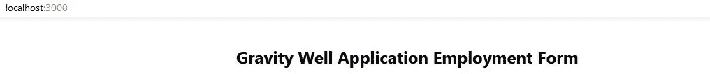
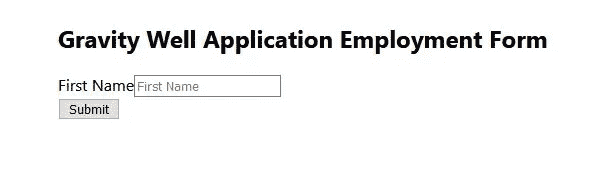
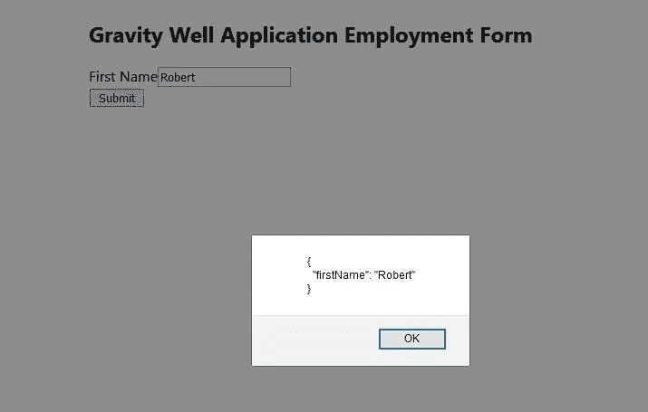
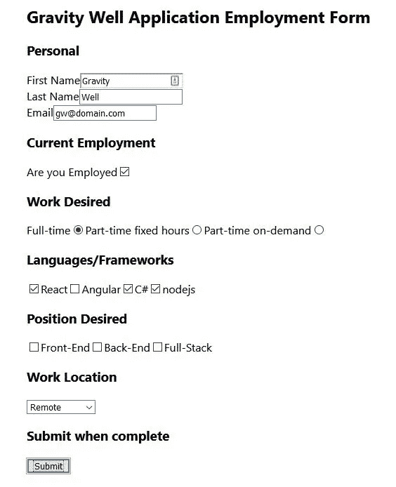
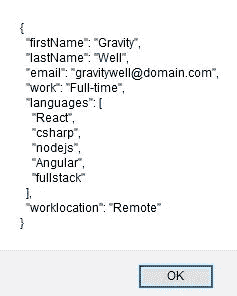

# 如何使用 React 最终表单管理表单状态

> 原文：<https://javascript.plainenglish.io/manage-form-state-with-react-final-form-bdad07b24509?source=collection_archive---------4----------------------->

## 反应提示

## 没有 useState()钩子的 React 窗体状态管理。


Photo by [Kelly Sikkema](https://unsplash.com/@kellysikkema?utm_source=medium&utm_medium=referral) on [Unsplash](https://unsplash.com?utm_source=medium&utm_medium=referral)

在本教程中，我们将使用 **React 最终表单**探索 React 表单状态管理。React 最终形式允许我们管理状态*而不需要 useEffect()钩子。*

# 什么是反应最终形式？

> React 基于订阅的高性能表单状态管理

[React Final Form](https://final-form.org/react) 是 [Final Form](https://final-form.org/) 的 React 包装器，它使用
[观察者模式](https://en.wikipedia.org/wiki/Observer_pattern)进行状态管理。

> **观察者模式**是一种[软件设计模式](https://en.wikipedia.org/wiki/Design_pattern_(computer_science))，其中一个名为**主题**的[对象](https://en.wikipedia.org/wiki/Object_(computer_science)#Objects_in_object-oriented_programming)维护一个名为**观察者**的依赖者列表，并自动通知它们任何状态变化，通常通过调用它们的[方法](https://en.wikipedia.org/wiki/Method_(computer_science))之一。

# 谁使用 React 最终形式？

其中，


Source: final-form.org/react

如果您以前从未构建过 React 表单，您可能希望从下面的文章开始。这为状态管理引入了一个简单的表单和 useState()挂钩。这将帮助您对比 React 最终表单的状态管理。

[](https://js.plainenglish.io/two-ways-of-managing-state-in-a-functional-react-form-ef0929eefe67) [## 在函数式反应表单中管理状态的两种方法

### 在注册表单中，对每个输入使用 useState 挂钩，而不是使用一个用户对象和一个 useState 挂钩。

js .平原英语. io](https://js.plainenglish.io/two-ways-of-managing-state-in-a-functional-react-form-ef0929eefe67) 

# 我们开始吧

我将使用 VSCode，但是你可以使用任何你想要的代码编辑器。另外，我将使用 create-react-app 引导一个新的 React 应用程序。但是如果你有一个你喜欢工作的沙箱，请使用它。

## 提升我们的应用程序

1.  创建一个放置应用程序的目录。根据需要命名。
2.  在代码编辑器中，打开刚刚创建的目录。
3.  打开一个终端窗口。

```
npx create-react-app using-react-final-form
```

4.一旦完成，用 **cd** 进入目录。

```
cd using-react-final-form
```

5.要确保 React 启动并运行，请键入以下命令来启动开发服务器。

```
npm start
```

6.验证完成后，关闭浏览器选项卡，并使用 CTRL-C 停止开发服务器

## 安装依赖项

***注意*** *:我们将不会专注于造型，但随着我们的进展，您可以随意使用您最喜欢的库。*

我们将需要两个 npm 库。

*   最终形式
*   反应-最终-形式

1.  确保 React 开发服务器已停止。在您的终端窗口中键入。

```
npm install **final-form react-final-form**
```

## 构建表单

我们将构建一个虚构的就业申请表。

1.  打开 **App.js** 并用这个替换它的内容。

```
import React from 'react'export default function App() {return (
    <div style={{ padding: 15, margin: 'auto', maxWidth: 600 }}>

      <h2>
        Gravity Well Application Employment Form
      </h2>

    </div>
  )
}
```

2.使用运行 React 开发服务器。

```
npm start
```

你应该看看



The start of our form

我们想要观察其状态的控件将是 HTML 的**输入(文本、复选框和单选)和选择。**

然而，我们不直接使用这些，我们在每个 HTML 元素周围使用 React Final Form 的**字段**包装组件。这些**字段**组件都包含在一个 HTML 表单中，该表单被包装在 React Final 表单的**表单**组件中。这些将来自我们已经安装的**反应-最终-形式库**。

我们需要处理 HTML 表单的 onSubmit。当它被调用时，它会使用[渲染道具](https://reactjs.org/docs/render-props.html)将信息传递给 React Final Form 的表单组件的 onSubmit 处理程序。

一个非常抽象的表示可能是这样的，创建一个 HTML 表单和输入的包装器。

```
<Form onSubmit={onSubmit}> - React Final Form's Form component
 <form onSubmit={**handleSubmit**}> - HTML form control
  <Field> - React Final Form's Field component
    component="input" - HTML input component
```

# 构建表单

我们将从从 **react-final-form** 导入并使用 React Final Form 的 **Form** 组件和 **Field** 组件开始。

React 的 HTML 表单将有一个特殊的处理程序， **handleSubmit** ，用于它的 onSubmit 事件。

> `handleSubmit`是一个方便的方法，被设计成作为`onSubmit`道具传递给 HTML `<form>`组件。`handleSubmit`将调用`event.preventDefault()`停止默认浏览器提交过程。

我们将使用 React 最终表单的**表单**组件的[渲染道具](https://reactjs.org/docs/render-props.html)来传递 **handleSubmit** 函数，该函数将传递表单的值。

> 术语[“渲染道具”](https://cdb.reacttraining.com/use-a-render-prop-50de598f11ce)指的是使用一个值为函数的道具在 React 组件之间共享代码的技术。

1.  用以下内容替换您的 **App.js** 。观察**粗体**中的项目。

我们补充道，

*   提交 React 最终表单的表单。
*   反应最终形态的**形态的**控制。包装 HTML 表单。
*   反应最终形态的**场**控制。包装 HTML 输入元素。
*   HTML 提交按钮。

```
import React from 'react'
**import { Form, Field} from 'react-final-form'**// React Final Form's onSubmit event handler.
**const onSubmit = values => {
  window.alert(JSON.stringify(values, 0, 2))
}**
export default function App() {return (
    <div style={{padding: 15, margin: 'auto', maxWidth: 600 }}>

      <h2>
        Gravity Well Application Employment Form
      </h2>**<Form 
        onSubmit={onSubmit}
        render={({ handleSubmit }) => (
        <form onSubmit={handleSubmit}>

        <div>
            <label>First Name</label>
            <Field
              name="firstName"
              component="input"
              type="text"
              placeholder="First Name"
            />
      </div>
       <button type="submit" >
          Submit
        </button>** **</form>
      )}
      />**

    </div>
  )
}
```

运行它，键入一个名称，然后单击提交。



Our form so far



After entering a name and clicking Submit

# 再加点

添加额外的控件与我们刚才所做的非常相似。我们将添加复选框和单选按钮以及选择的输入类型。还是那句话，没有造型。

1.  用这个替换你的 **App.js** ，只研究每一种输入类型。请记住，在它的核心，是 React 最终表单的**表单**、**字段**和**渲染道具**与 HTML 表单的**handle submit**一起使它工作。

```
import React from 'react'
import { Form, Field} from 'react-final-form'
// React Final Form's onSubmit event handler.
const onSubmit = values => {
  window.alert(JSON.stringify(values, 0, 2))
}
export default function App() {
return (
    <div style={{padding: 15, margin: 'auto', maxWidth: 600 }}>

      <h2>
        Gravity Well Application Employment Form
      </h2>
<Form 
        onSubmit={onSubmit}
        render={({ handleSubmit }) => (
        <form onSubmit={handleSubmit}>

          <h3>Personal</h3>
        <div>
            <label>First Name</label>
            <Field
              name="firstName"
              component="input"
              type="text"
              placeholder="First Name"
            />
      </div>
      <div>
            <label>Last Name</label>
            <Field
              name="lastName"
              component="input"
              type="text"
              placeholder="Last Name"
            />
      </div>
      <div>
            <label>Email</label>
            <Field
              name="email"
              component="input"
              type="text"
              placeholder="Email"
            />
      </div>
      <div>
      <h3>Current Employment</h3>
            <label>Are you Employed</label>
            <Field
              name="employed"
              component="input"
              type="checkbox"
            />
      </div>
      <div>
            <h3>Work Desired</h3>
           <div>
            <label>Full-time</label>
            <Field
              name="work"
              component="input"
              type="radio"
              value="Full-time"

            />
            <label>Part-time fixed hours</label>
            <Field
              name="work"
              component="input"
              type="radio"
              value="Part-time fixed hours"

            />
             <label>Part-time on-demand</label>
             <Field
              name="work"
              component="input"
              type="radio"
              value="Part-time on-demand"

            />
            </div>
      </div>
      <div>
            <h3>Languages/Frameworks</h3>
           <div>

            <Field
              name="languages"
              component="input"
              type="checkbox"
              value="React"
            />
             <label>React</label>
             <Field
              name="languages"
              component="input"
              type="checkbox"
              value="Angular"
            />
             <label>Angular</label>
             <Field
              name="languages"
              component="input"
              type="checkbox"
              value="csharp"
            />
             <label>C#</label>
             <Field
              name="languages"
              component="input"
              type="checkbox"
              value="nodejs"
            />
             <label>nodejs</label>

            </div>
      </div>
      <div>
            <h3>Position Desired</h3>
           <div>

            <Field
              name="position"
              component="input"
              type="checkbox"
              value="Front-End"
            />
             <label>Front-End</label>
             <Field
              name="languages"
              component="input"
              type="checkbox"
              value="Back-End"
            />
             <label>Back-End</label>
             <Field
              name="languages"
              component="input"
              type="checkbox"
              value="fullstack"
            />
             <label>Full-Stack</label>

            </div>
      </div>

      <div>
        <h3>Work Location</h3>
            <Field 
             name="worklocation" 
              component="select">
              <option />
              <option value="Remote">Remote</option>
              <option value="On-site">On-site</option>
              <option value="Combination">Combination</option>
            </Field>
          </div>
          <h3>Submit when complete</h3>
       <button type="submit" >
          Submit
        </button>
      </form>
      )}
      />

    </div>
  )
}
```

运行并填写后，您的最终表单应该如下所示。



Completed React Final Form



After clicking Submit

# 结论

React 表单和状态处理总是比它需要的要复杂一些。React Final Form 通过将表单封装在状态处理程序中，提供了几种选择之一。

如上所述，虽然在它的核心，是 React 最终表单的**表单**、**字段**和**渲染道具**以及 HTML 表单的 **handlSubmit** 使它全部工作，当然还有更多 React 最终表单。

一如既往，我鼓励你探索 React 最终形式和它的一些附加功能。此外，添加额外的控件和一些样式。

**感谢您的阅读和编码！**

*想看就看，加入 Medium 帮我继续写*

[](https://bobtomlin-70659.medium.com/membership) [## 通过我的推荐链接加入灵媒——重力井(罗伯·汤姆林)

### 作为一个媒体会员，你的会员费的一部分会给你阅读的作家，你可以完全接触到每一个故事…

bobtomlin-70659.medium.com](https://bobtomlin-70659.medium.com/membership) 

资源

*   [最终形式](https://final-form.org/)
*   [反应最终形态](https://final-form.org/react)

您可能还想研究一下 [Formik](https://formik.org/) 来构建 React 表单。

这可以在我的一个 GitHub 账户上找到，

[](https://github.com/Gravity-Well/using-react-final-form) [## 重力井/使用-反应-最终-形式

### 这个项目是用 Create React App 引导的。在项目目录中，您可以运行:在…中运行应用程序

github.com](https://github.com/Gravity-Well/using-react-final-form) 

如果您不确定如何克隆 GitHub repo。看这个。

[](/how-to-clone-a-github-repository-e8b963b93f2b) [## 如何克隆 GitHub 存储库

### 获取您最喜欢的 JavaScript 开发人员的公共代码的本地副本，并在您的本地机器上运行它。

javascript.plainenglish.io](/how-to-clone-a-github-repository-e8b963b93f2b) 

**其他 React 教程**

[](/two-ways-of-managing-state-in-a-functional-react-form-ef0929eefe67) [## 在函数式反应表单中管理状态的两种方法

### 在注册表单中，对每个输入使用 useState 挂钩，而不是使用一个用户对象和一个 useState 挂钩。

javascript.plainenglish.io](/two-ways-of-managing-state-in-a-functional-react-form-ef0929eefe67) [](/using-reacts-useeffect-hook-to-fetch-data-and-periodically-refresh-that-data-2a69b6d44081) [## 使用 React 的 useEffect 钩子获取数据并定期刷新数据

### 使用 useEffect 获取功能组件中的数据，并根据需要使用 setInterval 刷新数据。

javascript.plainenglish.io](/using-reacts-useeffect-hook-to-fetch-data-and-periodically-refresh-that-data-2a69b6d44081) [](/creating-your-first-react-application-db9dfe93b4f5) [## 如何在你的第一个 React 应用中使用 Props

### 建立一个产品展示器，而不是简单的 Hello World！

javascript.plainenglish.io](/creating-your-first-react-application-db9dfe93b4f5) [](/react-router-and-spas-made-easy-19fd1db0d6fc) [## 如何使用 React-Router 创建 SPA

### 使用客户端路由创建单页应用程序

javascript.plainenglish.io](/react-router-and-spas-made-easy-19fd1db0d6fc) [](/creating-your-second-react-application-d6d50e3e1e91) [## 如何用 useState 钩子管理 React 中的状态

### 使用功能组件上的 useState 挂钩管理状态

javascript.plainenglish.io](/creating-your-second-react-application-d6d50e3e1e91) [](/what-is-next-js-and-server-side-rendering-9e24ea21c144) [## 什么是 Next.js 和服务器端渲染

### Next.js 是由 Vercel 创建的 React 框架。与使用客户端渲染的 React 不同，Next.js 使用服务器端…

javascript.plainenglish.io](/what-is-next-js-and-server-side-rendering-9e24ea21c144)