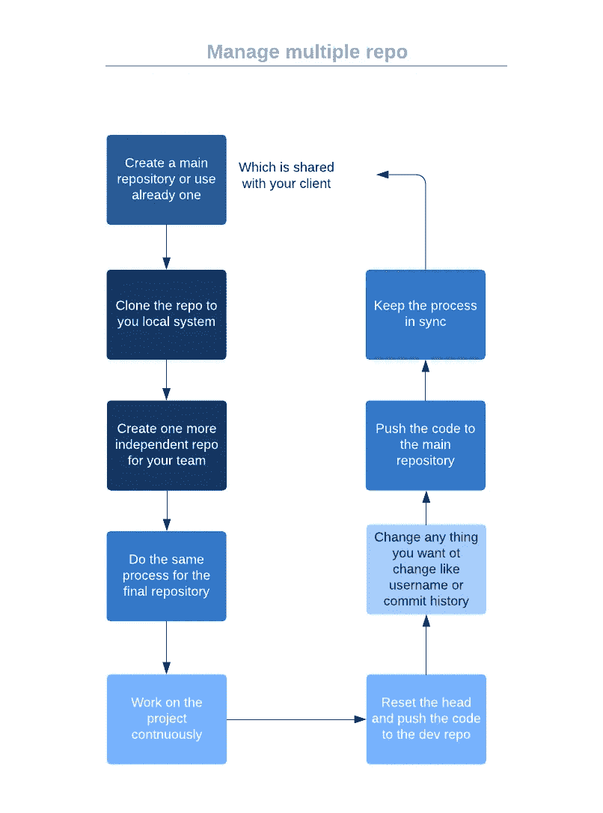
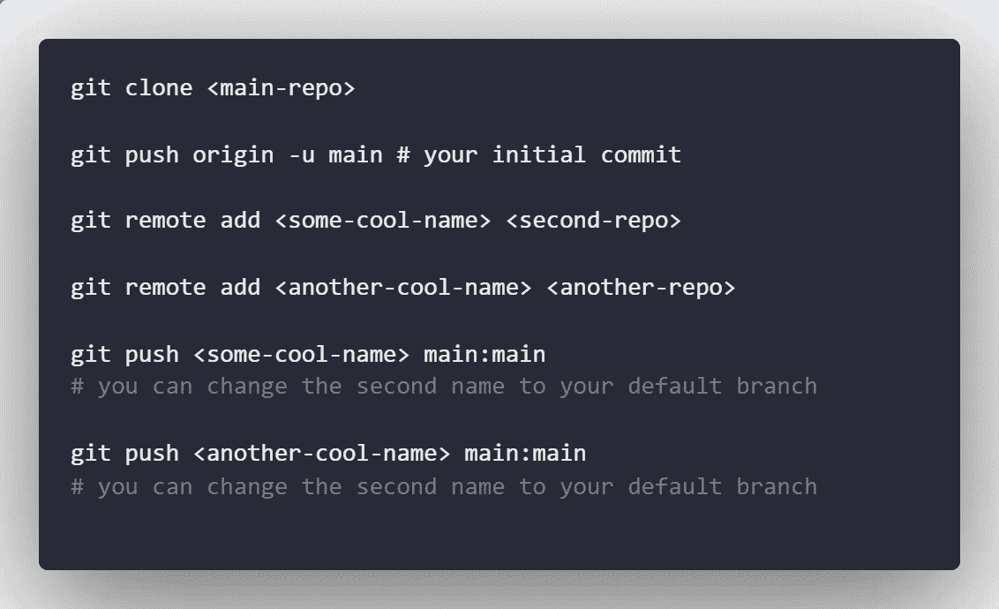
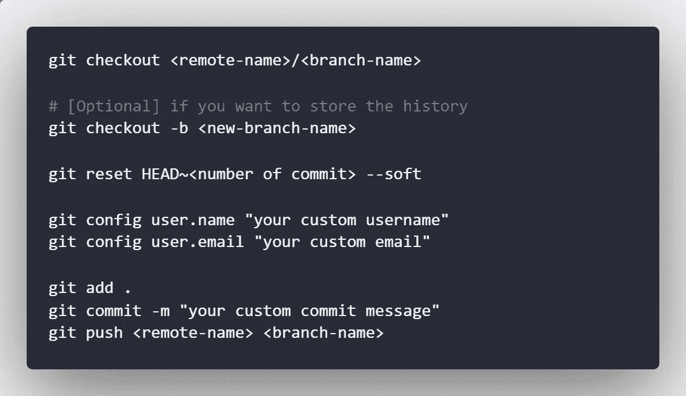

# 如何管理独立的 Git 远程

> 原文：<https://javascript.plainenglish.io/manage-independent-git-remotes-62510271d542?source=collection_archive---------2----------------------->


Photo by [Marco Bianchetti](https://unsplash.com/@marcobian?utm_source=medium&utm_medium=referral) on [Unsplash](https://unsplash.com?utm_source=medium&utm_medium=referral)

**您是否曾经在同一个 git 文件夹中管理多个遥控器时遇到过困难？或者想把同样的代码推到另一个回购上却因为头大而做不到？**

今天，我们将讨论这些事情，以及如何管理多个相同来源的遥控器。

# 为什么我们不拿把叉子呢？

当您有多个存储库需要管理，尤其是当它们只有一个来源时，fork 是一个很好的选择。


All git user actions to a repository

你想推一些东西，然后从你的分叉回购到主回购创建一个 PR。从主回购中获得持续的拉动，你就可以顺利完成你的项目。这是一个很棒的想法，但是我们不会讨论同样的场景。

# 如果您想在存储库之间进行分离，该怎么办呢？

可能会有一个复杂的场景，您希望在其中一个 repo 上执行一些代码，并将代码推送到多个存储库。如果你想通过别人的账号推送呢？用叉子很难做到这一点，对吗？

## 让我们了解如何处理这种情况

假设你有三个项目，即 P1、P2 和 P3。您的角色如下

*   P1 是主要的存储库，你的客户可以看到它
*   P2 是二级存储库，您的部署在那里工作
*   P3 是你与自由职业者合作的最后一站，你不想暴露你的客户和部署信息

这种情况可能很难适应，但如果你有管理背景，你就会理解这个过程及其复杂性

主要问题是*我们能做到吗？*答案是*是的，你可以。*但是现在如何让我们理解这个过程呢



Process diagram

这是流程图，

让我为你分解这个过程，这里我们将有 3 个独立的存储库。一旦你内联了它们，你应该让它们有相同的来源，你可以做的如下。



Commands

让你把东西复制粘贴到这里

```
git clone <main-repo>git push origin -u main # your initial commitgit remote add <some-cool-name> <second-repo>git remote add <another-cool-name> <another-repo>git push <some-cool-name> main:main# you can change the second name to your default branchgit push <another-cool-name> main:main# you can change the second name to your default branch
```

您可以更改每个远程的默认分支名称，并通过使用您的分支名称修改 push 命令，将任何分支作为默认分支进行推送。左边的是现有的，右边的是新的分支

# 把交叉的树枝推到另一个遥控器上

要将交叉分支推到单独的远程，您可以按照下面的命令

```
git push <another-cool-name> <your local branch-name>:<remote branch name you want to push>
```

有一点很重要，你应该只在你想同步遥控器和云台的时候这样做。否则，你应该使用`-f`命令来强制推遥控器。**明智地做**。

# 更改用户的名称

要在推送之前更改用户名，请运行以下命令来设置正确的用户

```
git config user.name "your-name"
git config user.email "your-email"
```

# 重置已提交的头

假设您想要压缩提交，然后用其他用户名推它。为此，您可以使用以下命令



commands to reset head

这是复制粘贴引用

```
git checkout <remote-name>/<branch-name># [Optional] if you want to store the historygit checkout -b <new-branch-name>git reset HEAD~<number of commit> --softgit config user.name "your custom username"git config user.email "your custom email"
# [Optional] if you want to reset the config git add .git commit -m "your custom commit message"git push <remote-name> <branch-name>
```

# 结论

管理 git 远程的最后一句话是

> 这是一个非常复杂的方法，但是如果你有一个复杂的 git 结构，那么它将为你完成这项工作。在每次用力按压遥控器之前，你都应该采取一些预防措施。

希望你学到了一些好的复杂的东西。这将帮助你思考不同层次的复杂性。谢谢！

*更多内容看* [***说白了. io***](http://plainenglish.io/)