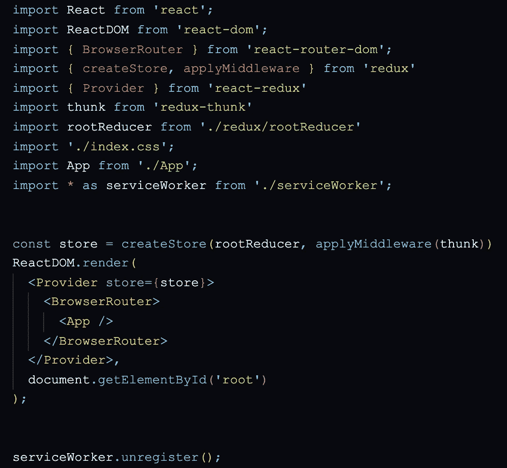
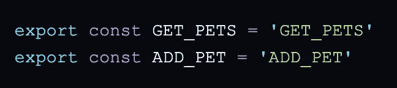
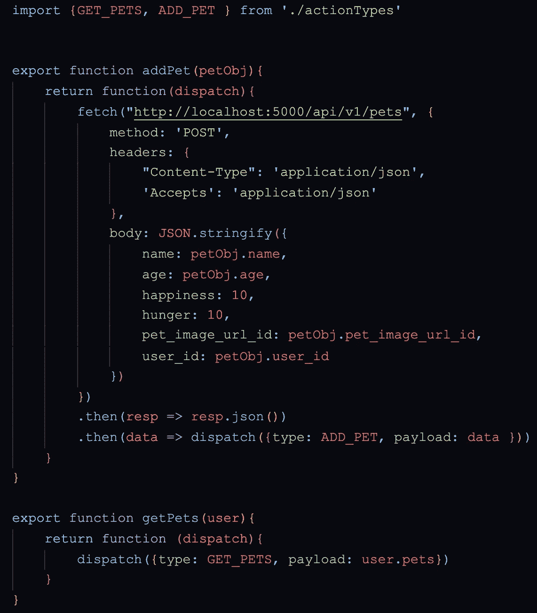
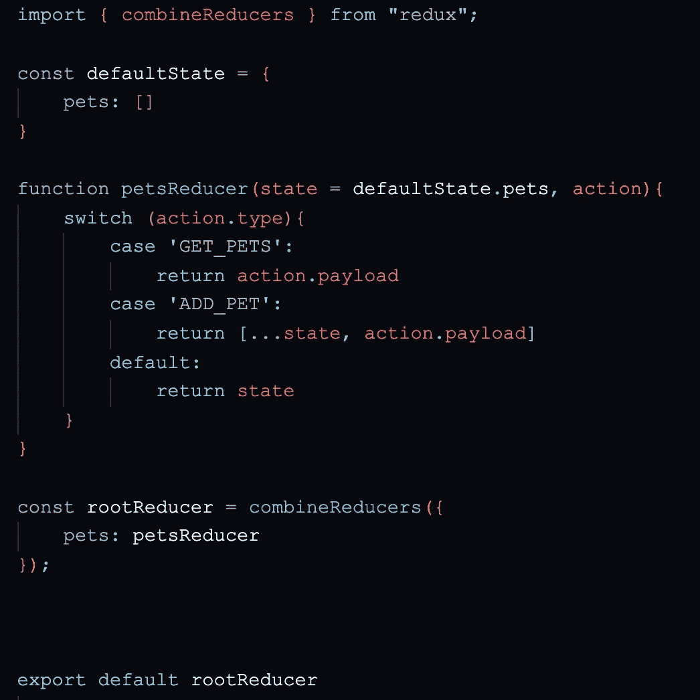
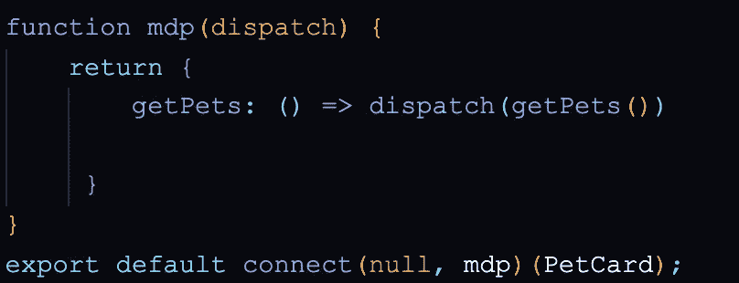
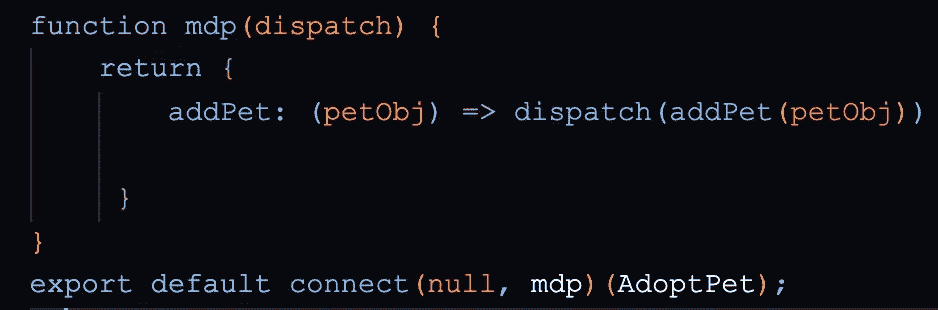
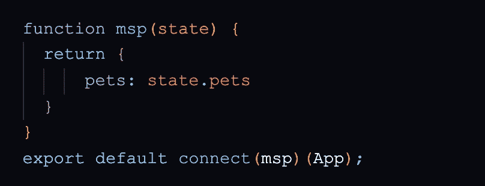

# 使用 Redux 管理全局状态

> 原文：<https://javascript.plainenglish.io/managing-global-state-with-react-redux-6b7279ec5f50?source=collection_archive---------3----------------------->

当我第一次学习 React 时，我对它的许多独特功能和扩展感到不知所措。这是我在熨斗学校期间最具挑战性的阶段转换之一。尽管如此，我还是越来越适应这个框架，并扩展了我的技能，加入了许多有用的工具，包括 Redux。

# 为什么是 Redux？

这么多人使用 redux 的一个主要原因是，它为复杂或高度填充的组件层次结构利用了更简单、更精简的状态管理。Redux 也使得在你的应用中保持关注点的分离变得更加容易——它唯一的工作就是处理全局状态。

当在一个有很多组件的大型应用程序中管理状态时，当一个组件中的状态必须由另一个组件更新时，会变得非常混乱。传统上，新值会通过其起点之上的每个组件一直传递到组件层次结构的顶部，然后再向下传递到下一个组件以更新其状态。

通过 Redux，状态被全局存储，并且可以在应用程序中的任何地方轻松更新或调用。

这相当于乘坐当地公交车与乘坐优步。当地公共汽车通常只朝一个方向行驶，要停很多站才能到达最终目的地。它也只从预定的地点上车，如果公共汽车没有在你想要的目的地停下来，你最终不得不换乘另一辆公共汽车。或者，优步可以从任何地点接你，并且总是会把你带到正确的目的地。当然，巴士更便宜，完成工作，你不必建立一个完整的个人资料或输入你的信用卡信息，但当巴士变得有点太复杂时，优步总是派上用场。

## 文件结构

当我学习 redux 的时候，我被教导通过文件来分离动作和 reducers。这遵循了 Redux 的关注点分离的主题，同时也使代码更具可读性，更简洁。

# 索引. js

在 Index.js 文件的顶部，createStore applyMiddleware 和 rootReducer 从 redux 库导入，Provider 从 react-redux 库导入，thunk 从 redux-thunk 库导入。

CreateStore 用于使用根 reducer 创建应用程序的商店，根 reducer 将包含应用程序的状态树。ApplyMiddleware 用于将 redux-thunk 中间件应用到商店。Provider 作为 props 传递到 store，使得包装在里面的所有组件都可以访问状态。

# 动作类型文件

动作类型文件包含用于识别动作文件中的动作的变量。虽然这个文件对于 Redux 的功能不是必需的，但是它进一步有助于分离关注点，并有助于避免打字错误或其他小错误。

在我的应用程序 Pocket Dudes 中，我选择利用 Redux 来处理宠物状态。在动作类型文件中，两个变量 GET_PETS 和 ADD_PET 在引号中被设置为它们的名称并被导出。

# 动作文件

动作文件包含 redux 函数，这些函数返回传递给 redux 的数据( **dispatch)** 。通常，这些函数会接收一条数据，然后**将它**和**动作类型**发送到根减速器。

首先，这两种操作类型都是从操作类型文件中导入的。第一个函数 addPet 接收一个 Pet 对象，并向数据库发送一个 post 请求。然后，在 post 请求完成之后，数据被分派到根 reducer，它带有一个键**有效负载**和动作类型 **ADD_PET。**第二个函数 getPets 接受用户对象，将有效负载设置为用户的宠物，并使用动作类型 **GET_PETS** 将其分派给根 reducer。

# 根缩减器文件

根 reducer 文件包含当前状态和处理更新状态的“Reducer 函数”。

在根 Reducer 文件中，combineReducers 是从 redux 库导入的，以后用于维护当前状态并保持更新。

然后，默认状态被设置为一个散列，其关键字为“pets ”,值为空数组。函数 petsReducer 接受**默认状态**和**动作，**确定**动作类型**，，并用**有效载荷**更新状态(我们在动作文件中设置有效载荷关键字的任何数据)。

根缩减器将“pets”的当前状态设置为 petsReducer 当前返回的状态。如果没有调用动作，则 petsReducer 返回当前状态。

# 地图分派到道具

map dispatch to props (mdp)函数使特定的 redux 操作可以通过组件的 props 来访问。

这里，我使用 getPets 函数获取 PetCard 组件中用户的所有宠物，使用 addPet 函数将一只宠物添加到 AdoptPet 组件中用户的宠物列表中。 **connect** 函数从 Redux 库的文件顶部导入，用于在调用时将函数的调度响应连接到根 reducer。

# 将状态映射到道具

将状态映射到属性(msp)功能使特定的状态对象可以通过组件的属性进行访问。

在 App.js 文件中，msp 函数接受当前 redux 状态(通过 connect 函数)并返回指定状态键的值。

# 结论

Redux 是一个非常抽象的库，需要大量的学习和实践才能完全掌握。虽然我的理解仍然相当新鲜，我可能没有在我的解释中非常深入，但我计划继续练习和学习 Redux，并希望回来编辑这个博客，提供更全面的说明。