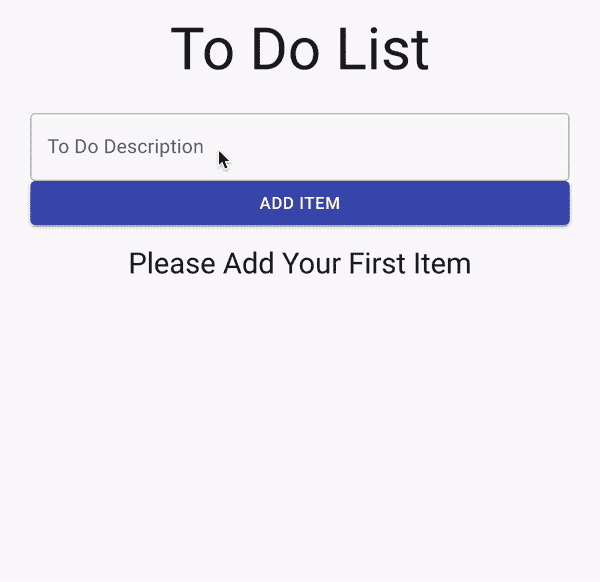
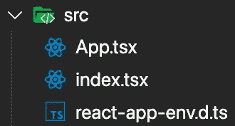
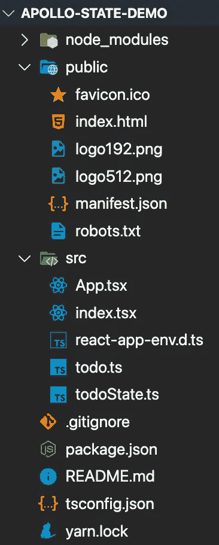

# 使用 Apollo、Immer 和 TypeScript 管理本地状态

> 原文：<https://javascript.plainenglish.io/managing-local-state-in-react-with-apollo-immer-and-typescript-e966abe58476?source=collection_archive---------7----------------------->

## 我们将学习如何使用*反应变量在 Apollo 应用中本地管理状态。*


Apollo 是一个广泛的开发平台，可用于前端和后端开发。

今天我们将关注 Apollo 对 React 的实现，即 Apollo-Client。Apollo-Client 是一个数据获取和缓存工具，它使用 GraphQL 来收集和管理其数据，但他们最近推出了一个名为 Reactive Variables 的新功能，它完全不依赖于 GraphQL。我们将使用反应变量和一个名为 Immer 的库(稍后将详细介绍)来实现一个本地状态管理的待办事项列表。

下面是阿波罗客户文档*反应变量*的链接，供那些想了解更多的人参考。

[](https://www.apollographql.com/docs/react/local-state/reactive-variables/) [## 反应变量

### 在 Apollo Client 3 中新增的反应变量是一种在 Apollo 客户端之外存储本地状态的有用机制…

www.apollographql.com](https://www.apollographql.com/docs/react/local-state/reactive-variables/) 

# 我们在建造什么

今天，我们将使用一些非常酷的 React 技术来创建一个类似这样的待办事项列表。



# 项目设置

我们需要做的第一件事是打开终端或命令提示符(取决于操作系统)并导航到我们想要创建 React 项目的目录。

导航到所需目录后，运行此命令。

```
npx create-react-app apollo-state-demo --template typescript
```

创建项目后，我们只需要安装几个包。

```
npm i @apollo/client immer uuid @material-ui/core @material-ui/icons @types/uuid graphql
```

一旦安装了包，您就可以在您选择的代码编辑器中打开项目。

*我将使用 VS 代码。下面是一个下载链接，供那些想尝试一下的人使用。*

[](https://code.visualstudio.com/) [## Visual Studio 代码-代码编辑。重新定义的

### Visual Studio Code 是一个重新定义和优化的代码编辑器，用于构建和调试现代 web 和云…

code.visualstudio.com](https://code.visualstudio.com/) 

现在我们的项目已经在代码编辑器中打开，是时候删除 src 目录中所有不必要的文件了。您可以继续删除除了下面截图中的这 3 个文件之外的所有文件。



我们将在 src 目录中创建两个新文件，分别名为 **todoState.ts** 和 **todo.ts** 。当我们完成时，我们的项目应该是这样的。



# 让我们开始编码吧

我们将把它分成两部分。首先，我们将使用反应变量和 Immer 实现状态管理逻辑。其次，我们将把这个状态管理逻辑连接到我们的 UI。

## 第一部分。设置状态管理

我们要做的第一件事是创建我们的模型，我们的状态将基于该模型。这将会非常简单。我们将有一个 todo 类型，它具有 id、描述和已完成的属性。继续修改 **todo.ts** 文件，使其看起来像下面的代码。

随着我们的 *Todo* 类型的创建，是时候使用*反应变量*和 *Immer* 来设置我们的状态了。我们将在下面的代码中做一些事情。我们将为我们的状态设置初始值，并创建不同的函数来修改我们的状态(添加 todos、删除 todos 和切换 completed 属性)。

你会看到在第 7 行的**，**我们正在初始化我们的状态，并告诉 TypeScript 我们的状态类型将是一个列表*todo*。

关于*反应变量*的工作方式，真正酷的是你只需调用我们在第 7 行声明的内容，并传递你希望新状态是什么(你可以在**第 13、26、**和 **35** 行看到这一点)。

现在我不打算深入探究我们是如何向数组中添加和移除项目的，但是你们中的很多人可能对在几个地方弹出的 *produce* 函数感到疑惑。该函数是由 Immer 库带来的，基本上，它允许我们在使用不可变状态的事物上编写可变状态操作。

要了解有关 Immer 的更多信息，您可以参考以下链接中的文档:

[](https://immerjs.github.io/immer/) [## Immer 简介| Immer

### 总是（德语词）

| Immer Immer js . github . io](https://immerjs.github.io/immer/) 

现在我们的状态管理已经设置好了，剩下的就是将它连接到我们的 UI。

## 第二部分。将用户界面连接到状态管理

对于我们的 UI，我们将使用一个名为 Material-UI 的库。对于那些不知道的人，你可以通过下面的链接了解更多。不过，我们会让事情变得非常简单，所以如果你不熟悉 Material-UI 及其工作原理，也不用担心。

[](https://material-ui.com/) [## Material-UI:一个流行的 React UI 框架

### React 组件使 web 开发更快更容易。建立自己的设计体系，或者从材料设计开始。

material-ui.com](https://material-ui.com/) 

我们需要做的第一件事是用下面的代码替换我们的 **index.tsx** 文件中的旧代码。

这个文件中唯一值得注意的是 CssBaseline 组件。Material-UI 引入了这个组件。它所做的只是引入一些智能的 CSS 默认和重置。

随着我们的 **index.tsx** 文件准备就绪，是时候用下面的代码替换我们的 **App.tsx** 文件中的旧代码了。

上面代码中唯一值得注意的与*反应变量*相关的是 *useReactiveVar* 钩子，它本质上允许我们订阅/监听待办事项列表状态的变化。

仅此而已。我们做到了。我们用我认为非常简单的管理状态的方法做了一个待办事项列表。

下面是 CodeSandbox 中该应用程序代码的链接，供那些想在浏览器中使用它的人使用。

下面是 Github 中该项目的链接。

 [## 13 b 法国/阿波罗-本地-州-演示

### 这个项目是用 Create React App 引导的。在项目目录中，您可以运行:在…中运行应用程序

github.com](https://github.com/13bfrancis/apollo-local-state-demo) 

# 结论

希望通过阅读本文，您已经掌握了一个关于 React 状态管理的新工具。一如既往，如果你有任何想法或建议，请随时留下评论。

*更多内容看*[***plain English . io***](https://plainenglish.io/)