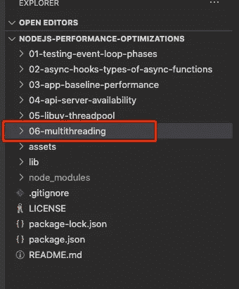

# 如何管理 Node JS 中的多线程

> 原文：<https://javascript.plainenglish.io/managing-multiple-threads-in-node-js-9ebc374d2f68?source=collection_archive---------7----------------------->


在这篇文章中，我将向你展示如何通过管理多线程来潜在地将你的[节点](https://nodejs.org/en/)应用的性能提高三倍。这是一个重要的教程，其中显示的方法和示例将为您提供设置生产就绪线程管理所需的内容。

# 请观看下面这篇文章的视频:

# 子进程、集群和工作线程

在很长一段时间里，Node 拥有多线程的能力，通过使用[子进程](https://nodejs.org/dist/latest-v14.x/docs/api/child_process.html)、[集群](https://nodejs.org/dist/latest-v14.x/docs/api/cluster.html)，或者更近期的一个叫做[工作线程](https://nodejs.org/dist/latest-v14.x/docs/api/worker_threads.html)的模块的首选方法。

子进程是为应用程序创建多线程的最初方式，从 0.10 版开始就已经存在。这是通过为您想要创建的每个额外线程生成一个节点进程来实现的。

集群，从版本 4 开始就是一个稳定的版本，允许我们简化子进程的创建和管理。当与 PM2 结合时，它工作得非常出色。

现在，在我们开始对我们的应用进行多线程处理之前，有几点您需要完全理解:

**1。I/O 任务的多线程已经存在**

有一层节点已经是多线程的，那就是 [libuv](https://libuv.org/) 线程池。文件和文件夹管理、TCP/UDP 事务、压缩和加密等 I/O 任务都交给 libuv，如果本质上不是异步的，就在 libuv 的线程池中处理。

**2。子进程/工作线程仅适用于同步 JavaScript 逻辑**

使用子进程或工作线程实现多线程仅对执行繁重操作(如循环、计算等)的同步 JavaScript 代码有效。例如，如果您尝试将 I/O 任务卸载到工作线程，您将不会看到性能的提高。

**3。创建一个线程很容易。动态管理多线程很难**

在你的应用程序中创建一个额外的线程是很容易的，因为有大量的教程教你如何做。然而，创建与您的机器或虚拟机正在运行的逻辑核心数量相当的线程，并管理这些线程的工作分配是一种更高级的方式，并且编写这种逻辑超出了我们的大多数工资级别😎。

谢天谢地，我们处在一个开源和 Node 社区杰出贡献的世界里。也就是说，已经有一个模块可以让我们根据机器或虚拟机的 CPU 可用性动态创建和管理线程。

# 工人池

我们今天要学习的模块叫做[工人池](https://github.com/josdejong/workerpool)。由 [Jos de Jong](http://josdejong.com/) 创建的 Worker Pool 提供了一种简单的方法来创建一个工人池，用于动态卸载计算以及管理一个专用工人池。它基本上是 Node JS 的线程池管理器，支持基于浏览器的实现的工作线程、子进程和 Web 工作线程。

为了在我们的应用程序中使用 Worker Pool 模块，需要执行以下任务:

*   **安装工人池**

首先，我们需要安装工人池模块— npm 安装工人池

*   **初始化工人池**

接下来，我们需要在应用程序启动时初始化工人池

*   **创建中间件层**

然后，我们需要在我们的重载 JavaScript 逻辑和管理它的工作池之间创建一个中间件层

*   **更新现有逻辑**

最后，我们需要更新我们的应用程序，以便在需要时将繁重的任务移交给工人池

# 使用工作池管理多线程

此时，你有两个选择:使用自己的 NodeJS app(并安装 [workerpool](https://www.npmjs.com/package/workerpool) 和 [bcryptjs](https://www.npmjs.com/package/bcryptjs) 模块)，或者从 GitHub 下载[源代码](https://github.com/bleedingcode/nodejs-performance-optimizations)用于本教程和我的 [NodeJS 性能优化](https://www.youtube.com/watch?v=ol56smloW2Q&list=PLISqeoHsXJYAIfu4-mgNY0tloWz2uut1t)视频系列。

如果选择后者，本教程的文件将存在于文件夹**06-多线程**中。下载后，进入根项目文件夹并运行 npm install。之后，进入**06-多线程**文件夹跟随。



在 **worker-pool** 文件夹中，我们有 2 个文件:一个是 worker 池的控制器逻辑(controller.js)。另一个包含将由线程触发的功能，也就是我前面提到的中间件层(thread-functions.js)。

## worker-pool/controller.js

```
'use strict'

const WorkerPool = require('workerpool')
const Path = require('path')

let poolProxy = null

// FUNCTIONS
const init = async (options) => {
  const pool = WorkerPool.pool(Path.join(__dirname, './thread-functions.js'), options)
  poolProxy = await pool.proxy()
  console.log(`Worker Threads Enabled - Min Workers: ${pool.minWorkers} - Max Workers: ${pool.maxWorkers} - Worker Type: ${pool.workerType}`)
}

const get = () => {
  return poolProxy
}

// EXPORTS
exports.init = init
exports.get = get
```

controller.js 是我们需要 **workerpool** 模块的地方。我们还导出了两个函数，分别叫做 **init** 和 **get** 。在加载我们的应用程序期间，将执行一次 **init** 函数。它用我们将提供的选项和对 **thread-functions.js** 的引用实例化了工人池。它还创建了一个代理，只要我们的应用程序在运行，这个代理就会一直保存在内存中。 **get** 函数只是返回内存中的代理。

## worker-pool/线程-函数. js

```
'use strict'

const WorkerPool = require('workerpool')
const Utilities = require('../2-utilities')

// MIDDLEWARE FUNCTIONS
const bcryptHash = (password) => {
  return Utilities.bcryptHash(password)
}

// CREATE WORKERS
WorkerPool.worker({
  bcryptHash
})
```

在 **thread-functions.js** 文件中，我们创建了将由工人池管理的工人函数。对于我们的例子，我们将使用 **BcryptJS** 来散列密码。这通常需要大约 10 毫秒来运行，这取决于一个人的机器的速度，并且当涉及到重型任务时，这是一个很好的用例。在 **utilities.js** 文件中是散列密码的函数和逻辑。我们在线程函数中所做的就是通过 workerpool 函数执行这个 **bcryptHash** 。这允许我们保持代码集中，避免重复或混淆某些操作存在的位置。

## 2-utilities.js

```
'use strict'

const BCrypt = require('bcryptjs')

const bcryptHash = async (password) => {
  return await BCrypt.hash(password, 8)
}

exports.bcryptHash = bcryptHash
```

## 。包封/包围（动词 envelop 的简写）

```
NODE_ENV="production"
PORT=6000
WORKER_POOL_ENABLED="1"
```

的。env 文件保存端口号，并将 **NODE_ENV** 变量设置为“生产”。这也是我们通过将 **WORKER_POOL_ENABLED** 设置为“1”或“0”来指定是否要启用或禁用工作池的地方。

## 1-app.js

```
'use strict'

require('dotenv').config()

const Express = require('express')
const App = Express()
const HTTP = require('http')
const Utilities = require('./2-utilities')
const WorkerCon = require('./worker-pool/controller')

// Router Setup
App.get('/bcrypt', async (req, res) => {
  const password = 'This is a long password'
  let result = null
  let workerPool = null

  if (process.env.WORKER_POOL_ENABLED === '1') {
    workerPool = WorkerCon.get()
    result = await workerPool.bcryptHash(password)
  } else {
    result = await Utilities.bcryptHash(password)
  }

  res.send(result)
})

// Server Setup
const port = process.env.PORT
const server = HTTP.createServer(App)

;(async () => {
  // Init Worker Pool
  if (process.env.WORKER_POOL_ENABLED === '1') {
    const options = { minWorkers: 'max' }
    await WorkerCon.init(options)
  }

  // Start Server
  server.listen(port, () => {
    console.log('NodeJS Performance Optimizations listening on: ', port)
  })
})()
```

最后，我们的 **1-app.js** 保存了将在我们的应用程序启动时执行的代码。首先我们初始化**中的变量。env** 文件。然后，我们设置一个 [Express](https://www.npmjs.com/package/express) 服务器，并创建一个名为 **/bcrypt** 的路由。当此路由被触发时，我们将检查工作池是否已启用。如果是，我们在 Worker Pool 代理上获得一个句柄，并执行我们在 **thread-functions.js** 文件中声明的 **bcryptHash** 函数。这将依次执行**实用程序**中的 **bcryptHash** 函数，并将结果返回给我们。如果工人池被禁用，我们只需直接在**实用程序**中执行 **bcryptHash** 函数。

在我们 **1-app.js** 的底部，你会看到我们有一个自我调用功能。我们这样做是为了支持 async/await，这是我们在与 Worker 池交互时使用的。如果启用了工作池，我们就在这里初始化它。我们想要覆盖的唯一配置是将 **minWorkers** 设置为“最大”。这将确保工作线程池将生成与我们机器上的逻辑核心一样多的线程，只有一个逻辑核心除外，它用于我们的主线程。在我的例子中，我有 6 个支持超线程的物理内核，这意味着我有 12 个逻辑内核。因此，当 **minWorkers** 设置为“max”时，工作线程池将创建并管理 11 个线程。最后，最后一段代码是我们启动服务器并监听端口 6000 的地方。

# 测试工作池

测试工作池就像启动应用程序一样简单，在它运行时，向`http://localhost:6000/bcrypt`执行一个 get 请求。如果你有一个像[auto canon](https://www.npmjs.com/package/autocannon)这样的负载测试工具，当工作池被启用/禁用时，你可以看到性能的不同。AutoCannon 非常容易使用。

# 结论

我希望本教程能够让您深入了解如何在节点应用程序中管理多线程。本文顶部的嵌入式视频提供了测试 Node 应用程序的现场演示。

下次见，干杯:)