# 许多开发人员努力解释 API

> 原文：<https://javascript.plainenglish.io/many-developers-struggle-with-explaining-apis-20a071d74596?source=collection_archive---------4----------------------->

## 你也在纠结吗？

Photo by [Andrea Piacquadio](https://www.pexels.com/@olly?utm_content=attributionCopyText&utm_medium=referral&utm_source=pexels) from [Pexels](https://www.pexels.com/photo/woman-in-white-shirt-showing-frustration-3807738/?utm_content=attributionCopyText&utm_medium=referral&utm_source=pexels)

你是否听说过“ **API** ”这个词，并想知道它到底是什么？你对它的作用或用途有一个模糊的概念吗？

当你第一次开始用任何一种 web 技术编程时，你都会遇到这种情况。许多新来的人纠结于这个概念，许多人对它有一些模糊的想法，并认为他们知道它是什么。

现在 API[并不是 web 编程的专属](https://en.wikipedia.org/wiki/API#Usage)，但是当你为 web 或移动编程时，你会经常用到它。过去，API 主要与计算机操作系统和桌面应用程序相关联。然而最近几年，我们已经看到了 Web APIs 的出现。

# 什么是 API？

它代表**一个**应用 **P** 编程 **I** 接口。这听起来既恐怖又新奇！那是什么意思？API 到底是什么？

和大多数地方一样，我不会给你一个模糊的定义，充满了技术术语。

所以，这就是:

> **简单来说，** API 就是一些不是你自己写的代码，那个代码有一些你被允许调用的方法。它可以是你从电脑上下载并运行的东西，也可以是网络上其他地方的东西。

从本质上来说，这就是 API 的全部。

不要想别的，当我们说一个 API 的时候，只要坚持上面提到的定义就可以了！

仅此而已吗？本质上，是的。

那为什么要取这么花哨的名字？

让我们找出答案！

让我们用 JavaScript 构建一个 API，让我们能够做饭🍜(实际上是 ofc)。

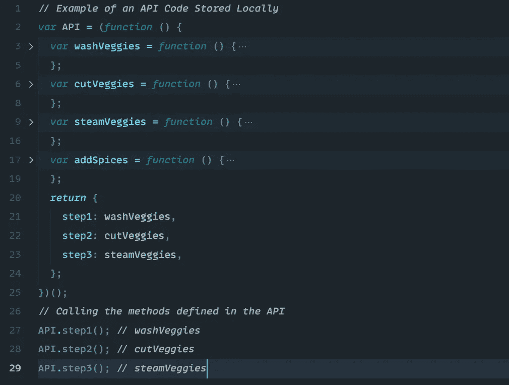

Our API Code that is stored in the computer

正如我所说的，我们可以有本地的 API 或者保存在远程服务器上，或者你可以下载。我们在本地做了一个，命名为 API，但是可以随便命名。

这是一个 JavaScript 文件，我已经下载并保存到本地文件夹中。

当我运行我的网页时，我可以使用这段代码:

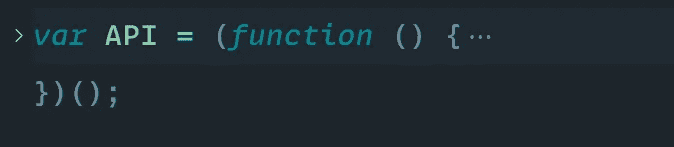

There is an immediately invoked function expression(IIFE) that is going to run itself.

在底部，它将返回一个对象，它返回的对象有三个属性。

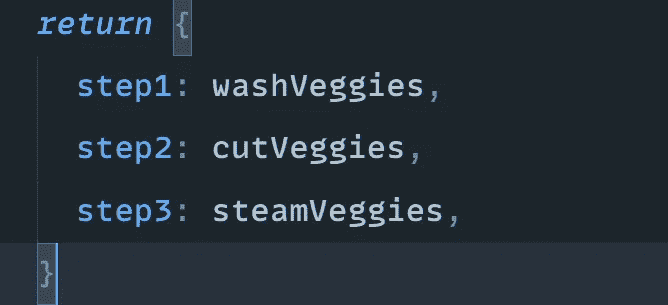

我们可以使用点运算符调用这些方法。

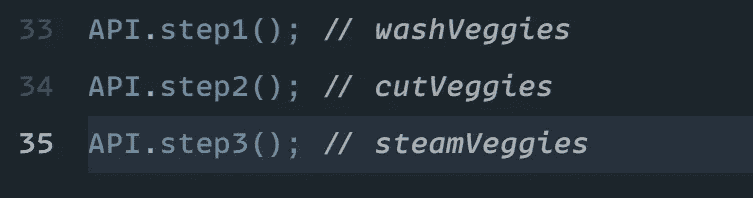

Calling methods described in our API.

当会连续调用这些方法时，我们会得到这样的输出:

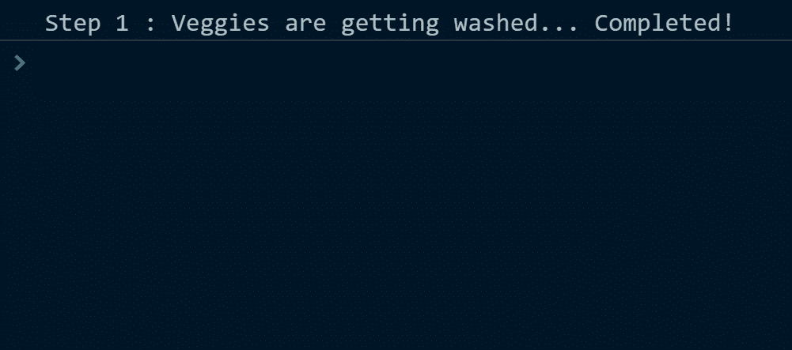

我们有调用其他函数`addSpices()`的函数`steamVeggies()`

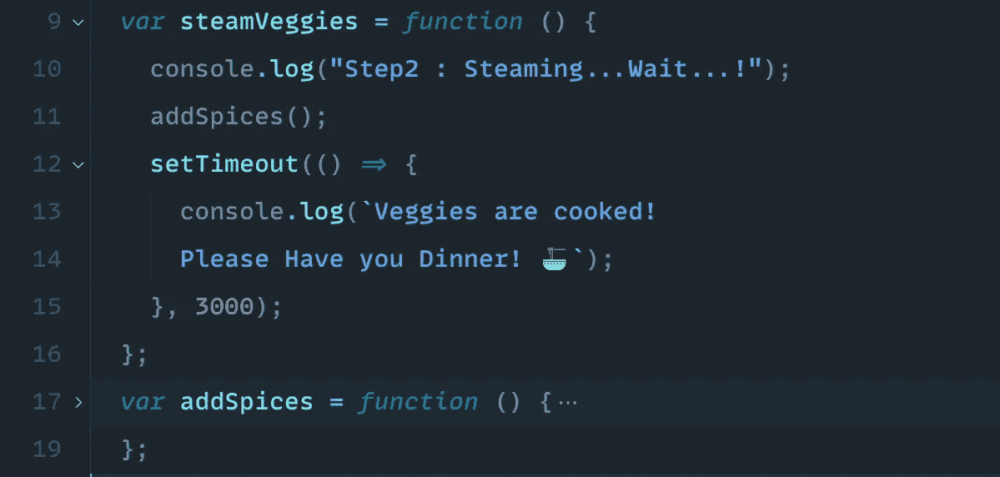

这里不能直接调用`addSpices()`,但是我可以调用`steamVeggies()`,它将运行函数`addSpices()`

现在这个正在做的只是 ***控制台记录*** 出来的一些消息，正在做什么并不重要，重要的是我有一个**对象**和一个**名**。这将是一个我可以下载并使用的文件，或者它可以保存在远程服务器上，或者它可以是我下载并保存在我的文件中的东西，然后在我的脚本文件中，我可以使用它。

所以，我可以先说 API，然后说 dot，这是这个函数返回的内容。

## 这些是我们可以调用的方法:

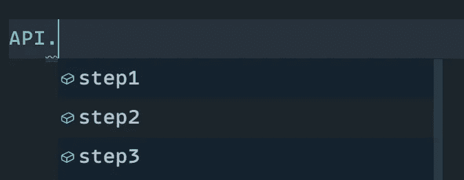

我们可以说，好吧，我要调用函数`step1()`，然后我需要调用函数`step2()`

API 里还有其他像`addSpices()`这样的我们不能直接调用的。

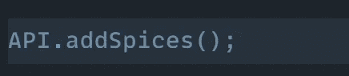

调用这个会给我们一个错误

所以里面有对我们隐藏的代码。我们不知道它在做什么，但有些事情是**暴露**给我们的，也就是 ***公开*** *。我们可以在代码中访问它们。我可以用一个`step1()`、`step2()`和`step3()`。这些是我们从 API 中可以得到的东西。*

在 **A** 应用 **P** 编程 **I** 接口中，**接口**部分就是这三种方法:

This is the **Interface** part of the code

这些方法是我与这个 **API** 交互的接口

This is our **Application Programming** part of the code

现在，它为什么被称为**一个**应用程序 **P** 编程 **I** 接口有意义吗？

现在，上面我们已经用了 API 这个名字，但不一定要叫 **API。它可以被称为任何东西。你可以叫它[***Som***](https://www.twitter.com/tweetsbysoma)如果我们愿意的话。**

你需要明白的是，有这个 [**黑盒**](https://en.wikipedia.org/wiki/Black_box) 藏在离我们很远的地方。我们所知道的是来自 [*文档*](https://en.wikipedia.org/wiki/API#Documentation) 。它说这些是我们可以使用的东西，我们在我们的程序中使用它们。

这就是一个 **API** 的全部。

别人写的代码，我可以访问，我可以在我的代码中使用它来完成某种任务。

它可以位于[远程服务器](https://en.wikipedia.org/wiki/Web_API)上，

它可以在我自己的电脑上，

这可能是我不得不使用 [**HTTP**](https://en.wikipedia.org/wiki/Representational_state_transfer) 来交谈的东西，我不得不向 API 发出一个 [AJAX 请求来获取信息。](https://developers.google.com/web/updates/2015/03/introduction-to-fetch#:~:text=fetch()%20allows%20you%20to,the%20complex%20API%20of%20XMLHttpRequest.)

在做 web 开发的时候，你可能会遇到术语 **RESTful API** 。不要混淆，它也是一个代码，但是它遵循某种[架构风格](https://en.wikipedia.org/wiki/Representational_state_transfer#Architectural_properties)，并使用 [HTTP 请求](https://developer.mozilla.org/en-US/docs/Web/HTTP/Methods)来访问和使用数据。该数据可用于获取、放置、发布和删除数据类型，这是指读取、更新、创建和删除与资源相关的操作。

**但总而言之，** [***人家***](https://en.wikipedia.org/wiki/API_writer#:~:text=An%20API%20writer%20is%20a,system%20architects%2C%20and%20system%20designers.) **为了让我们的生活轻松一点而写的代码而已！**

# Web 环境中的 API

API 对于互联网就像总机接线员对于早期的电信一样！

就像总机接线员过去如何连接电话一样，API 使得应用程序或软件之间能够进行通信。API 或应用程序编程接口是远程服务器的一部分，当您在浏览器中导航到一个网站时， ***接收请求******发送响应*** 。

以[medium.com](https://polymathsomnath.medium.com)为例，对数据的请求被发送到媒体的远程服务器。一旦您的浏览器接收到数据并处理了代码响应，浏览器将显示中页。在这种情况下，Medium 的服务器是启用通信并允许您访问网页的 API。

这里发生的事情是，你的请求进入了别人编写并存储在服务器上的代码。它为您提供了对存储在远程服务器某处的当前页面的访问。

你的请求不直接去服务器！它进入一个 API，这个 API 决定如何处理它。

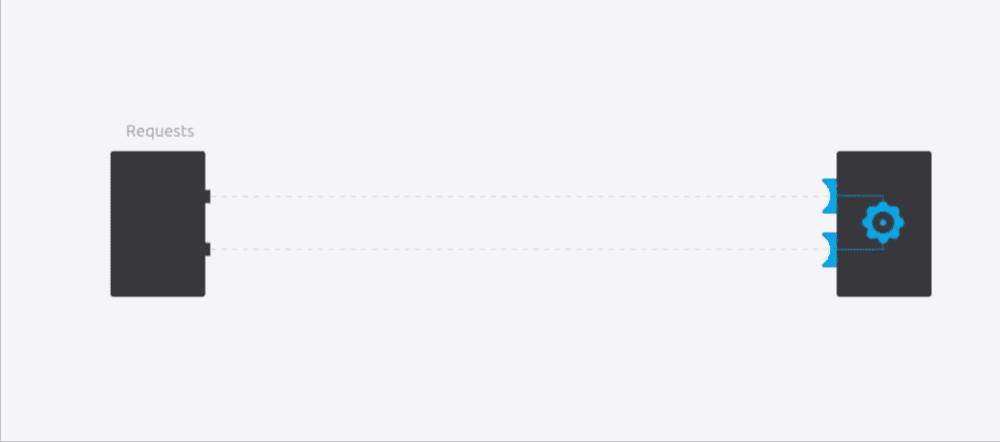

Client(left), API (Blue bolt), and Server(right)

API are 还支持两个站点之间的**交互**和**数据更改**，就像当一个网页有一个“分享到 Twitter”按钮时，点击该按钮会触发与您的 Twitter 帐户的通信，并通过添加新的 Tweet 来更改您的帐户。

现在，这种代码或 API 可以采取多种形式，这取决于它的使用场合。它将获得一个与该区域相关的名称。举几个例子，我们有

*   **开放 API**或**公共 API:**这些是公开提供给开发者和其他用户，限制很少。
*   **合作伙伴 API:**这些**API 由/向战略业务合作伙伴公开。它们不公开，需要特定的权限才能访问。**
*   ****内部 API 或私有 API:**这些是对外部用户隐藏的，仅由内部系统公开。它并不意味着供公司外部使用，而是供不同的内部开发团队使用，以获得更好的生产力和服务重用。**

**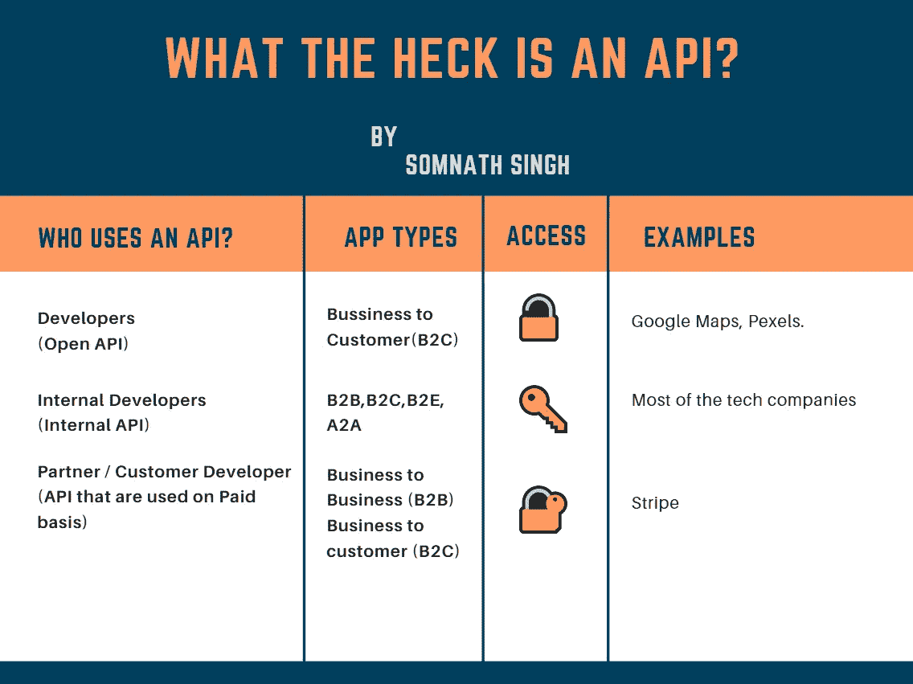**

**Bird’s eye view 🦅**

**除了内部、合作伙伴、开放 API 之间的区别，我们还应该提到另一种 API 分类方法:**

*   ****数据 API**为各种数据库或 SaaS 云提供商提供对底层数据集的 CRUD 访问。**
*   **内部服务 API 包括公开内部服务，反映部分内部流程，或者一些复杂的动作。**
*   ****外部服务 API**是第三方服务，可以嵌入到公司现有服务中，带来附加价值。**
*   ****用户体验 API**利用复合 API 帮助应用开发者为每种特定设备(桌面、移动、平板、VPA、物联网)提供合适的体验。**

**API 可以进一步分为本地、web 或程序 API:**

****Local API**为原始形式，名称由此而来。他们为应用程序提供操作系统或[中间件](https://developer.mozilla.org/en-US/docs/Glossary/Middleware)服务。微软的[。NET](https://dotnet.microsoft.com/learn/dotnet/what-is-dotnet)API、用于语音应用的 [TAPI(电话 API)](https://en.wikipedia.org/wiki/Telephony_Application_Programming_Interface) 以及数据库访问 API 都是本地 API 形式的示例。**

****Web API**旨在表示广泛使用的资源，如 [HTML](https://developer.mozilla.org/en-US/docs/Web/HTML) 页面，并使用简单的 [HTTP](https://developer.mozilla.org/en-US/docs/Web/HTTP) 协议进行访问。任何 web [URL](https://developer.mozilla.org/en-US/docs/Web/API/URL) 都会激活 web API。Web APIs 通常被称为 [REST(代表性状态转移)](https://developer.mozilla.org/en-US/docs/Glossary/REST)或 [RESTful](https://en.wikipedia.org/wiki/Overview_of_RESTful_API_Description_Languages) 。(我们在上面讨论过)**

****程序 API**基于[远程过程调用(RPC)](https://en.wikipedia.org/wiki/Remote_procedure_call) 技术，使得远程程序组件看起来对软件的其余部分是本地的。[面向服务架构(SOA)](https://en.wikipedia.org/wiki/Service-oriented_architecture)API，比如微软的**‘**WS 系列 API，都是程序 API。**

# **开发人员社区中的 API 示例**

**像脸书、谷歌和雅虎这样的公司发布 API 来鼓励开发者增强他们的能力。这些 API 给了我们一切，从浏览其他服务网站的新互联网功能，到提供轻松访问网络资源的移动设备应用。**

****

**新功能，如 [**【内容发布】**](https://en.wikipedia.org/wiki/Content_delivery_network)[**【增强现实】**](https://developers.google.com/web/updates/2018/06/ar-for-the-web) 以及可穿戴技术的新应用，很大程度上是通过这些 API 创造出来的。**

**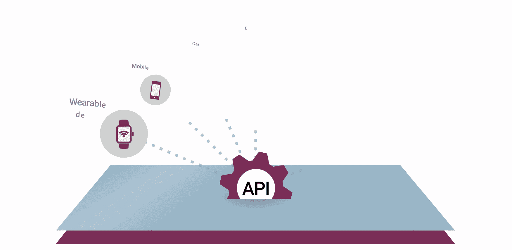**

**下一次，每当你听到 API 这个词，就把它想象成一段代码，这段代码允许两个软件程序通过在*应用*、*数据库*和*设备*之间来回运行来传递数据和建立连接，从而相互通信。**

# **我们学到了什么**

*   **API 是一些不是你自己写的代码，那些代码有一些你被允许使用的方法。**
*   **在 web 环境中，API 是远程服务器的一部分，当您在浏览器中导航到一个网站时， ***接收请求*** 并且 ***发送响应*** 。**
*   **API 可以采取多种形式，这取决于它的使用场合，例如**开放 API**或**公共 API、合作伙伴 API、内部或私有 API。****
*   **可以进一步分为**本地 API、Web API、程序 API。****
*   **简而言之，API 是允许两个软件程序相互通信的代码。**

**现在，我希望您清楚地了解什么是 API 及其各种细微差别。我见过人们纠结于这个术语。从一个更广阔的视角来看待它，将会结束人们在学习这个他们称之为 **API** 的花哨术语时的挣扎。**

****如果你还有什么问题，可以在评论里提问或者在我的** [**推特**](https://twitter.com/TweetsbySoma) **上联系我。🙏****