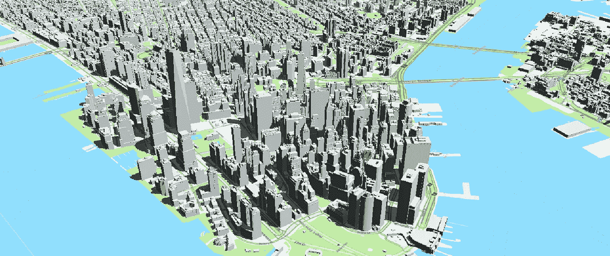
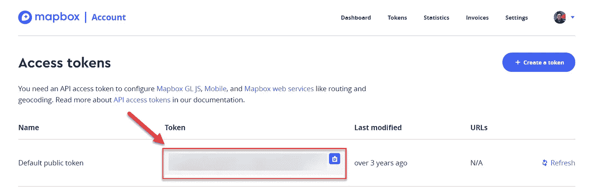
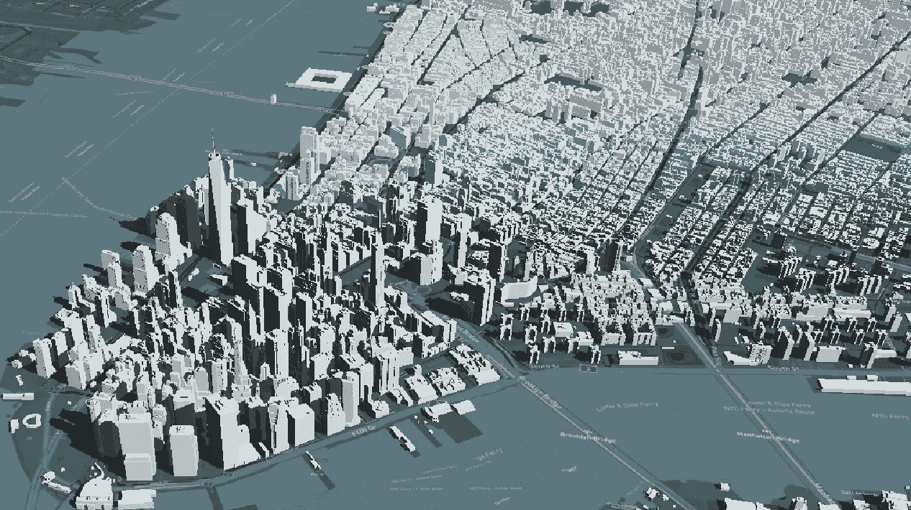

# 基于地图框 CesiumJS 中的地图

> 原文：<https://javascript.plainenglish.io/mapbox-based-map-in-cesiumjs-a6782738a9e9?source=collection_archive---------8----------------------->

## CesiumJS 教程

## 让我们将您最喜爱的底图添加到 3D 虚拟地球中



3D City Model — New York City, USA with Mapbox Day Navigation based-map

CesiumJS 是一个开源的 JavaScript 库，用于创建具有最佳性能、精度、视觉质量和易用性的世界级 3D 地球仪和地图。如果你是铯的新手，请查看来自[https://cesium.com/docs](https://cesium.com/docs)的铯的基础教程

这篇短文逐步展示了如何将基于 Mapbox 的地图添加到 CesiumJS web 应用程序中。我们开始吧！

## 第一步。准备地图框 API 密钥

你可以通过注册一个账户来获得 Mapbox API 密匙，并从 https://account.mapbox.com/access-tokens/[获得你的访问令牌](https://account.mapbox.com/access-tokens/)



[https://account.mapbox.com/access-tokens/](https://account.mapbox.com/access-tokens/) (Screenshot by Author)

## 第二步。拾取或创建地图框样式

[](https://docs.mapbox.com/api/maps/styles/) [## 样式| API

### 地图框样式 API 允许您读取和更改地图样式、字体和图像。这个 API 是 Mapbox Studio 的基础…

docs.mapbox.com](https://docs.mapbox.com/api/maps/styles/) 

*   选择[现有地图框官方风格](https://docs.mapbox.com/api/maps/styles/)或[创建自己的地图框风格](https://docs.mapbox.com/help/tutorials/create-a-custom-style/)
*   获得所需的地图框样式后，复制样式 ID。
    通常，您会获得以下格式的地图框样式 URL:

```
mapbox://styles/<User>/**<Style ID>**e.g.
mapbox://styles/mapbox/**streets-v11** (mapbox official)
mapbox://styles/thunyathep/**cklwtkdc25om317p66ibh77qe** (my style)
```

## 第三步。将 MapboxStyleImageryProvider 添加到铯查看器

在 CesiumJS JavaScript 部分，您可以使用准备好的样式 ID 和访问令牌将基于地图框的地图作为影像提供者添加到查看器部分。

Sample Script by Author



3D City Model — New York City, USA with Mapbox Night Navigation based-map

差不多就是这样！玩得开心，享受吧！🗺

*更多内容请看*[***plain English . io***](https://plainenglish.io/)