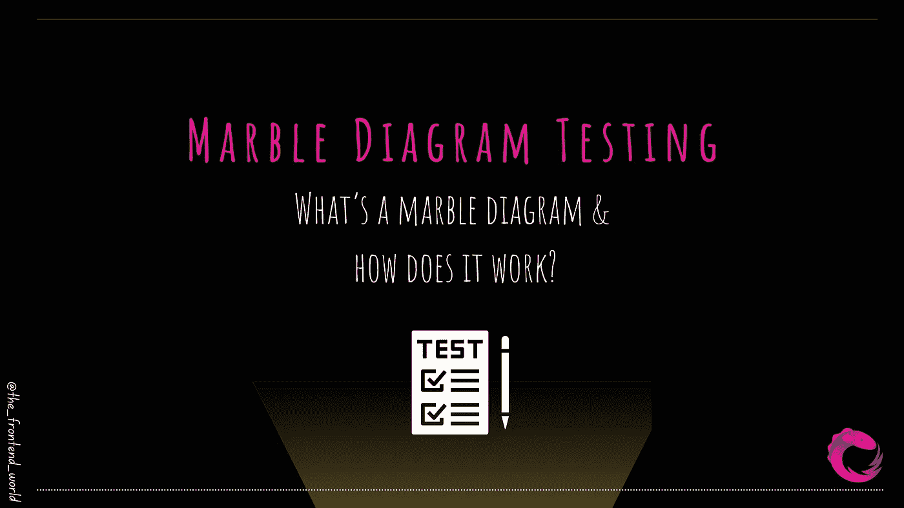
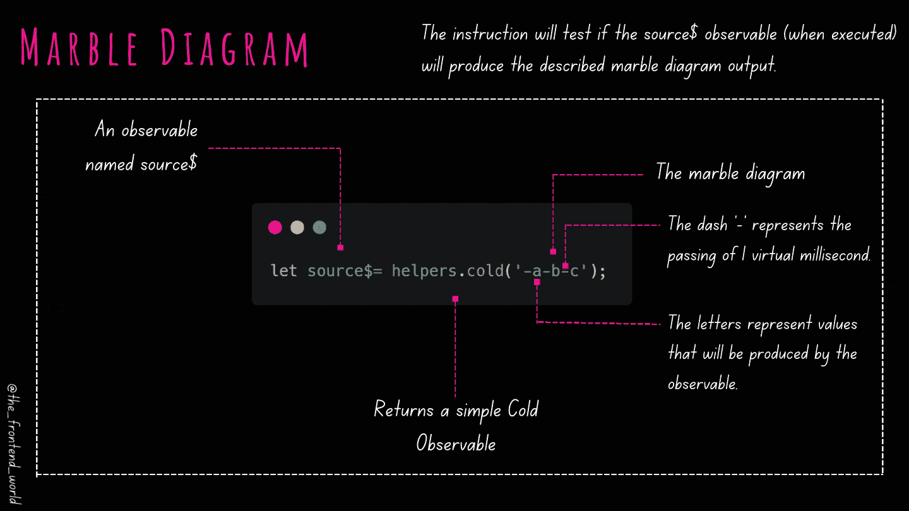
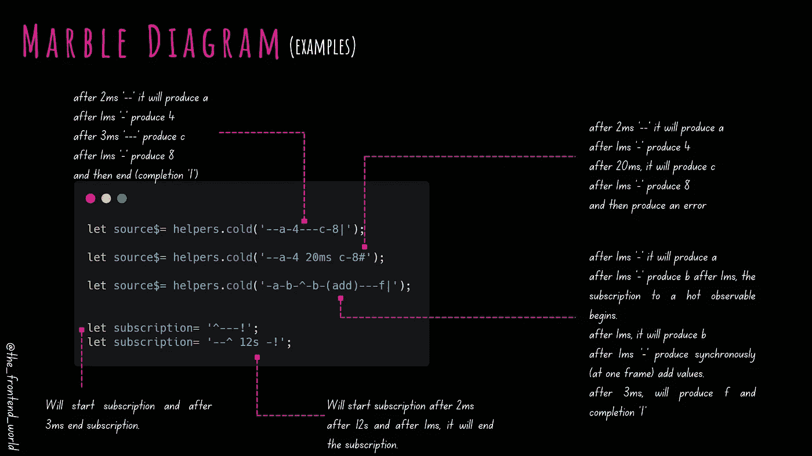

# 大理石图测试

> 原文：<https://javascript.plainenglish.io/marble-diagram-testing-5009c74324db?source=collection_archive---------9----------------------->

## 什么是大理石图，它是如何工作的？

By FAM

你听说过*大理石图吗，有没有激起你的好奇心？还是在测试你的被观察对象，想了解一下 ***大理石图*** ？*

*欢迎，你来对地方了！*

# *首先，什么是大理石图？*

*大理石图用于在 RxJS `TestShceduler`的上下文中测试异步代码。一句话:*

> *弹球图是一个具有特殊语法的字符串，用于描述可观察到的事件。*

## *大理石图特征*

*   *它描述可观察的事件(产生值、错误和完成)。*
*   *它代表随着时间的推移可观察到的源。*
*   *它从左到右运行-->*
*   *可观测量随着时间推移产生价值。这些值将被表示为圆圈或框架。*
*   *一帧是用来表示`TestScheduler`虚拟时间的单位(多亏了这个虚拟时间，我们可以将异步代码转换成同步代码，并对其进行测试)。*
*   *它反映了执行可观察源后产生的价值。*

## *理解语法…*

**

*By FAM*

*   *每个破折号`-`代表时间(1 虚拟毫秒)。*
*   *每一个字母都代表了可观察对象在执行时将产生的价值。*
*   *`(abdidf)`，括号中的几个值表示这些值将在同一帧中同步产生。*
*   *一个`**|**`代表一个可观察的完成。*
*   *A `**#**`表示由可观测值产生的误差。*
*   *空白被忽略。这是一个好消息，因为它有助于对齐图表，以便您可以轻松地比较和阅读它们(我们将在后面看到一个例子)。*
*   *如果我们有一个很长的虚时间(写一个无限长的破折号串)呢？).好吧，谢天谢地，我们可以用数字后跟`ms`、`s`表示秒、`m`表示分。例子:`42ms` (注意这里的**需要**空格，所以它不会被解释为由可观测值产生的值。*
*   *`**^**`仅适用于热观测值，代表开始订阅**热**观测值的点(这意味着订阅者不会收到在此点之前产生的值)*

## *测试订阅呢？*

*这在大理石图中也是可行的，具体做法如下:*

*   *`^`表示订阅的开始。*
*   *`!`表示订阅结束。*
*   *这同样适用于演示时间`-`、`12ms`、……*

# *例子*

**

*By FAM*

*想要一个完整的带有大理石图的单元测试套件示例吗？这将是下面这篇文章(将于明天发表)使用 RxJS `TestScheduler`。*

> *我今天的故事到此结束，希望你喜欢 it❤*

*[如果你喜欢看我的文章……♥️](https://famzil.medium.com/subscribe)*

* [## 如果你喜欢看我的文章… ♥️

### 如果你喜欢读我的文章… ♥️，当我的文章发表时，欢迎你第一个得到通知…

famzil.medium.com](https://famzil.medium.com/subscribe) 

> 谢谢你，❤

如果你有兴趣成为付费会员，你可以使用我的推荐链接。下次见

亲爱的读者，感谢你在我生命中的存在。

**让我们在** [**中**](https://medium.com/@famzil/)**[**Linkedin**](https://www.linkedin.com/in/fatima-amzil-9031ba95/)**[**脸书**](https://www.facebook.com/The-Front-End-World)**[**insta gram**](https://www.instagram.com/the_frontend_world/)**[**YouTube**](https://www.youtube.com/channel/UCaxr-f9r6P1u7Y7SKFHi12g)**或**上取得联系************

**参见我的关于网络要素和一般文化的电子书。**

***更多内容请看*[***plain English . io***](http://plainenglish.io/)***