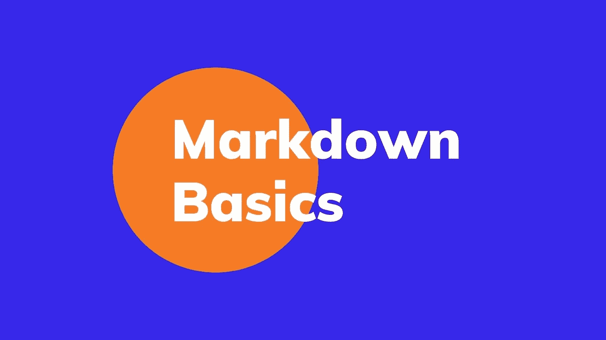
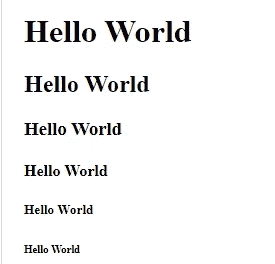
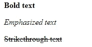
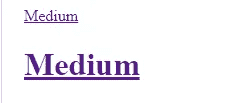
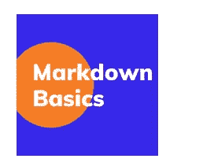
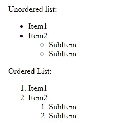
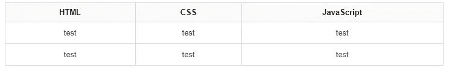
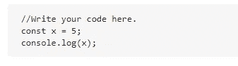

# 用例子解释降价基础知识

> 原文：<https://javascript.plainenglish.io/markdown-basics-explained-with-examples-73d5c55ddabe?source=collection_archive---------9----------------------->

## 通过实践示例了解降价。



Image created with ❤️️ By author.

# 介绍

Markdown 是一种简单的标记语言，用于在网页上创建格式化文本。您可以使用它将文本格式化为标题、列表、表格、链接等。也就是说，Markdown 被广泛用于在 GitHub 上写自述文件、写文章、写文档。它无处不在，因为它提供了一种简单的语法，允许您在纯文本文档中添加格式化元素。

因此，在本文中，我们将学习一些基础知识，帮助您使用 Markdown 编写格式化文本。让我们开始吧。

# 标题

在 HTML 中，我们用`h1`、`h2`、`h3`等等来写标题。我们也可以在 Markdown 中写标题。但是我们没有使用标签，而是在文本的开头使用了操作符`#`。

这里有一个例子:

```
# Hello World
## Hello World
### Hello World
#### Hello World
##### Hello World
###### Hello World
```

*输出:*



Image created by the author.

# 文本格式

Markdown 中有许多文本格式功能。您可以将文本格式化为粗体、强调、斜体等。

看看下面的例子:

```
**Bold text***Emphasized text*~~Strikethrough text~~
```

*输出:*



Image created by the author.

# 链接

在 Markdown 中编写链接要容易得多。您只需将文本写在括号内，并将链接放在括号内。

这里有一个例子:

```
[Medium](https://medium.com/)# [Medium](https://medium.com/)
```

*输出:*



Image created by the author.

# 形象

在 Markdown 中添加图像与添加链接非常相似。唯一的区别是，你需要在开头加上一个感叹号，告诉 Markdown 你添加的是一个图片，而不是一个链接。

这里有一个例子:

```

```

*输出:*



Image created by the author.

正如您所看到的，要显示图像，您只需在括号内写下 alt 文本，并在括号内写下图像的链接。当然在开头加上感叹号之后。

# 列表

你也可以使用 Markdown 将文本格式化成有序或无序的列表，只需给它们编号或加上星号`*`。

为了更好地理解，请看下面的例子:

```
Unordered list:
* Item1
* Item2
 * SubItem
 * SubItemOrdered List:
1\. Item1   
2\. Item2
  1\. SubItem
  2\. SubItem
```

*输出:*



Image created by the author.

如你所见，我们用两个空格来表示子项目。

# 桌子

只需使用`|`和`:— —-:`就可以在 Markdown 中制作出令人惊叹的表格

这里有一个很好的例子:

```
| HTML | CSS    | JavaScript |
|:----:|:------:|:----------:|
| test | test   | test       |
| test | test   | test       |
```

*输出:*



Image created by the author.

正如您在上面看到的，我们使用`:---:`作为父列。

# 代码块

当然，您也可以使用 Markdown 将文本格式化为代码块，只需在代码的开头和结尾加上 3 个反勾号(` `` `)。

这里有一个例子:

```
```
 //Write your code here.
 const x = 5;
 console.log(x);
```
```

*输出:*



Image created by the author.

# 结论

如你所见，Markdown 是一种非常有用的标记语言。您将需要它来编写开发文章、文档、GitHub 自述文件等等。

感谢您阅读这篇文章。希望你觉得有用。

# 更多阅读

*如果你对 JavaScript 和 web 开发相关的更有用的内容感兴趣，可以* [*订阅*](https://mehdiouss.ck.page/) *我的快讯。*

*你可能也喜欢:*

[](/5-awesome-css-features-that-you-probably-dont-know-63f90e66562) [## 你可能不知道的 5 个很棒的 CSS 特性

### 每个 web 开发人员都应该知道的有用的 CSS 特性。

javascript.plainenglish.io](/5-awesome-css-features-that-you-probably-dont-know-63f90e66562)