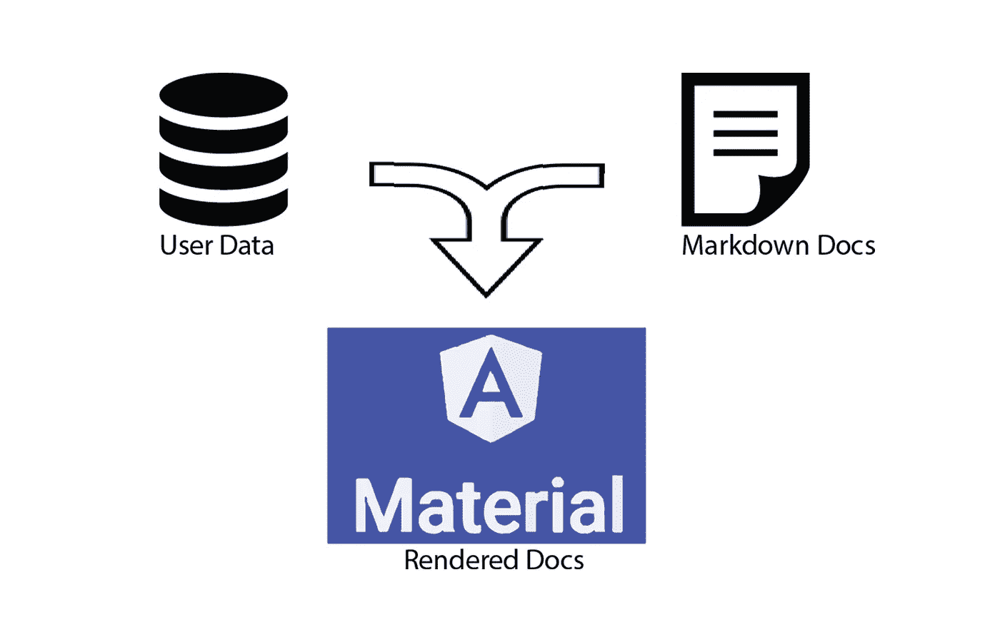
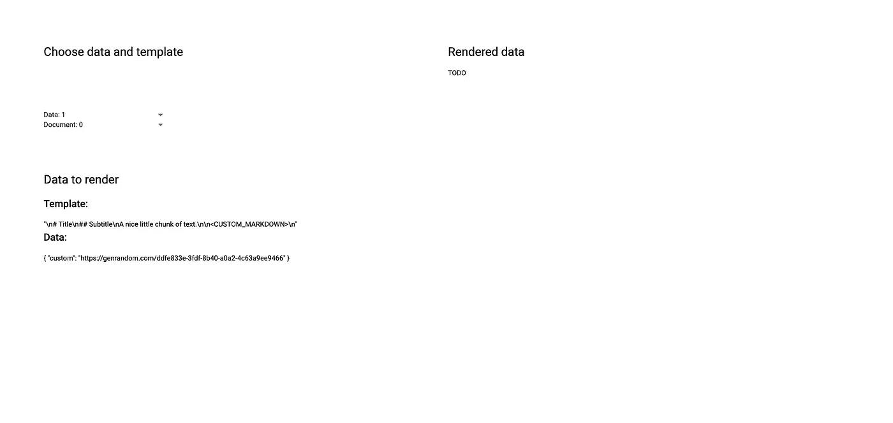
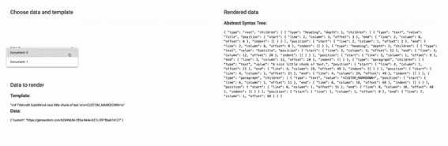
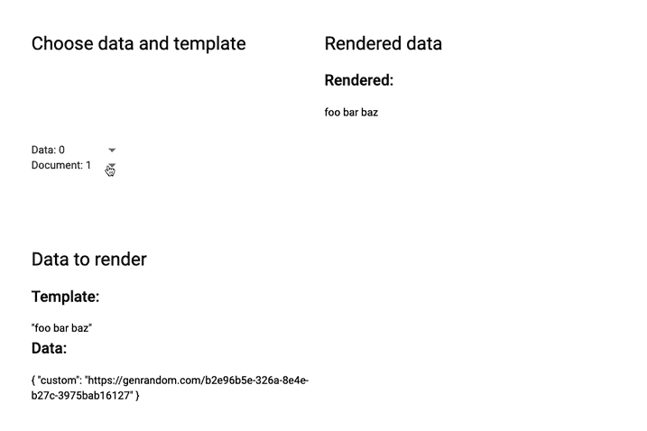
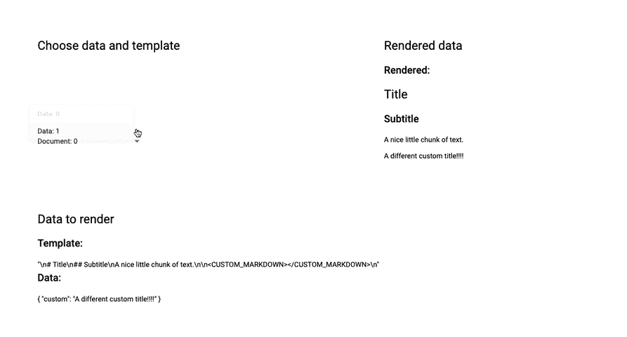

# 使用 Unified 和 Remark 降低到角度渲染

> 原文：<https://javascript.plainenglish.io/markdown-to-angular-rendering-using-unified-and-remark-96835bb877?source=collection_archive---------5----------------------->

我最近开发了一个前端应用程序，它需要将 markdown 文档渲染成有角度的组件。使用的 app 是两种用户使用的。一个小组研究了几个应用中使用的模型数据库。另一组用 markdown 方言编写文档模板，其中包含一些引用数据库模型的自定义扩展。

文档必须以与应用程序的其他部分一致的风格呈现，这些部分使用了大量有棱角的材料组件。这个项目很有趣，有时也很棘手，所以我为其他可能面临同样挑战的人创建了一个示例回购。



Rendering markdown and user data into Angular Components. Image by Author

应用程序开发中的每个步骤都与示例回购中的特定提交相关联。创建缩减至角度渲染器的步骤如下:

1.  创建您的应用程序([回购链接](https://github.com/matteson/custom-markdown/tree/71b73b4fdb173d012ce4515870d529b492982a2b))。
2.  使用`Unified`和`Remark`将 markdown 解析成一个语法树( [repo link](https://github.com/matteson/custom-markdown/tree/515f0f381ecf8d8a78c5f62f5f9d850600ed07f0) )。
3.  将树渲染成角度组件( [repo link](https://github.com/matteson/custom-markdown/tree/ee5dd55d24117e334957733048f8c41901c29ca7) )。
4.  为您的数据添加自定义解析器( [repo link](https://github.com/matteson/custom-markdown) )。

# **创建您的应用**

我不会在这上面花太多时间，因为这个应用程序非常简单。我们从两个服务获取数据，一个用于数据，一个用于文档。用户可以用两个`mat-select`元素选择数据和模板。

我用我喜欢的布局和样式库初始化了这个应用程序:`@angular/flex-layout`和`@angular/material`。



Our initial app. The user selects data with the pickers. The raw data is displayed in the lower left. The rest of the post will be about rendering the data in the right panel.

# 使用 Unified 和 Remark 解析 Markdown

该功能的主要功能在[备注](https://github.com/remarkjs/remark/tree/main)中实现，是[统一生态系统](https://unifiedjs.com/)的一部分。Unified 是一套通用的工具，“将语法树编译成内容，将内容编译成语法树”。我们的目标是获取非结构化的文本数据，一个 markdown 文件，并使用 Angular 组件库将其呈现为结构化内容。

通过 markdown 解析器注释，Unified 通过将我们的 markdown 文件映射到一个结构化的树中，极大地提升了这个特性。我们将 Unified 与 Angular 应用程序集成所需的最小功能是一个工厂，我们可以将其用作提供者。

## 统一工厂. js:

```
import * as unified from "unified";
import * as ***markdown*** from "remark-parse";

export function unifiedFactory() {
  return unified()
    .use(markdown)
    .freeze();
}
```

统一的核心是处理器流水线。管道中的每一级都接受输入，对其进行转换，然后将其传递给管道中的下一级。最初，我们使用一个非常简单的管道，只有一个将 markdown 转换成结构化文本的阶段。

使用这个管道，一个简单的降价文件，如:

> foo bar 巴兹

将呈现为这棵树:

```
{
 **“type”: “root”,**
 “children”: [
 {
 **“type”: “paragraph”,**
 “children”: [
 {
 **“type”: “text”,
 “value”: “foo bar baz”,**
 “position”: {“start”: {“line”: 1, “column”: 1, “offset”: 0 },
 “end”: {“line”: 1, “column”: 12, “offset”: 11},
 “indent”: []
 }
 }
 ],
 “position”: {“start”: {“line”: 1,”column”: 1,”offset”: 0 },
 “end”: { “line”: 1, “column”: 12, “offset”: 11 },
 “indent”: []
 }
 }
 ],
 “position”: { “start”: { “line”: 1,”column”: 1,”offset”: 0 },
 “end”: {“line”: 1,”column”: 12, “offset”: 11 }
 }
}
```

`root`节点有一个`paragraph`子节点，子节点又有一个`text`子节点。这种结构化数据正是我们将降价转换成角度分量所需要的。

为了将统一管道与应用程序集成，应用程序需要 it 作为提供者。

```
...
providers: [
  DataService,
  DocumentService,
  {
    provide: 'unified',
    useFactory: unifiedFactory,
  }
],
...
```

这可以提供给`MarkdownComponent`像任何其他角度服务一样使用。

```
// markdown.component.ts@Component({
  selector: 'app-markdown',
  templateUrl: './markdown.component.html',
  styleUrls: ['./markdown.component.css']
})
export class MarkdownComponent {

  processed: any = '';

  @Input()
  set raw(markdown: string) {
    this.processed = this.unified.parse(markdown);
  }

  constructor(
    @Inject('unified') private unified: FrozenProcessor
  ) { }
}
```

该组件接受降价字符串的输入。当`raw`被设置时，我们调用`unified.parse()`来得到语法树。

我们可以为降价组件创建一个简单的显示:

```
// markdown.component.html<div class="mat-h2">Abstract Syntax Tree:</div>
<code>
  {{ processed | json  }}
</code>
```

我们将组件连接到我们的应用程序中:

```
...
<app-markdown [raw]="documents[selected_document]"></app-markdown>
...
```

它为我们提供了以下功能:



Animation of app with parsing. Changing the template triggers the app to parse markdown into an AST.

用户可以选择不同的降价模板，作为响应，语法树被打印到屏幕上。这个特性的其他方面很简单。我们必须从结构化的树中渲染我们的角组件。

# 从 AST 渲染角度分量

Remark-parse 将 markdown 视为由块部分和内联部分组成。块部分是像标题、段落、列表、表格等东西。内联部分包括纯文本、粗体文本、斜体文本、链接、图片等。

呈现树包括将节点树传递给呈现逻辑。我们循环遍历树中的每个子节点，递归调用呈现逻辑。我们创建一个`block` 组件和一个`inline`组件。当我们扩展渲染逻辑的复杂性时，分离这个逻辑是有帮助的。

```
// Block component@Component({
  selector: '[block]',
  templateUrl: './block.component.html',
  styleUrls: ['./block.component.scss'],
  encapsulation: ViewEncapsulation.*None*,
})export class BlockComponent {
  constructor() {}

  @Input('block') node: any;

  // AOT safe children from the node
  get children() {
    return 'children' in this.node ? this.node.children : [];
  }
}
```

对于每个孩子，我们在一个`ngSwitch`语句中检查类型，用类和 css 信息将它放在适当的`div`中，然后将孩子传递给`[inline]`元素。

```
// Block HTML logic<ng-container **ngFor*="let ***child*** of children">
  <ng-container [ngSwitch]="***child***.type">
    <!-- Headings -->
    <ng-container **ngSwitchCase*="'heading'">
      <div class="mat-h1"
        **ngIf*="***child***.depth === 1"
        [inline]="***child***"
      ></div>
      <div class="mat-h2"
        **ngIf*="***child***.depth === 2"
        [inline]="***child***"
      ></div>
      <div class="mat-h3"
        **ngIf*="***child***.depth === 3"
        [inline]="***child***"
      ></div>
    </ng-container>

    <!-- Paragraph -->
    <p **ngSwitchCase*="'paragraph'"
      [inline]="***child***"
    ></p>

    <!-- Can be added: -->
    <!-- Lists -->
    <!-- Tables -->
    <!-- Etc. -->
  </ng-container>
</ng-container>
```

内联组件也有类似的模式:

```
// Inline component @Component({
  selector: '[inline]',
  templateUrl: './inline.component.html',
  styleUrls: ['./inline.component.scss'],
  encapsulation: ViewEncapsulation.*None*,
})
export class InlineComponent {
  constructor() {}

  @Input('inline') node: any;

  // AOT safe children from the node
  get children() {
    return 'children' in this.node ? this.node.children : [];
  }

  public text_helper(value: string): string {
    return value || '';
  }
}
```

对于每个孩子，我们再次使用`[ngSwitch]`循环

```
// Inline HTML template<ng-container **ngFor*="let ***child*** of children">
  <ng-container [ngSwitch]="***child***.type">

    <!-- Plain text -->
    <ng-container **ngSwitchCase*="'text'">
      {{ text_helper(***child***.value) }}
    </ng-container>

    <!-- Other types go here emph, strong, html, etc. -->
  </ng-container>
</ng-container>
```

最后，我们更新`markdown.component.html`以将语法树传递给顶层块。

```
<div class="mat-h2">Rendered:</div>
<div [block]="processed"></div>
```

我们更新的应用程序拥有我们正在寻找的大部分功能。



Rendering markdown as Angular components

# 为用户数据添加自定义解析器

在我们的 fixtures 中，我们包含了字符串`<CUSTOM_MARKDOWN></CUSTOM_MARKDOWN>`。我们可以编写一个定制的解析器，将它解释为一个特殊的标记，而不是一个字符串。解析器向语法树添加一个自定义块。

```
export function customParser(classNames = {}) {
  const customMarker = new ***RegExp***(`<CUSTOM_MARKDOWN></CUSTOM_MARKDOWN>`);

  function customTokenizer(eat, value, silent) {
    const keep = value.match(customMarker);
    if (!keep || keep.index !== 0) return;

    const add = eat('<CUSTOM_MARKDOWN></CUSTOM_MARKDOWN>');

    return add({
      type: 'customMarkdown',
      children: [],
      data: {},
    });
  }

  const Parser = this.Parser;

  // Append our custom block to the parser
  const blockTokenizers = Parser.prototype.blockTokenizers;
  const blockMethods = Parser.prototype.blockMethods;
  blockTokenizers.customBlock = customTokenizer;
  blockMethods.splice(blockMethods.indexOf('list') + 1, 0, 'customBlock');
}
```

我们可以在解析工厂中包含自定义解析器。

```
import { customParser } from "./custom-parser";

export function unifiedFactory() {
  return unified()
    .use(markdown)
    .use(customParser)
    .freeze();
}
```

最后，在开关中包含自定义角度分量。

```
<ng-container **ngFor*="let ***child*** of children">
  <ng-container [ngSwitch]="***child***.type">
  ... <div **ngSwitchCase*="'customMarkdown'">
    {{get_custom()}}
  </div> </ng-container>
</ng-container>
```

作为一个演示，我们使用打印一个字符串到模板化的文档中，它依赖于在前端选择的数据。



Our feature with all the functionality we sought

# 结论

就演示中的功能而言，这看起来像是很多工作，但这对我为之构建的团队产生了巨大的影响。关键的一点是，在规模上，这将数据源的开发与如何呈现数据源的开发分离，并使没有前端开发经验的团队能够在应用程序中编写文档视图。

我真的很高兴将来能继续与 Unified 和 Remark 合作。这是一个巨大的文本操作工具生态系统。

*更多内容尽在*[***plain English . io***](http://plainenglish.io/)