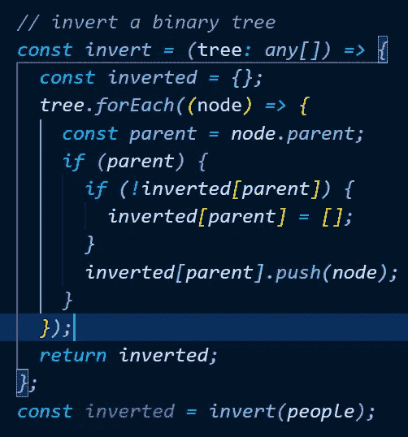
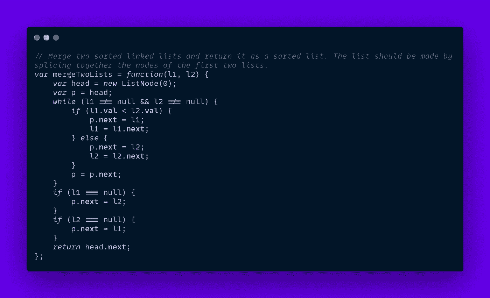
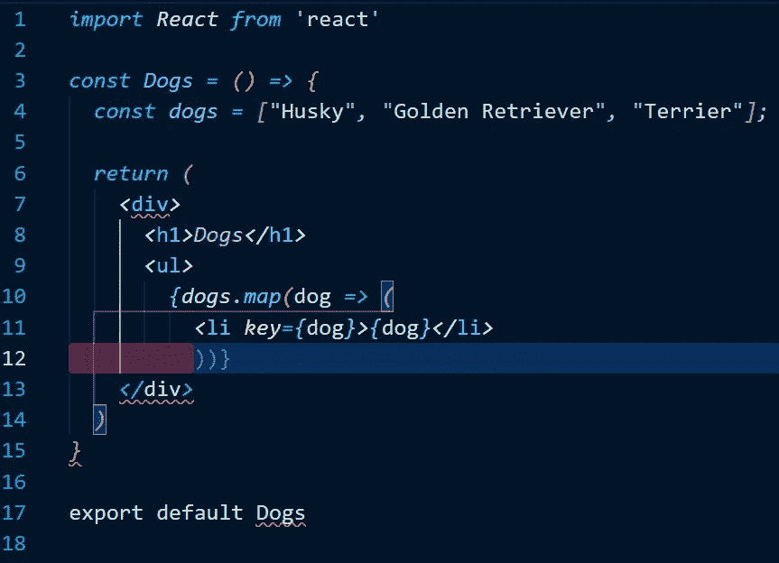
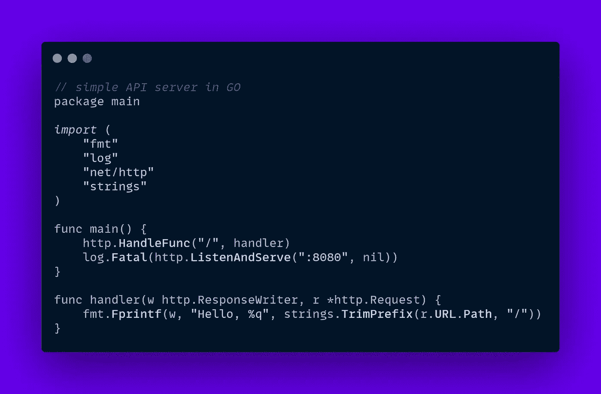
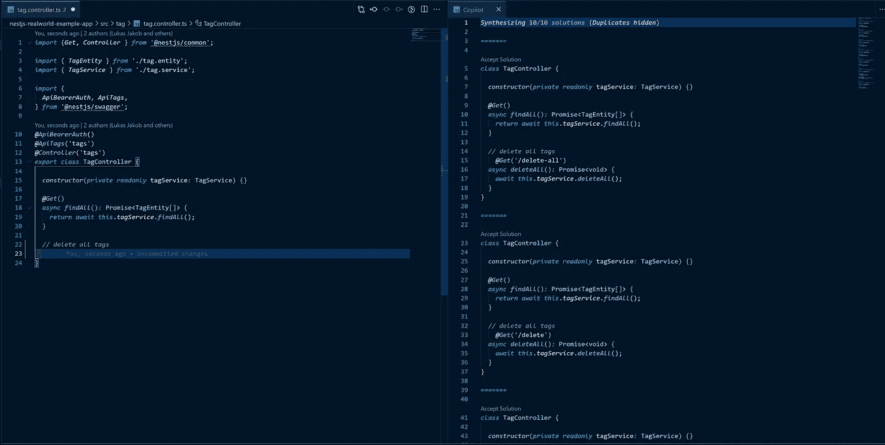
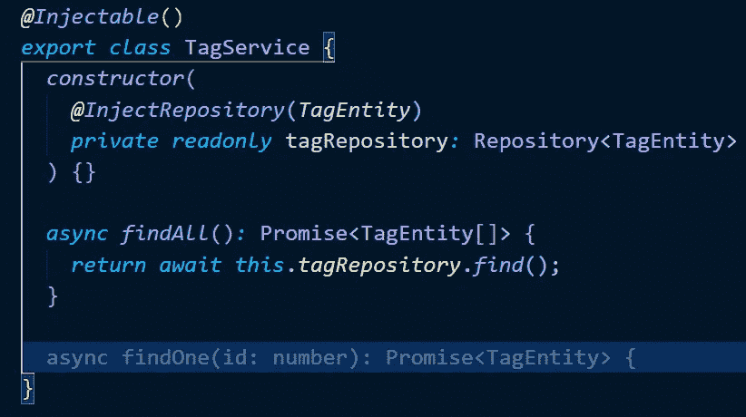
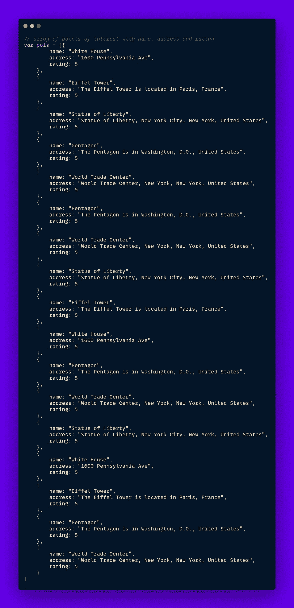
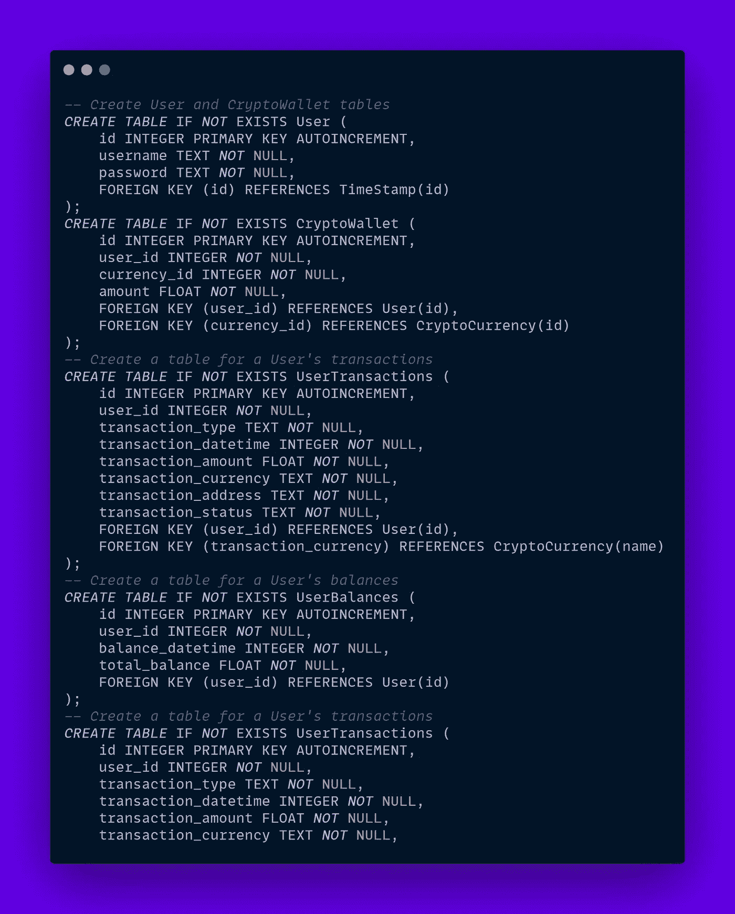

# 精通 Github Copilot AI for React in VS 代码

> 原文：<https://javascript.plainenglish.io/master-github-copilot-252553a7db10?source=collection_archive---------6----------------------->

## AI 结对编程是未来吗？

几周前 [Github](https://github.com/) 宣布了一个最先进的、基于人工智能的针对 [VSCode](https://code.visualstudio.com/) 的结对程序员 beta 扩展，这极大地震动了软件开发行业。虽然许多人担心这个人工智能工具会取代我们的工作，但这绝对不是真的**还没有**。在过去的一个月里，我一直在许多项目中测试 Github Copilot，主要是 JS，包括前端和后端，以及其他更不可思议的任务。

# 1.它是如何工作的

一旦您注册了 beta 计划，您将会收到一个通知，告知您有资格测试该扩展，并可以通过 [VSCode 扩展市场](https://marketplace.visualstudio.com/items?itemName=GitHub.copilot)访问它，之后您就可以开始了。现在，每当我们写一些代码时，扩展会给出一个建议，告诉我们如何用浅灰色来完成这一行，我们可以按下“Tab”来接受它。

使用该扩展的另一种方式是写评论，让 GPT-3 驱动的猛犸象占用你的资源来生成一个常见的面试问题解决方案，比如如何倒置二叉树😋。

但是如果我们不喜欢这个建议，按“CTRL + Enter”键，右边会出现一个标签，上面有 10 个完整的建议(不是一行程序)。

令人难以置信的是，你能够以如此快的速度生成代码行来解决简单的任务，比如基本算法，甚至更专业的任务。

**2。它能做什么**
我们在前面的例子中看到，它在回答面试问题方面非常出色，希望在未来使它们过时，因为我在生产中还没有反转链表或反转树。

**回答面试问题&解决简单算法**

让我们用一些 [LeetCode](https://leetcode.com/) (一个学习算法和准备面试的神奇平台)问题来测试一下，比如

> 合并两个排序列表(简单)

> 两个数相加(中号)

对于困难的问题，副驾驶并不总是击中本垒打，但它确实给了一些像样的建议。

> 我们可以说 Github Copilot 擅长算法

**完整的括号**

这可能看起来很滑稽，但我发现 copilot 真正擅长的一个用例是在 JSX 为地图功能添加最后的括号和括号。每个人都喜欢 React，但有时你必须处理的括号数量太多了。

谁会想到我们会有一个人工智能来拯救我们👿。

> 我们可以说 Github Copilot 在结尾部分是可以接受的

**创建 API 端点**

需要注意的一点是，Github Copilot 像其他人工智能驱动的代码自动完成工具一样( [Tabnine](https://www.tabnine.com/) & [Kite](https://www.kite.com/) )受益于更大的代码库，因为它从中学习。

如果我们在 [GO](https://golang.org/) 想要一个全新的服务器，(我总是承诺自己要学习这种令人难以置信的性能和面向未来的语言)我们会得到这样的建议:

我还不了解围棋，但是对于一个简单的服务器来说，这看起来是一个好的开始。

让我们使用 [Nest.js](https://nestjs.com/) 和 [Prisma](https://www.prisma.io/) 作为 ORM，在一个[现实世界实现](https://github.com/lujakob/nestjs-realworld-example-app/tree/prisma)上尝试一下。

Copilot 知道使用 TagService 的 deleteAll 方法(虽然不存在)。如果我们去 TagService.ts 看看它是否建议这样做

不完全是，但仍然是一个有效的猜测。

> 我们可以说 Github Copilot 在后端很不错

**生成数值**

我想创建一个包含美国所有州的数组，在下拉列表中使用。我不擅长地理，也不是美国本地人，我们的人工智能朋友来帮忙了:

老实说，我不知道这些是否正确，这是 Github Copilot 的一个普遍缺点，因为它不验证代码是否工作或其来源。

因为 API 端点还没有准备好，所以我必须为位置卡列表写一些占位符值:

> 我们可以说 Github Copilot 在创造价值方面相当不错

**生成 SQL**

SQL 写起来真的很乏味，设计数据库有时需要一点想象力，如果我们请 Github Copilot 为加密交易平台设计一个数据库会怎么样，因为人工智能和区块链应该成为 2021 年的顶级技术。

这是 Github Copilot 的一个很棒的第一条建议。如果我们让他添加一个 Wallet 和用户表，看看它是否使用了带有前面代码的外键，会怎么样呢？

虽然还没有完工，但在如此短的时间内，这是一个令人难以置信的数量可观、设计合理的场地。

> *我们可以说 Github Copilot 非常擅长简单的 SQL*

**写‘好’的文案**

如果我们每天都想写一篇博客，但是我们写得真的真的很差或者很慢怎么办？

该死的这个人工智能真的很自恋，但不幸的是不擅长写 markdown，但这根本不是它的设计目的。

> 我们可以说 Github Copilot 不擅长写博客

# 3.你应该使用它吗

在我看来，Github Copilot 是一个很好的工具，可以添加到您的工作流程中，尽管它还远未完成，需要一些性能改进。

许多人认为人工智能是开发人员生存的祸根，但这离成为可能还有很长的路要走，在未来的几年里，即使人工智能在编写代码方面变得越来越有能力，这也不会导致我们的工作灭绝，而是进化和改变。

现在它只不过是一个美化了的自动完成工具，具有额外的“StackOverflow 集成”功能，所以没有什么可担心的。

我最后的建议是把它作为一个有趣的工具来使用，不要依赖它，而且可能会有一些法律问题，因为 AI 是在所有公共存储库上训练的，不管许可证是一个相当明智的话题，所以从长远来看，把它用于生产可能是不可取的。

> 我希望你喜欢这个关于 Github Copilot 能做什么的教程💜这就去。

*更多内容看*[***plain English . io***](http://plainenglish.io/)