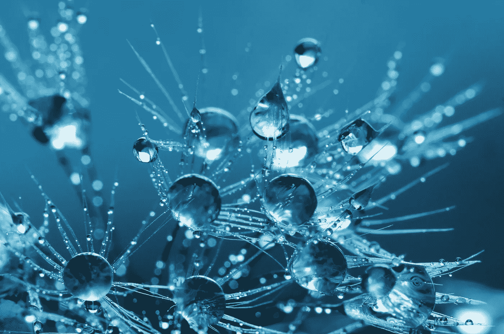
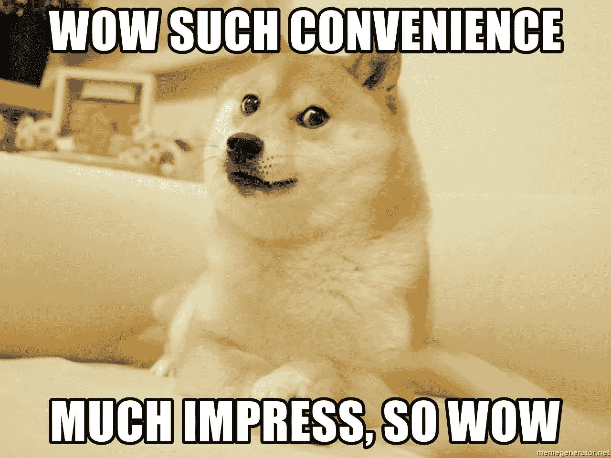
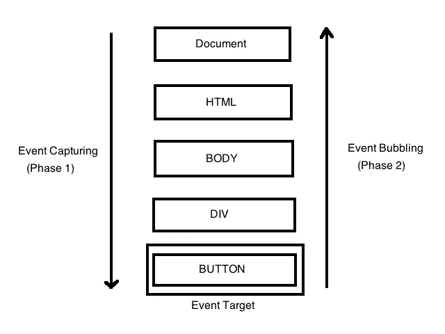
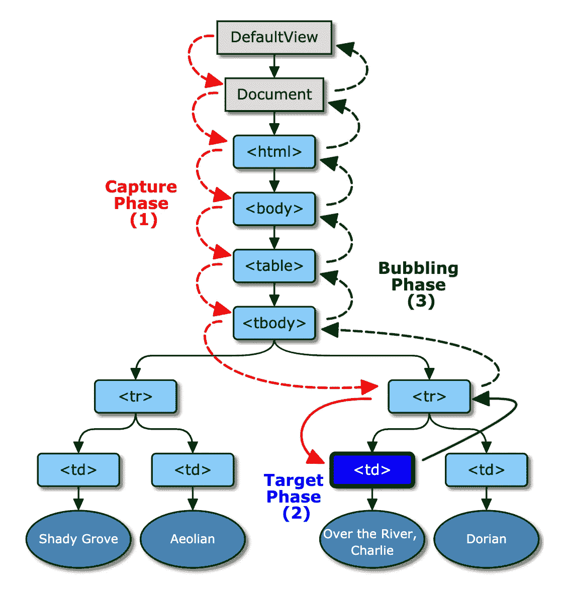
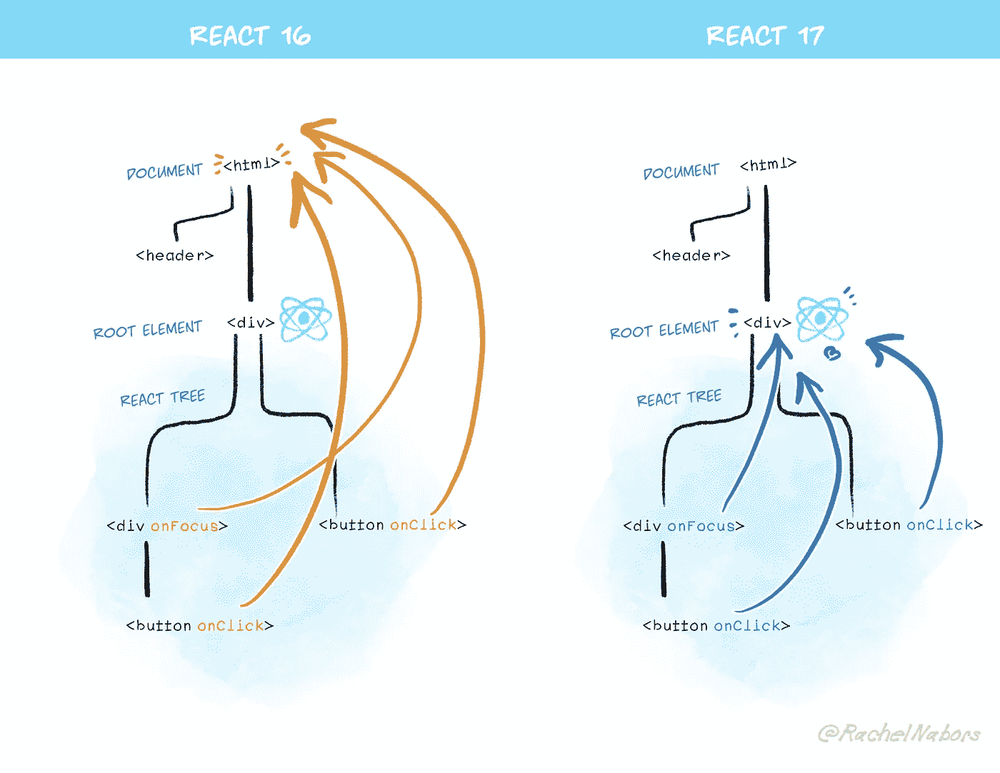

# 大师轻松应对:像专家一样理解事件

> 原文：<https://javascript.plainenglish.io/master-react-with-ease-understand-event-bubbling-like-a-pro-part-1-8389644dca34?source=collection_archive---------6----------------------->

## 了解什么是事件冒泡以及如何在 React 应用中防止它——第 1 部分

Photo by [Anthony](https://www.pexels.com/@inspiredimages?utm_content=attributionCopyText&utm_medium=referral&utm_source=pexels) from [Pexels](https://www.pexels.com/photo/clear-water-drops-132477/?utm_content=attributionCopyText&utm_medium=referral&utm_source=pexels)

欢迎来到《轻松应对大师》，这是一个系列节目，旨在帮助你以一种超级清晰易懂的方式理解《❤》

我会教你**所有你需要知道的**关于**事件冒泡**的事情，这样你就可以开始在你的项目中应用你在这里学到的东西了！

今天您将学到的内容:

*   **✨** [**什么是事件委派？(+它与事件冒泡的关系)**](#549c)
*   **✨**t20**什么是事件冒泡？**
*   **✨**[**JavaScript 中事件冒泡是如何发生的**](#2602)
*   **✨** [**事件冒泡是如何在反应中发生的**](#b4b2)
*   **✨** [**如何阻止事件在你的组件中冒泡(附实例)**](#ab13)

# 什么是事件委托？

长话短说，事件委托就是**一种强大的 JavaScript 技术，允许更有效的事件处理。**

**👍优点(将进一步详细解释):**

*   这种技术通常被认为是高性能的，因为在顶级父元素上只使用了一个事件侦听器函数，而不是每个子元素都使用一个。

**👎缺点(将进一步详细解释):**

*   一旦内部子元素的事件被调用，它上面/下面的所有元素也将被调用(冒泡/捕获)。为了阻止这种情况发生，必须调用`event`对象上的方法。
*   本主题的第 2 部分将进一步详细解释其他问题。

**冒泡**和**捕获**(稍后解释)允许我们实现事件委托模式。

# **什么是事件冒泡？**

假设我们认识一个叫`Molly`的女孩，她也不是一个真实的人，而是——🥁drum·罗尔——**一个 React 组件！哇！如此方便！**

generated via [https://memegenerator.net/](https://memegenerator.net/)

她有一个单亲家长`div`，有一个`onClick`事件处理程序，当点击它时——把每个人叫到桌子旁吃她的食物。

然后在这个父元素`div`中有几个子元素`button`——当被点击时创建一个虚拟的食物项目(即。【T2 氏】。

这是当你点击每一个时发生的事情:

Gif by [Mariya Diminsky](https://media.giphy.com/media/eEVi5aB0WIv7rCTlhV/giphy.gif)

正如你所看到的，这种情况发生在每个孩子身上:

1.  首先，按钮的事件处理程序被触发。
2.  **其次，父 div 的事件处理程序被触发**。

在大多数情况下，您可能只想在单击按钮时调用按钮的事件处理程序。然而，正如您所看到的，父事件也被触发了！？

这叫做 **✨Event Bubbling✨** 。

在接下来的几节中，我将讨论到底发生了什么以及我们如何解决它！

# **JavaScript 中事件冒泡是如何发生的**

## ℹ️为什么会存在？

JavaScript 创建**事件传播**模式的目的之一是让从一个源(父元素)捕获事件变得更容易，而不是在每个内部子元素上设置一个事件处理程序。

## ℹ️事件传播触发顺序

事件传播经历了**三个阶段**:

Image from [https://ehsankorhani.com/](https://ehsankorhani.com/)

1.  **🟢捕获阶段** —当事件被实际触发时，这是**第一阶段**。这个事件首先通过最顶层的事件“捕获”或传播，即。`window`对象，然后是`document`，在`html`元素之后，然后是最里面的元素。**一直往下，直到到达** `event.target` **(你点击的/事件触发的)。**
2.  **🟢目标阶段**—**第二阶段**是我们到达`event.target`的时候。例如，当用户点击一个按钮时，**这是实际的按钮元素。**
3.  **🟢鼓泡阶段**—**第三阶段**。这个事件从`event.target`开始，**向上传播，直到它再次到达顶层父节点**(尽管顶层父节点的事件不再被调用)。

*请注意:虽然有 3 个主要阶段，但目标阶段实际上没有单独处理。捕获和冒泡阶段的事件处理程序都在这里触发。*

*从技术上讲，还有另一个阶段叫做“无阶段”,即没有事件发生的阶段。您可以通过* `[*event.eventPhase*](https://developer.mozilla.org/en-US/docs/Web/API/Event/eventPhase)` *访问元素处于哪个阶段。*

**考虑你刚刚学到的内容，看看下面的例子。**

假设用户点击了`table`中的`td`元素。**这里事件传播是如何发生的？🤔花点时间想一想。**

**这是实际发生的事情，按照刚才提到的顺序:**

*请注意:* `*DefaultView*` *这里的* `*Window*` *会是对象。*

Image by [https://www.w3.org/](https://www.w3.org/)

# React 中事件冒泡是如何发生的

另一方面 React 创造了一个叫做 [**的东西**](https://reactjs.org/docs/events.html) 。

这些只是浏览器事件对象的包装器。基本的用例是相似的，包括像`stopPropagation`和`preventDefault`这样的方法(我将在后面讨论)——最大的好处是它们在不同的浏览器上工作是一样的。

React 不将事件处理程序附加到节点，而是附加到文档的根。当事件被触发时，React 首先调用适当的元素(即。目标阶段(您单击的元素)，然后它开始冒泡)。

为什么 React 会这样做，而不是像原生 DOM 那样简单地处理事件？

Gif by [Giphy](https://giphy.com/gifs/hayley-mills-the-trouble-with-angels-AqlX1TY49hTS8/links)

## **ℹ️** 浏览器一致性

重要的是，事件在所有浏览器中的工作是相同的。React 创建的合成事件，以确保属性在不同的浏览器和平台之间保持一致。

**当一个事件在一个浏览器中运行，但另一个浏览器中的用户使用你的应用程序时，你不会想创建一个应用程序，它将不再运行** —这是一个糟糕的用户体验**。**

## **ℹ️从你实际想要从**触发的元素触发

设置事件处理程序的地方就是打算调用它的地方——在那个特定的元素上，而不是在其他地方(当然，为了首先理解基本概念，我在这里暂时忽略一些边缘情况)。

**那个事件最了解它所设置的元素，所以它应该是第一个触发的。之后，随着事件传播越来越高，上面的每个元素知道的越来越少。**

以我们之前的`Molly`组件为例。我知道你很想她，所以她又来了:

Gif by [Mariya Diminsky](https://media.giphy.com/media/eEVi5aB0WIv7rCTlhV/giphy.gif)

🤔你有没有注意到当一个按钮被点击时，按钮上的事件处理程序首先被调用，然后父事件处理程序才被调用？

它从来没有发生在相反的(即。捕获阶段永远不会被触发)。

**这是因为 React 的合成事件只使用冒泡阶段(此处包含目标阶段)。**如果目的是关注首先触发事件的`event.target`(本例中的按钮)，这是有意义的。

请记住，React 只是用这些**合成事件**模拟 JavaScript 的本机冒泡和捕获阶段，这就是为什么随着时间的推移，您可能会注意到一些差异(在本主题的第 2 部分中会进一步解释)。

**⚠️合成事件**本身并不关注捕捉阶段，除非您专门将其设置为。要触发捕获阶段，只需将父`div`的事件处理程序`onClick`设置为`onClickCapture`:

**注意，下面触发的不是冒泡阶段，而是捕获阶段:**

Gif by [Mariya Diminsky](https://giphy.com/gifs/BETT2abn9nJdSjenq4)

**⚠️**

现在，在 React 版本 17+中，事件处理程序只能到达`root`元素。

Image by [React](https://reactjs.org/blog/2020/08/10/react-v17-rc.html)

# **如何停止组件中的事件冒泡**

现在你已经理解了**事件传播**、**事件冒泡**和**事件捕获**的核心概念，让我们讨论一下如何修复我们最初的问题。

您有一个按钮(或其他元素),并且您只想触发按钮的事件处理程序——不应该触发其他父级！

🤔那么，我们如何才能阻止这种情况发生呢？您有几个选择:

## *ℹ️事件*。停止传播()

这将阻止任何父组件的事件触发。要使用它:

1.  确保将`event`对象作为参数传递。
2.  在事件处理函数中，对代码上方的事件对象使用`stopPropagation`方法。

注意:请注意，我将父代的`div`从`onClickCapture`改回了`onClick`:

上面我只给`handleCookEggs`函数添加了`stopPropagation`。所以当点击`Cook Eggs`按钮时，注意它只为那个元素触发那个事件！

## ℹ️事件. stop immediate 传播()

假设在同一个元素上有多个事件。如果你使用`event.stopPropagation()`，肯定会阻止任何父事件触发，但是如果你在同一个元素上有多个事件，它们仍然会被触发。

为了防止同一元素上的其他事件触发，请使用`event.stopImmediatePropagation()`来代替。它将阻止父事件和相同元素事件触发。

如果你处于`event.stopPropagation()`对你不起作用的情况，试试`event.stopImmediatePropagation()`吧。

*注意:有时你的应用程序中可能会有第三方库，导致前者无法工作。当然，看看是什么导致后者工作而不是前者，这仍然是一个好主意，可能会给你另一个解决问题的线索。*

## ℹ️事件.预防默认()

根据事件处理程序和元素，您可能希望使用此。

例如:

*   如果您有一个表单，并且不想在提交时刷新页面。
*   您正在设置自己的路线功能，并且不想刷新页面。

你已经完成了**的第 1 部分，像**大师轻松应对**系列中的专家**一样理解事件冒泡！耶！

Gif from [Giphy](https://media.giphy.com/media/SVs0cQ0nLRsLNUadmn/giphy.gif)

现在你知道了:

*   **事件委托意味着什么，事件冒泡和事件捕获是如何工作的。**
*   **事件传播在 JavaScript 和 React 中的不同工作方式。**
*   你对 React 中事件处理的好处和注意事项有了更好的理解。
*   有几种方法可以用来解决你特殊情况下可能出现的问题。

**的第 2 部分像专家一样理解事件冒泡**深入探讨了事件传播的更多注意事项，包括一个重要的边缘案例。第 1 部分应该足以开始在您的应用程序中实现它，但如果您想了解更多细节，请务必查看第 2 部分！

**✨🥰如果你喜欢这篇文章，并且想了解更多关于各种 React 主题的信息，请关注以下内容以获取最新更新🎉**

*更多内容尽在*[***plain English . io***](http://plainenglish.io/)