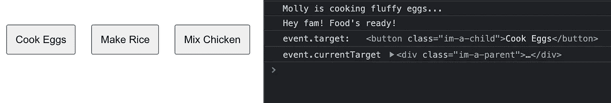
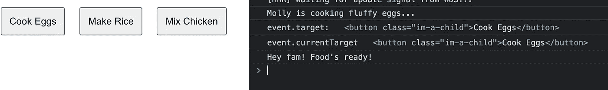
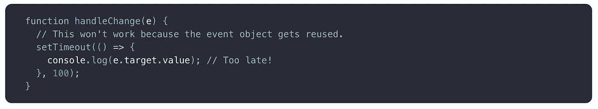
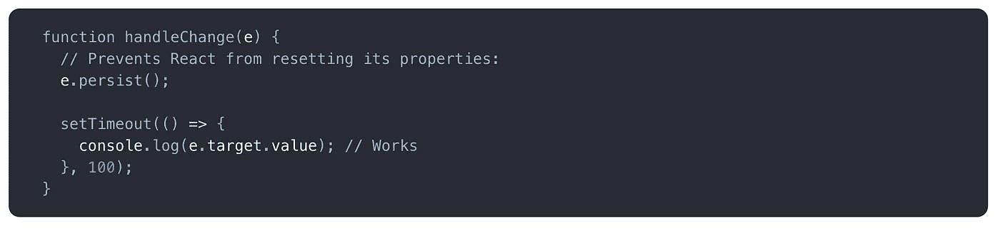
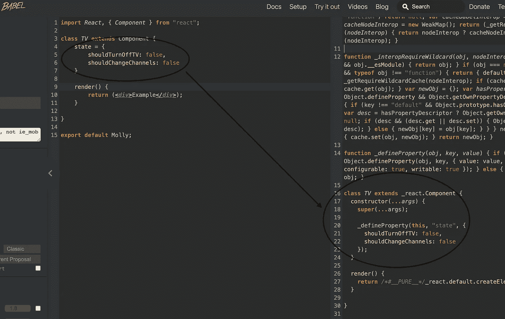

# 大师轻松应对:像专家一样理解事件

> 原文：<https://javascript.plainenglish.io/master-react-with-ease-understand-event-bubbling-like-a-pro-part-2-62870b0ac1a2?source=collection_archive---------15----------------------->

## 第 2 部分——了解更多关于事件冒泡的知识以及一个特殊的边缘案例！

Image by [PixaBay](http://pixabay.com)

**欢迎来到《轻松应对大师》**，这是一个系列节目，旨在帮助你以一种超级清晰易懂的方式理解《❤》

在**像专家一样理解事件冒泡的第 1 部分中，**您学习了**所有您需要知道的关于**事件冒泡**的知识，以便立即开始在您的项目中应用它！**

在第 2 部分**像专家一样理解事件冒泡**中，我将分享更多的提示和技巧，以及如何处理下一个 React 应用中很可能出现的边缘情况！让我们开始吧！

今天，您将了解:

*   **✨** [**事件.目标 vs 事件.当前目标**](#dfc9)
*   **✨** [**实际更新的事件触发顺序和 JavaScript 中的 useCapture 参数**](#1601)
*   **✨** [**哪些事件没有泡沫，是如何处理的？**](#cd10)
*   **✨** [**事件监听器在 React 版本 16 及之前 VS 版本 17+**](#d399)
*   **✨** 

# **事件.目标 vs 事件.当前目标**

理解`Event`对象上这两个目标属性之间的区别真的可以让你以后不再头疼。

**记住:******触发事件**的 **元素与附加了事件监听器的**元素并不总是**相同。****

****🤔迷茫？别担心，让我和他们一起度过这一关。****

**Gif by [Giphy](https://media.giphy.com/media/lT9Y1nrHdZWX9QoSH0/giphy.gif)**

**让我们以前面第 1 部分中的例子**为例，像专业的**和`console.log`一样理解父 div 事件处理程序中的`event.target`和`event.currentTarget`事件冒泡。**

**现在，当我们点击`Cook Eggs`按钮时，我们会看到什么？**

****

**Image by Mariya Diminsky(me)**

**注意父 div 的事件处理程序知道**预期的** `target` **是** **按钮**。**

****但是** —因为我们正在检查父事件处理程序中的**，我们看到父 div 是`currentTarget`。****

**好吧，让我们深入研究一下。**

**如果我们使用相同的`console.log`并在实际的**按钮的事件处理程序**中进行检查会怎么样？**

**🤔我们现在会看到什么？**

****

**Image by Mariya Diminsky(me)**

**注意，由于我们现在正在检查**按钮的事件处理程序**内部，我们看到`currentTarget` **已经变成了按钮**。**

**当然，由于我们正在点击按钮，我们已经知道`target`将再次成为`button`。**

**考虑到您刚刚学到的内容，现在您知道:**

**`ℹ️ event.target`是导致事件的**嵌套最深的元素。****

**`ℹ️ event.currentTarget`是 **监听事件**的**元素(事件监听器附加于此)。****

# ****实际更新的事件触发顺序和 JavaScript 中的 useCapture 参数****

**在 JavaScript 中,`EventTarget.addEventListener`将用于为事件添加一个处理程序。**

**当我们看一下 [MDN 文档](https://developer.mozilla.org/en-US/docs/Web/API/EventTarget/addEventListener)时，我们看到您可以在`options`对象中可选地设置`capture`，或者通过`useCapture`参数(现在也是可选的)，这做同样的事情。**

**⚠️这是因为除非你特别设置，否则捕获阶段将被忽略，取而代之的是，**只有冒泡阶段(在目标阶段之后)会在 JavaScript 中被本地触发**。MDN 也解释了这一点:**

> **对于附加到事件目标的事件侦听器，事件处于目标阶段，而不是捕获和冒泡阶段。“捕获”阶段的事件侦听器在任何非捕获阶段的事件侦听器之前被调用。**

***请注意:* `*useCapture*` *参数在旧版浏览器中并不总是可选的。确保在实施之前检查*[*【caniuse.com】*](https://caniuse.com/?search=usecapture)*。***

# ****哪些事件不冒泡，如何处理？****

**虽然大多数事件都是泡沫化的，但你知道有几个不是吗？**

**Gif by [Giphy](https://giphy.com/gifs/no-nope-bounce-T5QOxf0IRjzYQ)**

****这里有一些本地 JavaScript 的例子:****

*   **[模糊](https://developer.mozilla.org/en-US/docs/Web/API/Element/blur_event) ( [聚焦](https://developer.mozilla.org/en-US/docs/Web/API/Element/focusout_event)是一样的，但实际上是冒泡)。**
*   **[focus](https://developer.mozilla.org/en-US/docs/Web/API/Element/focus_event)([focus in](https://developer.mozilla.org/en-US/docs/Web/API/Element/focusin_event)是一样的，但它实际上是冒泡的)。**
*   **[mouse leave](https://developer.mozilla.org/en-US/docs/Web/API/Element/mouseleave_event)([mouse out](https://developer.mozilla.org/en-US/docs/Web/API/Element/mouseout_event)是一样的但是实际上是冒泡的)。**
*   **[鼠标进入](https://developer.mozilla.org/en-US/docs/Web/API/Element/mouseenter_event) ( [鼠标悬停](https://transang.me/everything-about-event-bubbling/mouseover)是相同的，但它实际上冒泡)。**
*   **[加载](https://developer.mozilla.org/en-US/docs/Web/API/Window/load_event)，[卸载](https://developer.mozilla.org/en-US/docs/Web/API/Window/unload_event)，[中止](https://developer.mozilla.org/en-US/docs/Web/API/HTMLMediaElement/abort_event)，[错误](https://developer.mozilla.org/en-US/docs/Web/API/Element/error_event)，[卸载前](https://developer.mozilla.org/en-US/docs/Web/API/Window/beforeunload_event)。**

**⚠️:当 `[Event](https://developer.mozilla.org/en-US/docs/Web/API/Event/Event)` [被创建](https://developer.mozilla.org/en-US/docs/Web/API/Event/Event)时，确实冒泡的事件在`bubbles`选项[上设置了`true`——尽管它们仍然经过捕获阶段。](https://developer.mozilla.org/en-US/docs/Web/API/Event/Event)**

# ****React 版本 16 和 VS 版本 17+之前版本中的事件侦听器****

**正如您在第 1 部分**中了解到的，像专业人员一样理解事件冒泡——React 的** **合成事件并不总是像它们的本地 JavaScript 对等物一样工作。****

**让我们了解一下这些差异以及 React 版本之间的变化。**

## **ℹ️事件你不会料到泡泡会有什么反应**

**例如，你可能会认为 React 的`onBlur`和`onFocus`不会冒泡，因为 JavaScript 的本地等价物不会冒泡，对吗？然而 React 故意让这些事件继续冒泡。**

**⚠️虽然 React 版本 17 对某些事件做了一些改变，比如 T5 不再冒泡，但大多数事件仍然继续冒泡。**

**参见[这个答案](https://stackoverflow.com/questions/34926910/onfocus-bubble-in-react)和[这篇文章](https://www.quirksmode.org/blog/archives/2008/04/delegating_the.html)了解更多关于这个话题的细节。**

## **`ℹ️ event.target.value`曾经在异步函数中无效**

**在 React 版本 17 之前，**如果你试图访问一个异步函数中的事件，你会注意到它是未定义的**。**

**这是因为 React 的**合成事件**对象被池化了——这意味着在事件处理程序被调用后，**您将不再能够访问它们，因为它们将被重置并放回池中。****

**Gif by [Giphy](https://giphy.com/gifs/NsZbrSS0miha0/links)**

****

**Image from [React](https://reactjs.org/docs/legacy-event-pooling.html)**

**显然，这给需要在稍后时间访问该事件中的信息**的**异步函数**带来了问题。****

**⚠️在异步函数中保存这些信息的唯一方法是调用`event.persist()`:**

****

**Image from [React](https://reactjs.org/docs/legacy-event-pooling.html)**

**这样做的**意图**是为了**提高性能**，但是经过更仔细的检查，React 的团队发现这只是**迷惑了开发者**而**实际上** **并没有真正提高性能**所以它完全被废弃了。**

**随着 **React 版本 17** 的发布， **React 不再池化合成事件对象，所以你可以期望在你的异步函数**中接收预期的 `**event.target.value**` **，而不需要`event.persist()`。****

**请务必在这里阅读更多关于本次更新[的信息。](https://reactjs.org/blog/2020/08/10/react-v17-rc.html#no-event-pooling)**

# ****特殊边缘案例:如果你也需要一个外亲来火呢？****

**让我们利用你在第 1 部分学到的一切，像专家一样理解事件冒泡，在你的下一个 React 应用中修复一个特殊的边缘情况！**

****🤔假设我们希望在我们的应用程序中有这两个工作:****

1.  **当用户点击内部 div/按钮等时。元素，我们希望只触发该事件(或者在下面的例子中，在电视上换频道)。**
2.  **当用户单击外部父 div 时，将触发该父 div 的事件。(这可能对弹出模式有用。当用户在模式外单击时，您希望弹出窗口关闭——或者在下面的例子中，电视重新打开。**

**目前，您知道如果您单击父/子元素，React 的**合成事件**系统将触发冒泡。**

**你也知道要阻止这一切我们可以使用`event.stopPropagation()`。**

**但是我们现在进退两难。**

**如果您希望一个事件处理程序在一种情况下触发(我们的#1)，而另一个事件处理程序在另一种情况下触发(#2)，该怎么办？**

**⚠️:如果我们使用`event.stopPropagation()`，它将阻止一个事件处理程序触发，但这样你将永远无法在另一种情况下调用另一个事件处理程序。我们如何解决这个问题？**

**为了解决这个问题，让我们利用 React 的状态模式！**

***请注意:我在这里使用了箭头函数，所以* `*bind*` *ing 状态是不必要的。如果你不确定这意味着什么，请随意阅读我写的关于这个话题的另一篇文章* [*这里*](https://medium.com/free-code-camp/learn-es6-the-dope-way-part-ii-arrow-functions-and-the-this-keyword-381ac7a32881) *。***

****ℹ️下面我已经包括了一个 React 类组件版本和一个 React 钩子版本——你喜欢哪个就用哪个。请务必仔细阅读评论:****

**Example written as a Component Class**

**Example written as a Functional Component utilizing React Hooks**

****🤔下面是我们运行代码时发生的情况:****

**Gif by [Mariya Diminsky](https://giphy.com/gifs/WsHmCK3B52FzQkl80s)**

1.  **当我们点击`Change Channel`时，频道增加。请注意，其他两个事件处理程序不运行。**
2.  **当我们单击`Turn Off TV`时，UI 会改变，如果我们试图单击父 div 之外的任何地方，其他两个事件处理程序不会运行。**
3.  **当我们在电视关闭的情况下单击外部父 div 时，只有一个事件处理程序在运行。**

***请注意:在我上面的例子中，我使用的是* `*state = {}*` *而不是* `*constructor(){...}*` *，因为当* `*Babel*` *(一个 JavaScript 编译器)转换你的 React 代码时，它会吐出一个* `*constructor*` *以及里面的所有内容。如果你知道这一点，可以随意跳过下图:***

****

**Screenshot by Mariya Diminsky taken from [Babel](https://babeljs.io/)**

## **更简单的修复方法！**

**这是解决问题的一种方法，但是还有一个更简单的方法！**

**只需检查事件处理程序内部的`target`(点击的内容)是否与`eventTarget`(监听事件的事件处理程序)相同。**

**如果是一样的，那你就直接叫`stopPropagation`好了！下面是一个简单的例子:**

**你已经完成了**的第 2 部分，像**大师轻松应对**系列中的专家**一样理解事件冒泡！耶！**

**Gif by [Giphy](https://media.giphy.com/media/SVs0cQ0nLRsLNUadmn/giphy.gif)**

**现在你知道了:**

*   ****`Event.target`**和** `Event.currentTarget` **的区别以及被触发的事件并不总是与附加了事件监听器的事件相同。******
*   ******事件传播在现代 JavaScript 中是如何发生的，如果需要使用捕获阶段，如何使用** `useCapture` **参数。******
*   ******你知道了不是所有的事件都会在本地 JavaScript 中冒泡，它们的一些别名也会冒泡。******
*   ******您还了解到，几乎所有 React 的合成事件(除了 React 版本 17 中的一些更新)都会冒泡。******
*   ******最后，您现在更好地理解了如何利用 React state 来处理外部父类需要触发而不停止其他事件处理程序的边缘情况。******

******更多资源/延伸阅读:******

*   ****https://www.youtube.com/watch?v=Q6HAJ6bz7bY****
*   ****【https://javascript.info/bubbling-and-capturing ****
*   ****[https://www.w3.org/TR/uievents/](https://www.w3.org/TR/uievents/)****
*   ****[https://Chris RNG . svbtle . com/event-propagation-and-event-delegation](https://chrisrng.svbtle.com/event-propagation-and-event-delegation)****
*   ****[https://jsbin.com/hilome/edit?js,output](https://jsbin.com/hilome/edit?js,output)****

******✨🥰如果您喜欢这篇文章，并且想了解更多关于 React 主题的信息，请关注以获取最新更新🎉******

*****更多内容看* [***说白了. io***](http://plainenglish.io/)****