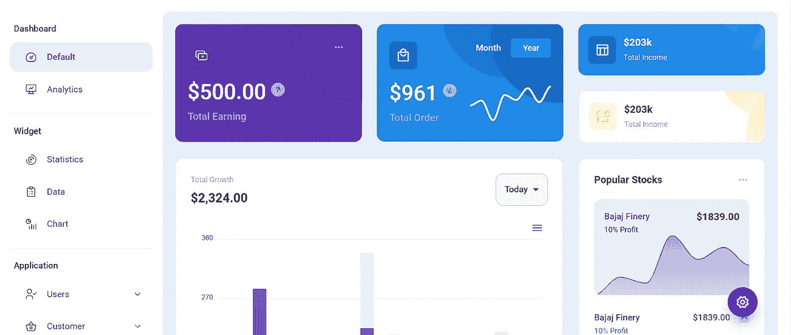

# 炫耀技能的同时掌握 Web 开发:5 个最佳基于项目的教程

> 原文：<https://javascript.plainenglish.io/master-web-development-while-showing-off-your-skills-5-best-project-based-tutorials-7a5ef044e9c5?source=collection_archive---------10----------------------->

## 通过这 5 个基于项目的教程，在掌握 web 开发的同时，作为初级开发人员构建您的作品集。

Photo by [Lala Azizli](https://unsplash.com/@lazizli?utm_source=medium&utm_medium=referral) on [Unsplash](https://unsplash.com?utm_source=medium&utm_medium=referral)

我免费开始了我的 web 开发之旅。

但是如果我没有项目来展示我的技能，这是没有用的。因此，为了提高、学习和展示我的技能，我继续创造了许多项目。

创建项目是学习和展示技能的好方法。而且对于初级开发人员或者初级开发人员找工作或者工作特别有帮助。

因此，我将为你们提供一些非凡的项目，你们可以建立和学习。

> 注意:在这里我将为你提供一些很酷的东西，我不是说只是复制和粘贴的东西。总是试图理解背后的概念。了解它的实现方式。
> 
> 我认为你可以通过实现它来更容易地学习。
> 
> 最后，这些项目不是我的，它们是由一些专家开发人员创建的，我在这里分享。
> 
> 就是这样。

# 我们将学习创造什么？

1.  投资组合网站
2.  具有 CRUD 功能的博客网站
3.  用 Firebase 克隆 Amazon
4.  社交媒体反应应用
5.  反应管理仪表板

那我们开始吧。

# 1.投资组合网站

Photo by [Ben Kolde](https://unsplash.com/@benkolde?utm_source=medium&utm_medium=referral) on [Unsplash](https://unsplash.com?utm_source=medium&utm_medium=referral)

作品集网站是你在学习网站开发时必须创建的最主要、最关键的项目之一。

现在，向网络世界公开自己的身份是每个人的法定项目之一。

投资组合对你来说至关重要

1.  雇主可以更了解你和你的项目，专业知识，工作经验等。
2.  公司可以看到你的个人资料。
3.  开发者可以更了解你，以便合作。

还有很多。

那么尼廷，我们如何才能创造它呢？

[这里的](https://youtu.be/r_hYR53r61M)是一个简单的 YouTube 视频，将帮助您创建一个投资组合网站和在 AWS(亚马逊网络服务)的部署。

使用的技术: **HTML、CSS、JavaScript 和 AWS。**

【https://github.com/divanov11/portfolio-website】源代码 : [源代码](https://github.com/divanov11/portfolio-website)

# 2.博客网站

Photo by [Anete Lūsiņa](https://unsplash.com/@anete_lusina?utm_source=medium&utm_medium=referral) on [Unsplash](https://unsplash.com?utm_source=medium&utm_medium=referral)

实际上，我已经尝试了几种方法来为自己创建一个博客。无论是使用 MERN(MongoDB、Express、React 和 Node)堆栈还是 WordPress。

创建一个 WordPress 博客并不难，但我想从头开始实现它，并学习 CRUD(创建、读取、更新和删除)操作。

但是我还没有一个很好的教程来从头开始创建它。

最近，Lama Dev 创建了一个博客网站来帮助 Web 开发人员。我真的很喜欢它。

我想和 MERN·斯塔克一起创建一个博客网站，拉马·德夫帮助了我。

教程分为 3 部分，[第一部分](https://youtu.be/tlTdbc5byAs)创建前端，[第二部分](https://youtu.be/OML9f6LXUUs)创建后端，[第三部分](https://youtu.be/LelifxOrzvw)连接前端和后端。

从字面上看，你会学到很多东西。

使用的技术: **React，Node，Express，和 MongoDB。**

**源代码:**[https://github.com/safak/youtube/tree/mern-blog-app](https://github.com/safak/youtube/tree/mern-blog-app)

# 3.用 Firebase 克隆 Amazon

Photo by [Christian Wiediger](https://unsplash.com/@christianw?utm_source=medium&utm_medium=referral) on [Unsplash](https://unsplash.com?utm_source=medium&utm_medium=referral)

创建像亚马逊这样的电子商务商店就像做梦一样。

聪明的程序员帮助我们为你创建一个。

**您将学习构建什么？**

完整的电子商务功能应用程序与帐户和登录页面，产品页面，购物车和结帐页面，真正的支付，以及订单历史页面。

[这里的](https://youtu.be/RDV3Z1KCBvo)是一个简单的 YouTube 视频，将帮助你创建亚马逊克隆。

[这里的](https://medium.com/cleverprogrammer/amazon-clone-using-react-the-ultimate-guide-fba2b36f3458)也是这方面的书面指南。

使用的技术: **React，Firebase 等**。

# 4.社交媒体反应应用

Photo by [Sara Kurfeß](https://unsplash.com/@stereophototyp?utm_source=medium&utm_medium=referral) on [Unsplash](https://unsplash.com?utm_source=medium&utm_medium=referral)

到目前为止，我们已经学会了创建一个投资组合网站，博客网站，甚至电子商务网站。

但是我们也使用社交媒体。

所以，为什么不学习创建一个社交媒体应用程序呢？

在这里，卡尔·哈德文教我们创建一个 Instagram 克隆。它实际上是一个 12 小时长的视频，可以帮助你学习很多概念。

**你将学会创造什么？**

登录、注册、仪表板(查看/喜欢/评论照片)和用户资料。

您甚至将学习将它部署到 Vercel。

使用的技术: **React，Firebase，Tailwind CSS，LoadTest，Lighthouse，Vercel，React 测试库，和 Cypress E2E 测试。**

**源代码:**[https://github.com/karlhadwen/instagram](https://github.com/karlhadwen/instagram)。

# 5.反应管理仪表板

我创建了大部分主要项目来学习几个概念。在那之后，我从一家创业公司获得了一个项目，为他们创建一个仪表板。

我已经轻松地创建了它，但为此，我必须花很多时间来学习 apex chart、chart.js 和其他类似的图表文档，以便在仪表板中创建不同的图表。

有时候后来找了个视频轻松创作。

再一次，Lama dev 通过创建一个管理仪表板帮助我掌握了一些新概念。

他真的教会了我很多概念，多亏了他。

使用的技术: **React，Material-UI，Chart。**

源代码:【https://github.com/safak/youtube/tree/react-admin 

# 让我们结束吧

我写过所有与 Web 开发相关的东西，比如 [80+免费资源](/80-free-resources-for-web-designers-and-web-developers-in-2021-f400be2875ea)、[YouTube 12 大频道](https://medium.com/code-blog/top-12-youtube-channels-every-web-developer-should-follow-4b5a4f6ee1e4)、 [11 个让我的生活更简单的 Web 开发工具](/11-web-development-tools-i-use-every-day-because-they-make-my-life-easier-54ede59743c2)等等

但是我没有写过关于创建项目的文章，这就是。

我花了很多时间和精力向我的读者提供有价值的项目。所以请大家分享，鼓掌，甚至跟我来。这将有助于我今后写更多这类内容。

谢了。

 [## 一个有 30 多年经验的程序员教给我的 8 条人生经验

### 就连千禧一代也在放弃六位数的技术工作。

javascript.plainenglish.io](/8-life-lessons-a-programmer-with-30-years-of-experience-taught-me-2a9fb090a398)  [## 我每天都在使用的 11 个 Web 开发工具，因为它们让我的生活变得更加轻松

### 他们也一定会为你做同样的事情。

javascript.plainenglish.io](/11-web-development-tools-i-use-every-day-because-they-make-my-life-easier-54ede59743c2)  [## 停止使用 Redux 和 Easy Peasy——考虑 React Context

### 对于较少的样板代码，请使用此选项

javascript.plainenglish.io](/stop-using-redux-and-easy-peasy-consider-react-context-instead-8b653f909d00) 

*更多内容请看*[***plain English . io***](http://plainenglish.io/)