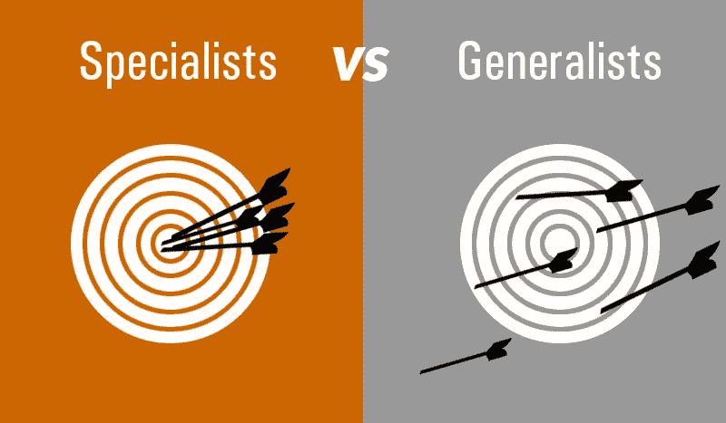
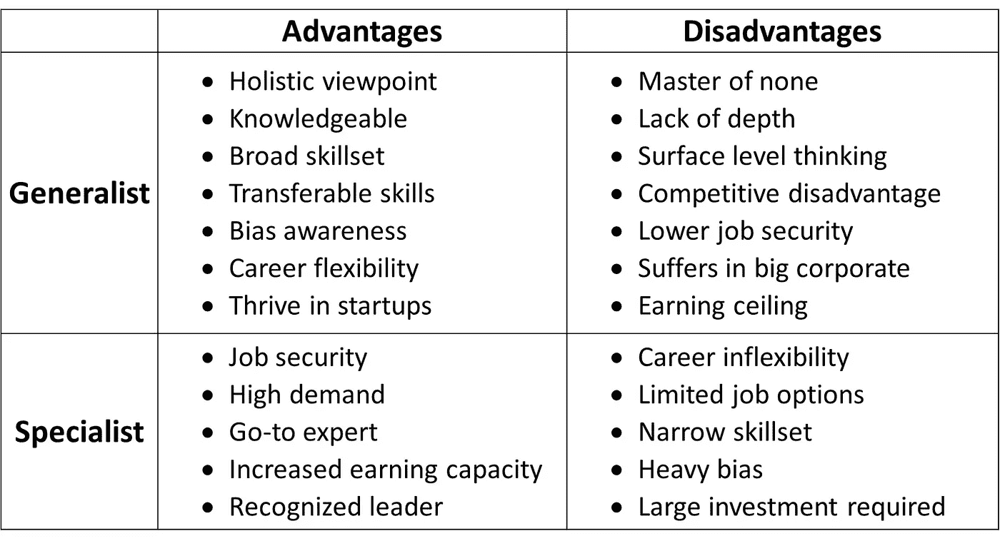
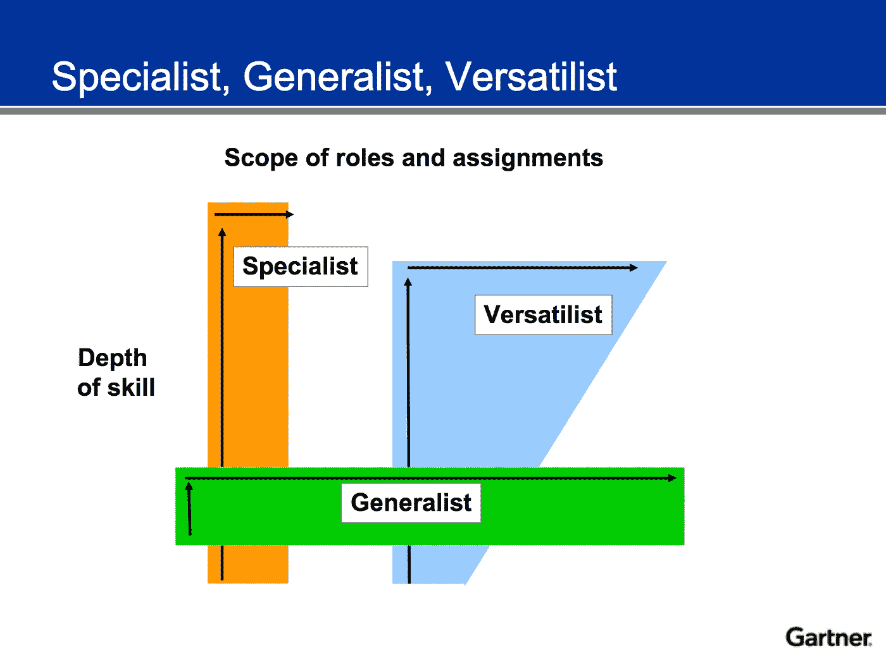

# 掌握利基市场与智能通才——我希望作为一名软件工程师能知道的 5 件事(第 5/5 部分)

> 原文：<https://javascript.plainenglish.io/mastering-a-niche-vs-smart-generalist-5-things-i-wish-i-knew-as-a-software-engineer-part-5-5-7c835a31ad22?source=collection_archive---------12----------------------->

如果您错过了这个由 5 部分组成的系列中的最后一部分，您可以在: [**关键点 4——沟通&协作——作为软件工程师我希望知道的 5 件事**](https://anandsafi.medium.com/communicate-collaborate-5-things-i-wish-i-knew-as-a-software-engineer-part-4-5-4ee303cd764a)

所有 5 个关键特征都可以在本文中找到 [**。**](http://%20https//link.medium.com/c3RhPQcQzcb)

老实说，这一直是我软件工程职业生涯中最具挑战性的话题之一，我相信对许多其他人来说也是如此。 ***真的没有对错之分*** ，最终的方向将取决于你的喜好、兴趣和运作方式。

我将尝试在下面强调每一方的关键特征。此外，在最后还有一个额外的好处，我想分享一种混合的方法，我个人更喜欢这种方法(在后面的中会有更多的描述)。

> 多面手——也被称为“万事通，无所不知”
> 
> 专科医生——也称为“T 形”，即在特定的利基市场垂直成长

Generalists vs Specialists

总体而言，**多面手**可以从更广阔的视野、更多的可支配技能以及在转移工作时容易转移的技能中受益。另一方面，对于**专家**来说，他们可能只是表面上掌握了许多技能，但由于缺乏深度而一无所知，反之亦然。

在通才与专家的辩论中，我想强调的一个方面是*职业发展与成长*。我认为与每个角色相关的一个关键区别是:

> 多面手——他们 ***本身并没有可以垂直发展的职业阶梯*** 。相反，他们有一面职业攀岩墙，让他们有机会改变方向，根据自己的意愿、加速增长的心态和舒适程度，向上、向下、向左、向右移动。
> 
> 专家——他们在大多数情况下都有明确的职业阶梯。道路可能看起来更窄，有精确的焦点和锁定，但总有**一个坚实的下一个阶段在望。**

# ⭐ **奖金** ⭐

正如承诺的那样，我想分享 Gartner 的一个有趣的小新闻。除了通才和专家之外，还有第三类人可以根据情况进行调整，称为 ***范思哲！***

The era of Versatilist

如您所见，*versatilits*可以按需扩展和运行。这正是在软件工程领域流行的 ***【身兼数职】*** 观念。

无论是在某一天跳到一个产品问题上，第二天与设计团队一起头脑风暴下一个产品开发迭代——程序员与开发人员和软件工程师的真正区别取决于这一核心技能。

我个人可以证明，作为一名全能主义者，我对整个 SDLC 和公司使命有着强烈的认同感，增强了我在团队内外的沟通和协作。虽然它非常有价值，但这似乎有一个潜在的负面影响，好像你是"*(我在这里也写了一篇关于这个 [**的单独文章！**](https://anandsafi.medium.com/key-point-1-spreading-too-thin-5-things-i-wish-i-knew-as-a-software-engineer-9eee39b40553) )*

## *感谢阅读！*

## *请随时与我联系: [LinkedIn — Anand Safi](https://www.linkedin.com/in/anandsafi) 。我很想听听你对这个和其他技术话题的想法！*