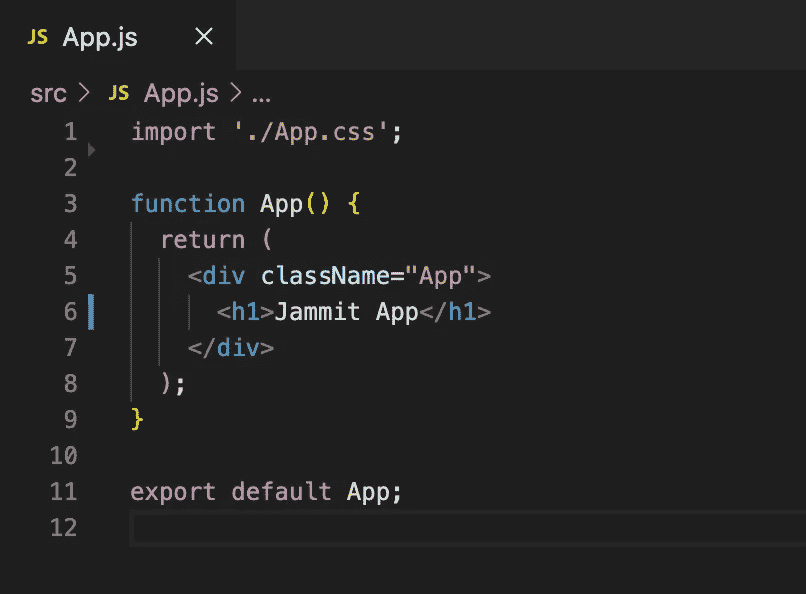

# 掌握创建-反应-应用程序

> 原文：<https://javascript.plainenglish.io/mastering-create-react-app-c75ad3fa8706?source=collection_archive---------5----------------------->

## 这个入门包是自动创建生产就绪的 React 项目的最舒适的方式


Author: [Sarah Pflug](https://burst.shopify.com/@sarahpflugphoto) Copyright: [Burst Some Rights Reserved](https://burst.shopify.com/licenses/shopify-some-rights-reserved)

几年前，我参加了一个前端开发人员职位的招聘过程，其中包括编写一个简单的项目。简报并不复杂，我可以使用任何我想要的编码语言。

在我分娩后，公司安排了一次面试来讨论我的解决方案。我非常自信。我满足了所有的要求，我创建了一个可用的用户界面，我润色了我的代码，因此我对我的解决方案感到非常自豪。

一位资深开发人员和我坐在一起，我的项目在他的笔记本电脑上打开着，他问了第一个问题:你为什么要使用*的服务人员*？

我完全呆住了。我不知道他在说什么。

在我愚蠢地开始了一场毫无头绪的技术面试后，下面的问题也好不到哪里去。

*“这个 App.test.js 文件是干什么用的？”*，面试官问。

*“哦至少这个我知道！”*，我想。*“该文件用于测试目的”*

“那么，你在这个文件中测试什么？”

我没有测试任何东西。就像*服务人员*一样，当我运行`create-react-app`来自动设置我的项目时，那些文件是自动创建的，我开始毫不在意地编码。

面试的其余部分进行得比较顺利。我知道如何回答有关我的编码决策的所有问题，但不幸的是，我已经留下了第一个坏印象。

公司正在寻找知道他们在做什么的开发者。他们不反对使用非官方的设置命令，就像`create-react-app,`的情况一样，幸运的是，他们不需要那些深刻理解如何配置复杂工具的人，比如 *webpack* 或 *Babel* 。但是，他们期望应聘者理解自己的工作，不要独断专行。

那天，我学到了宝贵的一课:我必须深刻理解我的项目的配置。

两年后，我想与你分享一些关于这个主题的知识。

# 什么是 create-react-app？

`create-react-app`是一种自动设置生产就绪的 React 应用程序的方法。它允许开发人员至少在一定程度上避免任何代码项目需要的配置和构建工具。使用它创建一个简单的项目后，升级应用程序的底层基础设施是非常容易的。Angular 项目有一个类似的工具，称为 *Angular CLI。*

# 使用 create-react-app 设置项目

就在最近，我使用`create-react-app`命令创建了一个 React 应用程序，它将作为一个例子来说明我现在如何进行项目配置。

我使用以下命令创建了一个名为 Jammit 的新 React 项目:

```
npx create-react-app jammit
```

该命令自动建立一个开发环境，具有以下文件结构:


File structure of a project created with create-react-app

启动应用程序时，浏览器上会出现一个带有默认登录页面的网页:


React app create with create-react-app running in abrowser

之后，我删除了以下文件列表:

```
- logo192.png- logo512.png- logo.svg- favicon.ico- robots.txt- App.test.js- setupTests.js- index.css- reportWebVitals.js
```

这些文件包括默认生成的网页的徽标和图标、用于测试的文件、一个. txt 文件和一个用于分析应用性能的`reportWebVitals.js`文件。我打算只使用我自己的标志和图标，并开发一些赛普拉斯测试后。因此，我安全地删除了所有列出的文件。

# 了解项目的配置

完成这些步骤后，这就是我的项目结构的样子。


My project’s file structure after deleting unnecessary files

我确保我完全理解了这些文件在我的项目配置中的作用。

## 节点 _ 模块

这个文件夹是 [npm 存储本地安装的包](https://docs.npmjs.com/cli/v6/configuring-npm/folders)的地方。每当我们通过调用“import”语句导入一个新的包时，这个包就会出现在这里。

## index.html

这个`index.html`充当浏览器上提供的主文件的模板。这包括描述页面内容的元数据。

## manifest.json

该文件描述了整个应用程序，包括填充 web 应用程序的图标、颜色、名称等所需的信息。


Medium browser tab, including a title and an icon defined by the manifest.json

## 。gitignore

`.gitignore`指示 git 哪些文件不应该添加到提交中。它通常用于避免提交任何中间对象文件和来自构建文件夹的对其他项目合作者没有用的文件。

此时，我仍处于开发的初始阶段，还没有配置 git 存储库。因此，我不使用这个文件。但是，根据我的经验，它在进一步的开发阶段会很方便，因此，我现在维护它。

## package.json

该文件列出了项目所依赖的包以及项目可以使用的包的版本。

它还包括`react-scripts`，一组来自`create-react-app`包的脚本。基本上，`package.json`包括将`start`、`build`、`test`和`eject`翻译成 react-scripts 版本的相同命令。例如，运行`npm start`将实际运行`react-scripts start`，它设置开发环境并启动服务器。

## 包锁. json

该文件包含项目中使用的包的确切版本。

## README.md

文件包括项目的一般信息，比如描述，如何安装和运行它。在编码项目中，自述文件通常被格式化为 markdown 格式，以便在 GitHub 页面的底部生成 HTML 格式。

## src 文件夹

该文件夹包含源代码。在`src`中，我们可以添加 React 组件、模块、样式文件、中间件等任何东西。

## 索引. js

当用`create-react-app`生成一个 app 的时候，默认的`index.js`包含了很多可选的东西，我在开始编码之前就立刻删除了。下面是我的项目的`index.js`在应用程序创建后和清理后的对比。


index.js file after and before I removed optional code

基本上，我在`index.js`中维护的是 React 应用程序的入口点，见第 5 到 8 行。在这些行中，ReactDOM 的`render()`方法被调用，以将 React 元素呈现到所提供的容器中的 DOM 中，并返回对组件的[引用](https://reactjs.org/docs/more-about-refs.html)。在这种情况下，React 元素是第 6 行定义的`<App>`组件，而提供的容器是已经由 starter pack 在`index.html`中定义的 DOM 元素`root`

## App.js

这是这个应用程序的根组件，我将导入其他子组件，如导航栏，页脚，或任何其他我需要的组件。

`App.js`最初是为了适应我们之前见过的默认登录页面而创建的。因此，我们可以删除它的大部分内容。我只添加了一个标题，以确保我在浏览器上看到任何东西。



App.js content before and after I removed unnecessary code

## App.css

我仍然不知道我是否需要使用 App.css。我将在开发过程中决定这一点。然而，我现在肯定不需要它的内容，所以我现在删除了它。


App.css content before and after I removed unnecessary code

# 开始编码

通过运行`npm start`，我可以看到我的初始页面在浏览器中的样子。


React app create with create-react-app, after I configured my own setup, running in a browser

仅此而已。这是我最终觉得准备好开始开发我的项目的时候了。

# 结论

`create-react-app`创建一个可以使用的前端构建管道。

这个命令是开始一个新项目的一种舒适的方式，而不必担心复杂的问题，比如如何设置一个 *webpack* 。然而，重要的是理解项目的配置，以便能够充分利用`create-react-app`的潜力，而不会在工作空间中留下不必要的资源。

希望你喜欢这个指南，在那次尴尬的面试之前，它会对我的过去非常有用。编码快乐！