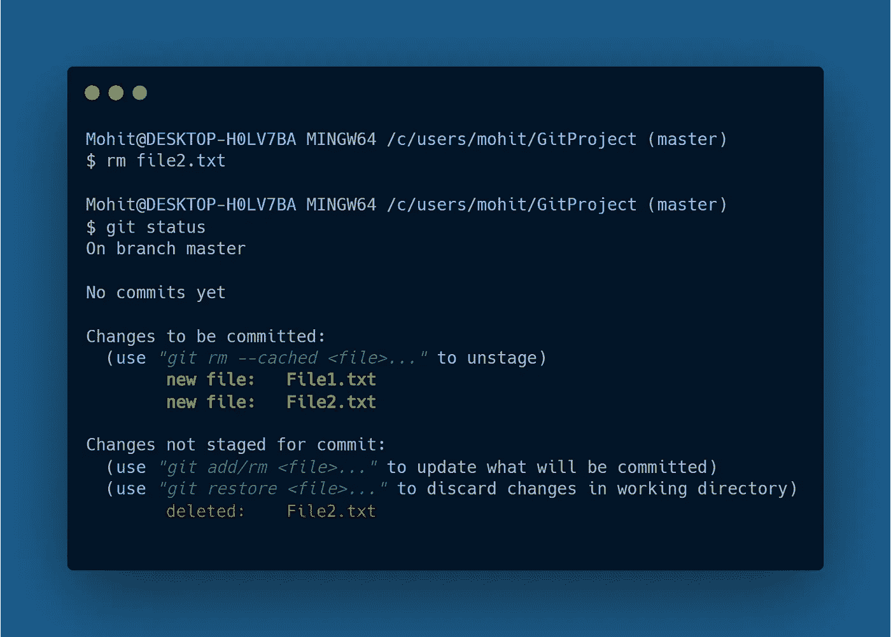

# 掌握 Git 命令行

> 原文：<https://javascript.plainenglish.io/mastering-the-git-command-line-b2c6efe4f4ad?source=collection_archive---------7----------------------->

## 像专家一样使用 Git 版本控制系统

## 正在配置 Git

在系统上正确使用 Git 需要一组配置步骤，以使进一步的工作流高效快速。我们第一次在机器上安装 **Git** 时，我们必须指定这 4 种配置:

*   **姓名&电子邮件:**每次我们在 git 存储库中提交更改时，我们的姓名和电子邮件都会被存储起来。
*   **我们的默认编辑器:**设置默认编辑器非常重要，因为如果你在 mac 上工作，你的默认编辑器应该是 **Vim** ，只有在你熟悉它的环境时才应该使用它。
*   **行尾:**有些情况下，当我们协同工作时，由于不同的操作系统，我们必须定义*行尾*，这样当我们提交我们的更改时，就不会出现复杂的错误。*例如，在* ***窗口上*** *行尾标有* ***回车*** *和* ***换行符(\r\n)*** *但是在* ***的情况下 MAC OS**&***T39****

为了解决这个问题，我们必须配置一个名为 **core.autocrlf** 的文件，在这里我们指定行尾。(如果您使用的是 Windows，则将此设置为 **true** ，如果是 macOS，则设置为**输入**)。

**输入以下命令进行配置:**

> **注意:**在**全局级别**下设置这些配置被认为是最佳实践，如果你是 **Git** 的新手，我会建议你坚持使用全局级别。

## 初始化 Git 存储库

为了使用 Git 命令行，我们需要初始化一个存储库&始终确保您位于您想要使用 Git 的项目的工作根目录中。

*   在项目目录的根目录中输入命令***‘git init’****来初始化一个空的 Git 库。*

## Git 工作流

为了能够使用 Git 命令行，我们应该对 Git 实际上是如何工作的有一个正确的理解，因为我们有 3 个概念要看:

*   **工作目录:**您处理项目文件的正常目录，仅包含实际文件。
*   Staging Area:Staging Area 对许多开发人员来说有点混乱，这也是为什么大多数时候人们发现学习 Git 很难的原因之一，因为他们对 Staging Area 没有清晰的理解。我们可以说它是 git 存储库中的一个隐藏目录，在提交之前所有的更改都保存在这里，所以如果我们的代码中有 bug，我们可以检查它，然后提交给 Git 存储库。用简单的话来说，Staging Area 提供了临时保存更改的能力，因为我们仍然需要在以后提交它们。
*   **Git 存储库:**在最终提交之后，所有已经提交的文件都进入 Git 存储库，在这里我们可以观察到我们所做的更改。

为了理解临时区域，这里有一个它工作的例子:

例如，我们的工作目录中有两个文件**(文件 1 &文件 2)** ，我们使用 echo 命令对这两个文件做了一些更改。

现在，如果我们使用下面的 Git 命令检查状态-**‘Git status’**

它只是说还没有提交(因为我们还没有进行任何提交)&未被跟踪的文件用红色字体显示，所以每当我们在命令行中看到未被跟踪的消息时，它只是意味着我们还没有将这些文件添加到登台区。 ***注意，未跟踪的文件在命令行中总是以红色字体显示。***

为了将这些文件添加到暂存区，我们使用命令- **'git add {fileName} '，**在我的例子中，我只有两个文件可以使用**句点(.)**从工作目录的根目录递归添加所有文件。

使用**“git add command”**添加文件后，如果我们再次检查状态，我们看不到任何红色，这意味着现在这些文件正在被跟踪并成功包含在暂存区中。因此，每当我们想要在特定的工作完成时在暂存区添加文件，我们可以使用 **'git add {fileName}'** 命令来添加这些文件。

之后，如果我们的代码一切正常，我们想要提交它，但是在我们进入提交部分之前，有一个不可靠的概念需要我们在暂存区中了解。假设我们从工作目录中删除了 **File2.txt** 或对其进行了一些更改，然后检查状态，我们再次观察到一些红色消息。

现在我们有消息“已修改”,这意味着这些更改未被跟踪，或者如果我们用更具体的术语来说，这些更改不在临时区域中。大多数人对暂存区感到困惑，用我简单的话来说，暂存区存储了我们文件中的更改，不多也不少。

例如，如果我们从工作目录中删除 **File2.txt** ，暂存文件的前一版本在暂存区中仍然保持不变。

正如我们所看到的，我们仍然有一些红色消息，此时 **File2.txt** 不再存在于工作目录中，但如果我们使用命令**git add，它会存在于暂存区&**我们不再有未转移的文件，我们只看到了 **File1.txt.**

通过这个演示，我们可以简单地说，暂存区存储的是文件中的更改，而不是文件本身。

## 提交更改

当我们完成了我们的变更，我们可以提交我们的变更，最终的变更将存储在 Git 存储库中。使用命令**' git commit-m { commit message } '**我们可以用一条描述我们所做更改的消息来提交我们的更改。

**例如:**

*   我们提交我们的更改&之后我们的工作树将被清理，这意味着在中没有未被跟踪的文件，我们的更改被保存在 **Git** 存储库中。

正如我提到的，暂存区负责存储我们在工作目录的文件中所做的更改中的更新。例如，如果我们将 **File1.txt 重命名为 index.js &，然后检查状态**，您将再次注意到*暂存区中的一些未跟踪的文件。*

因此，我们再次需要使用**‘git add’**命令将重命名的 ***index.js*** 文件添加到暂存区中，以更新我们所做的更改。

## 忽略文件

在每个 git 项目中，我们需要忽略特定的目录或文件格式，这样 Git 存储库就不会在我们申请提交时存储这些文件，忽略文件是必要的，否则在我们申请提交的每一步中, **Git** 存储库的大小都会增加。

忽略任何导演或文件格式有一个**。gitignore** 文件，它包含了我们在提交变更时想要过滤掉的所有目录和文件类型。为了更好地理解，我们将添加一个我们想要过滤掉的目录，并将其添加到**中。gitignore** 文件

*   我们创建了一个目录**过滤器**并添加了一个**。我们想要忽略的 bin** 文件。
*   使用 git status 命令我们检查了状态，我们可以观察到 **filter/** 目录未被跟踪。
*   要忽略这个过滤器目录，我们必须添加与我们想要过滤掉的目录完全相同的名称，使用默认编辑器，我们在**中添加了**过滤器/** 。gitignore** 文件，现在我们将能够很容易地过滤掉这个目录。
*   如果我们再次检查状态，Git 会停止跟踪该目录&我们不再在命令行的未跟踪区域看到 **filter/** 。

> 注意:如果你使用 **VS 代码**作为你机器上的默认编辑器，使用**代码。gitignore** 命令打开。gitignore 文件。

## git 状态-s

之前，我们使用普通的 **git-status** 来查看状态，这是一种更具描述性的方式，但是对于干净的环境，我们可以使用 **git status -s** 命令。

**例如:**

*   我们添加了两个新文件 **status1.txt** 和 **status2.txt，**并运行“git status -s”。
*   我们可以观察到两个问号，这仅仅意味着这两个文件未被跟踪。
*   当我们使用***“git add”添加这些未跟踪的文件时，*** 我们可以看到**【A】显示文件已经添加到暂存区中。**

****

****Untracked Files****

****

****Added Files in Staging Area****

## **取消转移文件**

**如果我们不小心将文件添加到暂存区域，我们还可以使用**“git restore—staged { fileName }”**命令恢复我们所做的更改。在我们的例子中，我们只有两个文件和一个句号**(。)**将恢复我们从根目录&所做的更改，将文件恢复到它们先前的版本。**

****

****Unstaging Files****

**我们还可以使用“git restore”命令来恢复文件，但是如果文件未被跟踪，它将不起作用，因为如果文件不在临时区域中，git 不知道将更改恢复到哪里。例如，如果我们尝试运行**“git restore”**不会有什么变化。**

****

## **创建海关命令**

**在 Git 中，我们还可以创建自己的定制命令，以避免在终端中键入长命令，为了生成定制命令，我们使用 alias 命令。**

****例如:****

****

****Custom Commands****

*   **要取消这些更改，我们必须输入长命令，但是可以在 Git 中创建任何类型的自定义命令。**
*   **在别名之后，我们在命令中键入我们需要的关键字*(在我的例子中是****revert****)*。**
*   **在双引号中，我们添加了 Git 使用的原始命令。**

## **还原已删除的文件**

**有时我们会不小心从工作目录中删除一些文件，使用 Git 我们可以在几秒钟内获得这些删除的文件:**

**例如:**

****

*   **我们生成了一个名为 **newfile.txt** &的新文件，用消息**“new file stored”提交更改。****
*   **现在，假设在第二次提交中，我们意外删除了文件，我们提交了一个消息**“新文件已删除”。****
*   **要恢复这个文件，我们必须运行 oneline 命令来查看到目前为止我们所做的所有提交。**
*   **正如我们看到的，每个提交都有一个唯一的 id(在我的例子中是 9209bfd )与每个提交相关联，我们可以使用这个 id 返回到上一次提交，并恢复我们刚刚删除的文件。**
*   **为了恢复文件，我们使用**“git check out”**命令以及提交 **id** 和我们想要恢复的文件名。**

# **分支**

**分支是**版本控制系统**中令人敬畏的特性之一，它完全改变了我们设计软件的方式，与其他 *VCS* 如***Subversion***&***Mercurial 相比，Git 分支是最有效的。*** 在 Git 中，当我们生成一个新的分支时，它会将 **Head** 指针移动到那个新的分支，这意味着现在我们可以在同一个工作目录中的新工作区中工作了。**

## **切换分支**

****

****Branching****

**假设我们正在制作一个 Web 应用程序，我们在前端代码中遇到了一些错误，此时我们可以创建一个新的分支来处理这些错误，稍后我们可以合并这个新的分支来生成最终的结果。**

> ****注:*****主指针*** 在移动到 ***新分支*** 后仍保持在我们离开工作的同一水平，这样我们就可以在 ***合并*** 分支后继续我们离开的地方。**

****例如:****

****

****Switching Branches****

*   **为了更好地理解，我创建了一个名为**“分支”、**的新 Git 存储库，其中有一个名为**“user . txt”的普通文本文件。****
*   **现在使用**【git branch】**命令我们可以创建一个新的分支。(在我的例子中，新的分支被命名为 **newuser** )。**
*   **使用**“git switch”**命令，我们将分支从**主**分支更改为我们新创建的分支。**
*   **如果我们修改我们的 **User.txt** 文件并检查状态，我们可以观察到这些变化现在与新的分支相关联。**
*   **之后，如果我们使用 oneline 命令提交我们的更改，我们可以很容易地看到**头**移动到我们的新分支。**

> **如果我们返回到我们的**主**分支并打开 **User.txt** 文件，我们将看不到我们所做的更改，因为它们都是在新分支上执行的。**

## **合并**

**在 **Git** 中有两种方法可以合并我们的分支:**

*   ****快进合并****
*   ****3 路-合并****

**在快进合并中，我们可以说我们的头指针移动到了我们想要与主分支合并的新分支&之后我们可以删除这个新分支。**

**但是三路合并，它有点不同，因为工作树会分叉，因为当我们合并两个分支时，Git 会创建一个新的提交，这个新的提交在新的分支中并不存在，由于这个新的提交，在合并两个分支后，我们的整个工作树会分叉。**

> *****你会从下面的例子中得到更好的理解:*****

****

****FF Merge & 3-Way Merge****

****比如:****

**快进合并工作得很好，可以使用命令 **"git merge {branchName}"** 来完成，但是在三路合并中，我们必须告诉 git 避免使用 ***FF merge*** ，即使使用**" Git merge-no-f { branch name } "命令也可以。****

****

**3-Way Merge**

*   **对于三向合并，我们创建了一个名为**“another branch”**的新分支，当我们将其与主分支合并时，可以很容易地观察到分叉的工作树。**
*   **如果我们尝试将工作树可视化，它与我们在上面的图表中讨论的结构完全相似&我们可以看到 **HEAD** 指针移动到主分支，名为 **anotherbranch** 的分支与线性工作树断开连接，并且我们之前的所有分支都连接到上面的工作树。**