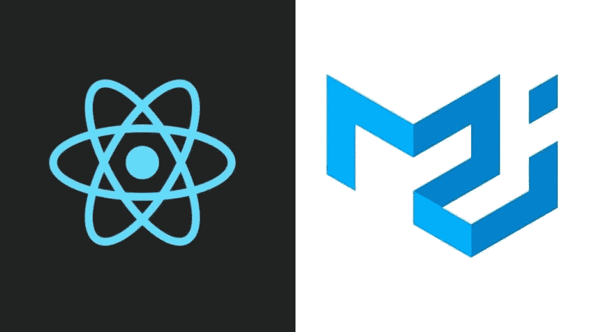
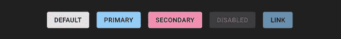
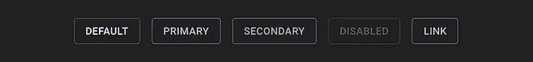
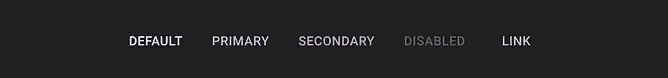
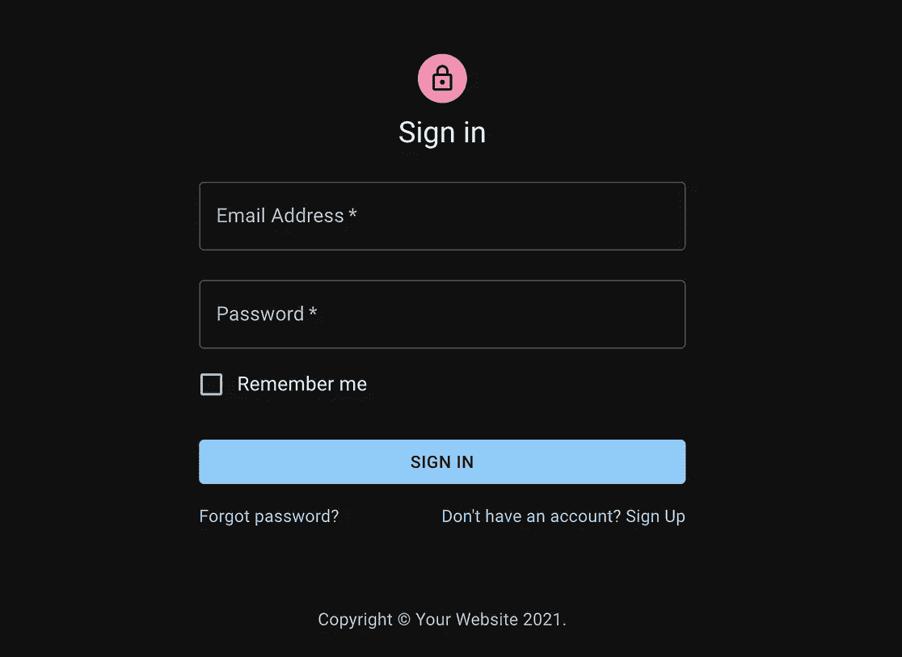
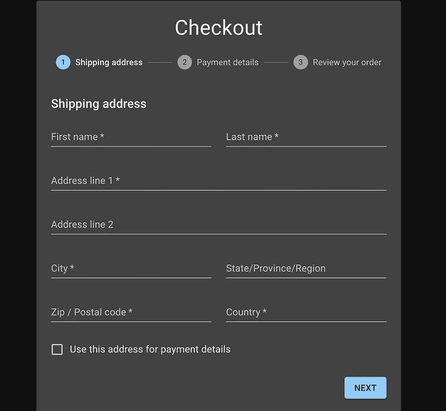

# 材质界面——造型从未如此简单

> 原文：<https://javascript.plainenglish.io/material-ui-styling-never-been-so-easy-f29d5d15335d?source=collection_archive---------13----------------------->



Material-UI 是最好的库或框架——对一些人来说是库，对另一些人来说是框架。你认为是什么？

在 React 中，您可能会发现您希望以一种快速而简单的方式为 React 组件赋予样式，而 Material-UI 提供了一种简单的方法来实现这一点。它可能会提醒您以某种方式使用 Bootstrap。

Material-UI 来自谷歌的**材质设计**。有了这个库，你的网站看起来就像你一生都在做设计师，但也许你以前从未做过。如果你想优化你在网站上的工作时间，它是完美的，它也是反应灵敏和移动优先的。开始用还需要什么？

## 如何安装 Material-UI？

你只需要打开你的**终端**并执行下面的代码:

```
$ npm install @material-ui/core //using npmyarn add @material-ui/core //or you can use yarn
```

然后，打开你的 index.html，导出 Roboto 作为默认字体。顺便说一下，Roboto 是最常用的字体之一，在任何网站上看起来都很不错。你可以在谷歌字体上找到代码。

```
<link rel="stylesheet" href="https://fonts.googleapis.com/css?family=Roboto:300,400,500,700&display=swap" />
```

下一步是导入所有的 SVG 素材**图标**。但是，您也可以从 Google 导入它们。

```
npm install @material-ui/icons //using npm

yarn add @material-ui/icons //or using yarn
```

使用这些图标让你有机会拥有 UX/UI 设计师在不同的**设计工具**上设计线框时可以使用的相同图标，例如 Figma、Sketch 或 Adobe XD。

## 实现材料用户界面组件

设置好材料 UI 后，让我们开始使用组件。材质 UI **组件**已经独立，这意味着它们可以独立工作。你只需要导入组件，样式也会被设置好。下面是一个如何实现按钮组件的例子。对于每个组件，您必须从@material-ui 导入它们。

```
import React from 'react';
import ReactDOM from 'react-dom';
import Button from '@material-ui/core/Button';

function App() {
  return (
    <Button variant="contained" color="primary">
      Hello World
    </Button>
  );
}

ReactDOM.render(<App />, document.querySelector('#app'));
```

可以看到有一些属性。*变量*变量定义了**按钮如何出现你想要实现的效果。*颜色*定义按钮的颜色。默认情况下，您可以在这些颜色之间进行选择。**

************

**Different variant buttons: contained, outlined, and text button —Credits: Material-UI**

**此外，Material-UI 网站提供了一个**组件 API** ，在其中你可以找到如何实现每个组件和每个特性。除了按钮组件之外，您还可以在这里找到一些主要组件:**

*   **卡片**
*   **电影《阿凡达》**
*   **格子**
*   **检验盒**
*   **圆规**
*   **表单控制器**
*   **投入**
*   **菜单**
*   **情态的**
*   **工具栏**
*   **诸如此类…**

**此外，在 Material-UI 网站上，你可以找到一堆免费和付费的**模板**，以防你想节省时间或者只是想看看它是如何工作的。也是学习素材的好方法——UI。例如，您可以找到一个登录、一个博客、一个粘贴页脚或一个结帐。**

********

**This how it looks a template from Material Design. Sign in — left side — and checkout — right side.**

## **我想用 Material-UI 自定义样式怎么办？**

**好吧，Material-UI 有很多 React 组件的默认样式，但是如果你想更进一步，你应该怎么做呢？也许这种颜色不是你想要的默认颜色，或者甚至移动组件作为材料——UI 并不能让你满意。在这种情况下，Material-UI 可能很难使用。但是有一个解决方案可以达到这个目的。它的名字叫 ***Themeprovider*** 。如果您使用**主题属性**定制主题，您必须使用 MuiThemeProvider，它将您创建的主题传递给您定制的父组件并添加更多变量。这就是我们如何使用 **MuiThemeProvider** 来创建一个常量并重新定义我们想要改变的变量:**

```
**import { createMuiTheme } from '@material-ui/core/styles';
import blue from '@material-ui/core/colors/blue';

const theme = createMuiTheme({
  palette: {
    primary: blue,
  },
});**
```

**您可以自定义的一些变量包括:**

*   **调色板:例如，你可以替换原色，使用棕色作为`pallete.primary`**
*   **排版:你可以改变字体系列，默认情况下在 em 中的大小。**
*   **断点。这和 Bootstrap 非常相似，它们的默认键是`xs`、`sm`、`md`、`lg`和`xl`。**
*   **自定义变量**

**如果有必要，你可以嵌套不同的主题提供者。例如，如果你想让同一个组件有不同的风格，这取决于该组件在网站上的位置。**

**但是没有必要访问多主题来改变风格。您还可以访问 React 组件中的主题变量。只需导入使用`withTheme()`**

```
**import { withTheme } from '@material-ui/core/styles';**
```

**并把它作为一个函数来使用。然后，像这样访问组件的默认变量。我们还可以将主题导出为一个 **JSON 对象**:**

```
**function WithTheme(props) {
  const { theme } = props;
  const primaryText = theme.palette.text.primary;
  const primaryColor = theme.palette.primary.main;

  const styles = {
    primaryText: {
      backgroundColor: theme.palette.background.default,
      padding: `${theme.spacing.unit}px ${theme.spacing.unit * 2}px`,
      color: primaryText,
    },
    primaryColor: {
      backgroundColor: primaryColor,
      padding: `${theme.spacing.unit}px ${theme.spacing.unit * 2}px`,
      color: theme.palette.common.white,
    },
  };**
```

## ****总结****

**如果不想浪费时间自定义 React 组件，Material UI 是个不错的选择。一些**的优点是:****

*   **以更快的方式定制组件并制作动画。**
*   **移动优先。**
*   **响应网站。**
*   **使用 ThemeProvider 创建您自己的样式并将该样式添加到组件中。**

**然而，我们可以发现使用 Material-UI 的一些缺点:**

*   **当一个网页是建立在 Material-UI 上时，你可以很容易地识别出来。那可能被解释为缺乏个性。**
*   **各种各样的动画可能会分散用户的注意力。**

**就是这样。希望这篇文章对理解 Material-UI 的好处有所帮助。**

***更多内容请看*[*plain English . io*](http://plainenglish.io/)**