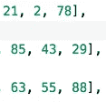

# 矩阵区域和:求矩形内数字的和

> 原文：<https://javascript.plainenglish.io/matrix-region-sum-finding-the-sum-of-numbers-inside-the-rectangle-a58c61cfcc92?source=collection_archive---------7----------------------->

## 关于如何概念化矩阵和使用暴力解决算法问题的演练

Photo by [Scott Graham](https://unsplash.com/@homajob?utm_source=medium&utm_medium=referral) on [Unsplash](https://unsplash.com?utm_source=medium&utm_medium=referral)

出于某种原因，我很难理解矩阵。

这不是我第一次尝试使用矩阵，但它的构造方式和 2D 性质让我在尝试和处理如何迭代矩阵时在脑海中打转。

现在我们正在写另一篇关于矩阵的博客。希望额外的写作和练习能帮助我(也帮助你！).

简单来说，矩阵就是数组的数组。矩阵是数字的平方，或者是数字的 2D 矩阵。它的子数组*必须*在数组中包含相同数量的元素。如果他们没有，那就是**而不是**一个矩阵。

让我们看一个例子:

如你所见，我们的矩阵是 5x5，这意味着矩阵中有 5 个数组，每个数组中有 5 个元素。它在数组中包含相同数量的元素，使得上面的例子成为一个矩阵。

太好了！现在我们了解了什么是矩阵，让我们介绍使用矩阵作为输入的练习。

Did someone say a back exercise?

# 问题是

我们将要解决的问题陈述如下:

*给定一个整数矩阵和矩阵内一个矩形区域的坐标，求落在矩形内的数字之和。我们的程序将被多次调用，使用来自同一个矩阵的不同矩形区域。*

当我试图解决这个问题时，我的朋友建议我在用代码解决这个问题之前，先作为一个人尝试解决这个问题。

接受了这个建议，我重新审视了这个问题，并尝试以人类的方式解决它。让我们再次使用上面的例子:

假设我们想得到上面所有数字的总和。最合理的做法是将第一个数字(10)加到下一个数字(29)上，依此类推，直到到达行尾。一旦我们完成了这一行，我们就移动到下一行(或数组)，从左边开始，继续添加数字。

从左到右。自上而下。这是我们在英语中习以为常的。

幸运的是，我们可以用非常相似的方式编写代码！我们可以用一个嵌套的 for 循环来遍历我们的矩阵，以访问每个数组及其单个元素，并对所有数字求和。外部的 for 循环访问每个单独的数组，而嵌套的 for 循环更深入一层，访问每个数组内的每个单独的值。

让我们增加额外的复杂性，来完成我们面临的问题:

*使用给我们的坐标建立矩形区域，找出落在该区域内的数字之和*

因此，我们现在需要的不是得到矩阵中所有数字的总和，而是以某种方式得到坐标，并在矩阵中建立一个区域，然后只得到该段的总和。

我们如何做到这一点？

# 方法

我们的坐标将由包含两个值的数组来表示。假设我们的坐标如下:

常数坐标 1 = [2，2]
常数坐标 2 = [4，4]

让我们从坐标 1，[2，2]开始。使用我们的矩阵示例，coord1 告诉我们的是第一个 2 是矩阵数组的第二个索引(或行)。因此，我们正在查看下面这一行:

坐标中的第二个 2 代表我们需要在数组中走多远。在我们的例子中，我们需要再次转到第二个索引，即 21。

太好了，我们已经设定了第一个坐标！Coord2 的工作方式类似-> coord2 让我们转到矩阵数组中的第 4 行，即第 4 个数组:

类似于我们的第一个坐标，第二个 4 代表我们需要在数组中走多远。我们看第四个指数，88。这就创建了我们需要处理的矩形区域！

# 解决方案

让我们重新介绍我们的问题，并开始编码！

*给定一个整数矩阵和矩阵中一个矩形区域的坐标，求落在矩形内的数字之和。我们的程序将被多次调用，使用来自同一个矩阵的不同矩形区域。*

如上所述，我们将有一个双 for 循环来遍历行和元素。然而，我们需要做一些小的调整来访问*仅仅是*我们已经花了很多时间在我们的坐标上声明的区域。

我们知道我们需要一个运行计数来跟踪我们区域的总和，所以现在让我们声明:

那么我们如何设置我们的 for 循环呢？我们有自己的坐标，所以我们需要从矩形区域的起点开始迭代，而不是从矩阵的起点开始。

因此，我们将外部 I 设置为 coord1[0]，即 2。我们需要将它迭代到矩阵(coord2[0])的第 4 个索引或数组

在我们的内部 for 循环中，我们将把我们的内部 j 设置为 coord1[1]，也就是 2，它将迭代到第 4 个索引(coord2[1])，也就是 4。

*记住，两个坐标中的第一个坐标代表行，第二个坐标代表该行的索引。*

我们的最后一步是确保我们的结果随着每次迭代而增加。我们的最终代码将如下所示:

Our final code

# 结论

我们做到了！一步一步来看，我们看到了如何在给定一对坐标的情况下遍历一个矩阵并建立一个区域矩形。通过这样做，它将省去我们在*全矩阵*上迭代的麻烦，并为我们提供一个更有效的解决方案。

不可否认，对我来说，概念化矩阵是如何迭代的仍然很棘手，但是我鼓励你在看到它们的时候多加练习——你对这种棘手的数据结构重复得越多，你就越容易前进。

下次见！

*更多内容尽在*[*plain English . io*](http://plainenglish.io/)