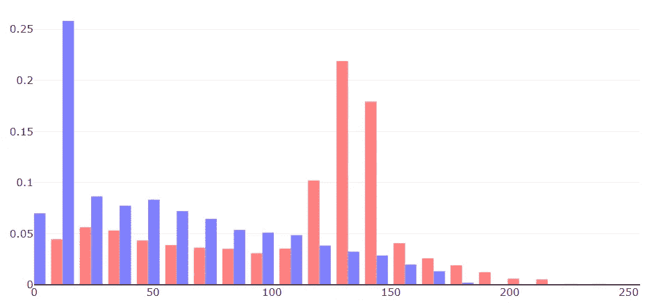

# 如何测量两个直方图的相似性，并应用于查找相似图像

> 原文：<https://javascript.plainenglish.io/measuring-the-similarity-of-two-histograms-with-an-application-to-find-similar-images-8eaeba35c914?source=collection_archive---------10----------------------->



毫无疑问，直方图是数据分析的主要对象之一。直方图表示某个随机变量的值的分布。

如果直方图被归一化为 1，即值(条)的总和为 1，那么它们表示某个离散随机变量的**密度函数**。在这种情况下，条形的值是随机变量将相应条形的标签作为值的概率。

一个经常出现的问题是两个直方图彼此偏离多少。例如:

*   比较几个期间的财务数据分布
*   比较图像数据的颜色分布

在这个故事中，我们将着眼于直方图距离的精确定义，并给出一个测量两幅图像相似性的示例实现。特别地，这可以用于自动检测相似的图像。

## 相交方法:

首先，通常密度函数的距离定义非常复杂且难以计算。我们要看一个比较容易理解和计算的。

让我们看看它的定义和主要性质。如果你对概率论一点都不熟悉，这些定义可能看起来有点难懂。但是请注意，您会惊讶于它的实际实现是多么容易。为此，请跳到下一节。

(如果嵌入的 PDF 显示为空白，您可以在此访问它

## 实施:

直方图距离的计算非常简单。

假设给我们一个离散分布的概率密度`f, g`。或者，我们可以说，`f`和`g`是归一化直方图的数据阵列。然后可以用 JavaScript/TypeScript 计算距离，如下所示:

```
({ f, g }: { f: number[], g: number[] }): number =>
    **1 - f.reduce((prev, e, idx) => prev + Math.min(e, g[idx]), 0); ** 
```

所以本质上我们简单地把`min(f[idx], g[idx])`的值相加，然后从`1`中减去它。这都适用于归一化直方图，或者换句话说，其中`f`的值分别为。`g`做总结到`1`。

您可以将这个总和视为标题直方图中红色和蓝色条的所有交叉点的总和。由此可见，该总和越接近`0`，直方图的差异就越大。

## 图像应用:

现在，让我们看看如何使用这种简单的技术来检测相似的图像。为此，我创建了一个简单的网页，它交叉计算给定图像列表的距离。你可以在这里看到它[。](https://applied-math-coding.github.io/histogram-distance/)

首先，对于每个图像，计算每个通道‘r’、‘g’、‘b’的颜色分布。这意味着，每个图像由三个直方图表示。

为了计算两幅图像的距离，将相应的‘r’-、‘g’-、‘b’-直方图的距离相加。因此，本质上，我们通过使用 l1 范数来计算两个三元组的距离，这同样可以被显示为构成度量。

其中一幅图像只是另一幅的灰度。这些图像之间的距离被计算为`0.68`。这表明该方法不能很好地恢复形状。

您可以通过执行以下操作来摆弄底层代码:

```
git clone [https://github.com/applied-math-coding/histogram-distance.git](https://github.com/applied-math-coding/histogram-distance.git)npm inpm start
```

它是使用 TypeScript 的 Vue 应用程序。

## 最后注意:

对我来说，相交方法第一次出现是在必须解决一个问题的时候，在这个问题中，摄像机只有在认为图像发生显著变化时才开始通知服务器。因此，树叶被风吹动不会引发事件，但突然的龙卷风卷走这些树应该会引发事件。正如已经提到的，对于检测形状，这种方法根本不适合，但是对于可以由颜色确定的任何事物，这种方法提供了很好的支持。

感谢阅读！

*更多内容尽在*[***plain English . io***](http://plainenglish.io/)