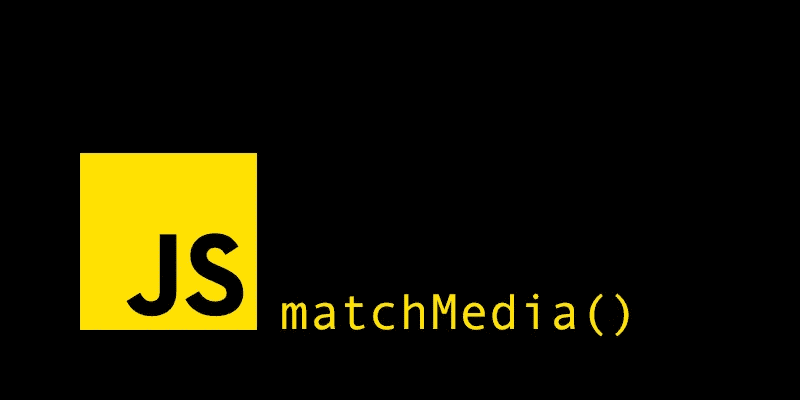

# JavaScript 中的媒体查询

> 原文：<https://javascript.plainenglish.io/media-queries-in-javascript-f7e5a41d83a1?source=collection_archive---------10----------------------->

## 了解如何根据媒体查询有条件地运行 JavaScript 代码。

我们都知道 CSS 媒体查询，它允许我们根据一个`@media`规则应用不同的样式。

但是你知道媒体查询不仅限于 CSS 吗？有时，根据媒体查询运行 JavaScript 代码会很有用。

怎么会？用`window` API 方法`matchMedia()`。

# matchMedia()方法

简而言之，这是用 JavaScript 编写媒体查询的一种简单快捷的方式。这个概念和 CSS 中的一样:如果媒体查询的条件匹配，那么运行一些代码。我们可以通过任何 CSS `@media`规则(屏幕、方向、最小宽度等。)作为该方法的字符串参数，它返回一个带有两个属性和两个方法的`MediaQueryList`对象。

属性:

*   `matches`:布尔值，如果满足媒体查询，则为`true`，否则为`false`。这是您将在大多数情况下使用的基本用法和更直观的属性，与我们编写 CSS 媒体查询的方式非常相似。
*   `media`:媒体查询本身。

方法:

*   `addListener()`或`addEventListener()`:添加一个回调，当媒体查询改变状态时调用。
*   `removeListener()`或`removeEventListener()`:删除之前在`addListener()`中定义的指定回调。

# 例子

下面的代码片段包含两个带有`matchMedia()`方法的属性和方法的例子。

# 结论

在第二个代码块中，可以认为使用传统的`window.addEventListener('resize', callbackFunction)`和使用`window.innerWidth`来获得当前的视窗宽度会更好，但是使用`matchMedia()`的方法旨在展示这种方法如何让我们检测 JavaScript 中的媒体查询变化，而不是提供针对特定问题的最佳方法。

然而，监听`resize`事件将在每次调整视窗大小时调用回调函数，这比使用`matchMedia`方法的性能要差，后者只在指定的媒体查询匹配时调用回调函数。

除此之外，使用所提出的方法为我们提供了更广泛的可能性，因为它不仅可以执行传统的操作，如监听视口宽度的变化，还可以检测众所周知的媒体查询的变化。

# 参考

 [## Window.matchMedia()

### 窗口接口的 matchMedia()方法返回一个新的 MediaQueryList 对象，该对象可用于确定是否…

developer.mozilla.org](https://developer.mozilla.org/en-US/docs/Web/API/Window/matchMedia)  [## CSSOM 视图模块

### 该规范中定义的许多特性已经被浏览器支持了很长一段时间。目标是…

www.w3.org](https://www.w3.org/TR/cssom-view/#dom-window-matchmedia)  [## MediaQueryList

### MediaQueryList 对象存储应用于文档的媒体查询的信息，同时支持即时和…

developer.mozilla.org](https://developer.mozilla.org/en-US/docs/Web/API/MediaQueryList)  [## 以编程方式测试媒体查询

### DOM 提供了可以通过 MediaQueryList 接口以编程方式测试媒体查询结果的特性…

developer.mozilla.org](https://developer.mozilla.org/en-US/docs/Web/CSS/Media_Queries/Testing_media_queries)