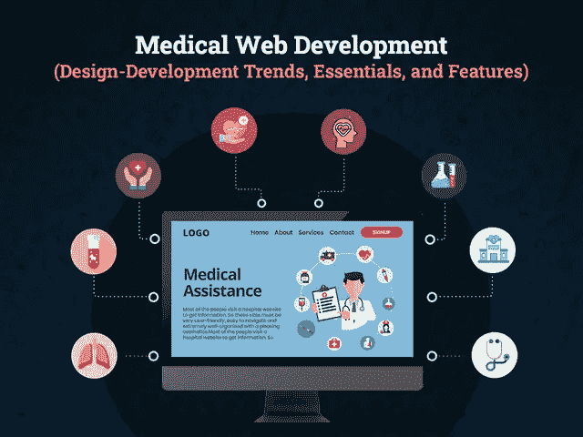

# 医疗网站开发:如何成为市场第一？

> 原文：<https://javascript.plainenglish.io/medical-website-development-how-to-become-1-on-the-market-571af7977b92?source=collection_archive---------12----------------------->

## **医疗保健网站开发:设计和发展趋势、基本特征和成本**

[Background vector](https://www.freepik.com/vectors/background) created by [photoroyalty](https://www.freepik.com/photoroyalty) — [www.freepik.com](https://www.freepik.com/free-vector/medical-background-design_978306.htm#page=1&query=healthcare&position=34)

近年来，数字化彻底改变了人们获取医疗保健服务的方式，作为一家医疗保健企业，您可能知道，跟上医疗保健行业的数字化趋势已成为市场的迫切需求。

随着医疗保健领域的新兴技术和创新，大多数患者都是通过搜索和比较在线服务提供商开始他们的旅程，并希望登陆一个美观且具有无缝导航的网站。

因此，如果你是一个适应数字时代的医疗服务提供商，那么你首先关心的肯定是哪些新兴技术值得投资，哪些功能可以集成，要遵循哪些设计趋势等等…

在我们深入研究医疗网站开发和设计趋势的完整指南之前，让我们通过快速的市场统计数据来了解为什么开发一个医疗网站在 2021 年对您的业务如此重要。

## **市场统计:技术对医疗保健行业的积极影响**

无论您是一家初创企业还是领先的医疗保健企业，网站都是您为诊所创造的第一印象，因此借助帮助您提高转化率和用户参与度的来描绘网站非常重要。此外，开发一个高质量的设计网站已经成为增加患者量和在 2021 年取得成功的潜在途径。

***下面是怎么回事！***

*   根据[谷歌的统计数据](https://www.thinkwithgoogle.com/marketing-strategies/search/the-digital-journey-to-wellness-hospital-selection/)，与传统的医疗保健服务提供商相比，网站搜索可以吸引 3 倍多的访问者访问医院网站。
*   [84%的患者](https://www.thinkwithgoogle.com/marketing-strategies/search/the-digital-journey-to-wellness-hospital-selection/)使用在线和离线资源进行医疗保健研究。
*   为了预约，用户考虑潜在患者的 [1 到 6 个在线评论](https://www.revlocal.com/resources/library/blog)以形成意见。
*   5%的谷歌搜索是基于医疗保健的，因为用户认为谷歌是获得所有健康相关答案的最佳地方。
*   [2.4%的医疗保健预约](https://www.accenture.com/us-en)通过在线预约或使用在线表格提交。
*   尽管如此，美国医疗保健市场仍在异常增长，预计到 2026 年国家支出将达到[5.7 万亿美元。](https://www.cms.gov/research-statistics-data-and-systems/statistics-trends-and-reports/nationalhealthexpenddata/nhe-fact-sheet)

**简而言之:**这些统计数据清楚地描绘了医疗保健行业数字化转型的渐进图景。全球有超过 40 亿人通过互联网访问在线服务，因此，新的医疗保健提供商仍有发现商机的空间

## **2。为医院、医疗保健提供商、医生和诊所建立网站的好处**

为你的医疗保健业务开发一个网站不仅已经成为一个热门话题，也是一个现代时代的基本需求。医疗网站不会增加寻求医生的人数，但也提供了从广泛的选项中选择的灵活性。随着网站的发展，医疗实践变得更加可靠、系统和容易利用。你所需要的就是与最好的 [**网站开发公司**](https://www.xicom.biz/services/web-development/) 合作，它可以很容易地将你的想法转化为潜在的解决方案。

如果你仍然想知道它是如何给你的企业带来特权的，那么你应该进一步阅读！

*在 2021 年拥有一个医疗网站的好处，以及它将如何发展你的业务:*

*   **全年无休**

为你的诊所或医院建立一个网站意味着病人可以随时随地找到你的服务。这意味着您的业务信息甚至可以在工作时间之外被访问，您的网站可以为您的患者服务。这确实有助于病人在紧急情况下不离开舒适的家就能立即获得所有信息。

*   **建立商业信誉**

在这个数字化时代，患者将通过简单地使用这种在线表格和其他工具来分享重要信息，从而积极地在线寻找医疗保健解决方案。因此，在你的网站上提供所有这些设施将有助于提高你的组织的可信度，从而进一步吸引更多的信息搜索者。

*   **生成更多销售线索**

使用传统的商业方法，你总是会受到产生业务的区域和界限的限制。但是，如果你真的希望将业务扩展到地理边界之外，那么医疗网站是实现这一目标并从世界不同角落创造更多业务的唯一途径。

*   **患者洞察**

业务分析是最重要的元素之一，通过提供对业务的实时洞察，帮助您跟踪业务的增长。在一家 [**网络开发公司**](https://www.xicom.biz/services/web-development/) 的帮助下，你可以创建这个版块，以提供一种方式来检查你的典型信息搜索者是谁，以及他们如何找到你的网站。事实上，它使你能够了解你的访问者喜欢什么，并采纳组织中的变化，以最大限度地扩大影响。

*   **超越竞争对手**

如果你还在用所有传统的方法管理你的业务，那么你就自动把你的业务交给了竞争对手。在这个数字时代，几乎每个人都知道一个网站的好处，以及在预约前访问网站的无尽优势。因此，如果你建立了一个网站，那么你将比市场竞争对手更有优势，并能在访问者中建立信任。

这些是拥有一个医疗网站的几个主要好处，但问题是如何设计和开发一个成功的网站…

# **3。构建用户友好型医疗网站的关键考虑因素**

不可否认的事实是，现代技术正在推动各个行业的数字化转型，医疗保健也不例外。市场上有太多的医疗网站，首要的障碍是让你的病人相信你和你的服务。这就是网站设计和开发策略帮助你占据中心位置的地方。

拥有一个定制的医疗网站很重要，但如何让潜在的和现有的患者看到它是一个主要问题。

因此，在你雇佣一个网站开发人员之前，记住这些最佳实践指南来创建一个有吸引力的、用户友好的和高度吸引人的网站是至关重要的。

*   **响应式设计，适合各种屏幕尺寸**

为了使你的网站用户友好，值得考虑一个能适应不同屏幕尺寸和分辨率的网站设计。由于如今患者使用智能手机、平板电脑、台式机等获取一些关于医院的数据，响应式网页设计是一个合乎逻辑的考虑。

*   **扁平设计往往加载速度更快**

有许多网站设计趋势来来去去，但平面设计是一种永远保持趋势的东西，因为它允许你在网站上使用极简和简洁的元素，所以用户的注意力将直接驱动到重要的网站内容。扁平化设计的最大好处是它可以减少网站负载，因为它拥有简单的设计元素。

*   **简单、方便、清晰的导航**

虽然市场上有各种各样的网站，但你更愿意呆在哪里获取信息？

*假设有两个网站 X 和 Y！*

x 网站有一个简单和易于导航的菜单，易于理解的信息，使您能够立即利用自己的服务。

而 Y 网站需要更长的时间来加载页面，复杂的导航，复杂的内容，但非常花哨的网页设计。

*你认为哪一个会给人一种愉快的体验？肯定 X 网站！*

不管你的网站的目的是什么(销售产品，管理约会，提供信息等等)，用户总是期待着可以理解和容易学习的导航。

*   **坚持严格的隐私政策**

有许多敏感数据通过您的网站进行交换，因此为了避免任何数据泄漏，并在您的网站上保持机密和安全，请确保您有一个严格的隐私政策。您必须有一个策略来保护您收集的数据、您使用的工具以及您为加密而处理的数据。既然这是你网站最关键的要素之一，那么雇佣一个 [**网站开发公司**](https://www.xicom.biz/services/web-development/) 来避免留下任何风险是值得的。由于他们了解数据的敏感性，并把他们客户的数据放在高度优先的位置，因此，他们从来没有给病人的数据留下任何混乱的空间。

*   **使用 SSL 证书和 HTTPS 提高安全性**

无论您的网站是用于管理预约、销售医疗产品还是仅仅传达医疗服务信息，使用 HTTPS 和 SSL 证书都非常重要。实施此类安全协议将确保与服务器的安全连接，并通过对从您的网站传输到服务器的所有数据进行加密，将欺诈风险降至最低。

*   **谷歌价值观快速加载时间**

在设计和开发一个网站的时候，确保它能在 3 秒内加载完毕。在竞争激烈的市场中，有成千上万的网站在这里为访问者服务，请确保您的网站即时加载。访问者几乎没有耐心等很久来加载你的页面。事实上，更长的页面加载会增加你的网站放弃率。

*   **利用清晰的 CTA(行动号召)**

为了将你的潜在访客转化为患者，你需要在整个网页上放置 CTA，将用户带到最重要的页面，例如预约、填写表格的患者门户网站等等。为了获得这一功能的最大好处，你可以选择外包一家**网络开发公司，该公司拥有一支经验丰富、技术娴熟的团队来处理这项任务，并提供无缝导航功能，有策略地将用户导向更高优先级的页面。**

*   ****基于人工智能的聊天机器人在医疗网站的集成****

**技术无疑已经改变了医疗保健行业，但人工智能正在大胆地为医疗行业铺平道路，以改善客户体验和简化运营。随着人工智能聊天机器人的实施，医疗保健企业可以最大限度地减少人工工作，无缝组织预约，帮助解决医疗问题，提供分析结果等，而没有任何麻烦。**

****简而言之:**随着数字化对医疗行业的巨大影响，毫无疑问，医疗保健系统将改变向患者提供护理和信息的方式。通过考虑上述这些关键因素，将有助于您构建一个极具影响力和吸引力的网站，提供出色的用户体验。**

**但是，如何开发和设计你的医疗网站仍然是一个需要回答的主要问题。**

# ****4。医疗网页设计&开发:如何成为市场第一？****

**如何开发和设计一个成功的医疗网站，以及如何成为医疗网站的第一名，是医疗企业最常问的问题之一。**

**因此，我们将设计和开发流程分为两个简单的步骤:**

****第一阶段:前端开发**或者你可以说是 UI/UX 设计的技术实现，包括网站上吸引用户注意力并使其具有交互性的所有图形元素和视觉呈现。网站设计是利用各种网络技术的第一阶段:**

*****编程语言:*** *JavaScript，TypeScript***

*****JavaScript 框架:*** *Angular，React，Vue 等等。***

*****标记语言:*** *HTML5，CSS3***

**在医疗网站开发的背景下，您可能需要 [**雇佣一名 web 开发人员**](https://www.xicom.biz/offerings/hire-web-developers/) 使用内容管理系统(CMS)定制网站的内部门户。该系统不仅可以帮助您无缝管理内容，还可以存储不同类型的内容，包括图像、文档、视频和更多相关内容。**

*****Pro 提示:*** *为了尽量减少前端开发的麻烦，建议走现成的系统，以节省开发时间和成本。但是，为了在医疗保健领域树立标杆，根据您的业务需求定制解决方案是值得的。***

****第二阶段:Web 后台开发**包括所有的后台操作，运营网站功能。您可以将 web backend 视为医疗网站的服务器端，它使用以下技术处理信息:**

*****编程语言:*** *PHP、Java、Ruby、Python 等等。***

*****Web 框架:*** *Phoenix，Ruby on Rails 等等。***

*****数据库服务器:*** *MySQL、PostgreSQL***

*****Web 服务器:*** *Apache，Nginx***

*****云服务器平台:*** *AWZ、EC2、S3 等等。***

**除了这些技术之外，web 开发公司还集成了第三方 API 来增加网站的功能，如下所述:**

*   *****安全数据交换与管理:*** *Box API、TrueVault、iHealth、Allscripts API、AdvancedMD AP、Human API 等等。***
*   *****医生位置:*** *更好的医生***
*   *****数据中枢:*** *世卫组织/欧洲数据仓库 API***
*   *****患者管理:*** *Drchrono API***
*   *****配药功能:*** *沃尔格林药房处方 API***
*   *****网上支付:*** *布伦特里，条纹***
*   *****分析:*** *谷歌云医疗 API***
*   *****症状检查器:*** *ApiMedic 系统检查器 API，身体质量指数计算器 API***

**简而言之:这些是网页开发中考虑的基本要素，决定了你的网站将会是什么样子，以及如何被处理。但是，在你的医疗网站上，哪些特性和功能是必不可少的呢？**

> **下面我们来读一读！**

# ****建设医疗网站的特点和功能****

**网站的特点和功能在决定你的网站的成功方面起着重要的作用。有太多的网站可以提供服务，但是只有你的网站的特性和功能才能让它在市场上脱颖而出。**

**因此，这里有一个你可以考虑包含在医疗网站中的功能列表:**

*   ****简易搜索****

**患者访问一个医学网站来寻找信息，所以确保你提供一个简单的搜索框来帮助他们找到所有紧迫问题的答案。**

**通常，访问者首先寻找认证和从属关系，以确定您的网站是否是真实的，从而进一步进行咨询。**

*   ****网上预约服务****

**一旦来访者对信息和预约的便利性留下深刻印象，确保你提供一份易于填写的预约表格，安排与他们选择的医生的预约。**

*   ****在线视频咨询****

**在当今时代，视频咨询已经成为医疗网站的另一个高要求功能，可以按照患者的时间节奏直接将患者与医生联系起来。有了这一功能，患者甚至不用离开舒适的家就可以获得高质量的医疗护理，并且可以无限制地联系医疗专业人员。这是你网站的一个重要特征，所以确保你找了一家 [**网络开发公司**](https://www.xicom.biz/services/web-development/) 根据你的业务需求定制它。由于精通最新的市场需求，专家可以帮助您以正确的方式实现这一功能，并确保无缝的用户体验。**

*   ****文件共享或上传****

**在您的网站上使用此类工具和功能，让患者上传他们的文档、报告或处方，以获得即时和更好的医疗帮助。**

*   ****网上支付系统****

**通过医疗网站，您可以处理各种任务，其中一个主要的新增功能是通过多种支付选项接受在线支付，包括信用卡、PayPal、Payoneer、Google Pay、Apple Pay 等。**

*   ****员工目录****

**为了在访问者中建立信任，你必须向他们解释你在和谁一起工作，他们的经历是什么，他们的教育，工作背景和专业等等。你的医疗网站应该从这个角度出发，这样病人在和你的团队预约时就不会有任何障碍。**

*   ****社交媒体整合****

**将社交媒体与您的医疗网站整合可能是增加客户参与度、扩大您的影响范围并为您的企业带来新客户的方法。**

*   ****实时分析****

**要确定你的业务进展如何，拥有谷歌分析服务的功能是很重要的。该解决方案将帮助企业主监控用户行为，分析营销冠军、网页和其他营销数据。为此，你可以 [**雇佣一个 web 开发人员**](https://www.xicom.biz/offerings/hire-web-developers/) 将这个功能集成到医疗 web 开发列表中。专家将根据您的业务需求定制这一功能，帮助您获得更大收益。**

## ****开发一个医疗网站需要多少钱？****

**确定建立一个医疗网站的成本就像进入汽车展厅询问汽车的价格一样。由于任何汽车的成本取决于汽车的型号、颜色、技术等，因此，同样，网站开发成本也取决于战略规划和您在网站上提供的服务。**

**当然，它必须安全，功能齐全，并确保高可用性得分，但同时网站开发预算也关系到企业主。**

**如果你是一家初创公司，并希望以最少的预算起步，那么创建一个强大的 MVP 是值得的，它包括所有的基本特性和功能，帮助你了解你的业务范围。开发一个医疗网站的 MVP 的平均成本在 12000 到 15000 美元之间，大约需要 3 到 4 个月的时间。但是，如果你计划创建一个包含上述功能的网站，那么网站开发的成本可能会上升到 25，000 美元以上，并且需要大约 8 个月以上的时间进行网站开发。**

**因为每个业务都有不同的需求，所以项目所使用的特性和技术的选择会相应地带来开发成本的巨大变化。所以计算网站开发成本最简单的方法就是“计算网站开发者的总开发小时数*每小时成本”。**

# ****结论****

**希望在这篇博客结束时，你会明白如何创建一个专业的医学网站，以及它的基本功能和成本。但是医疗网站开发需要深入了解与医疗行业相关的所有参数，因此雇佣一家 [**网站开发公司**](https://www.xicom.biz/services/web-development/) 是有意义的，该公司将主要精力放在网站设计上，以确保无与伦比的性能。**

**因此，如果您正计划为您的企业创建一个医疗保健网站，拥有最适合您企业的功能，那么您可以 [***联系我们***](https://www.xicom.biz/contact/) 或在下面提出疑问！**

**====================================**

***更多内容请看*[***plain English . io***](http://plainenglish.io/)**