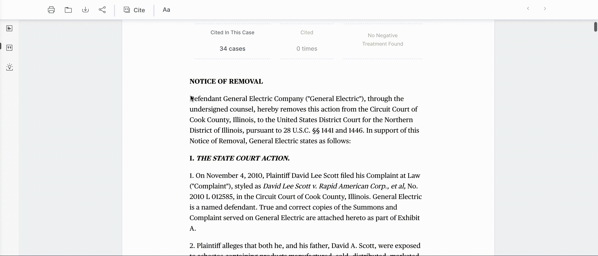
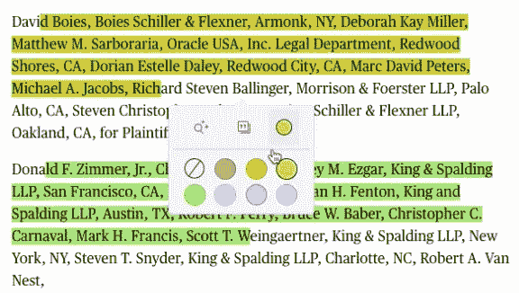
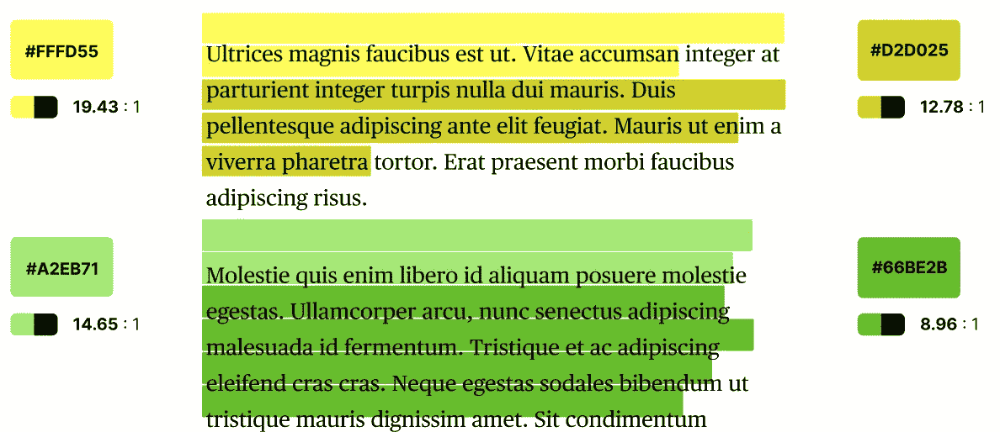

# React 中的中等文本高亮显示

> 原文：<https://javascript.plainenglish.io/medium-like-text-highlighting-in-react-afa35a29a81a?source=collection_archive---------3----------------------->


这是关于成长型工程师的系列文章中的另一篇。这篇特别的文章是关于通过拓宽漏斗底部的[(富博)](https://pixelme.me/blog/marketing-funnel)来增加客户参与度和忠诚度，这个术语经常被市场营销和销售团队使用，也是成长工程师日常工作的一部分。

尽管客户获取是初创公司最关注的领域之一，但产品参与也同样重要。想想一个投资组合；你可以将所有资金投资于短期股票，获得即时流动性，或者投资于长期股票，获得更好的回报。然而，两者兼顾通常是更安全的选择。同样适用于产品。

我们以 Pokemon Go 为例。它的用户获得速度很快，玩家一度痴迷于它，但仅此而已；他们的产品没有粘住。[这里有一篇文章](https://openviewpartners.com/blog/how-to-build-stickiness-into-your-product)，它很好地概述了如何在你的产品中建立粘性。

ROSS growth 团队的任务是构建一个类似媒体的文本突出显示，以平衡用户获取和用户参与。以下是一些验证其重要性的客户请求:

> “你能突出一下吗？如果是的话，你可以用多种颜色突出显示吗？这将是一个伟大的设计特点”
> 
> “…阅读案例时没有明显的手动突出显示功能。如果我发现一些我认为相关的文本，我需要能够突出显示它们。”

下面是一个 gif 图，展示了在生产中使用的第一个中等大小的文本高亮显示。我已经写了我们如何使用我在[这篇文章](https://pargles.medium.com/technical-sushi-burrito-brief-4c6e5d4c3ba6)中描述的不同方法来解决这个项目的评估。



接下来的部分将提供该特性实现的技术概述和我们面临的挑战，以及一些可以作为灵感来源的文章链接。

## 注意事项和第一步

需求被很好地定义，所以是时候评估它的实现了。但是首先，我们需要重新发明轮子吗？一定有 React 或 JavaScript 库为我们做这些，对吗？在这种情况下，不完全是。事实证明，这是一个具有挑战性的领域，与其他突出显示相关的功能(如语法突出显示)有交集。

当专门搜索“中等文本突出显示”时，我们大多会找到引用浮动操作菜单的库和文章，这是它的一部分，第一部分，但不是全部。第二部分是最具挑战性的，其中关键词“内容选择和突出”产生更好的结果和灵感。

我们最终实现了浮动动作菜单和内容选择，并从头开始高亮显示。然而，提及我们在限时研究中的发现仍然是有价值的，因为如果您的团队需要构建类似的东西，它可能会成为灵感。此外，我将提供一些我们内部解决方案的代码片段。

## 浮动操作菜单



有几个 JavaScript(如 [**TinyQ**](https://github.com/aruminant/tinyq) )和 React(如[**React-highlight-pop**](https://github.com/codeshifu/react-highlight-pop))库提供了一个开箱即用的浮动动作菜单，但它们在行为和样式方面限制了我们可以做的事情。

我们在 ROSS 使用[样式化组件](https://styled-components.com/)(组件时代的 CSS)实现了浮动动作菜单。为了获取文本及其在文档中的位置，我们使用了浏览器的[**window . get selection**](https://developer.mozilla.org/en-US/docs/Web/API/Window/getSelection)**，**和一个名为 [xpath-range](https://www.npmjs.com/package/xpath-range) 的库。这个库以 XPath 格式为我们提供了高亮文本的路径，比如 div[2]/p[7]/text[1]，这意味着第二个 div、第七个段落和第一个文本块。文本部分可以有多个索引，因为其他 HTML 标记将文本分割成一个部分，如超链接和粗体。Xpath 还提供了开始和结束偏移量，允许高亮显示的文本在以该格式加载后重新创建。

```
npm install xpath-range
```

下面的代码片段提供了三个函数:

1.  **getSelection()** :它返回关于被选中文本的元数据。点击可以了解更多关于**window . get selection**的信息
2.  **getxpath parameters(xpath)**:这个函数返回选择的 XPath、开始和结束偏移量，如上所述。
3.  **onHighlightAction(params)**:我们正在使用 redux，所以这个[动作](https://redux-saga.js.org/docs/introduction/BeginnerTutorial.html)将构建一个高亮类型的注释对象，而[将调度](https://redux-saga.js.org/docs/basics/DispatchingActions.html)一个 **saveUserUserAnnotation** 将元数据保存到数据库中(更多细节将在数据库模型会话中介绍)。然后，一旦用户再次刷新或加载该页面，该元数据将用于重建高亮显示的文本。

您还应该考虑存储文本本身，以便在 HTML 发生变化时可以进行模糊匹配作为后备。为了更安全，您还可以保留两个单词，继续进行选择，以覆盖突出显示单个单词的边缘情况，在这种情况下，模糊匹配将无助于重新创建选择。

## 内容选择和突出显示



最具挑战性的部分来了，一旦我们有了 xpath，我们如何动态地将文本包装在设置了不同背景颜色的类周围？知道我们还可以在文档打开后重建所有保存的精彩部分。

事实证明，没有多少图书馆可以为我们做这件事。“10 个文本荧光笔 JavaScript 库”博客文章是一个好的开始，JavaScript 文本荧光笔库( [Github](https://github.com/mir3z/texthighlighter) ，[演示链接](http://mir3z.github.io/texthighlighter/demos/simple.html))似乎非常适合我们。不幸的是，它对我们的用例不起作用。

[](https://bashooka.com/coding/text-highlighter-javascript-libraries/) [## 10 个文本荧光笔 Javascript 库

### 因此，这里有 10 个最好的文字荧光笔 Javascript 库，让你突出显示特定的文本，添加搜索关键字…

bashooka.com](https://bashooka.com/coding/text-highlighter-javascript-libraries/) 

因此，我们最终也通过利用另一个名为[**react-html-parser**](https://github.com/wrakky/react-html-parser#readme)**:**的库从头开始构建文本高亮显示逻辑

```
npm install react-html-parser
```

下面的代码片段提供了它如何工作的高级概述。它允许我们预处理**用户注释**(以及其他注释，如**脚注**和系统**段落**)列表，并在它们周围包装 React 组件，以便**reacttmlparser**可以获取原始 HTML 并将其转换为 React 组件。这就是总体思路，也是用 highlightedText 组件包装文本的逻辑所在。

高亮本身带来了几个挑战，因为你的 HTML 可能会包含其他标签，如 **< a href=""/ >** 和 bold**<b>bold</b>**标签，所以你必须决定是否要为每个单词添加一个高亮类，或者将它分解成文本块并给它们一个 CSS 类。下面的帖子(“如何让用户突出你的 HTML”)很好地涵盖了每种方法的利弊。

[](https://blog.emumba.com/how-to-let-users-highlight-your-html-c1013abf68fb) [## 如何让用户突出你的 HTML？

### Medium 已经成为一个非常受欢迎的博客有一段时间了，现在仍然如此。我被介绍到这个博客已经两个月了…

blog.emumba.com](https://blog.emumba.com/how-to-let-users-highlight-your-html-c1013abf68fb) 

## 数据库模型

很好，我们对前端是如何工作的有了一个大致的概念，但是后端呢？最能代表文本高亮的方式是什么？我们将该模型称为用户注释，因为它可以增长到用户评论和用户共享，使其可扩展，即使它目前只是文本高亮显示。我们还选择使用非 SQL 数据库( [AtlasDB](https://www.mongodb.com/cloud/atlas) )，因为它是可伸缩的，是文本存储的完美用例。我们决定遵循 [Web 注释数据模型](https://www.w3.org/TR/annotation-model/) (W3C)格式。

下面是保存到数据库的数据的示例。正如你所看到的，我们使用了两个 W3C 选择器，一个是 **W3CRangeSelector** ，然后由前端使用它来重新创建一个高亮显示的文本，另一个是 **W3CTextQuoteSelector** ，作为将来 HTML 发生变化时的后备选择。

```
{
  "_id": "ac93635f-689d-4d8b-a17b-3e8786b943f8",
  "ownerId": "usr-4d0ee82b-b095-4a8d-8df0-d812c3ad2461",
  "createdAt": 1607511518406,
  "lastModified": 1607511518406,
  "w3cAnnotation": {
    "type": "Annotation",
    "body": [
      {
        "type": "TextualBody",
        "value": null,
        "jsonValue": {
          "meta": {
            "color": "yellow"
          }
        },
        "id": null,
        "format": "application/vnd.ross.user-highlight-meta.v1+json"
      }
    ],
    "target": {
      "type": "W3CWebAnnotation",
      "source": "decision:13349956",
      "selector": [
        {
          "__typename": "W3CTextQuoteSelector",
          "exact": "\"An action to enforce an affidavit of support . . . may be brought against a sponsor in any appropriate court.\" 8 U.S.C. 1183a(e). However, a trial court's judgment must be supported by the pleadings. Tex.R.Civ.P. 301.",
          "type": "TextQuoteSelector"
        },
        {
          "endOffset": 89,
          "startOffset": 1,
          "__typename": "W3CRangeSelector",
          "endContainer": "/div[2]/div[3]/p[4]/text[2]",
          "type": "RangeSelector",
          "startContainer": "/div[2]/div[3]/p[4]/text[1]"
        }
      ]
    }
  }
}
```

我希望你喜欢这篇文章！祝您愉快！