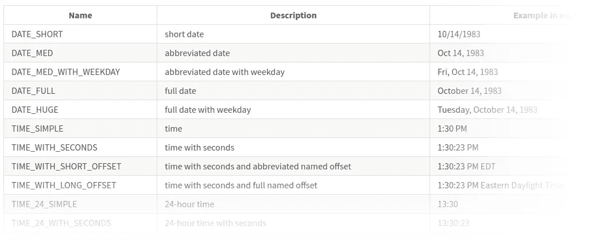

# 认识 Luxon，新的 Moment.js 杀手(第二部分)

> 原文：<https://javascript.plainenglish.io/meet-luxon-the-new-moment-js-killer-part-2-618053938cb6?source=collection_archive---------7----------------------->

## 使用 Luxon 在 React 应用程序中设置日期和时区


Timezones (source: [wikimedia.org](https://upload.wikimedia.org/wikipedia/commons/8/88/World_Time_Zones_Map.png))

## 系列

本文是“**遇见卢克森**”系列的**第二部**。*我强烈推荐先阅读* [*第一篇*](https://medium.com/javascript-in-plain-english/dates-and-time-zone-awareness-in-your-react-application-with-luxon-a-moment-js-successor-d747b2cc0713) *再继续阅读。*这不是点击诱饵:我真的相信当你获得第一篇文章中提供的知识时，你会从这篇文章中获得更多(第一篇文章的重点是更深入地理解**时区**，以及它们如何影响你代码中的日期和时间)。

*这篇*文章基于[优秀的文档](https://moment.github.io/luxon/docs/manual)，结合我自己的见解和评论，深入探讨了如何使用 **Luxon** 库本身。

*   `Part 1` : [时区](https://medium.com/javascript-in-plain-english/dates-and-time-zone-awareness-in-your-react-application-with-luxon-a-moment-js-successor-d747b2cc0713)
*   `Part 2`:使用 Luxon 库(*本文*)

走吧:)

## 概观

我们将依次讨论以下主题:

*   `Time zones`和抵消(摘要)
*   `Intl`(国际化)
*   `Parsing`椰枣
*   `Formatting`日期

# 时区和时差(摘要)

> 注:我住在挪威🇳🇴.我们目前有一个 **UTC+1** 时区(或者: **GMT+1** )。那是我的当地时区。

我再重复一遍，*时区和时差*在第一篇文章中有详细的解释。但是我们可以总结一下我们学到的一些东西。

用 Luxon `DateTime`类创建的每个日期都有一个关联的时区作为其属性之一。如果在创建日期时没有提供时区，Luxon 将使用系统的本地时区**作为默认值。**

如果我们解析一个 [ISO 8601](https://en.wikipedia.org/wiki/ISO_8601) 字符串(在我们的代码中被称为`**isoString**`)，而**没有**时区标志符，则日期被假定为当地时间:

注意源日期如何包含时间“12:00:00”。在解析并格式化日期*后，没有明确定义时区细节*，Luxon 假定这是我的本地时区(挪威)GMT+1 的日期。

这可有**大暗示**！

假设我们从一家在香港运营的公司托管的 API 接收到了这个`isoString`值(IANA 时区数据库符号“`Asia/Hong_Kong`”)。香港有一个 **UTC+8 偏移**。

如果我们像刚才那样简单地解析日期，它将在我们的系统(或我们的前端)中作为**错误日期**结束:我们的代码(Luxon)将假定该字符串表示 UTC+1 的 12:00h，而来自香港的数据发布者很可能打算发送一个表示他的时区(UTC+8) 的 1 月 20 日 12:00h 的日期。

> 如果你是一家大型跨国公司的开发人员，或者有一天你会成为，这些情况会发生。而且他们**会**惹麻烦。

这就是为什么通常认为以两种方式之一“通过网络传输数据”是最佳实践:

*   作为 ISO 8601 字符串，*带有*时区指示符后缀(例如:`2020–01–20T12:00:00**+08:00**`)
*   作为 UTC 中的日期

换句话说，如果找不到时区指示符，我们应该假设日期*是 UTC* 中的一个日期。您还应该将日期**作为 UTC 存储在数据库**中。至少，这是最佳实践。这并不意味着这种情况总是会发生……但现在你至少意识到了一些陷阱👍。

关于时区的更多细节可以在第一篇文章中找到。让我们继续前进。

# 国际化

在我们开始解析和格式化日期之前，值得一提的是 Luxon 从浏览器使用了[本地 Intl API](https://developer.mozilla.org/en-US/docs/Web/JavaScript/Reference/Global_Objects/Intl) 。

Luxon 知道您(本地)系统的*区域设置*，并将其作为默认设置。

> 什么是**区域设置**？由诸如“en-US”或“es-ES”之类的字符串标识的区域设置表示关于语言、日历类型、时钟类型、编号系统类型等的信息。([来源](https://developer.mozilla.org/en-US/docs/Web/JavaScript/Reference/Global_Objects/Intl/Locale))

我已经将我的操作系统(Ubuntu)配置为默认使用“en-US”语言环境，因为我更喜欢用英语工作。Luxon 利用了这一点，并在解析或格式化日期时将其用作默认值:

```
log(DateTime.local().locale);
// = en-US (the locale on my local system)
```

当我们**格式化**我们的`isoString`时，这变得相关和可见:

```
log(DateTime.fromISO(isoString).toLocaleString(full));
// = **January** 20, 2020, 12:00 PM GMT+1
```

一月是用英语写的。
我们可以改变这种情况:

```
log(DateTime
  .fromISO(isoString)
 **.setLocale("es-ES")**
  .toLocaleString(full)
);
// 20 **de enero** de 2020 12:00 CET
```

输出特定于*地区的*字符串和信息的函数(`toLocaleString`是其中之一)，比如日期和月份名称，现在返回西班牙语*名称。此外，请注意在其他变化中，段*的*顺序是如何变化的；这都是由语言环境决定的。*

您可以**更改 Luxon 使用的默认区域设置**:

```
import { Settings } from "luxon";
Settings.defaultLocale = "es-ES";
```

浏览文档了解更多国际化细节[🙂。](https://moment.github.io/luxon/docs/manual/intl.html)

# 解析日期

既然我们现在是时区和国际化的专家(…)，我们可以看看解析日期。

Luxon 允许我们用不同的方法解析各种“原始”值。但是正如他们自己所说的:

> “Luxon 不是一个 NLP 工具，不适合所有的日期解析工作。
> 但是它可以做一些解析

让我们快速浏览一下其中的一些。请注意，我已经为下面的所有代码片段设置了这些默认值:

```
Settings.defaultZoneName = "**UTC**";
Settings.defaultLocale = "**en-US**";
```

## 。fromISO(值)

## 。fromSQL(值)

## 。fromMillis(值)，。从秒(值)

## 。fromFormat(值)

浏览文档了解更多的[解析功能](https://moment.github.io/luxon/docs/manual/parsing.html)🙂。

# 格式化日期

## 。toLocalString(选项)

到目前为止，我们只使用了`.toLocaleString`来输出日期。我们将预置常数`**DateTime.DATETIME_FULL**`作为参数传递。Luxon 提供了广泛的预设列表:



You can find the full list on [this page](https://moment.github.io/luxon/docs/manual/formatting.html).

你也可以提供你自己的**定制值**。该值应该是对象。`DATETIME_FULL`的价值是:

您可以在 [Luxon 文档](https://moment.github.io/luxon/docs/manual/formatting.html#tolocalestring--strings-for-humans-)或 MDN 上的[中阅读关于此**选项对象**的更多信息。](https://developer.mozilla.org/en-US/docs/Web/JavaScript/Reference/Global_Objects/Intl/DateTimeFormat)

## 。toFormat(令牌)

你们中的一些人可能习惯于在格式化日期时使用标记，特别是如果你已经使用了 *Moment.js* 。我们可以用`.toFormat`做到这一点:

只有在前端显示日期时，才应该使用标记格式。一旦开始“通过网络”共享数据，或者将数据存储在数据库中，就应该使用 ISO 格式(如前所述)。

## Unix 时间戳

如果您需要检索以毫秒或秒为单位的*日期*的值，您可以使用:

```
DateTime.fromISO(isoString).**toMillis**();
DateTime.fromISO(isoString).**toSeconds**();
```

浏览文档了解更多[格式化功能](https://moment.github.io/luxon/docs/manual/formatting.html)🙂。

# 结论

虽然 Luxon 在某些场合的工作方式与 Moment.js 有点不同，但我觉得它使用起来非常直观。您通常会注意到，这只是构建在浏览器本地 API 之上的一个层。有些部分我比 Moment 更喜欢，而有些部分则相反。

但是想到我们利用了原生浏览器的强大功能，还是令人欣慰的。我们应该接受我们的浏览器正在向前发展。

最后但同样重要的是:Luxon 留下的足迹比 chunky Moment.js 小得多(在包的大小上)

感谢您的宝贵时间！

杰拉德·范德普特