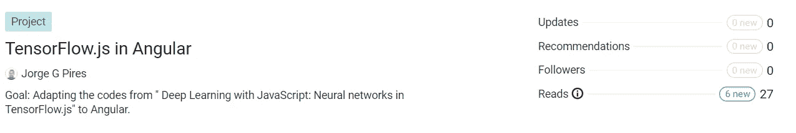
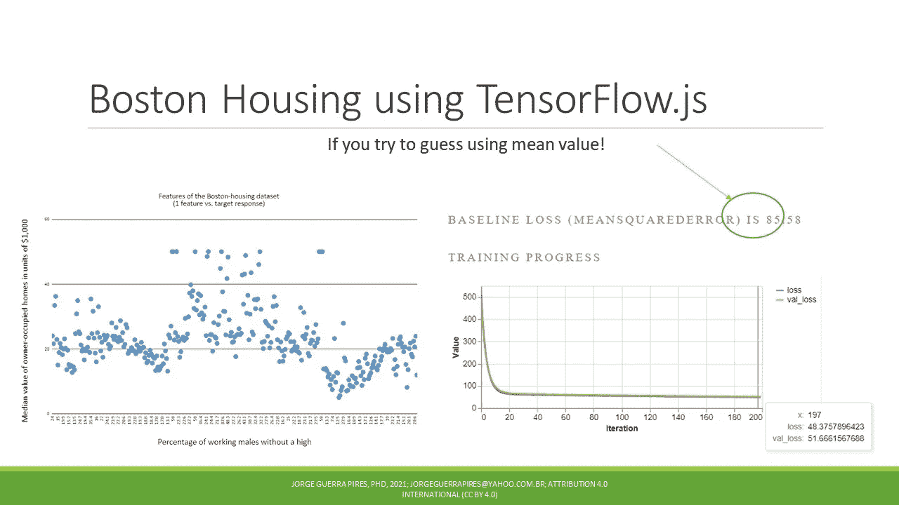

# 来看看我的项目“TensorFlow.js in Angular”:开发基于角度的机器学习应用

> 原文：<https://javascript.plainenglish.io/meet-my-project-tensorflow-js-in-angular-working-on-angular-based-machine-learning-apps-cce1874b7984?source=collection_archive---------7----------------------->

Man vs. Machine

# 什么是有角？🤔

Angular 是一个框架，由 Google 团队设计，它已经被广泛用于设计网站。本质上，它是一个基于 TypeScript 创建前端的框架。通俗地说:你在网络浏览器上看到并交互的页面。

> 这是一个创建前端的框架。

# TensoFlow.js 是什么？🤔

TensorFlow.js 是基于 JavaScript 的深度学习库，基于经典的 TensorFlow，用 Python 编写；还可以做简单的学习机，用张量做一些简单的数学运算等等。使用 TensorFlow.js 而不使用 Python 有几个原因，我希望将来能回到这一点。

很好的一点是，他们声称模型可以双向转换。

> 可以在两个方向上转换模型。

此外，他们声称这两个库是相似的，使得来自两个社区的程序员更容易一起工作，没有隔离，“我们反对他们”，“什么更好什么更差”等等。让我们一起工作，改变世界，而不是战斗！

# 为什么我认为它们很配🤔

请看我的文章:“[为什么我在认真考虑 JavaScript 和深度学习？而且我建议你这么做](https://jorgeguerrapires.medium.com/why-am-i-considering-seriously-javascript-and-deep-learning-and-i-would-suggest-you-to-do-so-976b7f89b4f0)、 [MEAN + TensorFlow.js:基于机器学习的 web 应用的单一语言、单一数据交换格式！](https://jorgeguerrapires.medium.com/mean-tensorflow-js-51fb7cb5d671)

# **目标**

将“用 JavaScript 进行深度学习:TensorFlow.js 中的神经网络”中的代码改编为 Angular。

# **假设**

Angular 提供了比普通 JavaScript 编码更强大的工具。

# 我面临的一些困难

*   我知道 TypeScript 的存在是有原因的，但是在 TensorFlow.js 中使用 TypeScript 是一个挑战。最大的挑战是知道所有东西的类型，否则，你不能运行任何东西。有时，很难找到这些信息，即使是在官方文档中。我使用的代码是普通的 JavaScript，不需要了解类型(这是 TYPEscript 的专长，它被称为 TypeScript:它是 JavaScript 的扩展，是强“类型化的”)。
*   下面提到了我的推特，想评论就评论吧！我知道，正如我一直坚持的那样，只要有耐心，你就能发现任何事情，解决任何困难；幸运的话，将来会有其他人来解决这个问题。

My tweet wherein I speak about the fact that TypeScript may add some initial difficulties to using TensorFlow.js with Angular

***起点*** :《深度学习与 JavaScript:tensor flow . js 中的神经网络》

on ResearchGate

一个使用 TensorFlow.js 的简单模型，用于经典的 [Bouston 住房问题](https://www.kaggle.com/c/boston-housing)

Simulations using TensorFlow.js, using one neuron with no activation.

下面我的推文，随意评论！

My tweet talking about the fact that learning machine today can do things that in the past seemed impossible. See the history of neural networks, quite intriguing

人们对我的推文有反应！也留下你的印象！🙏❤💪

Tweet, with good engagement, wherein I talk about this project!

# 跟我来

*   [研究之门](https://www.researchgate.net/project/TensorFlowjs-in-Angular)
*   [GitHub](https://github.com/JorgeGuerraPires/TensorFlow.js-in-Angular)
*   你也可以跟着我来这里！💪💪
*   [Linkedin](https://www.linkedin.com/company/76134456/admin/)；
*   我会在这篇文章上整理即将到来的相关文章！

让我们保持联系！🙏❤💪🙏💕💕🎉

Article on Twitter, feel free to leave your reactions!

## 一个活沙盒

 [## TfjsWithAngular

### 编辑描述

jorgeguerrapires.github.io](https://jorgeguerrapires.github.io/) 

# **作品列表**

*   [在 Angular 中使用 TensorFlow.js 可能遇到的问题](https://jorgeguerrapires.medium.com/problems-you-may-encounter-using-tensorflow-js-in-angular-7e28d118bc4d)

# 致力于

*   在 TypeScript 中使用 TensorFlow.js 时可能需要了解的一些类型

# 学习人工智能的神经模型:使用 TensorFlow.js

## 捐款

给我买杯☕☕☕☕☕咖啡或者一本书！📚📚📚📚📚

如果这些内容对你有用的话！是一次性捐款，不用再捐了！
[https://www.buymeacoffee.com/jorgepires](https://www.buymeacoffee.com/jorgepires)

现在你也可以支持我的任何项目！🥰🥰
更多信息:[https://jorgeguerrabrazil . wix site . com/ideacodinglab/publications](https://jorgeguerrabrazil.wixsite.com/ideacodinglab/publications)

*更多内容请看*[***plain English . io***](https://plainenglish.io/)*。报名参加我们的* [***免费周报***](http://newsletter.plainenglish.io/) *。关注我们关于*[***Twitter***](https://twitter.com/inPlainEngHQ)*和*[***LinkedIn***](https://www.linkedin.com/company/inplainenglish/)*。查看我们的* [***社区不和谐***](https://discord.gg/GtDtUAvyhW) *加入我们的* [***人才集体***](https://inplainenglish.pallet.com/talent/welcome) *。*