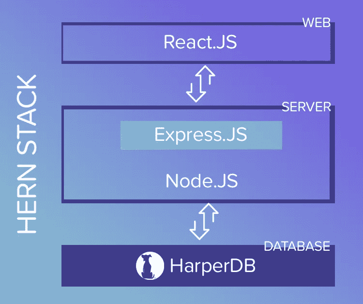

# 认识一下 HERN 堆栈，这里的一切都是用 JavaScript 编写的

> 原文：<https://javascript.plainenglish.io/meet-the-hern-stack-where-everything-is-written-in-javascript-929269ade2a7?source=collection_archive---------3----------------------->

## HERN 栈代表 HarperDB、Express、React 和 Node，它们都是用 JavaScript 编写的

新的技术术语和行话不断出现在开发领域。很难跟上！人们也喜欢分享和讨论他们最喜欢的技术堆栈、工具和框架。也就是说，在选择技术堆栈时，没有最终的正确或错误答案，因为它实际上取决于它要解决的特定用例。

今天，让我们来看看 HERN 堆栈。听说过吗？正如他们所说，这是一个新的“时髦词”，我认为这可能有助于提供一些清晰度。HERN 堆栈代表 HarperDB、Express、React 和 Node，这四种技术构成了这个特定的堆栈。都是用 JavaScript 写的。这是一个全栈解决方案，遵循通用的三层架构(前端、应用程序和数据库)。

如前所述，有许多堆栈，在为您的项目选择特定的堆栈时，不同的因素会发挥作用。您可以自由选择和尝试不同的堆栈！为了确保我们都在同一页上，Stackshare 将技术栈定义为“一个组织用来构建 web 或移动应用程序的一组技术。它是开发人员使用的编程语言、框架、库、模式、服务器、UI/UX 解决方案、软件和工具的组合。”如你所见，组合和可能性是无穷无尽的！

# 什么构成了 HERN 堆栈？

*   HarperDB :通过 REST API 访问的分布式 SQL / NoSQL 混合数据库
*   [express . js](https://expressjs.com/):node . js 的开源后端 web 应用框架，设计用于构建 web 应用和 API
*   [React.js](https://reactjs.org/) :开源，前端，用于构建用户界面或 UI 组件的 JavaScript 库
*   Node.js :开源、跨平台、后端 JavaScript 运行时环境，在 web 浏览器之外执行 JavaScript 代码

这些技术能够很好地协同工作，并成为应用程序和 web 开发等项目的优秀全栈解决方案，有几个原因。这种堆栈也有其他的变体，比如交换和整合框架，比如 Vue、Angular 或 Fastify。HEAN、HEVN、HFRN……组合无穷无尽。不要害怕发挥创造力，选择对你最有意义的技术！

# HERN 堆栈是如何工作的？

*Hern Stack Functionality Flowchart*

像大多数技术堆栈一样，这个堆栈有前端、后端和数据库层。HERN 堆栈允许您用 JavaScript 编写任何东西，最终简化和精简开发过程。HERN 堆栈的每个组件都提供了独特的优势，数据可以自然地流经三层中的每一层，从而实现快速开发和简单维护。(*有趣的事实——Harper db 实际上是 Node.js 中唯一从头开始构建的数据库，你可以* [*在这里*](https://www.harperdb.io/post/building-a-database-written-in-nodejs) 阅读更多信息！)

# 前端

React 充当 HERN 堆栈的前端或 web 层。React 的众多原因之一是[接管前端开发](https://insights.daffodilsw.com/blog/7-reasons-why-reactjs-is-taking-over-frontend-development)，因为它实现了更快的开发，简化了编码和集成，并带来了强大的社区。HarperDB 管理工作室是用 React 写的。React 提高了前端开发的质量，并允许我们快速地对应用程序进行更改和改进。

HarperDB 还提供了一个很棒的 [React SDK](https://www.npmjs.com/package/use-harperdb) ，如果这是您的风格，或者您可以通过我们内置的、易于使用的 API 直接调用 HarperDB。无论哪种方式，如果您愿意，都可以直接从客户端应用程序中查询数据。 [React Hooks](https://reactjs.org/docs/hooks-intro.html) 是一个管理 API 调用以及如何在应用中处理响应的好地方。

# 后端

Node.js 和 Express.js 充当 HERN 堆栈的后端服务器或应用层。Express 本质上是在一个节点服务器内运行，作为服务器端框架。Express 是一个最小且灵活的框架，有许多 HTTP 实用方法和中间件供您使用。

这里的想法是您构建自己的自定义 API 函数(GET、POST 等。)Express 由 React 前端调用。然后这些函数从服务器调用 HarperDB 来访问和修改数据库。您可以利用 HarperDB [Node.js 客户端](https://www.npmjs.com/package/harperive)，它本身支持承诺和回调。该库通过将每个 HarperDB 操作公开为客户机对象上的一个函数，使 HarperDB 交互感觉更像 JavaScript。

# 数据库ˌ资料库

如果您需要存储或传输任何类型的数据，您可能会这样做，您还需要一个数据库。有许多数据库选项，这实际上取决于您的特定项目或数据的最终目标。我们发现 HarperDB 可以与这个堆栈中的其他技术无缝协作，但是正如前面提到的，您可以交换堆栈的不同部分，以找到最适合您的技术。简单介绍一下背景知识:HarperDB 提供了完整的文档存储能力，以及企业级的 ACID 兼容 SQL，这有效地允许您在 JSON 上运行 SQL。使用 SQL 和 NoSQL 操作，通过单个端点 REST API 访问数据库。通过动态模式，HarperDB 被设计为大规模接收和处理任何类型的数据。借助 HarperDB 的集群和复制功能，扩展变得很容易，我们的数据模型构建在 [LMDB](https://www.harperdb.io/post/lmdb-deep-dive-interview) 之上，使我们能够打破读写速度的记录。目标是简化数据库安装、配置和管理的大部分工作。

# HERN 是你的下一个全栈解决方案吗？

基本上，你可以用 HERN 栈构建任何东西，它对于 JavaScript 开发人员和有大量 JSON 数据的项目来说尤其有用。HarperDB、Express、React 和 Node 配合得很好，有了这个技术堆栈，您可以最大限度地利用编写代码的时间，专注于您的项目，而不是调试和其他管理任务。

当谈到你的技术堆栈时，有这么多的选择——HERN、HEAN、HEVN、MERN、MEAN、LAMP 等。—尝试不同的堆栈以确定哪一个最适合您的使用情形或技能组合非常重要！