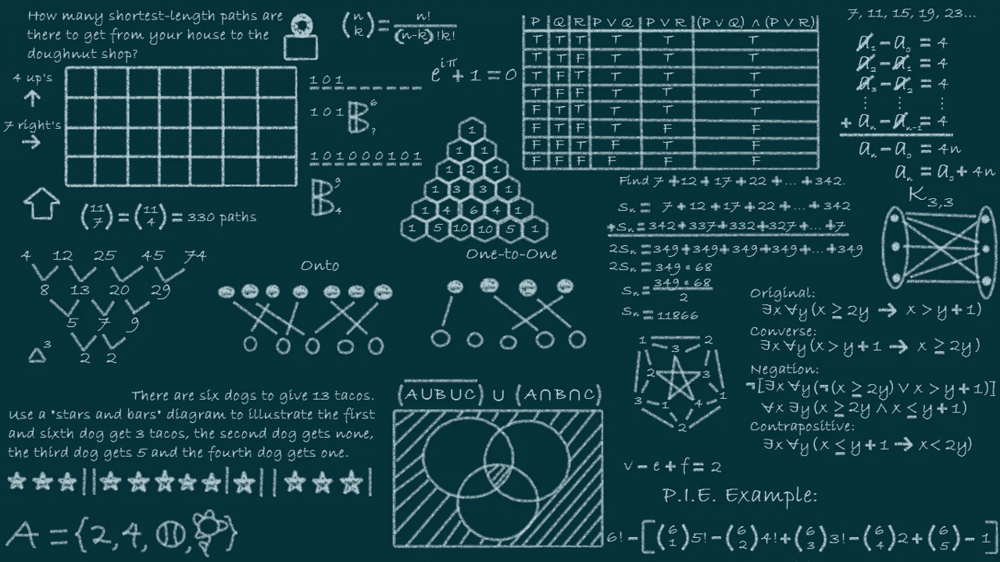

# 合并排序算法:JavaScript 中的一个解释

> 原文：<https://javascript.plainenglish.io/merge-sort-algorithm-an-explanation-in-javascript-a9b33cb6587e?source=collection_archive---------7----------------------->



归并排序是计算机科学中最常用的排序算法之一，也是最高效的排序算法之一。它基于“分而治之”的原则，这种技术是许多不同问题的有效算法的基础。

在本文中，我将讨论这个算法背后的概念，并向您展示一个 JavaScript 示例。

# 解释概念

分治算法递归地将一个问题分解成更小的问题，直到这些问题变得足够简单可以解决。然后将子问题的解决方案组合起来，给出原问题的解决方案。

在排序算法中，对两个已排序的数组进行排序比对一个未排序的数组进行排序更容易。一旦你有了两个排序后的数组，你就可以把它们合并成一个数组，方法是逐个比较它们的项，然后先把较小的项加起来。

这个概念很容易理解，但仍有一个问题。我们如何达到有两个排序数组的状态？好吧，我们可以分而治之。我们将递归地把数组分成两半。我们这样做，直到我们达到比较多对单项目数组的程度。

你可以在下面清楚地看到我们是如何递归地将数组分割成更小的数组，直到我们只有单个元素的数组。

```
 [1,9,3,8,6,5,7,4,2] [1,9,3,8]              [6,5,7,4,2]             [1,9]       [3,8]       [6,5]       [7,4,2]             [1]   [9]   [3]   [8]   [6]   [5]   [7]     [4,2]             [1]   [9]   [3]   [8]   [6]   [5]   [7]   [4]   [2]
```

在这一点上，我们开始向相反的方向移动，重新组装数组比较项目，并把它们放在正确的顺序。当算法结束时，我们将只有一个排序后的数组。您可以在下面看到排序过程是如何进行的。

```
 [1]   [9]   [3]   [8]   [6]   [5]   [7]   [4]   [2] [1]   [9]   [3]   [8]   [6]   [5]   [7]     [2,4] [1,9]       [3,8]       [5,6]       [2,4,7] [1,3,8,9]              [2,4,5,6,7] [1,2,3,4,5,6,7,8,9]
```

下面你会看到一个 JavaScript 实现。它利用内置的 slice 函数来获取我们需要的数组部分。在这段代码中，我们使用了两个独立的函数来清楚地展示这个过程是如何工作的。

```
const mergeSort = (arr) => {
  if (arr.length <= 1) {
    return arr;
  }
  const middle = Math.floor(arr.length / 2);
  return mergeArray(
    mergeSort(arr.slice(0, middle)), 
    mergeSort(arr.slice(middle))
  );
};const mergeArray = (left, right) => {
  let result = [];
  while (left.length && right.length) {
    if (left[0] < right[0]) {
      result.push(left.shift());
    } else {
      result.push(right.shift());
    }
  } return [...result, ...left, ...right];
};const unorderedArray = [1, 9, 3, 8, 6, 5, 7, 4, 2];console.log(mergeSort(unorderedArray)); *// Returns ordered array*
```

`mergeSort`函数分割数组，每半个数组调用一次。在返回的路上，我们使用`mergeArray`将数组和条目按照正确的顺序放在一起。

正如您在代码中看到的，合并排序算法的实现非常简单。一旦你理解了这个概念，用任何语言实现它都相对容易。

好了，这一次就到此为止。让我知道你的想法。编码快乐！

*更多内容尽在*[***plain English . io***](http://plainenglish.io/)