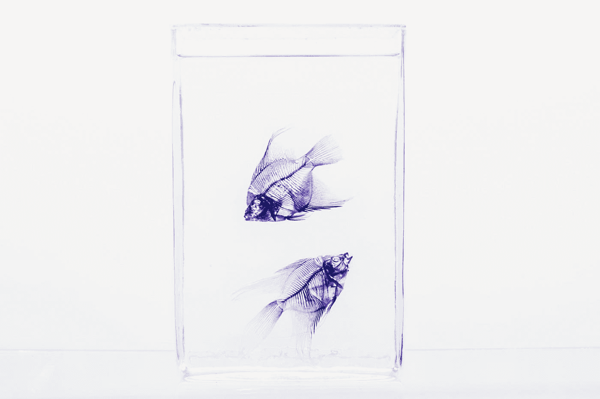

# 如何在电子窗口之间发送消息

> 原文：<https://javascript.plainenglish.io/messaging-between-electron-windows-a646b0af7d8d?source=collection_archive---------6----------------------->



Photo by [Maria Teneva](https://unsplash.com/@miteneva?utm_source=medium&utm_medium=referral) on [Unsplash](https://unsplash.com?utm_source=medium&utm_medium=referral)

在多个窗口中的 React 应用程序之间复制剪贴板数据。

Electron 中的多个窗口不共享相同的数据模型，必须使用进程间通信来共享数据。

尽管所有的窗口都来自同一个应用程序，但每个窗口都是一个包含唯一 Chromium web 视图的`BrowserWindow`实例。在窗口之间发送消息类似于 web 浏览器中的选项卡或窗口。

在 web 浏览器中，您可以使用广播频道进行通信。

定义通道后，发布的消息将为侦听器调度事件:

```
const channel = new BroadcastChannel("mychannel");// Send a message:
channel.postMessage("Hello, world");// Receive a message:
channel.onmessage = (event) => {
  console.log(event);
});
```

在 electronic 中，通过将消息从呈现进程发送到主进程，利用了类似的策略。然后，主进程向所有渲染窗口发送消息。

## 剪贴板示例

例如，考虑我们想要在窗口之间共享的高级剪贴板数据。每个窗口可能运行独特的应用程序；或者，同一个应用的多个实例。

我将继续我的多窗口电子应用程序帖子:

[](https://jasonsturges.medium.com/multiple-window-electron-app-9dbffde8ce95) [## 多窗口电子应用程序

### 轻松打开多个窗口类似于 Visual Studio 代码的文件≫新窗口。

jasonsturges.medium.com](https://jasonsturges.medium.com/multiple-window-electron-app-9dbffde8ce95) 

在那个例子中，新窗口可以通过*文件≫新窗口*打开，这有效地创建了完全相同的 React 应用的新实例。

## 发送数据

从任何窗口的 web 内容中，将数据有效载荷序列化到 JSON，并通过`ipcRenderer`将其发送到所需的通道。在这个例子中，客户端将使用`clipboard-send`发送剪贴板数据。

```
const { ipcRenderer } = require('electron');const copy = (data) => {
  const json = JSON.stringify(data);
  ipcRenderer.send("clipboard-send", json);
}
```

在主线程(`main.dev.js`)中，在`ipcMain`上创建一个监听器来处理从任何窗口的渲染器进程分派的`clipboard-send`通道事件。然后，通过发送`clipboard-receive`通道事件将该数据转发回所有窗口:

```
const { ipcMain} = require('electron');

ipcMain.on('clipboard-send', (event, json) => {
  windows.forEach(window => {
    window.send('clipboard-receive', json);
  });
});
```

## 接收数据

现在主线程向所有窗口发送消息，每个窗口都需要监听`clipboard-receive`通道上的事件:

```
const { ipcRenderer } = require('electron');let clipboard = {};ipcRenderer.on('clipboard-receive', (event, json) => {
  if (!json) return; const data = JSON.parse(json);
  clipboard = data;
});
```

每个窗口的渲染器线程现在可以反序列化数据负载，并将其缓存在本地剪贴板中。

完整生命周期:

*   一个窗口的渲染器线程向主线程发送消息
*   主线程将消息回显到所有窗口
*   所有窗口都接收带有数据负载的事件

## 新窗口

这里是数据广播后创建的窗口。继续剪贴板的例子，让我们说:

*   一个窗口将数据复制到剪贴板
*   一个新窗口打开了
*   用户试图粘贴到新窗口中—该窗口自消息广播后创建以来没有收到任何事件。

在这种情况下，您可以在主渲染器中创建本地缓存；然后，在创建新窗口时自动发送剪贴板数据。

```
const { ipcMain } = require('electron');let clipboardCache;export const createWindow = async () => {
  let newWindow = new BrowserWindow();
  // ... newWindow.webContents.on('did-finish-load', () => {
    // Send clipboard data
    newWindow.send('clipboard-receive', clipboardCache);
  });
}
```

## 把所有的放在一起

在窗口中显示的 JavaScript 代码中，例如 React 应用程序，向主线程发送和接收事件。这类似于客户端和服务器之间的通信:

```
const { ipcRenderer } = require('electron');// Local clipboard cache
let clipboard = {};// Send clipboard data to the main thread
const copy = (data) => {
  const json = JSON.stringify(data);
  ipcRenderer.send("clipboard-send", json);
};// Listen for incoming clipboard data
ipcRenderer.on('clipboard-receive', (event, json) => {
  if (!json) return;

  const data = JSON.parse(json);
  clipboard = data;
});// Do something with the clipboard data
const paste = () => {
  if (!clipboard) return; // ...
};
```

在主线程(`main.dev.js`)中，加入前面的多个例子:

```
const { ipcMain} = require('electron');**// Clipboard cache
let clipboard;**const windows = new Set();export const createWindow = async () => {
  if (
    process.env.NODE_ENV === 'development' ||
    process.env.DEBUG_PROD === 'true'
  ) {
    await installExtensions();
  } let x, y; const currentWindow = BrowserWindow.getFocusedWindow(); if (currentWindow) {
    const [currentWindowX, currentWindowY] = currentWindow.getPosition();
    x = currentWindowX + 24;
    y = currentWindowY + 24;
  } let newWindow = new BrowserWindow({
    show: false,
    width: 1200,
    height: 812,
    x,
    y,
    webPreferences: {
      nodeIntegration: true
    }
  }); newWindow.loadURL(`file://${__dirname}/app.html`); newWindow.webContents.on('did-finish-load', () => {
    if (!newWindow) {
      throw new Error('"newWindow" is not defined');
    }
    if (process.env.START_MINIMIZED) {
      newWindow.minimize();
    } else {
      newWindow.show();
      newWindow.focus();
    } **// Send clipboard data to new window
    newWindow.send('clipboard-receive', clipboard);** }); newWindow.on('closed', () => {
    windows.delete(newWindow);
    newWindow = null;
  }); newWindow.on('focus', () => {
    const menuBuilder = new MenuBuilder(newWindow);
    menuBuilder.buildMenu();
  }); windows.add(newWindow);
  return newWindow;
};app.on('activate', () => {
  // On macOS it's common to re-create a window in the app when the
  // dock icon is clicked and there are no other windows open.
  if (windows.size === 0) createWindow();
}); **// Echo clipboard data back to all windows:
ipcMain.on('clipboard-send', (event, json) => {
  clipboard = json;** **windows.forEach(window => {
    window.send('clipboard-receive', json);
  });
});**
```