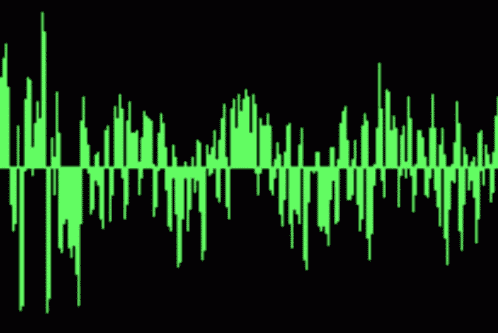
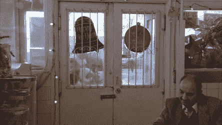

# 使用“反应”和“画布”的麦克风音频可视化工具

> 原文：<https://javascript.plainenglish.io/mic-audio-visualizer-using-react-and-canvas-4e89905141ac?source=collection_archive---------3----------------------->

## 从浏览器实时可视化麦克风音频的简单方法

最近，在我正在做的项目中，我得到了一个极好的机会，可以使用 React 和 canvas 创建一个音频可视化工具。我非常喜欢实现音频可视化工具，所以我想在第一篇博客文章中分享我的经验。

> 谷歌搜索“带麦克风的 web 音频 api 可视化工具”显然应该为您带来一些不错的结果:)
> 
> 本地麦克风流+网络音频 api +画布是这里的主要要求！

*如果您从未使用过 Create React App，* [*单击此处*](https://github.com/facebook/create-react-app) *访问 facebooks github 了解如何使用。*

首先，让我们拥有 Canvas 元素，然后在 Canvas 元素的`ref`属性内传递启动的`useRef`钩子。

现在让我们创建一个方法，提示用户允许使用一个媒体输入，这个媒体输入会产生一个带有包含所请求的媒体类型的轨道的`[MediaStream](https://developer.mozilla.org/en-US/docs/Web/API/MediaStream)`。在这里，我们请求只使用音频输入。

“音频测试”方法将首先检查用户设备中媒体设备的可用性，然后请求音频输入访问。

“ [AudioContext()](https://developer.mozilla.org/en-US/docs/Web/API/AudioContext) ”构造器创建了一个新的`[AudioContext](https://developer.mozilla.org/en-US/docs/Web/API/AudioContext)`对象，该对象表示一个音频处理图，由链接在一起的音频模块构建而成，每个模块都由一个`[AudioNode](https://developer.mozilla.org/en-US/docs/Web/API/AudioNode)`表示。

`[BaseAudioContext](https://developer.mozilla.org/en-US/docs/Web/API/BaseAudioContext)`界面的“createAnalyser()”方法创建一个`AnalyserNode`，可用于展示音频时间和频率数据并创建数据可视化。

“analyser.fftSize”接口是一个无符号长值，表示执行快速傅立叶变换(FFT)以获取频域数据时使用的样本窗口大小。

“createMediaStreamSource()”创建与代表音频流的`MediaStream`相关联的`[MediaStreamAudioSourceNode](https://developer.mozilla.org/en-US/docs/Web/API/MediaStreamAudioSourceNode)`，该音频流可能来自本地计算机麦克风或其他源。

`AnalyserNode`接口的“analyser.frequencyBinCount”只读属性是一个无符号整数，是`[AnalyserNode.fftSize](https://developer.mozilla.org/en-US/docs/Web/API/AnalyserNode/fftSize)`的一半。这通常等同于您必须处理的可视化数据值的数量。

现在我们准备用一点数学绘制频率数据，用魔法包裹，我们的可视化工具将在画布上可视化。

`analyserCanvas.current.[getContext](https://developer.mozilla.org/en-US/docs/Web/API/HTMLCanvasElement/getContext)(‘2d’)`方法返回画布上的绘图上下文，或者如果上下文标识符不被支持，或者画布已经被设置为不同的上下文模式，则返回`null`。

这些线将创建我们的音频可视化工具，并根据输入音频实时将它们绘制到画布中。

## 结论

如果你想知道更多关于这个话题的信息，欢迎在下面的评论区问我任何问题。我将感谢你的建议和意见。

感谢阅读！