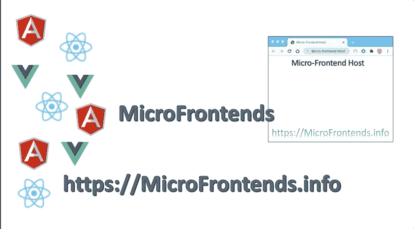
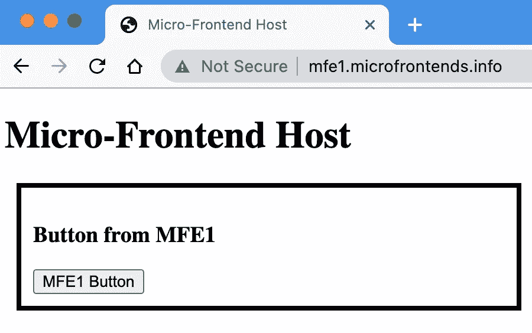

# 从初学者到专家的微前端

> 原文：<https://javascript.plainenglish.io/micro-frontends-from-the-begining-to-expert-33d660a05bb5?source=collection_archive---------4----------------------->

在这篇文章中，我将整理所有以前的文章和视频，以帮助人们逐渐理解微前端，并实施实践项目来了解更多关于这个概念的内容:

这是 YouTube 的播放列表:[https://youtu.be/AZDDIgJSKU0](https://youtube.com/playlist?list=PLjzEd-em7iW_-cUUki8Zt15mGF6ZrOQPn)

## 1.微前端基础:什么、为什么和如何

这篇文章可以是一个很好的起点。我解释了什么是微前端，为什么我们需要使用它们，以及在实践中实现它们的不同方法。

 [## 微前端:什么、为什么和如何

### 在我以前的文章(本文末尾的链接)中，我亲自展示了什么是微前端以及如何…

www.linkedin.com](https://www.linkedin.com/pulse/micro-frontends-what-why-how-rany-elhousieny-phd%E1%B4%AC%E1%B4%AE%E1%B4%B0) 

## 2.使用哪个框架？

在过去的几年里，我一直在帮助许多客户和公司迁移到[微前端](https://www.linkedin.com/pulse/micro-frontends-what-why-how-rany-elhousieny-phd%E1%B4%AC%E1%B4%AE%E1%B4%B0/#:~:text=What%20is%20a%20Micro-Frontend)。我们总是从那个著名的问题开始，“ ***使用哪个框架？*** “下面这篇文章会给你一些思路:

 [## 微前端:使用哪个框架？

### 在过去的几年里，我一直在帮助许多客户和公司迁移到微前端。我们总是从…

ranyel.medium.com](https://ranyel.medium.com/microfrontends-which-framework-to-use-457d5bed173e) 

# 模块联合框架:

对于新项目，我建议避开 CRA。虽然它节省了大量的配置，但它限制了您。学习 Webpack 并创建自己的配置。这是值得的。在这种情况下 ***模块联合*** 将是微前端的最佳选择。对于遗留站点，使用服务器端或构建时合成将它们包含到新创建的微前端中。以下文章将解释如何使用 Webpack 构建网站，以及如何使用模块联合构建微前端。

## 1.创建 react 应用程序，但不创建 React 应用程序

正如我在本文的[中所解释的，你需要打破对 CRA 的依赖，以使模块联邦顺利工作，没有问题，没有黑客攻击。](https://ranyel.medium.com/freedom-from-create-react-app-how-to-create-react-apps-without-cra-27fadeb79c82)

 [## 从创建-反应-应用中解放出来(如何在没有 CRA 的情况下创建反应应用)

### 当我开始使用模块联盟迁移到微前端时，我面临着两个挑战

ranyel.medium.com](https://ranyel.medium.com/freedom-from-create-react-app-how-to-create-react-apps-without-cra-27fadeb79c82) 

请按照下面的文章创建一个没有 CRA 的 React 应用程序样板文件

 [## 创建 react 应用程序而不创建 React 应用程序(CRA)

### 这篇文章将展示如何在不使用 create-react-app (CRA)的情况下创建 React 应用程序。有关我们为什么的更多详细信息…

www.linkedin.com](https://www.linkedin.com/pulse/create-react-app-without-create-react-app-cra-elhousieny-phd%25E1%25B4%25AC%25E1%25B4%25AE%25E1%25B4%25B0) 

## 2.第一个 Node.js 微前端动手项目

本文是第一个有助于实际操作的项目。大多数项目的解释将在其他文章中介绍。在本文中，我创建了两个微前端组件，公开简单的项目和一个呈现它们的容器。为了简单起见，我只使用 NodeJs 和 JavaScript 来解释主要概念。它是以一种帮助非常新的 web 开发人员轻松构建和尝试概念的方式编写的。

 [## 微前端:动手项目

### 准备好您的机器并安装 nodejs，如果需要，请按照下面的文章/视频操作:

medium.com](https://medium.com/nerd-for-tech/micro-front-ends-hands-on-project-63bd3327e162) 

## 3.反应微前端

在本文中，我开始使用 React 并向 Webpack 配置文件添加一个 babel-loader，我将在后面的文章中解释这一点。

 [## 使用 React、Webpack 5 和模块联合逐步实现微前端

### 在这篇文章中，我将一步一步地创建两个微前端反应组件，并呈现一个按钮组件…

www.linkedin.com](https://www.linkedin.com/pulse/micro-frontends-hands-on-example-using-react-webpack-rany) 

# 4.解释前面文章中的所有 Webpack 配置

在下面的视频和文章中，我详细解释了 Webpack 配置中的每一行。

【HTML Webpack 插件的第一篇文章:

 [## 逐步了解微前端 Webpack5 配置

### 在前两篇文章中，我演示了如何构建微前端并将它们部署到 AWS。在这个过程中，我…

www.linkedin.com](https://www.linkedin.com/pulse/understanding-micro-frontends-webpack5-configurations-rany) 

**模块联盟插件第二篇:**

 [## 逐步了解微前端 Webpack5 模块联合配置

### 上一篇文章，https://www.linkedin。

www.linkedin.com](https://www.linkedin.com/pulse/understanding-micro-frontends-webpack5-module-step-rany) 

这是 YouTube 上的播放列表:【https://youtu.be/AZDDIgJSKU0 

# 5.部署到 AWS S3

微前端的最大挑战之一是部署到生产中。没有太多的文章或教程会走到这一步。如果你使用 AWS 免费层和 S3 作为网络服务器，我想提供零成本的端到端体验。最终产品实际上是在[http://mfe1.s3-website-us-east-1.amazonaws.com/](http://mfe1.s3-website-us-east-1.amazonaws.com/)上线的

## **1。安装和配置 AWS CLI**

这将需要使用 AWS CLI 将内容复制到 AWS S3

 [## 为部署安装和配置 AWS CLI

### 在我们创建的大多数项目中，我们将经常与 AWS mor 打交道。因此，我决定创造这个…

www.linkedin.com](https://www.linkedin.com/pulse/install-configure-aws-cli-deployment-rany-elhousieny-phd%E1%B4%AC%E1%B4%AE%E1%B4%B0) 

## **2。为网站配置 S3 的说明**

在这里，我们将创建一个 AWS S3 桶，并为虚拟主机配置它

 [## 在 S3 AWS 上创建网站:一步一步来

### 我一直在我的文章中使用 AWS S3 部署，特别是微前端，我想给出简单的步骤…

www.linkedin.com](https://www.linkedin.com/pulse/creating-web-site-aws-s3-step-rany-elhousieny-phd%E1%B4%AC%E1%B4%AE%E1%B4%B0) 

## **3。将微前端部署到 AWS S3**

在本文中，我们将部署到我们在前一篇文章中创建的 S3 存储桶

 [## 使用 React、Webpack 5 和模块联合逐步将微前端部署到 AWS

### 在我之前的文章(https://levelup.gitconnected。

www.linkedin.com](https://www.linkedin.com/pulse/deploying-micro-frontends-aws-step-using-gitlab-react-rany) 

## **4。添加 CloudFront 发行版**

 [## 将 CloudFront 添加到支持 Web 的 AWS S3 Bucket

### 本文建立在前一篇文章(https://www.linkedin。

www.linkedin.com](https://www.linkedin.com/pulse/adding-cloudfront-web-enabled-aws-s3-bucket-rany-elhousieny-phd%E1%B4%AC%E1%B4%AE%E1%B4%B0/) 

在我们部署到支持 web 的 AWS S3 存储桶之后，我们可以通过以下 URL 浏览到该存储桶【http://mfe1.s3-website-us-east-1.amazonaws.com/

你注意到在网址旁边写着“不安全”。这是因为我们使用 HTTP 而不是 HTTPS。为了能够获得证书，我们首先需要创建一个 CloudFront 发行版。CloudFront 也称为 CDN 或边缘服务器，负责在全球范围内缓存您的内容，并提供更少的流量传输。让我们将 AWS CloudFront 添加到我们的 S3 桶中

添加替代文本

## **5。添加域名**

[https://www . LinkedIn . com/pulse/adding-domain-certificate-website-AWS-S3-we B- enabled-rany/](https://www.linkedin.com/pulse/adding-domain-certificate-website-aws-s3-web-enabled-rany/)

在本文中，我们将购买一个域( [microfrontends.info](https://microfrontends.info) )并将它链接到我们在上一篇[文章](https://www.linkedin.com/pulse/adding-cloudfront-web-enabled-aws-s3-bucket-rany-elhousieny-phd%E1%B4%AC%E1%B4%AE%E1%B4%B0)中创建的 CloudFront([http://d1tsn16diydefl.cloudfront.net/](http://d1tsn16diydefl.cloudfront.net/)

[https://mfe 1 . micro frontends . info](https://mfe1.microfrontends.info/)

[https://micro frontends . info](https://MicroFrontends.info)

=======================

请访问我的站点和存储库获取更多文章:

 [## 兰尼·埃尔豪斯尼，PhDᴬᴮᴰ -高级经理软件工程师- Zulily | LinkedIn

### 𝙈𝙞𝙘𝙧𝙤𝙨𝙚𝙧𝙫𝙞𝙘𝙚𝙨解决方案架构师𝘼𝙒𝙎𝙎𝙤𝙡𝙪𝙩𝙞𝙤𝙣𝙨𝘼𝙧𝙘𝙝𝙞𝙩𝙚𝙘𝙩𝘾𝙚𝙧𝙩𝙞𝙛𝙞𝙚𝙙…

www.linkedin.com](https://www.linkedin.com/in/ranyelhousieny/)  [## 兰尼·埃尔豪斯尼

### https://www.linkedin.com/in/ranyelhousieny/·https://rany.elhousieny.com AWS 解决方案架构师认证…

www.youtube.com](https://www.youtube.com/channel/UCJ6bFYSkBws-ug6fqJ_9CNg)  [## 兰尼·埃尔豪斯尼-中等

### 我假设您有一台普通的机器，没有安装任何与 AWS CLI 相关的东西。为了使这更容易，我将使用…

ranyel.medium.com](https://ranyel.medium.com/)  [## 微前端

### Martin Fowler 将微前端架构定义为“一种可独立交付的架构风格…

microfrontends.info](https://microfrontends.info) 

[https://rany.tk/microfrontends/](https://rany.tk/microfrontends/)

https://rany.elhousieny.com/publications

 [## 兰尼·埃尔豪斯尼，PhDᴬᴮᴰ -软件工程高级经理- Zulily | LinkedIn

### 𝙈𝙞𝙘𝙧𝙤𝙨𝙚𝙧𝙫𝙞𝙘𝙚𝙨解决方案架构师𝘼𝙒𝙎𝙎𝙤𝙡𝙪𝙩𝙞𝙤𝙣𝙨𝘼𝙧𝙘𝙝𝙞𝙩𝙚𝙘𝙩𝘾𝙚𝙧𝙩𝙞𝙛𝙞𝙚𝙙…

www.linkedin.com](https://www.linkedin.com/in/ranyelhousieny/)  [## ranyelhousieny -概述

### AWS 解决方案架构师认证、微服务解决方案架构师认证、Azure 认证、专业 Scrum…

github.com](https://github.com/ranyelhousieny)