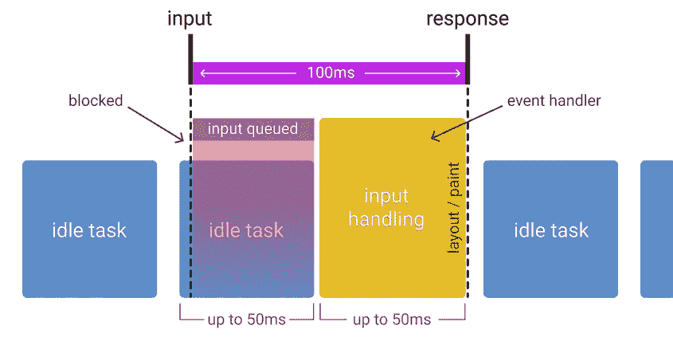
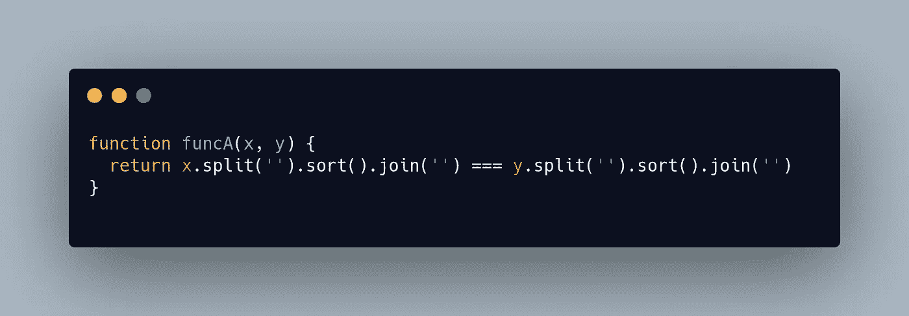
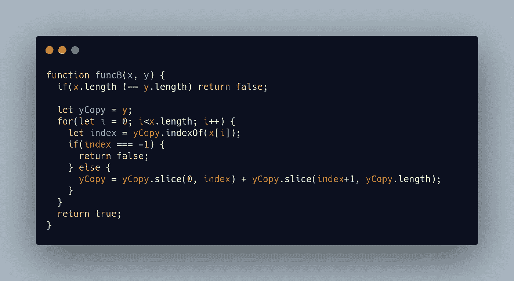
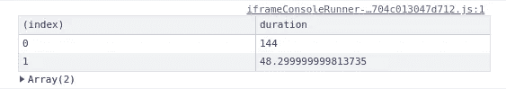

# 微优化您的 JavaScript 可能不值得，但是…

> 原文：<https://javascript.plainenglish.io/micro-optimizing-your-javascript-probably-isnt-worth-it-but-c6dd03e91f06?source=collection_archive---------8----------------------->

## 如果你正在做，我会这样做

Photo by [Charles Deluvio](https://unsplash.com/@charlesdeluvio?utm_source=medium&utm_medium=referral) on [Unsplash](https://unsplash.com?utm_source=medium&utm_medium=referral)

如果您希望优化应用程序中经常调用的函数，您可能希望进行一些测量，设置基准，并从那里开始。假设您已经查看了浏览器的瀑布图，并认识到一个长时间运行的功能可能会对您的 [RAIL](https://web.dev/rail/) 模型造成压力，或者更准确地说，一个长时间运行的功能会使用户与执行的操作分离(严格来说，用户界面中不必要的延迟超过 100 毫秒)。你可能想要达到以下目标:

Image taken from [here](https://web.dev/rail/).

在我们开始之前，完整的示例代码可以在[这里](https://codepen.io/sinia-nimevi/pen/XWaWYZV)看到。请随意使用该代码作为您未来测量的模板。

# 性能 API

为了开始测量我们函数的性能，我们需要熟悉 [Performance API](https://developer.mozilla.org/en-US/docs/Web/API/Performance_API) ，它是一个现成的 javascript Web API，允许您与性能接口进行交互，这反过来使我们能够在所谓的[高分辨率时间](https://www.w3.org/TR/hr-time/)内测量我们客户端应用程序的性能。虽然有很多内容，但我们感兴趣的是设置标记，测量它们之间的时间，并在控制台中记录这些条目以供进一步检查。

该 API 的使用非常简单，所以我将快速介绍一个示例场景。

# 两个相互竞争的功能

假设我们有一个检查两个单词是否是[变位词](https://en.wikipedia.org/wiki/Anagram)的函数。我想到了两种方法。也许我们想把两个字符串当作数组，因为我们对两个单词是否有相同的字母感兴趣，所以我们把它们转换成数组，对它们进行排序，并比较结果。

Treating words as character arrays allows for easy sorting.

另一种方法是，知道`for`循环是可笑的高性能，尝试围绕它建立逻辑。我们可以直接取消不等长的单词(这本身就是一个性能奖励)，然后我们可以循环遍历一个单词中的每个字符，并使用`indexOf`来检查它是否出现在另一个单词中。此外，我们需要逐步从第二个单词(或它的副本)中`slice`出字母，以避免误报。

A clumsy but possibly more performant solution.

# 实现性能 API

设置标记非常容易，事实上，就像在代码的适当位置键入`performance.mark('myCustomMarkerString');`一样简单。因为我们以后需要使用这个标记名，所以我实际上会把它保存为`const`(例如`const A`)，然后用它在函数的开始、`performance.mark(A)`和函数的结束`performance.mark(B)`留下一个标记。然后，我们使用带有指定标记的`performance.measure("my measurement #1", A, B)`来获取 A 点和 B 点之间的时间(例如)。我相信下面的示例代码非常清楚。

Setting and measuring marks in practice.

这里值得注意的是，一个接一个地运行两个函数一次很少会给出结论性的结果。最好将这两个函数运行 100 次、1000 次或更多次，以了解如果连续多次调用该函数，性能差距会有多大。

这将创建两个条目，稍后可以使用`performance.getEntriesByType(“measure”)`检索它们。这样做的结果将是一个由 [PerformanceEntry](https://developer.mozilla.org/en-US/docs/Web/API/PerformanceEntry) 对象组成的数组。我发现我对条目的`duration`值最感兴趣，所以我倾向于使用过滤了 duration 列的`[console.table](https://developer.mozilla.org/en-US/docs/Web/API/console/table)`来显示它们。这将大致转化为:

`console.table(performance.getEntriesByType('measure'), ['duration']);`

The resulting log in our browser console.

完整的代码可以在这个[代码栏](https://codepen.io/sinia-nimevi/pen/XWaWYZV)中看到。

# 结论

显然，这里的例子缺少一些东西。虽然它显示了两个函数的粗略比较，但真实世界的函数需要用不止一组参数一起测试，因为真实世界的应用程序可能会在各种场景中调用一个函数。您还可以通过划分结果来获得平均值，并自动重新运行测试几次来使逻辑变得复杂…但总而言之，这实际上取决于您的用例。如果您已经决定对代码进行微优化，我希望这足以让您入门。

此外，如果你认为你有一些我可能遗漏或误解的见解，请在评论中自由讨论——这个主题很广泛，可以用无数种方式来处理。如果你想拓展人脉或者只是扩大人脉——你可以在 [*Twitter*](https://twitter.com/SNimcevic) *和*[*LinkedIn*](https://www.linkedin.com/in/sini%C5%A1a-nim%C4%8Devi%C4%87-5b438996/)*上找到我。*

# 来源

*   [https://codepen.io/sinia-nimevi/pen/XWaWYZV](https://codepen.io/sinia-nimevi/pen/XWaWYZV)
*   [https://web.dev/rail/](https://web.dev/rail/)
*   [https://developer . Mozilla . org/en-US/docs/Web/API/Performance _ API](https://developer.mozilla.org/en-US/docs/Web/API/Performance_API)
*   [https://developer . Mozilla . org/en-US/docs/Web/API/performance entry](https://developer.mozilla.org/en-US/docs/Web/API/PerformanceEntry)
*   [https://www.w3.org/TR/hr-time/](https://www.w3.org/TR/hr-time/)
*   [https://developer . Mozilla . org/en-US/docs/Web/API/console/table](https://developer.mozilla.org/en-US/docs/Web/API/console/table)

*更多内容请看*[***plain English . io***](http://plainenglish.io/)