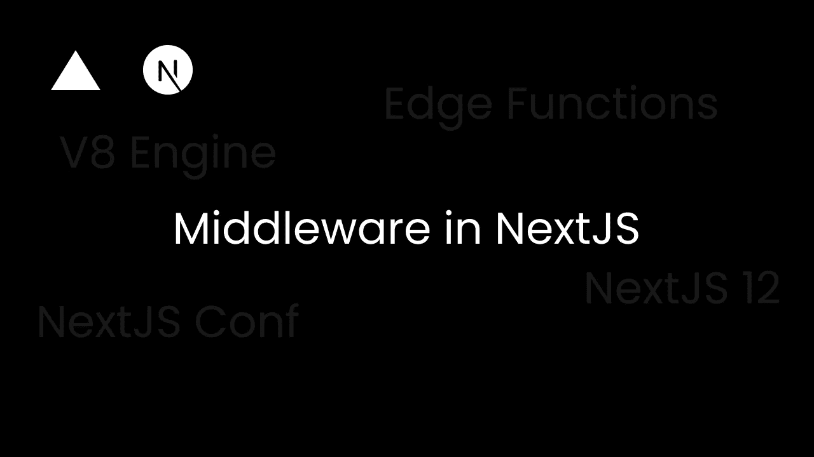
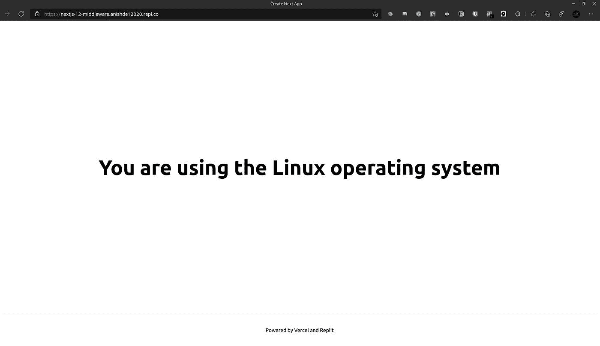
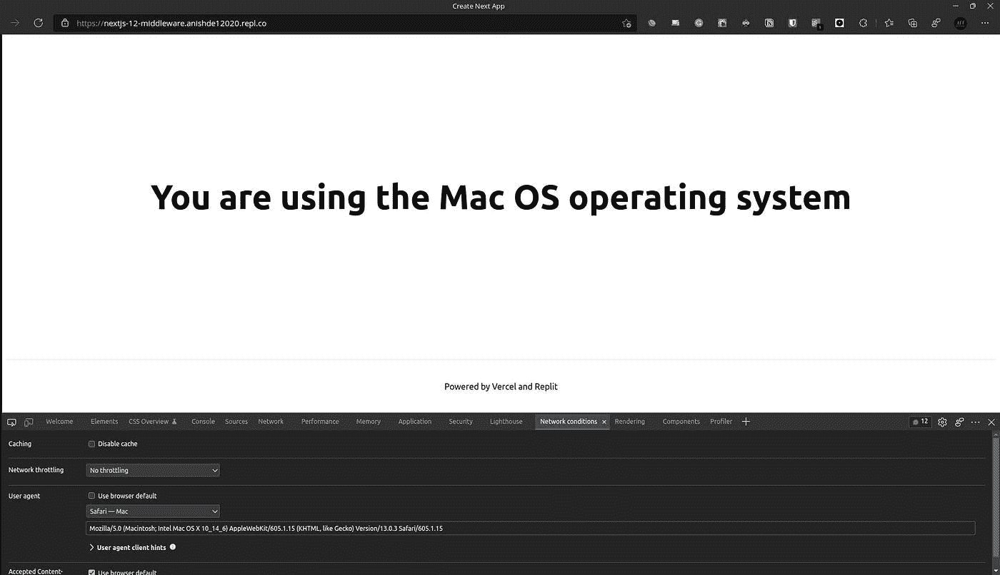

# Next.js 12 中的中间件:它们是什么，如何入门？

> 原文：<https://javascript.plainenglish.io/middleware-in-next-js-12-what-are-they-and-how-to-get-started-with-them-2bce9ae073eb?source=collection_archive---------1----------------------->

昨天，我们举行了 [Next.js Conf](https://nextjs.org/conf) ，我们获得了许多新东西。Next.js 12 已经发布，它有很多令人兴奋的新功能。其中一个特性是 Next.js 中的[中间件，所以让我们用一个例子来看看它是如何工作的。](https://nextjs.org/docs/middleware)

*中间件是一些简单的代码，允许用户在请求完成之前修改对请求的响应。我们可以根据用户的请求重写、重定向、添加标题，甚至流式传输 HTML。*

> *此定义来自* [*Next.js 中间件文档*](https://nextjs.org/docs/middleware)

我将在[回复](https://replit.com/)中为这个例子做所有的事情。你也可以跟着我学习这个教程。

回复—[replit.com/@AnishDe12020/NextJS-12-Middleware](https://replit.com/@AnishDe12020/NextJS-12-Middleware)

使用`create-next-app`创建 Next.js 项目。这将为我们提供一个设置了 Next.js 11 的项目(截至 2021 年 10 月 27 日)，因此，首先，我们需要升级到 Next.js 12。

使用 npm:

带纱线:

# 一个简单的中间件

现在，要添加中间件，我们需要在 pages 目录中创建一个`_middleware.js`文件。注意，您还可以在 pages 目录的子目录中添加中间件文件，使其在顶级中间件文件之后运行。更多信息可以参考 [Next.js 中间件执行顺序文档](https://nextjs.org/docs/middleware#execution-order)。

现在让我们编写一个简单的中间件函数:

这将在页面上显示用户的操作系统。我们将 HTML 流式传输给用户，但现在让我们看看如何在引擎盖下重写路线。

# 一个重写引擎盖下路线的中间件

首先，我们将创建一个名为`[os].js`的新文件，并将`index.js`代码复制到其中，只是替换函数名。

`[os].js`:

现在让我们回到我们的`_middleware.js`文件并做一些修改。首先，我们将导入`NextResponse`:

现在，让我们将用户的操作系统存储在一个变量中:

现在，我们可以重写我们创建的新路由的 URL，这就是`NextResponse`的用武之地。

这就是现在输出的`_middleware.js`文件的样子:

现在，让我们导入新路由中的下一台路由器:

由于这是一个 React 钩子，我们需要在返回的函数中创建一个 Next.js 路由器的新实例。

我们可以从之前在中间件中重写的 URL 参数中获得用户的操作系统

最后，让我们向用户展示他们使用的是什么操作系统:

最后，这就是我们的`[os].js`应该看起来的样子:

现在，如果我们访问主页，我们应该会看到这个(注意，我已经删除了一些 Next.js 样板代码):

我可以使用浏览器开发工具模拟浏览器用户代理，我们会得到不同于操作系统的结果:

现在，注意 URL 是`https://nextjs-12-middleware.anishde12020.repl.co/`，而不是`https://nextjs-12-middleware.anishde12020.repl.co/Linux`或`https://nextjs-12-middleware.anishde12020.repl.co/Mac Os`。这是因为我们在中间件中重写请求，因此客户端没有变化。

# Next.js 中间件是如何工作的？

Next.js 中间件利用了 [Vercel 的边缘函数](https://vercel.com/features/edge-functions)，这些函数运行在 [V8 引擎](https://v8.dev/)上。V8 引擎是用 C++编写的 JavaScript 引擎，由 Google 维护。它比在虚拟机或容器上运行 Node.js 要快得多，Vercel 声称这些边缘功能是即时的。

# 边缘函数的限制

一些 Node.js APIs 在中间件中不可用(因为它们是边缘函数)，比如文件系统 API。此外，一些 Node.js 模块将无法工作，因为只有实现了 es 模块并且不使用任何本机 Node.js APIs 的模块才是允许的。有关更多信息，请参见此处的

到目前为止，我们已经看到了中间件的威力，以及它将如何成为开发人员的一个巨大功能。通过使用中间件，可以快速、轻松地为本地化网站提供服务、提供基于地区的折扣、身份验证、僵尸检测等等。

Vercel 的团队也收集了许多使用中间件的例子。在这里查看它们[。](https://vercel.com/features/edge-functions#examples)

这篇文章到此为止，欢迎在下面留下评论，你也可以通过 [Twitter](https://twitter.com/AnishDe12020) 联系我。

*原载于*[*https://blog . anishde . dev*](https://blog.anishde.dev/middleware-in-nextjs-12-what-are-they-and-how-to-get-started-with-them)*。*

*更多内容请看*[***plain English . io***](http://plainenglish.io/)