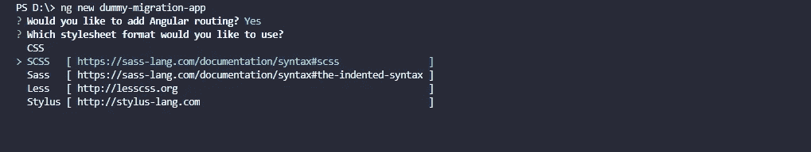
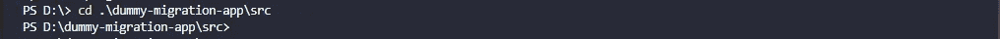
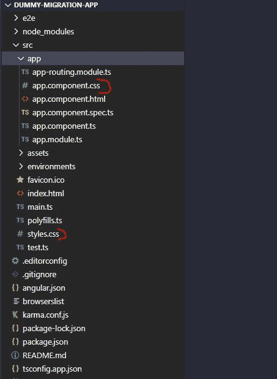
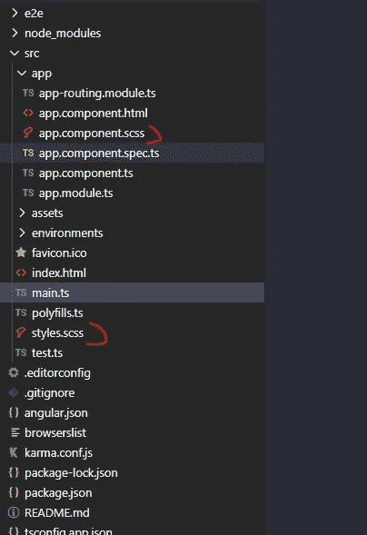
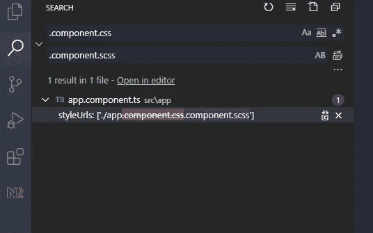

# 将现有的角度应用程序从 CSS 迁移到 SCSS

> 原文：<https://javascript.plainenglish.io/migrate-an-angular-app-from-css-to-scss-71200d615c95?source=collection_archive---------2----------------------->

## 在使用默认样式表格式的 Angular 应用程序中使用 SCSS 的快速指南


Photo by [Maik Jonietz](https://unsplash.com/@der_maik_) on [Unsplash](https://unsplash.com/)

在使用 Angular CLI 创建新的 Angular 应用程序时，您可能忘记了使用 **style=scss** 标志，或者在 CLI 提示时，您只是选择了 **CSS** 作为样式表。当你开始使用一个新的应用程序时，也许你不熟悉 CSS 预处理程序，比如 **SCSS** 。

原因可能是使用 **CSS** 而不是 **SCSS** ，但是现在您想在应用程序中切换到使用 SCSS 样式表格式。再一想，您知道这种转变可能会令人生畏，因为您的应用程序已经变得又大又复杂。

但是，正如 Thabo Ambrose 在他的文章中所解释的，有很多方法可以顺利完成迁移。在本文中，我们将涵盖:

*   我们如何使用 Angular schematics NPM 软件包，只需一个命令即可执行迁移
*   我们如何手动执行迁移，即使用 ng CLI 命令
*   我们如何使用 NPM 包*重命名器*来执行迁移

注:在本文中，我们将不涉及什么是 [SCSS](https://sass-lang.com/) 和[角度示意图](https://angular.io/guide/schematics)。我认为你对这些话题有所了解。

通常，要使用 SCSS 样式表生成新的 Angular 应用程序，我们可以使用以下 Angular CLI 命令:

```
ng new dummy-migration-app --style=scss
```

或者您只需点击***ng new dummy-migration-app****命令，等待 CLI 提示样式表选项，如下所示:*

**

## *使用 NPM 程序包示意图-scss-迁移*

*一种快速简单的迁移方法是使用示意图 NPM 包[*schematics-scss-migrate*](https://www.npmjs.com/package/schematics-scss-migrate)*。*在*[*NPM*](https://www.npmjs.com/package/schematics-scss-migrate)*上阅读更多关于这个原理图封装的内容。***

**要使用这个包从 CSS 迁移到 SCSS，你所要做的就是安装这个包，最好是作为一个[开发依赖](https://docs.npmjs.com/specifying-dependencies-and-devdependencies-in-a-package-json-file)并运行下面的代码:**

```
**ng g schematics-scss-migrate:scss-migrate**
```

**仅此而已，上面的命令执行了以下操作:**

*   **已将所有样式表从。css 到。递归存储在`src`文件夹中的 scss**
*   **更新了`styleUrls`值，以指向与组件样式文件相关的组件类中样式表的新文件名。**
*   **更新了`angular.json`文件中的组件样式原理图值，如果原理图不存在，则创建一个。**
*   **并将`angular.json`文件中的`.scss`引用重命名为`styles.css`**

***注意:在进行实际迁移之前，可以使用* ***进行测试，比如:*****

```
**ng g schematics-scss-migrate:scss-migrate --dry-run=true**
```

## **使用 Angular CLI 手动迁移**

**随着 Angular 9 的出现， **styleext** 被重命名为 **style，**如果您使用的是版本 9 或更高版本，那么您的命令应该是**

```
**ng config schematics.@schematics/angular:component.style scss**
```

***注意:对于早于 v6 beta 的 Angular CLI 版本，使用 ng set 代替 ng config。***

**或者可以直接在***angular . JSON****config 文件中设置原理图，如下图:***

```
***"schematics": {     
    "@schematics/angular:component": {       
        "style": "scss"     
    }
    ...   
}***
```

***现在，您必须将项目构建和测试选项的 **style.css** 的扩展更新为 **style.scss** ，就像这样:***

```
***{  
    "projects": {      
        "your-project-name": {      
            ...             
            "architect": {
                "build": {
                    "options": {
                        "styles": [  
                            "src/styles.css" **// update**   
                            ...
                         ] 
                         ...
                     }
                     ...
                 },
                 "test": {
                     ...
                         "options": {
                         ...
                         "styles": [
                             "src/styles.css" **// update**
                         ],
                 }      
             },
         }
     }
 } 
}***
```

***现在，要将样式表文件扩展名从。css 到。scss，请遵循以下说明。***

## ***将项目的样式表文件从。css 到。使用 NPM 软件包的 scss。***

***自己一个一个地重命名文件绝对不是一个好主意。为此，我们可以使用一个名为 [***重命名器***](https://www.npmjs.com/package/renamer) 的 NPM 包。值得注意的是，这个包不仅仅是为了重命名。css 到。scss，但也适用于所有其他文件。***

**要使用这个包，只需简单地安装它，可能是全局安装，如下所示:**

```
**npm i -g renamer**
```

**现在，在终端中，导航到项目目录中的 ***src*** 文件夹。**

****

> **作为一个建议，在你的项目上运行命令之前，暂存/提交你的工作，或者切换到一个新的分支，用**重命名**工具玩一玩。关于 ***重命名器*** 的更多细节，点击[这里](https://www.npmjs.com/package/renamer)。**

**现在，运行以下命令重命名 all。带有。scss**

```
**renamer --find css --replace scss ***
```

**上面的命令用。 **CSS** to。 **SCSS** 在当前的工作目录中，也就是 **src，**因为我们已经导航到它，这是因为在命令的远端有通配符/glob，也就是 **"* "。****

**现在，让我们验证预期的工作是否完成。**

****

**Before Command**

**的确如此。**

****

**After Command**

**现在，由于我们已经将所有样式文件的扩展名从。css 到。在整个应用程序中，我们必须改变所有组件中的样式 URL。**

**一个接一个地做这件事可能会令人沮丧，因为你的应用程序必须有太多的组件。这里，Angular 的默认约定和类似 VS 代码的 IDE 可以拯救我们。我们知道每个特定于组件的样式文件名都以. component.css 结尾(在我们的例子中是 component.scss，因为我们更新了扩展名)，例如 app **.component.css** 。现在，使用 IDE 全局搜索所有. component.css 条目(在我的例子中是 VS 代码)。在 VS 代码中，您可以简单地使用快捷键 **Ctrl + Shift + f** 进行全局搜索，并使用 **Ctrl + Shift + h，**用新值替换所有搜索到的条目，如下所示:**

****

**Replace .css **styleUrls** with .scss, globally**

**这些快捷方式可以节省大量的时间和工作。**

**现在，只要编译你的应用程序，看看是否有错误。如果没有，那么我们都设置好了从**迁移。css 到。scss** 。**

## **结论**

**有多种方法可以从迁移您的 angular 应用程序/项目。我最喜欢的是使用***schematic-scss-migrate***包，因为它不需要任何手工操作，可以节省很多时间。您甚至可以在迁移之前使用**模拟运行**选项来验证迁移。**

**这就是这篇文章的内容。我希望这有所帮助。感谢阅读！**

# **资源**

*   **从…迁移。CSS 到。现有角度项目的 SCSS 样式表**
*   **[SCSS 迁移入门](https://www.npmjs.com/package/schematics-scss-migrate)**
*   **[重命名器](https://www.npmjs.com/package/renamer)**