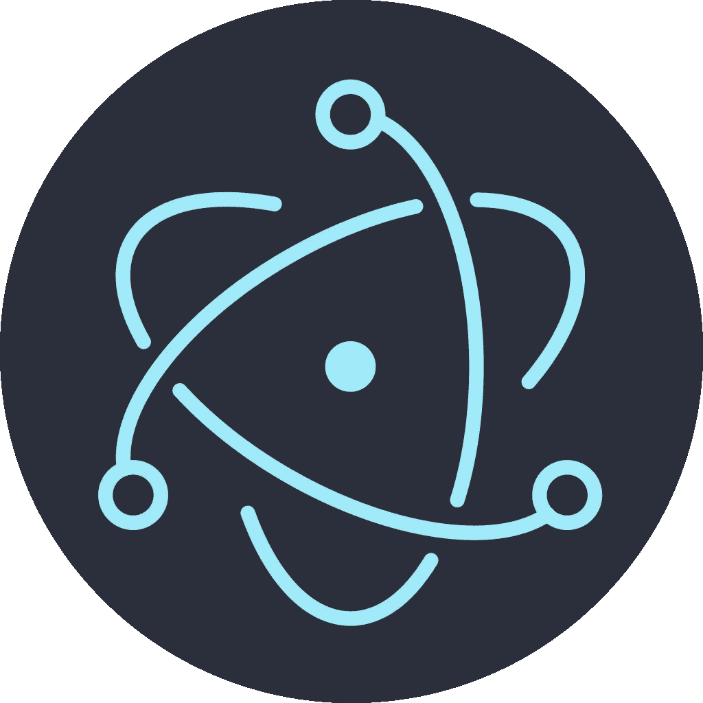
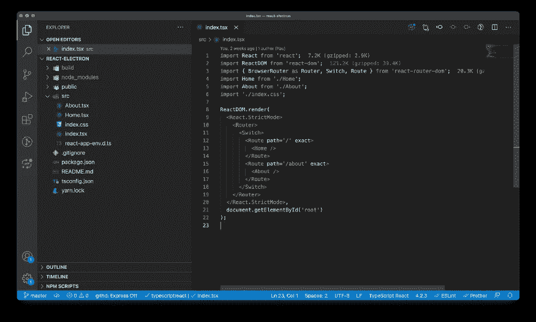
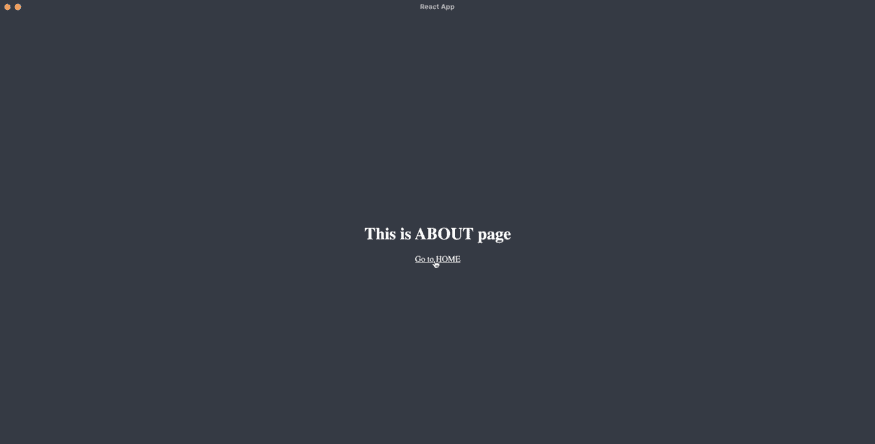
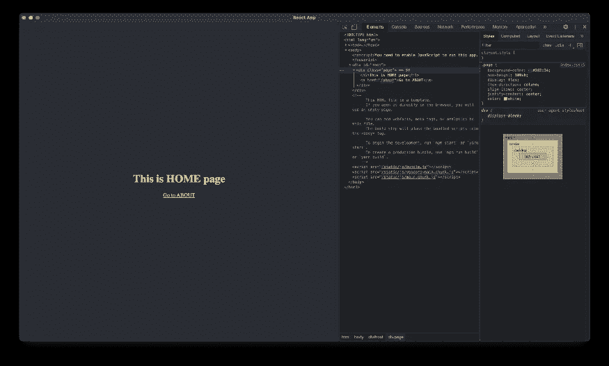
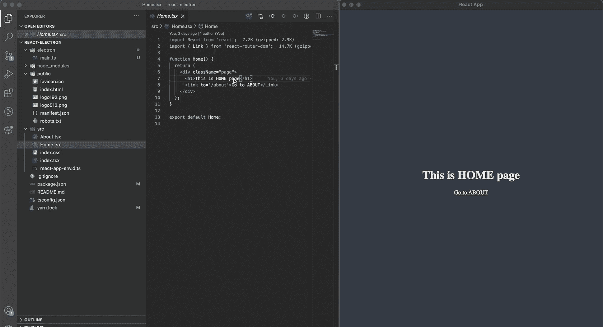
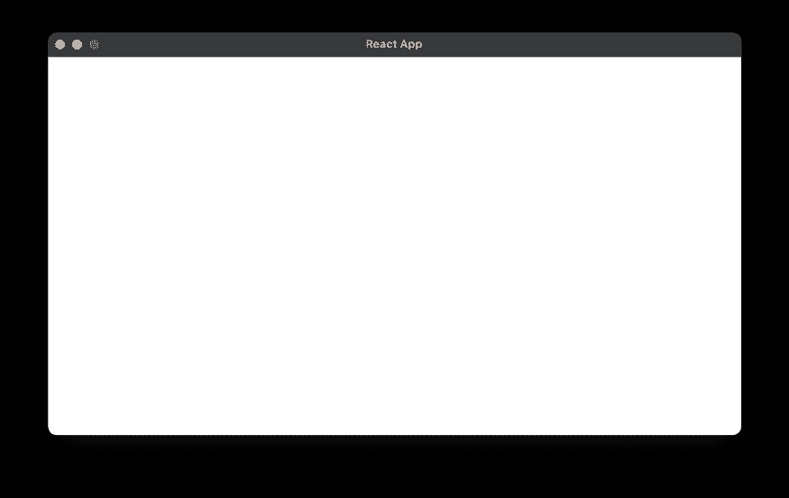
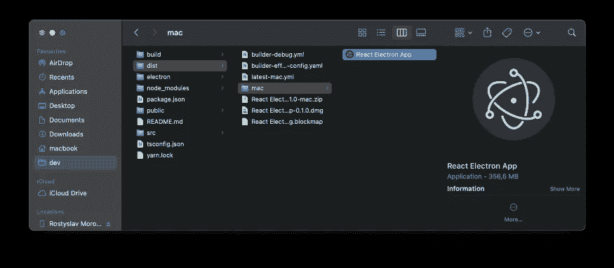
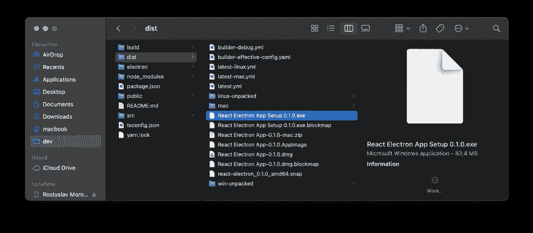
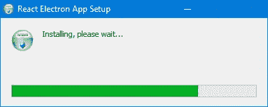
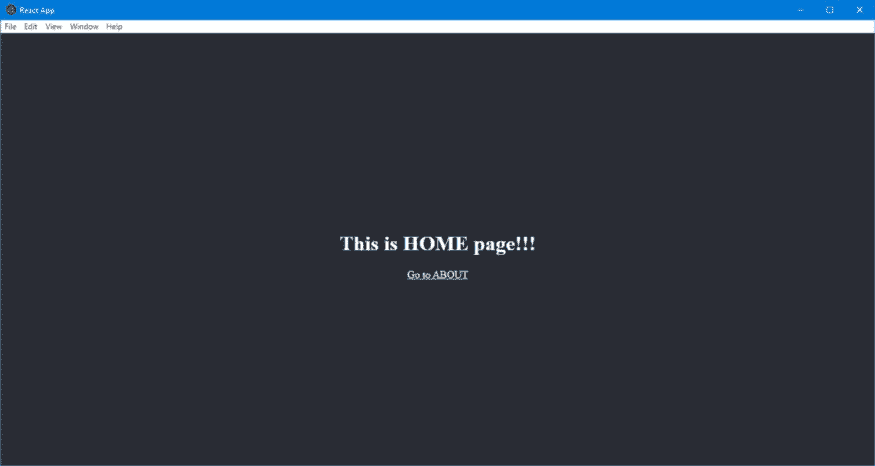

# 如何使用 Electron 将现有的 React Web 应用迁移到桌面应用

> 原文：<https://javascript.plainenglish.io/migrate-existing-web-react-app-to-desktop-app-with-electron-a7007128120e?source=collection_archive---------1----------------------->



*本文由* [*罗斯蒂斯拉夫*](https://rostyslavmoroziuk.medium.com/?source=post_page-----aedc1543c3a1--------------------------------) 撰写

## 什么是电子？

Electron 是一个用 web 技术构建桌面应用程序的框架。我们可以构建跨平台的应用程序，并通过使用 JavaScript 在所有平台(macOS、Ubuntu、Linux 或 Windows)上运行它们。像微软、脸书、Twitch 这样的大组织都在采用 electronic，所以我们可以肯定这个框架可以覆盖我们在桌面应用程序开发中的所有需求。感谢电子，你可以专注于你的应用，而不是你需要使用的技术。

## 为什么我们要将 Electron 集成到现有的 React 应用程序中？

我们希望获得一个桌面应用程序，而不需要对 web 应用程序的现有代码库进行任何更改。我们仍然可以使用 HTML5 通知 API 从渲染器进程发送通知。此外，我们可以继续使用我们现有的快捷方式监听器，基本上，仍然认为我们的应用程序是一个 web 应用程序。

在本文中，我们将通过一个小教程来学习如何将 Electron 集成到 React 应用程序中。

## 我们来编码吧！

让我们用`react-router-dom`和 Typescript 创建一个基本且非常常见的 React 应用程序。

你可以跳过创建基本应用的步骤，从[这里](https://github.com/RostikMoroziuk/react-electron)获取。

运行以下命令创建一个 React 应用程序:

```
npx create-react-app <app_name> --template typescript
```

请注意，我们需要在我们的 **package.json** 文件的 **devDependencies** 部分安装开发依赖项。否则，我们的依赖项将包含在产品构建中，这将增加包的大小。此外，强烈建议使用`yarn` 而不是`npm`，以避免构建和运行电子应用程序时的一些意外问题。

让我们给应用程序添加一个路由器:

```
yarn add react-router-domyarn add --dev @types/react-router-dom
```

我们可以从 **src** 文件夹中移除已创建的文件，并添加新文件。一旦我们的包被安装，我们就可以实现路由。我们准备增加两个页面:**首页**和**关于**。

现在，我们已经创建了一个基本的 React 应用程序。所以我们的项目结构应该是这样的:



React Basic App

## 集成电子和运行桌面应用程序

我们需要安装依赖关系来运行电子应用程序。让我们转到终端中包含项目的文件夹，并运行下一个命令:

```
yarn add --dev electron concurrently wait-on
```

我们将使用包`concurrently`和`wait-on`在本地以开发模式运行应用程序。

一旦我们完成了依赖项的安装，我们就可以开始编码了。在项目的根级别创建一个文件夹 **electron** ，并在那里添加一个文件 **main.ts** 。在这个文件中，我们在一个完整的工作区上创建一个窗口:

请访问此[链接](https://www.electronjs.org/docs/api/browser-window#new-browserwindowoptions)了解更多`BroswerWindow`属性。

现在我们需要编辑 **package.json** 来运行带有电子的 app。所以打开 **package.json** 文件，添加脚本`electron:start`:

```
"scripts": { "start": "react-scripts start", "build": "react-scripts build", "test": "react-scripts test",  "eject": "react-scripts eject", **"electron:start": "concurrently \"yarn start\" \"wait-on http://localhost:3001 && electron .\""**}
```

此外，我们需要添加**“main”**字段来指定电子应用程序的入口点，以及主进程文件的路径(在我们的例子中是 **electron/main.ts)** 。：

```
"name": "react-electron","version": "0.1.0","private": true,**"main": "electron/main.ts",**
```

恭喜你。现在，我们已经准备好在浏览器和电子版上运行现有的应用程序。让我们试一试。打开您的终端并运行:

```
yarn electron:start
```



Working Electron + React app

正如你所看到的，脚本`yarn electron:start`在浏览器中运行应用程序，一旦应用程序在`localhost:3000`上打开，它也用电子包裹，并作为一个单独的桌面应用程序打开。您可以在浏览器和单独的窗口中看到同一个应用程序。

## 调试呢？

您可以像调试 web 应用程序一样轻松地调试电子应用程序。Electron 在幕后使用 Chromium，所以你可以假设一个 Electron 应用程序和任何其他 web 应用程序一样，并使用你在浏览器中使用的调试工具。您可以打开 DevTools 并访问 web 编程中每天都会用到的元素、控制台、网络和其他选项卡。



DevTools in Electron

您可以尝试编辑 **src** 文件夹中的任何组件，并查看 React Fast Refresh 在浏览器和 electronic 中是否正常工作。



React Fast Refresh with Electron

好了，现在我们知道这个应用程序在浏览器和电子版中有相同的行为。因此，我们仍然可以与电子应用程序进行交互，就像在浏览器中打开任何其他 web 应用程序一样。我们可以使用相同的快捷方式、开放链接等。

您可以尝试在新选项卡中打开主页或“关于”页面:按住 Command 键(Windows 上为 Ctrl)并单击链接—链接将在新窗口中打开。

如果这不是你想要的行为，(кома)那么你可以很容易地阻止它。你只需要在**电子/主文件**中添加以下代码:

```
mainWindow.webContents.on('new-window', (event, url) => {   event.preventDefault();   mainWindow.loadURL(url);});
```

打开[链接](https://www.electronjs.org/docs/api/web-contents#instance-events)可以找到更多控制`BrowserWindow`的事件。

## 为发行而构建

有三种工具可用于构建和打包应用程序以进行分发:

*   [电子建造者](https://github.com/electron-userland/electron-builder)
*   [电子打包机](https://github.com/electron/electron-packager)
*   [电子锻造](https://github.com/electron-userland/electron-forge)

> 电子建设者和电子锻造使用电子封装机罩下。

在我看来，Electron Builder 看起来更可取，因为它有良好的文档和高度的可配置性。它支持为 Linux，macOS，Windows 构建。你可以很容易地签署你的申请。作为奖励，它支持自动更新。您可以使用 Electron Builder 在一台机器上为不同的操作系统创建发行版。它还有 Docker 映像，可以从任何操作系统创建 Windows 和 Linux 版本。

好的，让我们用电子构建器试着创建发行版。首先，安装我们的构建工具:

```
yarn add --dev electron-builder
```

现在，我们需要为发行版构建指定选项。将下一段代码添加到您的 **package.json** 文件中:

还必须指定电子主页路径。Electron 使用这个路径来知道我们的 CSS 和 JavaScript 文件在哪里。需要用自己的`appId`和`productName`。这里，我们只添加了构建应用程序所必需的必填字段。如果您不使用 macOS，您可能需要指定`win`或`linux`字段，而不是`mac`。

你可以在这里找到更多可能的选项[。](https://www.electron.build/configuration/configuration)

构建应用程序有一个小问题。我们指定了一个主页为`./`，这对于一个电子 app 来说是正确的。但是对于 web 产品构建，我们需要使用`/`。因此，让我们调整我们的脚本，为电子应用程序和一个简单的 web 应用程序使用不同的主页:

```
"scripts": {
... 

  "build": "PUBLIC_URL=/ react-scripts build", "build-electron": "react-scripts build"
...}
```

此外，我们需要添加一个脚本来构建一个分发应用程序。在您的 **package.json** 文件中打开一个脚本部分，并添加以下命令:

```
"electron:build": "yarn build-electron && electron-builder build --publish never"
```

您的 **package.json** 文件应该是这样的:

是的，我们快到了。我们必须为我们的应用程序指定开始 URL。
首先，我们需要添加一个新的依赖项来确定应用程序是运行在开发模式还是生产模式:

```
yarn add electron-is
```

现在在您的代码编辑器中打开 **main.ts** 文件并替换`startURL`。很可能，你不想在产品版本中支持 DevTools，所以我们将移除它们。

现在我们已经完成了发行版构建的配置。但是我们还得为我们的`react-router`再走一步。问题是在我们的 web 应用程序中使用了`BrowserRouter`。它不能在基于文件的环境下工作，而 electronic 可以。这就是为什么你会看到一个白屏，而不是一个应用程序。



Electron app with BrowserRouter

那么，这里的解决方案是什么呢？我们需要用`BrowserRouter`做网络应用，用`HashRouter`做电子应用。

让我们添加一个新的 **utils** 文件，该文件具有检查应用程序是否在电子环境中运行的功能:

我们还需要更新我们的 **index.tsx** 文件，以便根据环境使用正确的路由器历史记录:

好了，现在我们可以运行`electron:build`脚本了:

```
yarn electron:build
```

这个脚本将生成一个 **dist** 文件夹，其中包含我们应用程序的可执行文件。它还会为 macOS 创建一个 DMG 文件:



Electron distribution folder

正如我前面提到的，您可以从您的 Mac 机器上为 Windows 和 Linux 构建发行版文件。如果你不使用任何平台相关的模块，这是可能的(换句话说，如果你只是用电子包装你现有的 web 应用程序，这总是可能的)。为了构建不同平台的应用程序，我们需要向我们的 **package.json** 文件添加一个新脚本:

```
"electron:build:all": "yarn build-electron && electron-builder build --publish never -mwl"
```

该脚本将为 macOS、Windows、Linux 生成可执行文件:



正如你所看到的，electronic-builder 为不同的操作系统创建了安装文件。让我们尝试在 Windows 上运行安装文件:



Windows installer



React Electron App on Windows OS

该应用程序构建在 macOS 上，在 Windows 机器上成功安装和启动。还能更简单吗？我不这么认为。电子建设者做了所有的工作，而不是一个只有几个简单的配置开发人员。

## 代码签名

可以不签署申请，但不建议这样做。Mac 将阻止此应用程序，并需要很多额外的安装步骤。Windows 还需要一个额外的确认步骤。此外，不通过 App Store 和 Windows Store 签名，就不可能分发应用程序。

要签署 macOS 应用程序，您需要遵循以下步骤:

1.  加入苹果开发者[计划](https://developer.apple.com/programs/enroll/)。
2.  生成两个证书:开发者 ID 应用程序和开发者 ID 安装程序。
3.  启动钥匙串并前往“我的证书”。找到这些证书并全部高亮显示:Cmd+单击，右键单击，导出为 p12。
4.  包括这个 p12 文件来构建。
5.  添加环境变量[来构建机器。](https://www.electron.build/code-signing)

## 结论

所以，现在你做到了。恭喜你！我们已经成功地将电子集成到我们的 React 应用程序中。

您可以在这里找到本教程的代码:

[](https://github.com/RostikMoroziuk/react-electron/tree/electron) [## RostikMoroziuk/反应电子

### 这个项目是用 Create React App 引导的。在项目目录中，您可以运行:在…中运行应用程序

github.com](https://github.com/RostikMoroziuk/react-electron/tree/electron) 

## 进一步阅读

[](/5-tips-to-scale-up-your-react-apps-8fb68319062e) [## 扩展 React 应用的 5 个技巧

### 1.将 Bit 用于可组合设计 2。设计令牌 3。网络请求的定制钩子 4。客户端与服务器状态 5。一个…

javascript.plainenglish.io](/5-tips-to-scale-up-your-react-apps-8fb68319062e) 

*更多内容请看*[***plain English . io***](https://plainenglish.io/)*。报名参加我们的* [***免费周报***](http://newsletter.plainenglish.io/) *。关注我们关于*[***Twitter***](https://twitter.com/inPlainEngHQ)[***LinkedIn***](https://www.linkedin.com/company/inplainenglish/)*[***YouTube***](https://www.youtube.com/channel/UCtipWUghju290NWcn8jhyAw)*[***不和***](https://discord.gg/GtDtUAvyhW) *。对增长黑客感兴趣？检查* [***电路***](https://circuit.ooo/) *。***