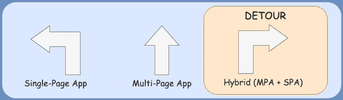

# 将多页应用程序迁移到单页应用程序

> 原文：<https://javascript.plainenglish.io/migrate-your-multi-page-application-to-a-single-page-application-a16863d6249f?source=collection_archive---------9----------------------->

## 创建和处理单页应用程序

## 带 vue tity(vue . js 和材质设计)

您可能会发现自己身处一个世界，在这个世界中，您迫切希望向现代技术发展，但除了重建整个平台，您看不到其他途径。这篇文章的目的是让你相信有一个简单的方法经常被忽视。

# 介绍

在现有环境中引入变革是一项挑战。利益相关者对术语“重建”过敏，一些开发人员也是如此，因为他们在自己的环境中感到舒适，并患有冒名顶替综合症。改变往往被视为一个漫长而充满挑战的旅程。采用新技术伴随着学习曲线，这可能会引起开发人员的焦虑，几乎肯定会引起产品所有者和利益相关者的焦虑。

## 方法

传统上，公司会通过重建遗留的单一平台来采用新技术。这可能很麻烦，因为公司在维护和未来路线图方面的现有需求总是优先考虑的。这种并行的方法伴随着一个概念的内在风险，这是开发人员的噩梦:重复工作。

不用从头开始重新构建平台，您可以找到一种并行的方法，通过这样一种方式设计它，使两个接口可以和谐共存。

## 演示

我开发了一个演示应用程序来演示这种方法。点击这里查看现场预告[https://hendrikprinsloo.co.za/projects/mpa-spa-hybrid/](https://hendrikprinsloo.co.za/projects/mpa-spa-hybrid/)

[Live Preview](https://hendrikprinsloo.co.za/projects/mpa-spa-hybrid/)

 [## 亨德里克普林斯扎/mpa-spa-hybrid

### 多页应用程序+单页应用程序混合是一个示例应用程序，并不意味着作为 kickstarter 模板…

github.com](https://github.com/HendrikPrinsZA/mpa-spa-hybrid/) 

# 利益

采用现代框架带来了宝贵的好处，使传统的开发显得原始。

## 快乐的开发者

利用现代技术，如[热重装](https://vue-loader.vuejs.org/guide/hot-reload.html)、[双向绑定](https://v3.vuejs.org/guide/forms.html#basic-usage)、[单文件组件](https://v3.vuejs.org/guide/single-file-component.html#single-file-components)等等。这些工具是为开发人员设计的，提供了很多便利。

## 提高效率

现代工具和组织良好的框架允许模块化组件的开发。大多数流行的库都提供了各种各样的现成组件，支持快速原型化和开发。参见 [Vuetify 的组件](https://vuetifyjs.com/en/components/alerts/)。

## 提高稳定性

重构旧的意大利面条逻辑最终会导致更少的错误。现代调试工具也使得诊断和解决错误变得更加容易。 [Vue.js 开发工具](https://chrome.google.com/webstore/detail/vuejs-devtools/nhdogjmejiglipccpnnnanhbledajbpd)使开发者能够走出`console.log`世界。

 [## Vue.js 开发工具

### 用于调试 Vue.js 应用程序的 Chrome 和 Firefox DevTools 扩展。

chrome.google.com](https://chrome.google.com/webstore/detail/vuejs-devtools/nhdogjmejiglipccpnnnanhbledajbpd) 

## 市场相关性

在过去的 5 年中，开发世界发展如此之快，熟练的开发人员也随之发展。如果你想发展一个拥有最佳技能的团队，你需要为他们提供他们想要的技术和工具。

# 障碍

为了说服公司和团队，你需要克服一些障碍。

## 对最终用户的影响

采用混合方法应该确保对最终用户的影响最小，因为他们应该能够在接口之间无缝转换。

> 在两个不同的界面之间导航时，最终用户不会感到困惑吗？

不一定，很有可能以最终用户甚至不会意识到这种转变的方式来配置它。目标是让两个接口协调工作，无缝转换。在 SPA 中，HTML 和 JavaScript 等依赖项只需加载一次(或在需要时)。所以对人眼来说，应该不会有太大的区别，应该感觉还是在同一个系统里。

## 投资成本

搭建任何一个平台所投入的时间和精力都是不可低估的。这可能是说服产品负责人和团队考虑新方向最难克服的障碍。

> 我们花了无数个小时煞费苦心地修复漏洞，现在你希望我们再次经历那段旅程。

已经投入的时间和精力不会被浪费，因为从发现那些逻辑缺陷中学到的东西不会就此消失。分离模块化组件中的关注点将解开意大利面条式的代码。

> 开发特性 X、Y 和 z 花费了我们太多的时间，重建它是不可行的。

从丰富的组件库和现代工具中开发一个特性的成本比从头开始构建要高效得多。功能的设计和模式不会改变。将它插入一个新的 UI 将比最初的开发简单得多。

> 许可和支持方面的初始成本如何？

大多数现代框架都有活跃的社区支持，并且没有任何许可成本。如果需要，您可以选择企业产品，如 [Vuetify for Enterprise](https://vuetifyjs.com/en/introduction/enterprise/) 。

## 学习曲线

当在遗留环境中采用任何现代 javascript 框架时，您可以预期会有一个学习曲线。然而，开发人员可能已经掌握了 javascript 和 DOM 操作的基础。这是一件好事，因为从基本的 javascript(或 jQuery)过渡到任何现代前端框架都非常容易。一些 YouTube 教程可能会让团队感觉更舒服。

> 如果我们没有这方面的专家呢？

现代框架的设计都考虑到了简单性，允许任何开发人员快速提升自己的技能。拥有一个活跃的社区有助于开发人员克服常见的警告。你需要团队中有一个人愿意接受挑战，带领团队走向成功。开发人员习惯于阅读文档，所以这应该不是问题。

> 我们有一些老派开发人员可能不太热衷于转型。

这很常见，因为许多开发人员过度利用他们的角色，专注于满足当前的业务需求，并且不认为他们有能力采用新技术。这是一个棘手的问题，需要一些软技能来克服。混合方法允许这些老派开发人员继续走现有的道路，并逐渐接触到新的思维。一旦他们迈出这一步，他们将永远不会回头，收养是有保证的！

## 当前的优先事项

评估已经建立的业务中的变化是至关重要的，因为它肯定会产生影响。这里的目标是证明价值。例如)在现有生态系统中开发一个新功能可能需要 2 周的开发时间。用新技术来挑战它，你很可能会证明它更快、更可靠，最重要的是更令人愉快。

> 我们承诺构建 X、Y 和 z。这一变化对路线图意味着什么？

这可能有点棘手，因为有许多因素要考虑。使用混合方法的好处是您可以灵活地做出决定。一旦框架建立起来，团队很可能倾向于尽可能地利用它。然而，在某些情况下，用旧的方式开发可能更有效

> 我们现有的平台有太多的漏洞。我们应该在穿越前稳定下来吗？

理想情况下，你会希望稳定现有的平台，让开发者有一些空间在新时代的平台上工作。然而，这取决于开发团队的舒适程度，他们应该能够做出决定。

> 团队需要多长时间才能跟上进度？

这取决于团队的能力，但一般来说，开发人员倾向于方便和简单。最大的挑战是以一种开发可以无缝继续的方式建立框架的框架。你必须有至少一个团队成员专门负责设置这一点。从我个人的经验来看，我只花了大约两个星期的时间来设置它，这样团队就可以开始飞行了。

## 托管要求

这是值得认真考虑的事情。您需要考虑当前的部署管道和托管生态系统。考虑引入现代前端框架的好处在于，它很可能不会对宿主环境产生额外的依赖。

> 在我们当前的部署流程中，我们需要改变什么？

理想情况下，您将借此机会转移到具有持续集成和持续部署的更现代的部署方法。但这不是必需的，因为您应该能够无缝地集成它。您可以考虑提交新接口的构建状态，并与现有的部署流程保持一致。或者，也是更好的选择，您可以将这一职责交给您的 CI/CD 流程。这也提供了让云承担单元测试、部署和发布责任的机会。

> 对性能和可伸缩性的影响如何？

如果您处于从原始 PHP 生成 HTML 的位置，那么性能上的好处是不可低估的。转移到仅在需要时从服务器获取数据的位置只会提高您的生态系统的性能。

# 入门指南

你选择哪种技术并不重要。在您现有的平台上投入并原型化这个概念。

如果这个故事得到足够的关注，我会考虑起草一个更实用的指南，但 [*现场预览*](https://hendrikprinsloo.co.za/projects/mpa-spa-hybrid/) *和* [*回购*](https://github.com/HendrikPrinsZA/mpa-spa-hybrid) *应该是一个很好的起点。*

*更多内容看* [***说白了. io***](http://plainenglish.io/)