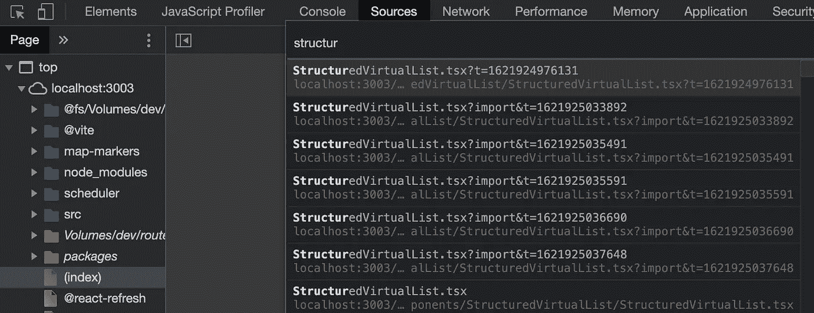

# 将 150K LOC 代码库迁移到 Vite 和 ESBuild:值得吗？(第三部分)

> 原文：<https://javascript.plainenglish.io/migrating-a-150k-loc-codebase-to-vite-and-esbuild-is-it-worthwhile-part-3-3-5a12894bac96?source=collection_archive---------3----------------------->

Webpack 和 Vite 之间更公平的比较，一些 Vite 的警告，以及整体的开发者体验。

这是关于将 React+TypeScript 代码库从 Webpack 迁移到 Vite 的三篇文章系列的一部分。第 1 部分讲述了我们为什么决定迁移，[第 2 部分](https://noriste.medium.com/migrating-a-150k-loc-codebase-to-vite-and-esbuild-how-part-2-3-91b0b873f388)讲述了我们是如何迁移的。

# 节食减肥

就像前面文章说的，Vite 比 Webpack 快，但是做的事情少。在本系列的早些时候，我说过我们的定制 Webpack 配置利用了 babel-loader、ts-loader 和[fork-ts-checker-web pack-plugin](https://github.com/TypeStrong/fork-ts-checker-webpack-plugin)来编译 TypeScript 并同时运行 ESLint。另一方面，ESBuild(Vite 的核心)既不检查类型，也不运行 ESLint。

**不带 TypeScript 和 ESLint 的 Webpack 有多快？**速度够快可以突出 Vite 吗？答案是否定的，但是越来越接近了。继续读下去。

# Webpack ESBuild 加载程序

现在我们的代码库已经可以进行 ESBuild 了，我们也可以通过 Webpack 来使用它。 [webpack-esbuild-loader](https://github.com/privatenumber/esbuild-loader) 这就是解决方案(在 Twitter 上的[讨论中发现)。通过从 Webpack 中移除 fork-ts-checker、TypeScript 和 ESLint 负担，我们可以在 Vite 和 Webpack 之间进行更公平的比较。](https://twitter.com/VLecrubier/status/1375731336330248196?s=09)

这很有趣，结论是

*   我们可以通过 ESBuild loader 来提升 Webpack。
*   即使在这种情况下，Vite 也更快。特别是，React 快速刷新带来了巨大的不同。

我们对构建时间不太感兴趣(我们正在努力改进日常的 DX)，但是为了完整起见，下面你可以找到构建的性能。

# 维特的问题

我喜欢 Vite，但我不妖魔化 Webpack。我关心的是 DX，而不是工具本身。这就是为什么我试图客观地报道我们在使用 Vite 时发现的问题:

*   保存后，Devtools 的源代码面板会多次列出同一个文件。没什么大不了的，但是有时候选错了。

*   如果启用了缓存，在浏览器历史记录中来回移动会加载过时的文件。同时，禁用缓存会使 Vite 变慢。
*   Vite 将工作负载从捆绑包转移到浏览器:与 Webpack 相比，Vite 消耗一小部分 RAM，但浏览器的工作将更加占用 CPU。粉丝们作证。
*   在很多热重装之后，你最好重装整个应用。
*   有一小部分文件我们不能通过 Devtools 断点，我们仍然需要理解为什么。
*   前端 app 的开发版明显比内置的慢。

# 到底:Vite 还是 Webpack？

答案来自使用最多的开发者: **Vite** ！

Vite 的表现和流动性战胜了 Webpack。整体 DX 好一个数量级，即使考虑以上问题。

我将在未来(或者，在最坏的情况下，当一个 Webpack 版本需要大量的前端操作工作时)删除每个 Webpack 依赖项、配置和所有脚本。

仅此而已！我希望追踪我们的旅程对你也有帮助。欢迎发表评论，分享您的经验或提出更多改进建议。

## 下一步是什么

我需要再次尝试 [Webpack 的文件系统缓存](https://twitter.com/alexander_akait/status/1398031559723261952)。因为一个老问题，我们放弃了它，但是在此期间事情可能已经改变了。

然后，我还在我的[文章](https://dev.to/noriste/speed-up-e2e-tests-for-vite-based-apps-3k4l)中分享了如何通过启用 Vite 中的 Rollup watch-mode 来获得“旧”捆绑体验和新体验的最佳效果。

# 后手稿

说到 **ESLint** ，我们在工作时不会再在手表模式下运行它了。这一决定背后的理由与 Vite 背后的动机相似:

*   每次保存文件时，VSCode 都会运行 ESLint
*   通过 lint 暂存，暂存文件通过 ESLint 传递

没有理由再让 ESLint 积极运行了。让我们也从 Webpack 中删除它。如果你在手表模式下运行 ESLint，记得[打开它的缓存](https://twitter.com/NoriSte/status/1354445830523146248)。

嗨！我是斯特凡诺·马尼，我是一名充满激情的**前端工程师**，一名**演讲者**，一名**讲师**。我作为高级前端工程师/团队领导为[工作波](https://www.workwave.com/)远程工作。

我喜欢创造高质量的产品，测试和自动化一切，学习和分享我的知识，帮助别人，在会议上发言，面对新的挑战。

你可以在 [Twitter](https://twitter.com/NoriSte?source=post_page---------------------------) 、 [GitHub](https://github.com/NoriSte?source=post_page---------------------------) 、 [LinkedIn](https://www.linkedin.com/in/noriste/?source=post_page---------------------------) 上找到我。你可以找到我最近所有的投稿/演讲等。在[我的 GitHub 总结](https://github.com/NoriSte/all-my-contributions)。

*更多内容请看*[*plain English . io*](http://plainenglish.io/)