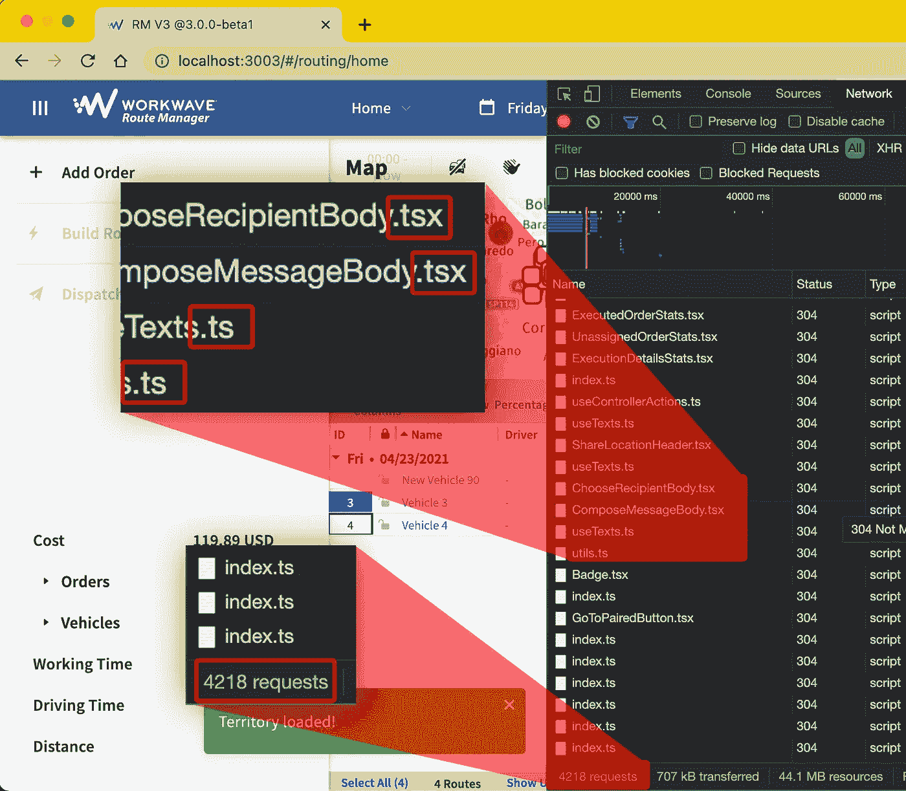

# 将 150K LOC 代码库迁移到 Vite 和 ESBuild:为什么？({第 1/3 条)

> 原文：<https://javascript.plainenglish.io/migrating-a-150k-loc-codebase-to-vite-and-esbuild-why-part-1-3-4ccd9bea2a61?source=collection_archive---------2----------------------->

Vite 是什么？我们为什么考虑它？比 Webpack 快吗？够成熟吗？

这是关于将 React+TypeScript 代码库从 Webpack 迁移到 Vite 的三篇文章系列的一部分。[第 2 部分](https://noriste.medium.com/migrating-a-150k-loc-codebase-to-vite-and-esbuild-how-part-2-3-91b0b873f388)讲的是我们是如何做到的，[第 3 部分](https://noriste.medium.com/migrating-a-150k-loc-codebase-to-vite-and-esbuild-is-it-worthwhile-part-3-3-5a12894bac96)讲的是事后分析。

# 从 Webpack 的慢到 Vite

总是同一个故事:你开始在一个分支上工作，运行`yarn start` **并等待两分钟**。然后你保存一个文件，等待 20 或 30 秒，应用程序就会刷新。然后，您在您正在处理的分支之间切换多次，并且您需要再次重新启动 dev 服务器。如此糟糕的开发者体验。

我们通过转移到 [**Vite**](https://vitejs.dev/) 和 [ESBuild](https://esbuild.github.io/) 来减少这个问题。继续读下去。

WorkWave RouteManager 的 UI 团队每天都在开发一个 150K LOC(并且还在增长，大约 250K LOC 是最终大小)的代码库。由于产品的性质和技术限制，目前我们无法将应用程序分成小块。75%的代码由所有应用程序部分共享和使用。

该应用基于 **React 和 TypeScript** ，跨越 **Web Worker** ，使用 Webpack、babel-loader、ts-loader 和 [fork-ts-checker](https://github.com/TypeStrong/fork-ts-checker-webpack-plugin) 来捆绑和验证代码。所有依赖项每周更新一次。

最近， [Vite 2.0](https://dev.to/yyx990803/announcing-vite-2-0-2f0a) 已经发布。它的核心思想很简单:利用 [ESModules](https://hacks.mozilla.org/2018/03/es-modules-a-cartoon-deep-dive/) 将文件“按原样”提供给浏览器。当浏览器解析源文件并向 web 服务器请求导入文件时，Vite 会这样做

*   将 NPM 依赖项转换为 ESModules 并为其服务
*   通过 [ESBuild](https://github.com/evanw/esbuild) 传输你的源代码
*   将代码提供给浏览器

这是什么意思？意思是 **Vite 不提前捆绑代码**。相反，当浏览器要求一个文件时，Vite 转换它。一张图胜过千言万语。

The browser loading the thousands of unbundled .ts and .tsx files.

文件被缓存，但是 **Vite 从本质上消除了构建工具的负担，将它转移到浏览器**。你可以阅读更多关于 [Vite docs](https://vitejs.dev/guide/why.html) 或者 CSS-Tricks 的[比较新一代构建工具](https://css-tricks.com/comparing-the-new-generation-of-build-tools/)的文章。

建筑怎么样？Vite 利用 Rollup 来构建项目，不用担心最终捆绑包的浏览器兼容性。

# 维特的优点

与 Webpack 不同，Vite 不是一个通用工具。 **Vite 支持几个甜区**。如果你的项目属于这些点，Vite 提供

*   得益于 ESBuild 的速度，性能更佳。
*   配置少。
*   更少的依赖性:像我们这样的 React+TypeScript 项目所需的一切都由 Vite 直接管理， **React 快速刷新包括在内**。

但不是所有闪光的都是金子！Vite 不包括哪些**？**

*   **TypeScript 验证:简而言之，ESBuild 删除类型批注而不验证它们。您必须自己运行`tsc`来验证类型。**
*   **这取决于您的配置，但是在我们的例子中，ESLint 的运行要感谢 fork-ts-checker。Vite 不在乎 ESLint。**

***注意:我将在本系列* *的第三部分* [*中谈论这些缺失，包括一些关于 Vite 和 Webpack 的客观考虑以及整体开发者体验。*](https://noriste.medium.com/migrating-a-150k-loc-codebase-to-vite-and-esbuild-is-it-worthwhile-part-3-3-5a12894bac96)**

**最后同样重要的一点:**Vite 及其生态系统是否足够成熟**？**

*   **生态圈喜欢:比如[故事书会支持](https://storybook.js.org/blog/storybook-6-2/)，[柏树对 Vite](https://www.cypress.io/blog/2021/04/06/introducing-the-cypress-component-test-runner/) 有一流的支持。**
*   **Vite 的创造者尤雨溪和 Vue 一样。**
*   **我们只有一个关于 Vite 的依赖的问题，Evan 在不到两天的时间里就解决了。**

**最后:赌 Vite 是没有风险的。无论如何，我们决定保持代码库与 Webpack 兼容，以便在遇到麻烦时在 Vite 和 Webpack 之间进行交换。**

# **基准**

**为了让您对性能改进有所了解，请看一下我们早期的基准测试，也就是我与团队其他成员分享的那些**

**然后，让代码库 ESBuild-ready 允许我们也让 Webpack 节食，这些是我们的最终基准。**

# **迁移代码库**

**本系列的第二部分深化了我们代码库迁移的技术细节。[第三部分](https://noriste.medium.com/migrating-a-150k-loc-codebase-to-vite-and-esbuild-is-it-worthwhile-part-3-3-5a12894bac96)是关于结论、DX 以及与 Webpack 更公平的比较。**

**大家好，我是斯特凡诺·马尼，我是一名充满激情的**前端工程师**，一名**演讲者**和一名**讲师**。我作为高级前端工程师/团队领导为[工作波](https://www.workwave.com/)远程工作。**

**我喜欢创造高质量的产品，测试和自动化一切，学习和分享我的知识，帮助别人，在会议上发言，面对新的挑战。**

**你可以在 [Twitter](https://twitter.com/NoriSte?source=post_page---------------------------) 、 [GitHub](https://github.com/NoriSte?source=post_page---------------------------) 、 [LinkedIn](https://www.linkedin.com/in/noriste/?source=post_page---------------------------) 上找到我。你可以找到我最近所有的投稿/演讲等。关于[我的 GitHub 总结](https://github.com/NoriSte/all-my-contributions)。**

***更多内容请看*[*plain English . io*](http://plainenglish.io/)**