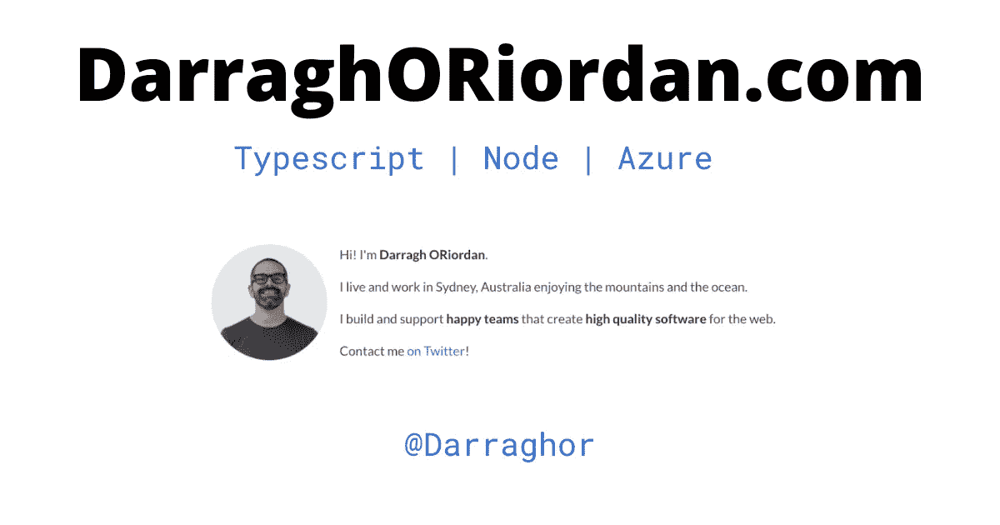

# 将 Create React App (CRA)应用程序迁移到 Vite

> 原文：<https://javascript.plainenglish.io/migrating-a-create-react-app-cra-application-to-vite-788b13243b5a?source=collection_archive---------0----------------------->


Photo by [Ferenc Almasi](https://unsplash.com/@flowforfrank?utm_source=medium&utm_medium=referral) on [Unsplash](https://unsplash.com?utm_source=medium&utm_medium=referral)

我有一个现有的应用程序是使用 create react app (CRA)搭建的，并使用 craco 进行了扩展。CRA 不支持我需要的工具，所以我不得不寻找一个替代品。我找到了维特。

Vite over CRA 有一些令人难以置信的改进，包括 PostCSS 8.0 支持，所以我决定迁移我的生产应用程序。

我将解释 Vite 的一些好处，并描述升级应用程序所需的步骤。

# 为什么要创建反应应用程序？

Vite 拥有 CRA 的所有功能，但实现更好，而且它还有 CRA 不支持的附加功能。

这是 Vite 对我的应用程序的三个主要好处。

# 速度

Vite 比 CRA 快 10-20 倍，因为它使用 esbuild 而不是 webpack。很难描述它的速度有多快，但是所有的改变在你的浏览器中都是瞬间发生的。

需要注意的一点是，Vite 不检查你的代码。它只将文件类型脚本转换成 JavaScript。因此，在开发管道的后期构建时，您可能会发现一些静态错误。不过，您的 IDE 应该会对此有所帮助。

# 本机 ECMAScript 模块支持

Vite 原生支持 ES 模块。它允许你为浏览器开发类似 TypeScript 的裸导入，并在构建时将它们转换成正确的版本化导入。

```
// you write your code with bare import 
import myModule from "./folder/myModule" // vite converts to usable import 
import myModule from "./folder/myModule.js?v=abc123
```

# CSS 插件支持

Vite 比 create react app 更早支持 PostCSS 8.0 等现代工具。在写这篇文章的时候，CRA 还不支持 PostCSS 8.0。Vite 正在更积极地开发中。如果你想使用没有笨拙的 webpack 垫片的 tailwind CSS，你应该使用 Vite。

你可以在这里看到[完整的特性列表](https://vitejs.dev/guide/features.html)

# 2021 年浏览器支持 Vite 构建

Vite 的默认目标需要原生 ES6 模块。能够使用原生 es6 模块减少了您的包大小，因为它更容易删除未使用的代码。

自 2019 年以来，大多数桌面浏览器都支持原生 ES6 模块。移动设备也是如此，尽管支持更加分散。你可以在 caniuse.com 这里查看支持[。](https://caniuse.com/es6-module)

如果你需要针对旧的浏览器，你可以使用来自 [@vitejs/plugin-legacy](https://github.com/vitejs/vite/tree/main/packages/plugin-legacy) 的官方插件。这将加载所需的聚合填充以支持旧目标。

# 计划升级到 Vite

如果你已经使用了 TypeScript，Vite 几乎可以替代 CRA。您将需要对您的代码进行一些更改，但您应该能够找到并替换其中的大部分。

这些是我们将遵循的迁移步骤。

1.  更新您的 package.json
2.  添加 Vite 配置
3.  更新您的 tsconfig.json 文件
4.  安装所有软件包
5.  移动您的 index.html 文件
6.  更新 index.html 内容
7.  更新所有的环境变量

我们走吧！

# 1.更新您的 package.json

将 package.json 脚本更改为使用 Vite。不要担心还没有，我们以后会安装的。

```
"scripts": {
    "start": "vite",
    "build": "tsc && vite build",
    "serve": "vite preview",
  },
```

确保从依赖项部分删除`react-scripts`。

为 Vite 添加一些新的 devDependencies。

```
"@vitejs/plugin-react-refresh": "^1.3.1",
    "vite": "^2.3.2"
```

如果你需要的话，现在就可以将 PostCSS 8+添加到你的依赖项中！

# 2.添加 Vite 配置

将`vite.config.ts`添加到项目的根目录。我只是用这个基本配置开始。

```
import { defineConfig } from 'vite'
import reactRefresh from '@vitejs/plugin-react-refresh'

// https://vitejs.dev/config/
export default defineConfig({
  // This changes the out put dir from dist to build
  // comment this out if that isn't relevant for your project
  build: {
    outDir: 'build',
  },
  plugins: [reactRefresh()],
})
```

# 3.更新您的 tsconfig.json

您必须设置 tsconfig.json 以使用 esnext 作为目标、lib 和模块类型。这可能会在 TypeScripts 的未来版本中发生变化，因为在给定的年份，es 标准中会添加更多的 esnext 功能，所以如果这篇文章是旧的，请查看 Vite 站点以获取更新的配置。

将 Vite 类型添加到 types 部分。这告诉 TypeScript 它为我们提供的特殊的 Vite 浏览器功能。

最后，不要忘记将 isolatedModules 设置为 true，如果您还没有设置的话。Vite 还不支持一些现代的类型脚本功能。

```
{
  "compilerOptions": {
    "target": "ESNext",
    "lib": ["dom", "dom.iterable", "esnext"],
    "types": ["vite/client"],
    "allowJs": false,
    "skipLibCheck": false,
    "esModuleInterop": false,
    "allowSyntheticDefaultImports": true,
    "strict": true,
    "forceConsistentCasingInFileNames": true,
    "noFallthroughCasesInSwitch": true,
    "module": "esnext",
    "moduleResolution": "node",
    "resolveJsonModule": true,
    "isolatedModules": true,
    "noEmit": true,
    "jsx": "react-jsx"
  },
  "include": ["src"]
}
```

# 4.安装以更新所有内容

运行`yarn`或`npm i`来安装我们已经添加到项目中的所有新的依赖项。

# 5.移动您的 index.html 文件

将 index.html 从`/public`移到项目的根。

Vite 不再需要将 index.html 放在公共文件夹中。

# 6.更新 index.html 的背景

Vite 以不同的方式处理 index.html 中的 URL 来创建 react 应用程序。

从文件中删除任何`%PUBLIC_URL%`引用。把那个字符串换成`""`就行了。

```
<!-- This is the create react app url. change this to not have the variable... -->
<link rel="icon" href="%PUBLIC_URL%/favicon.ico" />

<!-- ... to be like this. This is the correct url for Vite -->
<link rel="icon" href="/favicon.ico" />
```

添加带有项目入口点的脚本标记。

```
<body>
  <noscript>You need to enable JavaScript to run this app.</noscript>
  <div id="root"></div>
  <!-- Like below. This is the script tag for bootstrapping your Vite application -->
  <script type="module" src="/src/index.tsx"></script>
</body>
```

# 7.更新所有的环境变量，如果你使用它们的话

重命名您的环境变量，使它们以`VITE_`开头，例如搜索并将`REACT_APP_`替换为`VITE_`

```
# this create react app variable
REACT_APP_MY_VAR# should be this in Vite
VITE_MY_VAR
```

Vite 使用 ECMAScript 模块 import.meta 属性将环境变量传递给模块。

要访问这些环境变量，您必须将所有的`process.env.`更改为`import.meta.env.`。

你应该能够搜索和替换这个。

# 搞定了。

就是这样。现在尝试使用`yarn start`或`npm run start`运行您的应用程序

如果有什么对你不起作用，请告诉我！可以在 Twitter 上联系我[！](https://twitter.com/darraghor)



*原载于*[](https://www.darraghoriordan.com/2021/05/16/migrating-from-create-react-app-to-vite/)**。**

**多内容于* [***浅显易懂***](http://plainenglish.io/)*